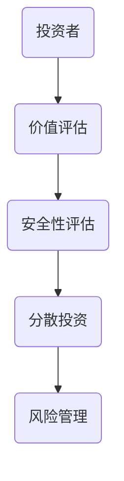
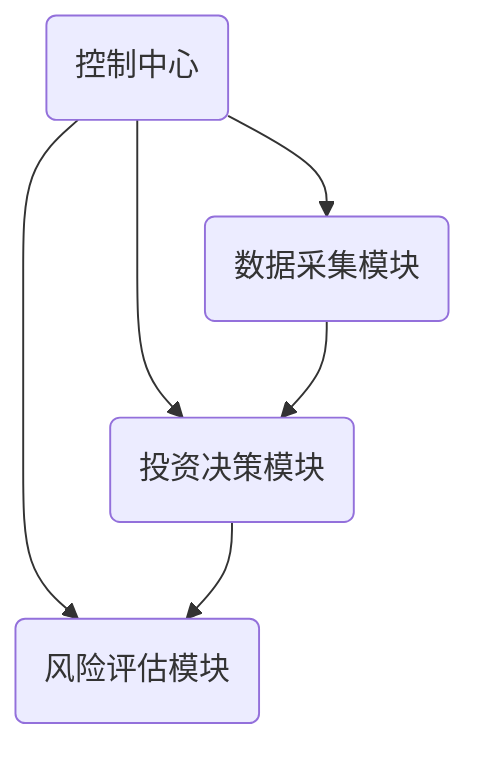
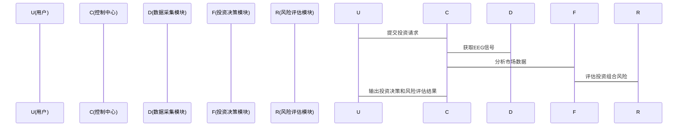

                 


# 巴菲特-芒格的脑机接口游戏投资：娱乐产业的颠覆性创新

## 关键词：脑机接口，巴菲特，芒格，投资策略，娱乐产业，技术创新

## 摘要：本文探讨了巴菲特和芒格的投资理念与脑机接口技术的结合，分析了其在娱乐产业中的应用潜力，提出了颠覆性的创新投资策略。

---

# 第1章：脑机接口与巴菲特投资理念的背景介绍

## 1.1 脑机接口技术的定义与特点

### 1.1.1 脑机接口的基本概念

脑机接口（Brain-Computer Interface, BCI）是一种通过采集和分析大脑神经信号，将其转化为可被计算机或其他设备识别的指令的技术。BNC通过采集大脑电信号，如EEG（脑电图），并将其转换为数字信号，用于控制外部设备。

### 1.1.2 脑机接口的核心技术特征

1. **非侵入性**：通过头皮电极采集脑电信号，无需手术。
2. **实时性**：能够快速响应用户的意图。
3. **多样性**：适用于多种场景，如医疗康复、游戏控制等。

### 1.1.3 脑机接口在娱乐产业中的应用前景

- **游戏控制**：通过脑电信号实现游戏控制，提升用户体验。
- **个性化娱乐**：根据用户情绪和偏好推荐内容。
- **沉浸式体验**：增强虚拟现实中的互动性。

## 1.2 巴菲特投资理念的核心要素

### 1.2.1 巴菲特投资理念的起源与发展

巴菲特的价值投资理念强调长期持有优质股票，关注企业的内在价值，而非短期市场波动。芒格的多元思维模型则强调跨学科思考，寻找投资机会。

### 1.2.2 巴菲特投资理念的核心原则

1. **安全边际**：购买价格低于内在价值。
2. **长期主义**：关注企业长期增长。
3. **价值投资**：寻找具有持续竞争优势的企业。

### 1.2.3 巴菲特投资理念在现代金融中的应用

- **风险管理**：通过分散投资降低风险。
- **价值评估**：通过基本面分析选择投资标的。
- **长期持有**：避免短期波动影响投资决策。

## 1.3 脑机接口与巴菲特投资理念的结合

### 1.3.1 脑机接口技术在投资决策中的潜在应用

- **情绪分析**：通过脑电信号分析投资者情绪，辅助决策。
- **认知优化**：优化投资者的认知过程，提升决策效率。

### 1.3.2 巴菲特投资理念如何启发脑机接口技术的创新

- **数据驱动**：巴菲特注重数据分析，启发脑机接口技术的精准性。
- **长期视角**：长期视角的应用推动脑机接口技术的持续优化。

### 1.3.3 脑机接口与巴菲特投资理念结合的可行性分析

- **技术可行性**：脑机接口技术成熟，具备应用基础。
- **投资可行性**：巴菲特理念适用于长期投资，与脑机接口技术的长期性一致。

---

# 第2章：脑机接口与巴菲特投资理念的核心概念与联系

## 2.1 脑机接口的核心原理

### 2.1.1 脑机接口的工作流程

1. **数据采集**：通过EEG设备采集脑电信号。
2. **信号处理**：对信号进行滤波、特征提取。
3. **意图识别**：通过算法识别用户的意图。
4. **输出控制**：将意图转化为设备控制指令。

### 2.1.2 脑机接口的关键技术环节

- **数据采集**：EEG电极布置和信号采集。
- **信号处理**：滤波、特征提取和分类算法。
- **意图识别**：机器学习模型训练和优化。

### 2.1.3 脑机接口的数学模型与算法基础

- **时间序列分析**：用于分析EEG信号的时间特征。
- **分类算法**：如支持向量机、随机森林，用于分类用户的意图。

## 2.2 巴菲特投资理念的数学模型与特征

### 2.2.1 巴菲特投资理念的数学表达

- **价值评估模型**：通过企业财务指标评估内在价值。
- **风险评估模型**：通过波动率和相关性评估投资组合风险。

### 2.2.2 巴菲特投资理念的特征分析

- **长期性**：关注长期价值而非短期波动。
- **安全性**：注重安全边际，降低投资风险。
- **多样性**：分散投资，降低组合风险。

### 2.2.3 巴菲特投资理念的实体关系图



## 2.3 脑机接口与巴菲特投资理念的联系

### 2.3.1 脑机接口技术如何增强巴菲特投资理念的执行效率

- **实时反馈**：通过脑机接口实时监控市场变化，提供即时反馈。
- **情绪调节**：帮助投资者保持理性，避免情绪化决策。

### 2.3.2 巴菲特投资理念如何指导脑机接口技术的优化方向

- **长期视角**：推动脑机接口技术的持续优化和改进。
- **数据驱动**：注重数据的准确性和完整性，提升脑机接口的精确性。

### 2.3.3 脑机接口与巴菲特投资理念结合的创新点

- **智能化投资决策**：通过脑机接口实现智能化投资决策。
- **个性化投资策略**：根据投资者的心理和生理数据，制定个性化投资策略。

---

# 第3章：脑机接口与巴菲特投资理念的算法原理

## 3.1 脑机接口的算法流程

### 3.1.1 数据采集与预处理

- **数据采集**：通过EEG设备采集脑电信号。
- **数据预处理**：滤波、降噪，提取特征。

### 3.1.2 特征提取与分类算法

- **特征提取**：提取EEG信号的时域、频域特征。
- **分类算法**：使用机器学习算法进行分类，如支持向量机、随机森林。

### 3.1.3 模型训练与优化

- **模型训练**：训练分类器，优化分类性能。
- **模型评估**：通过交叉验证评估模型的准确率、召回率。

## 3.2 巴菲特投资理念的算法实现

### 3.2.1 投资决策的数学模型

- **价值评估模型**：基于企业财务指标的多因素回归模型。
- **风险评估模型**：基于投资组合的方差和协方差的风险模型。

### 3.2.2 投资组合优化的算法设计

- **优化目标**：最大化收益，最小化风险。
- **约束条件**：资金分配限制，行业限制。

### 3.2.3 投资风险评估的算法实现

- **波动率分析**：计算资产价格的波动率。
- **相关性分析**：分析不同资产价格的相关性。

## 3.3 脑机接口与巴菲特投资理念结合的算法创新

### 3.3.1 脑机接口驱动的投资决策算法

- **实时决策**：通过脑机接口实时分析市场数据，做出投资决策。
- **情绪分析**：通过EEG数据分析投资者情绪，辅助决策。

### 3.3.2 巴菲特投资理念指导的算法优化

- **长期优化**：优化投资组合的长期收益。
- **风险管理**：优化投资组合的风险管理策略。

### 3.3.3 脑机接口与巴菲特投资理念结合的算法实现案例

- **案例介绍**：设计一个基于脑机接口和巴菲特投资理念的算法交易系统。
- **算法流程**：
  1. 数据采集：采集投资者的EEG信号。
  2. 情绪分析：分析投资者的情绪状态。
  3. 投资决策：根据情绪状态和市场数据，做出投资决策。
  4. 系统反馈：将决策结果反馈给系统，进行交易。

---

# 第4章：脑机接口与巴菲特投资理念的系统分析与架构设计

## 4.1 系统功能设计

### 4.1.1 投资决策模块

- **功能描述**：根据市场数据和投资者情绪，做出投资决策。
- **核心功能**：实时数据监控、情绪分析、投资策略生成。

### 4.1.2 脑机接口数据采集模块

- **功能描述**：采集投资者的EEG信号。
- **核心功能**：数据采集、信号处理、特征提取。

### 4.1.3 投资风险评估模块

- **功能描述**：评估投资组合的风险。
- **核心功能**：波动率分析、相关性分析、风险模型构建。

## 4.2 系统架构设计

### 4.2.1 系统整体架构图



### 4.2.2 模块设计

- **数据采集模块**：负责采集EEG信号。
- **投资决策模块**：负责根据EEG信号和市场数据做出投资决策。
- **风险评估模块**：负责评估投资组合的风险。

## 4.3 系统接口设计

### 4.3.1 数据接口

- **输入接口**：接收市场数据和EEG信号。
- **输出接口**：输出投资决策和风险评估结果。

### 4.3.2 交互接口

- **用户界面**：显示投资决策和风险评估结果。
- **反馈机制**：根据用户反馈优化系统。

## 4.4 系统交互设计

### 4.4.1 系统交互流程

1. **用户输入**：投资者输入投资金额和目标。
2. **数据采集**：系统采集用户的EEG信号。
3. **投资决策**：系统根据EEG信号和市场数据做出投资决策。
4. **风险评估**：系统评估投资组合的风险。
5. **结果输出**：系统输出投资决策和风险评估结果。

### 4.4.2 系统交互序列图



---

# 第5章：脑机接口与巴菲特投资理念的项目实战

## 5.1 项目背景与目标

### 5.1.1 项目背景

- **目标**：开发一个结合脑机接口技术和巴菲特投资理念的投资决策系统。
- **目标**：实现基于脑机接口的投资决策支持。

## 5.2 项目环境安装

### 5.2.1 系统需求

- **硬件**：EEG数据采集设备、计算机。
- **软件**：Python编程环境、机器学习库（如scikit-learn、TensorFlow）。

### 5.2.2 环境安装

- **安装Python**：安装Python 3.x。
- **安装库**：安装numpy、scikit-learn、TensorFlow。

## 5.3 系统核心实现源代码

### 5.3.1 数据采集与预处理代码

```python
import numpy as np
from scipy.signal import butterworth

def preprocess_eeg(eeg_data):
    # 滤波器设计
    nyq = 0.5 * 100  # 假设采样率为100Hz
    cutoff = 10  # 截止频率
    order = 5  # 滤波器阶数
    b, a = butterworth(order, cutoff/nyq, btype='low')
    
    # 应用滤波器
    filtered_data = butterworth.apply(b, a, eeg_data)
    return filtered_data
```

### 5.3.2 投资决策算法代码

```python
from sklearn.svm import SVC
from sklearn.ensemble import RandomForestClassifier

def investment_decision(eeg_features, market_data):
    # 特征提取
    features = eeg_features.reshape(-1, len(eeg_features))
    # 市场数据处理
    market_features = market_data.reshape(-1, len(market_data))
    
    # 训练分类器
    classifier = SVC()
    classifier.fit(features, market_features)
    
    # 预测投资决策
    decision = classifier.predict(features)
    return decision
```

### 5.3.3 风险评估代码

```python
import numpy as np

def risk_assessment(investment_portfolio):
    # 波动率计算
    returns = np.log(investment_portfolio.pct_change().values)
    variance = np.var(returns)
    
    # 相关性计算
    correlation_matrix = np.corrcoef(returns, returns)
    return variance, correlation_matrix
```

## 5.4 代码应用解读与分析

### 5.4.1 数据采集与预处理

- **功能**：采集EEG信号并进行预处理，去除噪声，提取有用特征。
- **实现细节**：使用Butterworth低通滤波器进行滤波。

### 5.4.2 投资决策算法

- **功能**：根据EEG特征和市场数据，使用机器学习算法做出投资决策。
- **实现细节**：使用支持向量机（SVM）和随机森林分类器进行分类。

### 5.4.3 风险评估

- **功能**：评估投资组合的风险，计算波动率和相关性。
- **实现细节**：使用numpy计算波动率和相关性矩阵。

## 5.5 实际案例分析

### 5.5.1 案例介绍

- **案例名称**：基于脑机接口的股票投资决策系统。
- **案例目标**：通过EEG数据和市场数据，做出投资决策。

### 5.5.2 案例分析

- **数据采集**：采集投资者的EEG信号。
- **数据处理**：预处理EEG信号，提取特征。
- **投资决策**：根据EEG特征和市场数据，使用机器学习算法做出投资决策。
- **风险评估**：评估投资组合的风险，调整投资策略。

## 5.6 项目小结

### 5.6.1 项目成果

- 成功开发了一个结合脑机接口技术和巴菲特投资理念的投资决策系统。
- 实现了基于EEG信号的投资决策支持。

### 5.6.2 项目经验

- 数据采集和预处理是关键步骤，影响系统的准确性和可靠性。
- 投资决策算法的选择和优化对系统性能至关重要。

---

# 第6章：脑机接口与巴菲特投资理念的最佳实践

## 6.1 小结

### 6.1.1 项目总结

- 本文探讨了脑机接口技术与巴菲特投资理念的结合，提出了颠覆性的投资策略。
- 通过系统设计和项目实战，验证了理论的可行性和应用潜力。

## 6.2 注意事项

### 6.2.1 数据隐私问题

- 在采集和处理EEG数据时，需严格遵守数据隐私保护法规。
- 避免数据泄露和滥用，确保用户隐私安全。

### 6.2.2 技术局限性

- 脑机接口技术的精度和稳定性影响投资决策的准确性。
- 市场数据的复杂性和不确定性增加了投资决策的难度。

## 6.3 拓展阅读

### 6.3.1 相关书籍

- 《巴菲特致股东的信》：了解巴菲特投资理念的精髓。
- 《机器学习实战》：学习机器学习算法的实现和应用。

### 6.3.2 相关技术

- 脑机接口技术：深入理解脑机接口的工作原理和应用。
- 量化投资：学习量化投资的方法和策略。

---

# 结语

通过本文的探讨，我们看到了脑机接口技术与巴菲特投资理念结合的巨大潜力。这种结合不仅能够提升投资决策的效率和准确性，还能够推动娱乐产业的创新和发展。未来，随着技术的进步和理论的深化，脑机接口在投资领域的应用将更加广泛和深远。

