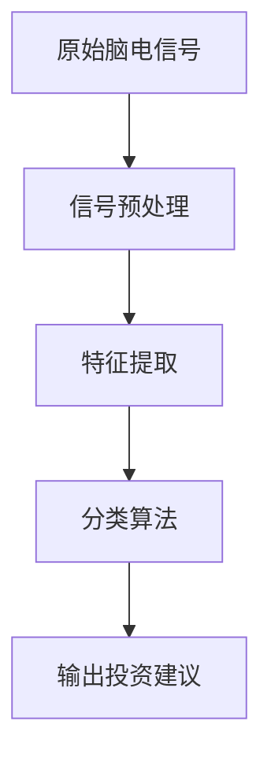
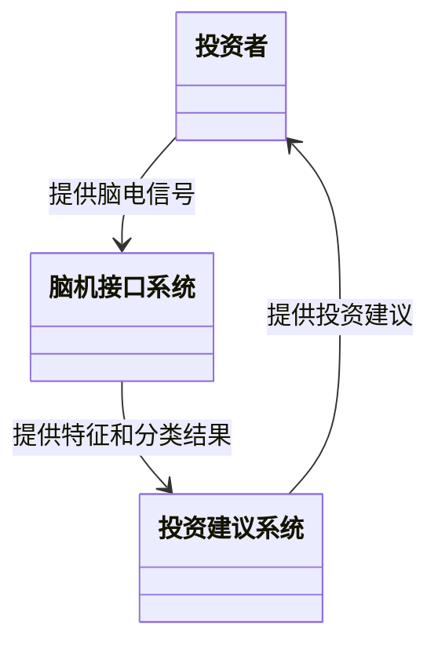
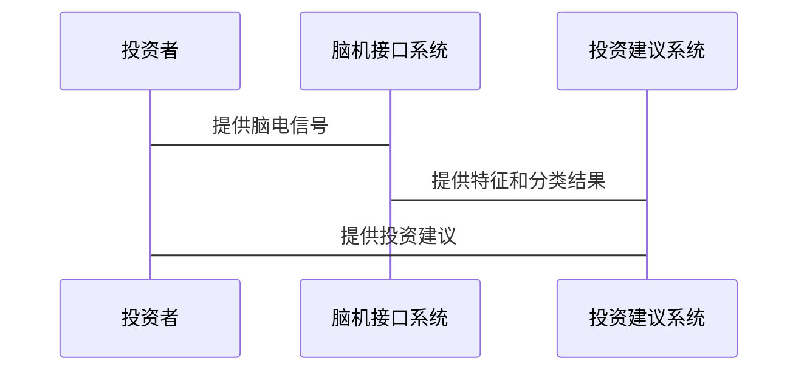

                 


# 巴菲特-芒格的脑机接口社交平台投资：思维互联的社交革命

## 关键词：巴菲特、芒格、脑机接口、社交平台、投资、思维互联、社交革命

## 摘要：本文探讨了巴菲特和芒格的投资智慧与脑机接口技术的结合，分析了脑机接口在社交平台中的应用，特别是如何通过思维互联实现投资的社交革命。文章详细介绍了脑机接口技术的核心概念、算法原理、系统架构，并通过实际案例展示了其在投资决策中的应用。

---

# 引言

## 巴菲特与芒格的投资哲学

### 巴菲特的价值投资理念

- **长期价值投资**：巴菲特强调购买优秀的公司，而非短期波动。
- **安全边际**：投资时留有余地，避免高风险。
- **内在价值**：通过分析公司基本面确定其真实价值。

### 芮格的多元思维模型

- **芒格的“格栅理论”**：通过多个学科的知识框架来分析问题。
- **逆向思维**：从反方向思考问题，避免从众。

## 脑机接口技术的现状

- **脑机接口（BCI）**：通过采集和分析脑电信号，实现人与机器的直接交互。
- **应用领域**：医疗、教育、娱乐、投资等领域。

## 脑机接口与投资社交的结合

- **投资决策的辅助工具**：通过分析投资者的心理状态，提供更精准的投资建议。
- **社交网络的思维互联**：投资者之间通过脑机接口共享思维，形成集体决策。

---

# 第1章：背景介绍

## 脑机接口技术的核心概念

### 脑机接口的定义

- **定义**：脑机接口是一种直接连接人类大脑与外部设备的技术，通过采集和分析脑电信号，实现人与机器的交互。
- **工作原理**：采集大脑产生的电信号，经过处理后转化为可被机器识别的指令。

### 脑机接口的分类

- **侵入式**：需要植入大脑内部，精度高但风险大。
- **非侵入式**：通过头皮采集信号，无创但精度较低。

## 问题背景

### 当前社交平台在投资中的局限性

- **信息过载**：投资者难以筛选有用信息。
- **情绪影响**：投资者的决策容易受情绪干扰。
- **认知偏差**：投资者容易受到心理偏差的影响。

## 问题解决

### 脑机接口技术如何解决投资社交中的问题

- **实时情绪监测**：通过脑电信号监测投资者的情绪状态，提供实时反馈。
- **个性化投资建议**：根据投资者的心理状态和认知模式，提供定制化的投资建议。

## 边界条件

### 系统边界

- **输入**：脑电信号、市场数据。
- **输出**：投资建议、情绪反馈。
- **外部依赖**：需要高性能的脑电信号处理算法和市场数据支持。

## 概念结构

### ER实体关系图

```mermaid
erDiagram
    投资者 {
        idInvestor
        name
        age
        emotionState
    }
    市场数据 {
        idMarket
        stockPrice
        marketTrend
    }
    脑机接口系统 {
        idSystem
        signalProcessingAlgorithm
        classificationAlgorithm
    }
    投资建议 {
        idAdvice
        adviceContent
        adviceTime
    }
    情绪反馈 {
        idFeedback
        feedbackContent
        feedbackTime
    }
    投资者 --> 脑机接口系统 : 提供脑电信号
    脑机接口系统 --> 投资建议 : 生成投资建议
    脑机接口系统 --> 情绪反馈 : 提供情绪反馈
```

---

# 第2章：核心概念与联系

## 脑机接口技术的核心原理

### 脑电信号的采集与处理

- **信号采集**：通过EEG设备采集大脑产生的电信号。
- **信号预处理**：去除噪声，提取有用信号。

### 特征提取

- **时域特征**：如均值、标准差、峰峰值等。
- **频域特征**：如功率谱密度、脑电图的频带分析。
- **非线性特征**：如复杂度、混沌特征。

### 分类算法

- **支持向量机（SVM）**：用于分类任务。
- **随机森林**：用于特征重要性分析。
- **深度学习**：如卷积神经网络（CNN）用于复杂模式识别。

## 脑机接口与社交平台的联系

### 投资社交平台中的脑机接口应用

- **实时情绪监测**：监测投资者的情绪状态，提供实时反馈。
- **个性化投资建议**：根据投资者的心理状态和认知模式，提供定制化的投资建议。
- **社交网络的思维互联**：投资者之间通过脑机接口共享思维，形成集体决策。

## 对比分析

### 核心概念对比表格

| 概念       | 定义                                                                 | 属性                     |
|------------|----------------------------------------------------------------------|--------------------------|
| 脑机接口   | 直接连接大脑与外部设备的技术                                         | 高精度、实时性           |
| 投资社交平台| 提供投资相关的社交服务的平台                                         | 信息共享、社交互动       |
| 思维互联   | 通过脑机接口实现人与人之间的思维共享                               | 实时性、准确性、互动性     |

---

# 第3章：算法原理

## 脑电信号处理算法

### 数据流处理流程



## 数学模型

### 信号处理中的线性代数模型

$$ y = a_1x_1 + a_2x_2 + \dots + a_nx_n + b $$

其中，$y$ 是预测的投资建议，$x_i$ 是输入的特征，$a_i$ 是对应的系数，$b$ 是截距。

### 分类算法中的支持向量机模型

$$ \text{目标函数}：\min_{w,b} \frac{1}{2}||w||^2 + C \sum_{i=1}^{n} \xi_i $$
$$ \text{约束条件}：y_i(w \cdot x_i + b) \geq 1 - \xi_i $$
$$ \text{对偶问题}：\max_{\alpha} \sum_{i=1}^{n} \alpha_i y_i - \frac{1}{2} \sum_{i,j} \alpha_i \alpha_j y_i y_j K(x_i, x_j) $$

其中，$K(x_i, x_j)$ 是核函数，用于处理非线性可分的问题。

---

# 第4章：系统分析与架构设计

## 系统功能设计

### 领域模型



## 系统架构设计

### 总体架构


## 接口设计

### HTTP接口

- **输入**：投资者的脑电信号和市场数据。
- **输出**：投资建议和情绪反馈。

## 交互流程

### 投资者与系统交互流程



---

# 第5章：项目实战

## 环境配置

```python
# 环境安装
pip install numpy
pip install scikit-learn
pip install matplotlib
```

## 核心代码实现

### 脑电信号处理

```python
import numpy as np
from sklearn import svm

# 示例数据
data = np.random.randn(100, 10)  # 100个样本，10个特征
labels = np.random.randint(2, size=100)  # 0或1的标签

# 训练SVM模型
model = svm.SVC()
model.fit(data, labels)

# 预测
new_data = np.random.randn(1, 10)
print("预测结果：", model.predict(new_data))
```

## 案例分析

### 实际案例

- **案例1**：某投资者在市场波动时情绪紧张，系统通过脑机接口监测到其情绪状态，并提供相应的投资建议。

## 项目总结

### 总结

- **优点**：实时监测情绪，提供个性化投资建议，提高投资决策的准确性。
- **缺点**：技术复杂，成本高，隐私问题。

---

# 第6章：最佳实践

## 总结

- **主要收获**：脑机接口技术在投资社交中的潜力巨大，可以实时监测投资者的情绪，提供个性化的投资建议。
- **经验教训**：技术实现复杂，需要多学科的知识。

## 注意事项

- **数据隐私**：脑电信号涉及个人隐私，需严格保护。
- **模型选择**：选择合适的分类算法，确保准确率。
- **用户接受度**：投资者需要接受脑机接口技术的应用。

## 拓展阅读

- **推荐书籍**：《巴菲特投资哲学》、《深度学习》
- **推荐网站**：Kaggle上的脑电信号数据集，相关技术博客。

---

# 结语

## 未来展望

- **技术进步**：脑机接口技术的精度和可用性将不断提升。
- **应用扩展**：脑机接口技术在更多领域的应用将不断拓展。

通过本文的探讨，我们看到了脑机接口技术在投资社交中的巨大潜力，未来这一领域将有更多创新和突破。

--- 

**THE END**

