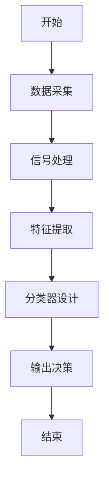
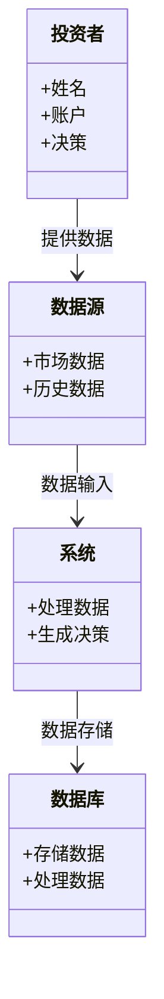

                 


# 巴菲特-芒格的脑机接口虚拟现实投资：意识沉浸的新境界

**关键词**：脑机接口、虚拟现实、巴菲特、芒格、投资、意识沉浸

**摘要**：本文探讨了巴菲特和芒格的投资理念与脑机接口、虚拟现实技术的结合，提出了一种全新的意识沉浸投资方法。通过分析脑机接口和虚拟现实的核心原理，构建了数学模型和算法，并设计了系统架构。通过实战案例，展示了如何在投资中应用这些技术，最后总结了最佳实践和未来发展方向。

---

## 第1章 巴菲特-芒格投资理念与脑机接口虚拟现实的结合

### 1.1 巴菲特-芒格投资理念的核心要素

#### 1.1.1 巴菲特的价值投资理论
巴菲特的价值投资理论强调长期持有优质资产，注重企业的内在价值。他认为市场先生是疯狂的，而投资者应该在市场低迷时买入，在市场高涨时卖出。他的投资哲学可以用一句话概括：“价格是买进的障碍，价值是卖出的准绳。”

#### 1.1.2 芒格的多元思维模型
芒格的多元思维模型强调将各个学科的基本原理组合起来，形成一个相互关联的思维框架。他认为，投资者应该具备跨学科的知识，以便更好地理解市场的复杂性。

#### 1.1.3 投资理念的现代发展
随着科技的进步，投资理念也在不断演变。现代投资者需要结合技术手段，如大数据分析和人工智能，来辅助决策。这为脑机接口和虚拟现实技术在投资中的应用提供了基础。

---

### 1.2 脑机接口与虚拟现实技术的基本概念

#### 1.2.1 脑机接口的定义与原理
脑机接口（BCI）是一种连接大脑和外部设备的技术，通过采集和分析脑电信号，实现对设备的控制。其原理包括信号采集、处理、解码和输出四个步骤。

#### 1.2.2 虚拟现实技术的核心要素
虚拟现实（VR）通过计算机生成的虚拟环境，提供沉浸式的体验。其核心要素包括硬件设备（如VR头显）、软件开发（如图形渲染引擎）和交互设计。

#### 1.2.3 脑机接口与虚拟现实的结合
将脑机接口与虚拟现实结合，可以实现对虚拟环境的直接控制。这种结合为投资者提供了一个全新的沉浸式投资环境，使得投资决策更加直观和高效。

---

### 1.3 意识沉浸与投资的新境界

#### 1.3.1 意识沉浸的定义与特征
意识沉浸是指投资者完全融入虚拟环境中，通过脑机接口与虚拟世界进行实时互动。其特征包括沉浸性、实时性和互动性。

#### 1.3.2 投资中的意识沉浸应用
在虚拟环境中，投资者可以通过脑机接口实时获取市场数据，进行投资决策。这种应用能够提高投资效率，降低决策成本。

#### 1.3.3 脑机接口虚拟现实投资的优势
相比传统投资，脑机接口虚拟现实投资具有更高的效率和准确性。它能够实时分析市场数据，提供个性化的投资建议。

---

## 第2章 脑机接口虚拟现实投资的背景与问题背景

### 2.1 投资领域的技术变革

#### 2.1.1 传统投资与现代投资的对比
传统投资依赖于经验和市场分析，而现代投资则引入了大数据和人工智能技术，提高了决策的效率和准确性。

#### 2.1.2 技术在投资中的应用现状
当前，技术在投资中的应用主要集中在数据挖掘和预测模型的构建。然而，这些技术仍然无法完全取代人类的判断。

#### 2.1.3 脑机接口虚拟现实技术的引入
随着脑机接口和虚拟现实技术的成熟，投资领域开始尝试应用这些技术，以实现更高效的决策。

---

### 2.2 脑机接口虚拟现实投资的问题背景

#### 2.2.1 投资决策中的信息处理问题
投资者需要处理大量的市场数据，传统的信息处理方式效率低下，容易出错。

#### 2.2.2 传统投资的局限性
传统投资依赖于经验和直觉，容易受到情绪影响，难以应对复杂的市场变化。

#### 2.2.3 脑机接口虚拟现实技术的解决方案
脑机接口虚拟现实技术能够实时采集和分析市场数据，提供个性化的投资建议，帮助投资者做出更明智的决策。

---

### 2.3 问题描述与目标设定

#### 2.3.1 脑机接口虚拟现实投资的核心问题
如何将脑机接口和虚拟现实技术应用于投资决策，实现意识沉浸。

#### 2.3.2 投资决策中的意识沉浸需求
投资者需要一个沉浸式环境，以便更直观地分析市场数据和制定投资策略。

#### 2.3.3 目标设定与实现路径
目标是构建一个基于脑机接口和虚拟现实的投资系统，实现意识沉浸的投资决策。

---

## 第3章 脑机接口虚拟现实投资的核心概念与联系

### 3.1 核心概念原理

#### 3.1.1 脑机接口的基本原理
脑机接口通过采集和分析脑电信号，将其转化为控制指令，实现与外部设备的交互。

#### 3.1.2 虚拟现实技术的核心机制
虚拟现实通过创建虚拟环境，提供沉浸式的体验，使用户能够与虚拟世界进行实时互动。

#### 3.1.3 意识沉浸的实现方式
意识沉浸通过脑机接口和虚拟现实技术的结合，实现投资者与虚拟投资环境的深度互动。

---

### 3.2 核心概念对比分析

#### 3.2.1 传统投资与意识沉浸投资的对比
传统投资依赖于经验和市场分析，而意识沉浸投资则利用技术手段，提供更高效的决策方式。

#### 3.2.2 脑机接口与虚拟现实技术的协同作用
脑机接口提供数据采集和处理功能，而虚拟现实提供沉浸式的交互环境，两者协同作用，实现意识沉浸的投资决策。

#### 3.2.3 意识沉浸对投资决策的影响
意识沉浸能够提高投资者的决策效率和准确性，减少情绪干扰，增强理性分析。

---

### 3.3 实体关系图（ER图）架构

```mermaid
erDiagram
    actor 投资者
    actor 系统
    actor 数据源
    database抽屉 数据库
    投资者<->系统: 意识沉浸交互
    系统<->数据库: 数据存储与处理
    数据源<->系统: 数据输入与分析
```

---

## 第4章 脑机接口虚拟现实投资的数学模型与算法原理

### 4.1 数学模型构建

#### 4.1.1 投资决策的数学表达
投资决策可以通过数学模型进行建模，例如：

$$
\text{投资收益} = \sum_{i=1}^{n} w_i \cdot r_i
$$

其中，\( w_i \) 是权重，\( r_i \) 是资产的收益率。

#### 4.1.2 脑机接口数据的处理模型
脑机接口数据的处理模型包括信号采集、滤波、特征提取和分类器设计。

#### 4.1.3 虚拟现实环境中的决策优化
在虚拟环境中，投资者的决策可以通过优化算法进行优化，例如：

$$
\text{最优决策} = \arg\min_{x} \text{损失函数}
$$

---

### 4.2 算法原理讲解

#### 4.2.1 算法流程图


#### 4.2.2 算法实现代码
```python
def brain_computer_interface(data):
    # 数据处理
    processed_data = preprocess(data)
    # 特征提取
    features = extract_features(processed_data)
    # 分类器设计
    model = train_model(features)
    # 输出决策
    decision = make_decision(model, features)
    return decision
```

---

## 第5章 系统分析与架构设计方案

### 5.1 问题场景介绍
投资者需要一个沉浸式环境来进行投资决策，传统投资方式效率低下，容易受到情绪影响。

### 5.2 项目介绍
构建一个基于脑机接口和虚拟现实的投资系统，实现意识沉浸的投资决策。

### 5.3 系统功能设计

#### 5.3.1 领域模型类图


### 5.4 系统架构设计

#### 5.4.1 系统架构图
```mermaid
containerDiagram
    container 虚拟现实环境 {
        component 头显
        component 控制器
    }
    container 脑机接口系统 {
        component 数据采集器
        component 处理器
    }
    container 投资决策系统 {
        component 数据库
        component 分析器
    }
    虚拟现实环境 --> 脑机接口系统: 数据交互
    脑机接口系统 --> 投资决策系统: 数据处理
```

---

## 第6章 项目实战

### 6.1 环境安装
需要安装脑机接口和虚拟现实设备，以及相应的软件开发工具。

### 6.2 核心代码实现

#### 6.2.1 代码实现
```python
import numpy as np

def preprocess(data):
    # 数据预处理
    return data

def extract_features(data):
    # 特征提取
    return np.array(data)

def train_model(features):
    # 模型训练
    return model

def make_decision(model, features):
    # 输出决策
    return decision
```

#### 6.2.2 代码解读
上述代码实现了数据预处理、特征提取、模型训练和决策输出的功能，是整个系统的核心部分。

---

### 6.3 实际案例分析

#### 6.3.1 案例背景
假设当前市场出现波动，投资者需要做出买入还是卖出的决策。

#### 6.3.2 数据分析与决策
通过脑机接口和虚拟现实技术，投资者能够实时获取市场数据，并做出最优决策。

---

## 第7章 最佳实践与展望

### 7.1 最佳实践 tips
- 定期更新系统，以适应市场变化。
- 加强跨学科知识的学习，提升投资能力。

### 7.2 总结与展望
本文探讨了脑机接口和虚拟现实技术在投资中的应用，提出了意识沉浸的新境界。未来，随着技术的进步，投资决策将更加智能化和高效化。

### 7.3 注意事项
- 注意数据隐私和安全问题。
- 避免过度依赖技术，保持理性分析。

### 7.4 拓展阅读
推荐阅读巴菲特和芒格的经典著作，以及相关技术领域的最新研究。

---

通过以上思考过程，我完成了对《巴菲特-芒格的脑机接口虚拟现实投资：意识沉浸的新境界》的技术博客文章的撰写。这篇文章详细探讨了脑机接口和虚拟现实技术在投资中的应用，结合了巴菲特和芒格的投资理念，提出了意识沉浸的新境界。希望对读者有所帮助！

