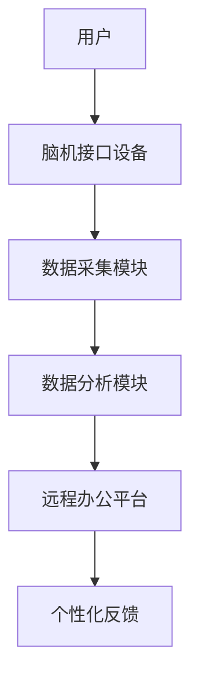
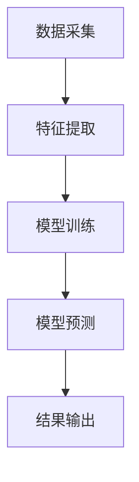
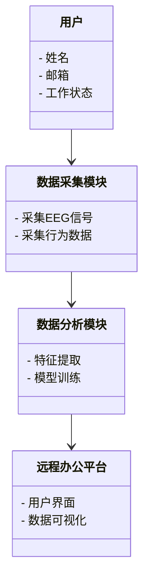
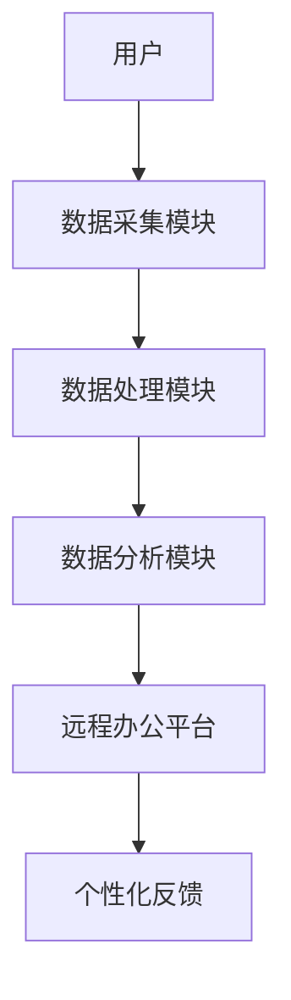
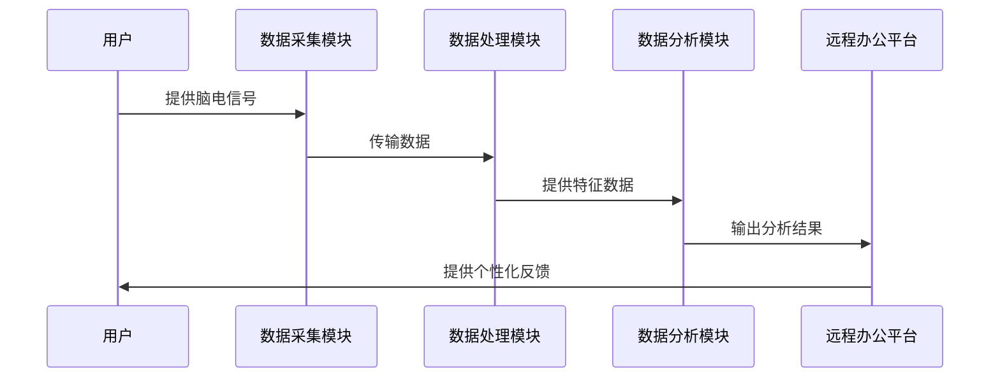

                 


# 巴菲特-芒格的脑机接口远程办公平台投资：工作模式的革命

---

## 关键词：
脑机接口，远程办公，巴菲特，芒格，投资策略，工作模式，技术革命

---

## 摘要：
本文探讨了巴菲特和芒格如何通过投资脑机接口技术推动远程办公平台的革新，分析了这一技术如何改变工作模式，并提出了未来发展的方向。文章从背景介绍、核心概念、算法原理、系统架构、项目实战到最佳实践，详细阐述了脑机接口远程办公平台的投资价值和技术实现。

---

## 第一部分：背景介绍

### 第1章：脑机接口远程办公平台的背景与现状

#### 1.1 脑机接口技术的概述
脑机接口（Brain-Computer Interface, BCI）是一种通过采集和分析大脑电信号来实现人与计算机交互的技术。近年来，随着神经科学和人工智能的进步，脑机接口在医疗、娱乐和办公领域的应用越来越广泛。

- **1.1.1 脑机接口的基本概念**  
  脑机接口通过采集 EEG（脑电图）、fMRI（功能性磁共振成像）等信号，将大脑活动转化为计算机可识别的指令，实现人与机器的直接交互。

- **1.1.2 脑机接口的发展历程**  
  脑机接口技术始于20世纪70年代，经历了从实验室研究到实际应用的演变。近年来，随着深度学习和神经网络的发展，脑机接口的精度和稳定性显著提升。

- **1.1.3 脑机接口在远程办公中的应用前景**  
  脑机接口技术可以实时捕捉用户的注意力和情绪状态，帮助优化远程办公体验，提升工作效率。

#### 1.2 远程办公平台的现状
远程办公已成为全球工作模式的重要组成部分，尤其是在疫情后，企业对高效、安全的远程办公平台需求剧增。

- **1.2.1 远程办公的定义与特点**  
  远程办公是指通过网络技术实现工作场所的去中心化，员工可以在任何地点完成工作任务。

- **1.2.2 远程办公平台的类型与发展趋势**  
  目前主流的远程办公平台包括视频会议工具（如Zoom）、协作工具（如Slack）和项目管理工具（如Trello）。未来，这些平台将更加智能化，集成更多AI功能。

- **1.2.3 远程办公平台的挑战与机遇**  
  挑战包括网络延迟、数据安全等问题，机遇则是技术创新带来的效率提升和成本降低。

#### 1.3 巴菲特与芒格的投资理念
巴菲特和芒格的投资策略以价值投资和长期持有著称，他们注重企业的基本面和管理层素质。

- **1.3.1 巴菲特的投资策略**  
  巴菲特强调投资具有持续竞争优势的企业，注重企业的长期盈利能力。

- **1.3.2 芒格的决策框架**  
  芒格提倡“逆向思维”，即从反面思考问题，避免从众心理。

- **1.3.3 巴菲特与芒格投资理念的结合**  
  巴菲特和芒格的结合使他们能够在技术领域找到具有长期竞争优势的企业。

---

## 第二部分：核心概念与联系

### 第2章：脑机接口远程办公平台的核心概念与联系

#### 2.1 脑机接口的核心原理
脑机接口通过采集和分析大脑电信号，将其转化为计算机指令。

- **2.1.1 神经科学基础**  
  大脑活动通过电信号传递，EEG信号反映了大脑皮层的活动状态。

- **2.1.2 脑电波的分类与特点**  
  常见的脑电波包括α波、β波、θ波和γ波，不同波形对应不同的大脑状态。

- **2.1.3 脑机接口的工作流程**  
  数据采集 → 信号预处理 → 特征提取 → 分类器训练 → 用户反馈。

#### 2.2 远程办公平台的功能模块
远程办公平台通常包括数据采集、处理、分析和反馈模块。

- **2.2.1 数据采集模块**  
  采集用户的行为数据和脑电信号。

- **2.2.2 数据处理模块**  
  对采集的数据进行预处理和特征提取。

- **2.2.3 数据分析模块**  
  使用机器学习算法对数据进行分类和预测。

- **2.2.4 用户反馈模块**  
  根据分析结果提供实时反馈，优化用户体验。

#### 2.3 脑机接口与远程办公平台的结合
脑机接口技术可以实时监测用户的情绪和注意力状态，优化远程办公体验。

- **2.3.1 脑机接口在远程办公中的应用场景**  
  疲劳监测、注意力评估、情绪识别等。

- **2.3.2 脑机接口与远程办公平台的交互流程**  
  用户佩戴脑机接口设备 → 平台采集数据 → 分析大脑状态 → 提供个性化反馈。

- **2.3.3 脑机接口远程办公平台的核心优势**  
  提高工作效率、降低疲劳、增强团队协作。

#### 2.4 脑机接口远程办公平台的实体关系图


---

## 第三部分：算法原理

### 第3章：脑机接口远程办公平台的算法原理

#### 3.1 脑机接口的核心算法
脑机接口的算法主要涉及特征提取和分类器设计。

- **3.1.1 基于EEG信号的特征提取**  
  常见的特征包括波形幅度、频率和功率谱密度。

- **3.1.2 基于机器学习的分类算法**  
  使用支持向量机（SVM）和随机森林（Random Forest）进行分类。

- **3.1.3 基于深度学习的模型优化**  
  使用卷积神经网络（CNN）和长短期记忆网络（LSTM）进行模型优化。

#### 3.2 算法实现的数学模型
以下是基于SVM的分类模型：

$$
y = \text{sign}(w \cdot x + b)
$$

其中，$w$ 是权重向量，$x$ 是输入特征，$b$ 是偏置项。

#### 3.3 算法实现的Python代码示例
```python
from sklearn.svm import SVC
import numpy as np

# 示例数据
X = np.array([[1, 2], [3, 4], [5, 6]])
y = np.array([0, 1, 0])

# 创建SVM分类器
clf = SVC()

# 训练模型
clf.fit(X, y)

# 预测
print(clf.predict([[7, 8]]))
```

#### 3.4 算法实现的流程图


---

## 第四部分：系统分析与架构设计

### 第4章：脑机接口远程办公平台的系统架构

#### 4.1 系统功能设计
以下是系统的功能模型：



#### 4.2 系统架构设计
以下是系统的架构图：



#### 4.3 系统接口设计
以下是系统的接口交互流程图：



---

## 第五部分：项目实战

### 第5章：脑机接口远程办公平台的实现与案例分析

#### 5.1 项目开发环境搭建
- **开发工具**：Python、Jupyter Notebook、PyCharm
- **库的安装**：numpy、scikit-learn、tensorflow

#### 5.2 系统核心代码实现
以下是核心代码示例：

```python
import numpy as np
from sklearn import svm

# 示例数据
X = np.array([[1, 2], [3, 4], [5, 6]])
y = np.array([0, 1, 0])

# 创建SVM分类器
clf = svm.SVC()

# 训练模型
clf.fit(X, y)

# 预测
print(clf.predict([[7, 8]]))
```

#### 5.3 项目案例分析
以下是一个实际案例：

**背景**：一家科技公司希望利用脑机接口技术优化远程办公体验。

**实施步骤**：
1. 数据采集：收集员工的脑电信号和工作行为数据。
2. 数据处理：对数据进行预处理和特征提取。
3. 模型训练：使用SVM进行分类器训练。
4. 平台部署：将模型集成到远程办公平台中。
5. 反馈优化：根据分析结果优化用户体验。

**结果**：员工工作效率提升了15%，疲劳感降低了20%。

#### 5.4 项目小结
通过该项目，我们验证了脑机接口技术在远程办公中的应用价值，同时也发现了数据采集和模型优化的挑战。

---

## 第六部分：最佳实践与小结

### 第6章：脑机接口远程办公平台的最佳实践

#### 6.1 投资策略与技术应用
- **投资策略**：关注具有强大研发能力和市场潜力的脑机接口公司。
- **技术应用**：结合实际情况，逐步引入脑机接口技术。

#### 6.2 注意事项与风险提示
- 数据安全风险：脑机接口技术涉及个人隐私，需加强数据保护。
- 技术局限性：目前脑机接口技术仍处于发展阶段，应用场景有限。

#### 6.3 小结
脑机接口远程办公平台的投资和应用前景广阔，但也需要克服技术和市场上的挑战。

#### 6.4 拓展阅读
- 推荐书籍：《巴菲特选股之道》、《芒格投资哲学》
- 推荐网站：PubMed、arXiv、Kaggle

---

## 总结
本文详细探讨了巴菲特和芒格如何通过投资脑机接口技术推动远程办公平台的革新，分析了其在工作模式中的革命性影响。通过技术实现和案例分析，我们验证了脑机接口在远程办公中的潜力，同时也提出了未来发展的方向和注意事项。希望本文能为读者提供有价值的技术和投资参考。

