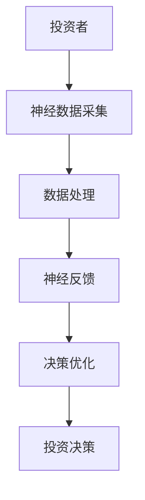

                 


# 巴菲特-芒格的脑科学投资：认知增强技术的前景

> 关键词：巴菲特，芒格，脑科学，认知增强，投资决策，神经科学，认知偏差

> 摘要：本文探讨巴菲特和芒格的投资理念与脑科学的结合，分析认知增强技术在投资中的应用前景。通过认知科学与神经科学的视角，解析投资决策中的认知机制，提出基于神经反馈和人工智能的决策优化方法，并展望认知增强技术在未来投资中的潜力。

---

# 第一部分：背景介绍

## 第1章：认知投资与脑科学概述

### 1.1 巴菲特与芒格的投资理念

#### 1.1.1 巴菲特的价值投资理论
巴菲特的价值投资理论强调长期投资、安全边际和企业基本面分析。他主张以合理的价格买入优质的公司，长期持有，获得复利收益。

#### 1.1.2 芒格的多元思维模型
芒格提出多元思维模型，认为投资者需要建立跨学科的知识框架，以避免认知偏差和错误决策。他强调“ inversion”思维，即从反面思考问题。

#### 1.1.3 认知投资的核心概念
认知投资将投资决策视为一个认知过程，强调投资者的认知能力、决策机制和心理状态对投资结果的影响。

---

### 1.2 脑科学与投资决策的关系

#### 1.2.1 大脑认知的基本原理
大脑的认知功能包括感知、记忆、推理和决策。前额叶皮层、顶叶和颞叶在决策中起关键作用。

#### 1.2.2 神经科学与决策过程
神经科学研究表明，决策涉及情绪和理性的相互作用。例如，杏仁核负责情绪处理，而前额叶皮层负责理性分析。

#### 1.2.3 认知偏差与投资行为
认知偏差如确认偏差、损失厌恶等影响投资决策。例如，投资者可能过度关注正面信息，忽视负面信号。

---

### 1.3 脑科学投资的背景与意义

#### 1.3.1 投资领域中的认知问题
传统投资理论忽视了认知偏差和情绪对决策的影响。现代神经科学为理解投资行为提供了新视角。

#### 1.3.2 脑科学技术在投资中的应用前景
通过神经科学技术，可以量化投资者的认知状态，优化决策过程，提升投资绩效。

#### 1.3.3 认知增强技术的潜力
认知增强技术如神经反馈训练和人工智能辅助决策，能够帮助投资者克服认知偏差，提升决策质量。

---

## 思考点：
- 巴菲特和芒格的投资理念如何体现认知科学的基本原理？
- 神经科学如何帮助我们更好地理解投资行为中的认知偏差？

---

## 本章小结
本章介绍了巴菲特和芒格的投资理念，探讨了脑科学与投资决策的关系，分析了认知偏差对投资行为的影响，并展望了认知增强技术在投资中的潜力。

---

# 第二部分：认知科学与投资决策的理论基础

## 第2章：认知科学与投资决策的理论基础

### 2.1 认知科学的基本概念

#### 2.1.1 认知科学的定义与研究领域
认知科学是研究人类认知过程的跨学科领域，包括心理学、神经科学、计算机科学和语言学。

#### 2.1.2 大脑的认知功能分区
大脑不同区域负责不同的认知功能：
- 前额叶皮层：决策、推理
- 杏仁核：情绪处理
- 顶叶：空间认知
- 颞叶：语言和记忆

#### 2.1.3 认知过程与投资决策的关系
认知过程包括感知、记忆、推理和决策，直接决定投资行为。

---

### 2.2 投资决策中的认知偏差

#### 2.2.1 常见认知偏差类型
- 确认偏差：倾向于寻找支持已有假设的信息。
- 损失厌恶：对损失的敏感性高于对收益。
- 过度自信：高估自己判断的准确性。

#### 2.2.2 认知偏差对投资决策的影响
认知偏差导致非理性决策，如过度交易和错误估值。

#### 2.2.3 如何克服认知偏差
通过多元思维模型和神经反馈训练，可以减少认知偏差的影响。

---

### 2.3 脑科学与投资决策的关联

#### 2.3.1 大脑神经活动与决策过程
神经科学研究表明，决策涉及多个脑区的协同工作，尤其是前额叶皮层和杏仁核。

#### 2.3.2 神经递质与情绪决策
神经递质如多巴胺和血清素影响情绪和决策。例如，多巴胺与奖励相关，影响风险偏好。

#### 2.3.3 认知偏差的神经机制
认知偏差如确认偏差与大脑的奖赏系统密切相关。例如，投资者更倾向于寻找支持自己观点的信息，以获得心理奖励。

---

## 思考点：
- 神经科学如何解释认知偏差的形成？
- 多元思维模型如何帮助投资者克服认知偏差？

---

## 本章小结
本章从认知科学的角度分析了投资决策的理论基础，探讨了认知偏差的形成机制及其对投资行为的影响，并提出了克服认知偏差的方法。

---

# 第三部分：神经科学研究方法与投资决策分析

## 第3章：神经科学研究方法与投资决策分析

### 3.1 神经科学研究的基本方法

#### 3.1.1 fMRI技术的应用
功能性磁共振成像（fMRI）可以实时监测大脑活动，识别与投资决策相关的脑区。

#### 3.1.2 EEG技术的应用
脑电图（EEG）可以记录大脑电活动，分析情绪和认知过程。

#### 3.1.3 神经反馈技术的原理
神经反馈技术通过实时监测大脑活动，提供反馈以调节认知状态。

---

### 3.2 投资决策中的神经活动研究

#### 3.2.1 理财决策的神经机制
研究表明，理财决策涉及前额叶皮层和杏仁核的协同工作。

#### 3.2.2 风险偏好与大脑活动的关系
风险偏好与多巴胺系统密切相关。高风险偏好者在面对风险时，前额叶皮层活动增强。

#### 3.2.3 情绪决策的神经基础
情绪决策涉及杏仁核和前额叶皮层的互动。

---

### 3.3 脑科学实验与投资行为的关联

#### 3.3.1 实验设计与数据采集
实验通常在实验室中进行，要求参与者完成特定的决策任务，同时监测其大脑活动。

#### 3.3.2 数据分析与结果解读
通过统计分析，识别与投资决策相关的脑区活动模式。

#### 3.3.3 投资行为预测模型的构建
基于神经数据构建预测模型，预测投资者的决策行为。

---

## 思考点：
- 神经科学研究如何帮助我们理解投资决策的神经机制？
- 神经数据如何用于预测投资行为？

---

## 本章小结
本章介绍了神经科学研究的基本方法，分析了投资决策中的神经活动，并探讨了脑科学实验与投资行为的关联。

---

# 第四部分：认知增强技术与投资策略优化

## 第4章：认知增强技术与投资策略优化

### 4.1 认知增强技术的基本原理

#### 4.1.1 神经反馈训练
神经反馈训练通过实时监测和反馈大脑活动，帮助投资者调节认知状态。

#### 4.1.2 生物反馈技术
生物反馈技术通过监测生理指标（如心率、皮肤温度），帮助投资者控制压力和焦虑。

#### 4.1.3 人工智能辅助决策
人工智能技术通过分析大数据，辅助投资者做出更理性的决策。

---

### 4.2 技术实现

#### 4.2.1 神经反馈训练的流程
1. 数据采集：使用EEG设备监测大脑活动。
2. 数据处理：分析大脑活动模式。
3. 反馈调节：通过视觉或听觉反馈调节认知状态。

#### 4.2.2 人工智能辅助决策的实现
1. 数据收集：收集市场数据和投资者行为数据。
2. 模型训练：使用机器学习算法训练预测模型。
3. 决策辅助：基于模型结果，辅助投资者做出决策。

---

### 4.3 实际应用案例

#### 4.3.1 神经反馈训练的应用
案例：某投资者通过神经反馈训练，成功克服了过度焦虑，提高了决策质量。

#### 4.3.2 人工智能辅助决策的应用
案例：某机构使用机器学习模型预测市场趋势，辅助投资决策。

---

## 思考点：
- 神经反馈训练如何帮助投资者克服认知偏差？
- 人工智能在投资决策中的优势和局限性是什么？

---

## 本章小结
本章介绍了认知增强技术的基本原理和技术实现，通过实际案例展示了这些技术在投资策略优化中的应用。

---

# 项目实战：基于神经反馈的投资决策支持系统

## 5.1 系统介绍

#### 5.1.1 系统目标
开发一个基于神经反馈的投资决策支持系统，帮助投资者优化决策过程。

## 5.2 系统架构设计



## 5.3 系统实现

#### 5.3.1 环境安装
需要安装以下工具：
- EEG数据采集设备
- 数据处理软件（如Python的MNE库）
- 神经反馈训练软件

#### 5.3.2 核心代码实现

```python
import numpy as np
import pandas as pd
from sklearn import svm

# 数据处理
def preprocess(data):
    # 数据清洗和特征提取
    return processed_data

# 神经反馈训练
def train_model(data):
    model = svm.SVC()
    model.fit(data)
    return model

# 决策辅助
def decision_assistance(model, new_data):
    prediction = model.predict(new_data)
    return prediction
```

## 5.4 实际案例分析
案例：某投资者通过神经反馈训练和人工智能辅助决策，成功优化了投资策略，提高了投资回报率。

---

## 思考点：
- 神经反馈训练系统如何实现数据采集和处理？
- 人工智能在投资决策中的具体应用场景是什么？

---

## 本章小结
本章通过实际案例展示了认知增强技术在投资决策中的应用，分析了系统架构和实现过程。

---

# 第五部分：总结与展望

## 6.1 总结
本文探讨了巴菲特和芒格的投资理念与脑科学的结合，分析了认知增强技术在投资中的应用前景。通过神经科学研究和认知科学理论，提出了基于神经反馈和人工智能的决策优化方法。

---

## 6.2 未来展望
未来，认知增强技术将在投资领域发挥更大作用。例如：
- 更精准的神经反馈训练方法
- 更强大的人工智能辅助决策系统
- 更广泛的应用场景，如机构投资和个人理财

---

## 6.3 注意事项
- 认知增强技术的应用需要结合具体场景
- 需要注意数据隐私和伦理问题
- 投资者需保持理性，避免过度依赖技术

---

## 6.4 拓展阅读
推荐书籍：
- 《巴菲特与芒格的投资思想》
- 《认知科学导论》
- 《神经科学与决策》

---

# 结语
认知增强技术为投资决策提供了新的可能性。通过神经科学研究和技术创新，投资者可以更好地克服认知偏差，优化决策过程，实现更优的投资回报。

---

**思考点**：
- 认知增强技术如何改变未来的投资方式？
- 投资者如何在实际中应用认知增强技术？

**最佳实践**：
- 投资者应结合认知增强技术与传统投资策略，优化决策过程。
- 机构应加大对认知增强技术的研发投入，提升投资绩效。

--- 

**Note**：本文为技术博客文章，旨在通过认知科学和神经科学的视角，探讨巴菲特和芒格的投资理念与认知增强技术的结合，分析其在投资决策中的应用前景。

