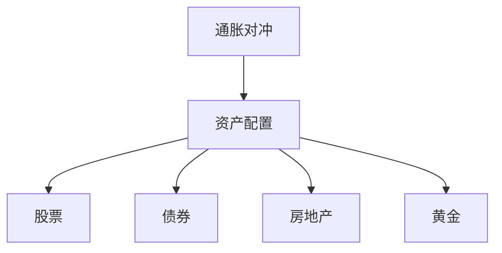
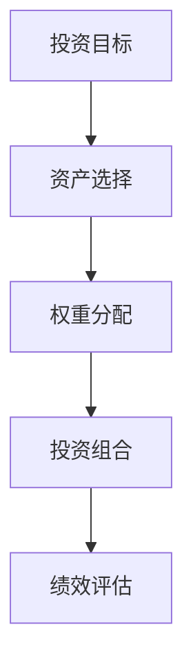

                 


# 巴菲特-芒格的通胀对冲策略：如何保护投资组合

**关键词**：通胀对冲、巴菲特、芒格、投资组合、资产配置、抗通胀资产、价值投资

**摘要**：本文深入探讨了巴菲特和芒格的通胀对冲策略，分析了其核心理念、策略实施步骤及实际案例。通过系统分析与架构设计，结合数学模型和算法原理，展示了如何利用多元化资产配置保护投资组合免受通胀影响。本文适合对投资策略和通胀对冲感兴趣的读者，旨在帮助他们在复杂经济环境中保护资产价值。

---

# 第一部分：巴菲特-芒格的通胀对冲策略背景与基础

## 第1章：巴菲特-芒格的通胀对冲策略概述

### 1.1 通胀对冲策略的背景与重要性

#### 1.1.1 通胀的定义与影响
通货膨胀是指物价总水平在一段时间内持续上涨，导致货币购买力下降。通胀对投资组合的影响包括降低实际收益、扭曲资产定价和增加市场波动性。

#### 1.1.2 通胀对投资组合的威胁
- 财富缩水：未通胀调整的投资收益可能为负。
- 资产贬值：固定收益资产（如债券）价值下降。
- 市场不确定性：通胀上升导致市场波动性增加。

#### 1.1.3 巴菲特的长期投资哲学
- 长期视角：投资于优质企业，关注长期价值。
- 股票的价值：基于企业的内在价值，而非短期价格波动。
- 安全边际：以合理价格买入优质资产，降低风险。

### 1.2 巴菲特与芒格的投资理念

#### 1.2.1 巴菲特的价值投资策略
- 寻找具有持续竞争优势的企业。
- 买入价格低于内在价值的股票。
- 长期持有，分享企业成长。

#### 1.2.2 芒格的多元思维模型
- 跨学科思维：将多个领域的知识融合，形成投资决策的基础。
- 避免情绪驱动：基于理性分析做出投资决策。
- 寻找安全边际：确保投资的安全性和收益性。

#### 1.2.3 巴菲特与芒格的通胀对冲观点
- 通过投资实物资产（如房地产、黄金）和优质股对抗通胀。
- 保持资产组合的多元化，分散风险。

### 1.3 通胀对冲策略的核心目标

#### 1.3.1 保护购买力
通过投资实物资产和优质股票，抵消通胀对购买力的侵蚀。

#### 1.3.2 维持资产实际价值
确保投资组合的实际价值随通胀上升而增长。

#### 1.3.3 投资组合的防御性构建
通过分散投资、选择抗通胀资产，降低通胀对组合的影响。

---

# 第二部分：通胀对冲策略的核心概念与联系

## 第2章：通胀对冲策略的核心概念与联系

### 2.1 核心概念原理

#### 2.1.1 通胀对冲的定义
通过投资实物资产或抗通胀金融资产，抵消物价上涨对购买力的侵蚀。

#### 2.1.2 巴菲特-芒格策略的核心要素
- 多元化：分散投资于股票、债券、房地产等资产。
- 优质资产：选择具有持续竞争优势的企业和资产。
- 长期持有：避免短期波动，分享长期增长。

#### 2.1.3 多元化资产配置的作用
通过分散投资降低风险，同时捕捉不同资产在通胀环境下的表现。

### 2.2 核心概念属性对比表

| 概念                | 特征                |
|---------------------|--------------------|
| 通胀对冲            | 保护购买力          |
| 资产配置            | 分散风险            |

### 2.3 核心概念ER实体关系图



---

# 第三部分：通胀对冲策略的算法原理

## 第3章：通胀对冲策略的算法原理

### 3.1 算法原理

#### 3.1.1 现代投资组合理论
通过优化资产配置，最大化收益，最小化风险。

#### 3.1.2 投资组合构建步骤
1. 确定目标：通胀对冲和收益目标。
2. 资产配置：股票、债券、房地产、黄金等。
3. 优化权重：调整各资产比例，平衡风险和收益。
4. 定期再平衡：根据市场变化调整配置。

#### 3.1.2 数学模型

##### 投资组合收益公式
$$ \text{投资组合收益} = \sum_{i=1}^{n} w_i \times r_i $$
其中，\( w_i \) 是第 \( i \) 资产的权重，\( r_i \) 是其收益率。

##### 投资组合风险公式
$$ \text{投资组合风险} = \sqrt{\sum_{i=1}^{n} \sum_{j=1}^{n} w_i w_j \sigma_i \sigma_j \rho_{ij}} $$
其中，\( \sigma_i \) 是第 \( i \) 资产的风险，\( \rho_{ij} \) 是相关系数。

---

## 第4章：系统分析与架构设计

### 4.1 系统分析

#### 4.1.1 问题场景
- 多元化投资组合构建。
- 资产配置优化。
- 定期再平衡。

### 4.2 系统架构设计



---

## 第5章：项目实战

### 5.1 项目实战：构建抗通胀投资组合

#### 5.1.1 环境安装
- 数据获取：使用历史价格数据。
- 工具：Excel或Python（Pandas、NumPy）。

#### 5.1.2 核心实现源代码

##### Python代码示例
```python
import pandas as pd
import numpy as np

# 假设data是各资产的历史收益数据
data = pd.DataFrame({
    '股票': [0.1, 0.05, 0.08, 0.06],
    '债券': [0.03, 0.04, 0.02, 0.05],
    '房地产': [0.08, 0.07, 0.06, 0.09],
    '黄金': [0.05, 0.04, 0.07, 0.06]
})

# 确定权重
weights = np.array([0.4, 0.3, 0.2, 0.1])

# 计算投资组合收益
portfolio_return = np.dot(data.values.T, weights)
```

---

## 第6章：最佳实践

### 6.1 小结
通过巴菲特和芒格的策略，结合多元化资产配置，可以有效应对通胀风险。

### 6.2 注意事项
- 定期再平衡：每年至少一次。
- 风险管理：避免过度集中。

### 6.3 拓展阅读
- 巴菲特的《投资之道》
- 芒格的《Poor Charlie's Almanack》

---

# 结论

巴菲特和芒格的通胀对冲策略通过多元化资产配置和优质资产选择，有效保护投资组合免受通胀影响。通过本文的系统分析和实战案例，读者可以掌握这些策略并在实际投资中应用。

---

感谢您的阅读，希望本文能为您提供有价值的投资策略和见解。

