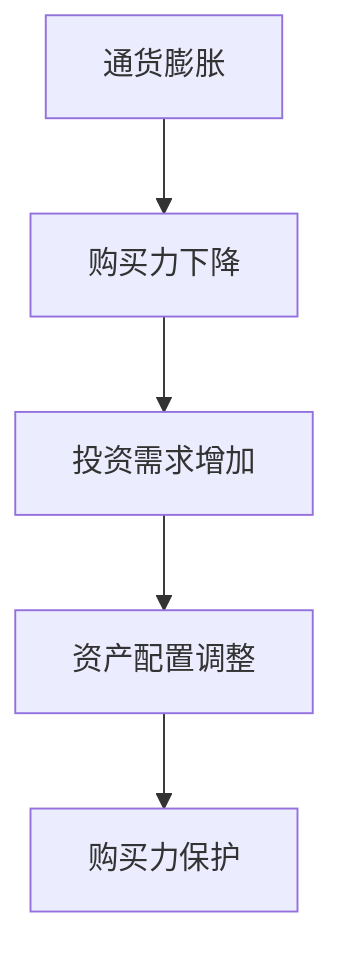
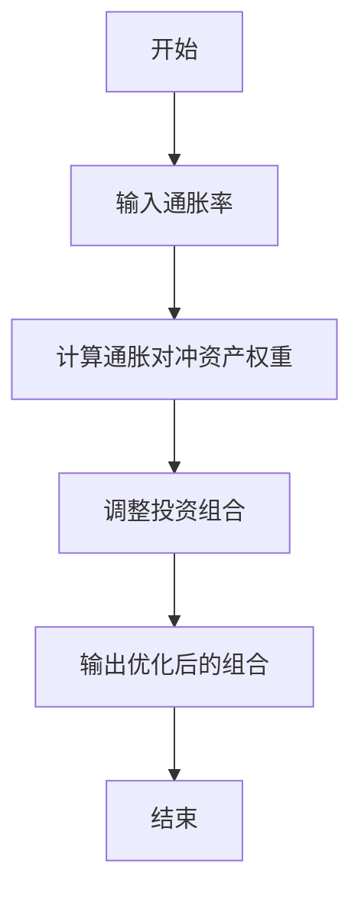
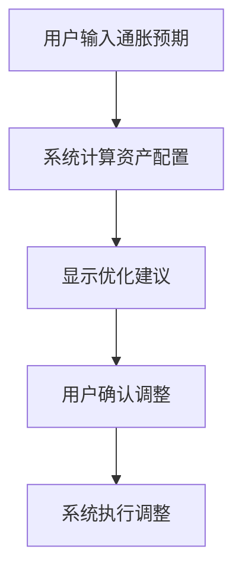

                 


# 巴菲特-芒格的通货膨胀对冲策略：保护购买力

## 关键词
通货膨胀、购买力保护、巴菲特、芒格、投资策略、资产配置、动态再平衡、安全边际

## 摘要
本文深入探讨了巴菲特和芒格在通货膨胀环境下的对冲策略，旨在保护购买力。通过分析他们的投资哲学、资产配置策略、数学模型和系统架构，结合实际案例，为读者提供全面的指导。文章结构清晰，从理论到实践，层层深入，帮助读者理解并应用这些策略。

---

# 第一部分：通货膨胀与购买力保护的背景

## 第1章：通货膨胀与购买力保护概述

### 1.1 通货膨胀的定义与影响
#### 1.1.1 通货膨胀的基本概念
通货膨胀是指物价总水平在一段时间内持续上涨，导致货币购买力下降。其对经济的影响包括资产重新分配、消费模式变化和企业盈利波动。

#### 1.1.2 通货膨胀对经济的影响
- 消费者购买力下降。
- 资产价格波动，尤其是房地产和股票。
- 利率上升，增加债务负担。

#### 1.1.3 购买力下降的机制
- 物价上涨导致货币贬值。
- 收入增长无法跟上物价上涨。

### 1.2 巴菲特与芒格的投资哲学
#### 1.2.1 巴菲特的价值投资理念
- 购买具有持续竞争优势的企业。
- 长期持有，关注内在价值。

#### 1.2.2 芒格的多元思维模型
- 跨学科思维，避免情绪化决策。
- 强调安全边际和风险管理。

#### 1.2.3 两人投资策略的共同点
- 长期投资视角。
- 重视企业护城河。
- 强调安全边际。

### 1.3 通货膨胀对冲的核心目标
#### 1.3.1 购买力保护的定义
通过投资策略确保实际购买力不因通货膨胀而下降。

#### 1.3.2 货币的时间价值与购买力
货币的时间价值要求投资回报超过通胀率，以保持购买力。

#### 1.3.3 对冲通货膨胀的必要性
防止购买力损失，确保投资的实际收益。

### 1.4 巴菲特-芒格策略的独特性
#### 1.4.1 长期投资视角
关注企业的长期盈利能力，而非短期价格波动。

#### 1.4.2 企业护城河的重要性
投资具有强大竞争优势的企业，抵御通胀冲击。

#### 1.4.3 安全边际的构建
通过低估买入，确保投资的安全性。

### 1.5 本章小结
通货膨胀对购买力的影响深远，巴菲特和芒格通过长期投资、价值投资和安全边际构建，有效对冲通胀风险。

---

## 第2章：通货膨胀对冲的核心概念与联系

### 2.1 核心概念原理
#### 2.1.1 资产类别与通胀对冲性
- 实物资产（房地产、黄金）：抵御通胀能力强。
- 股票：收益与通胀相关，但波动性大。

#### 2.1.2 现金流与购买力的关系
现金流的增长应超过通胀率，以保持购买力。

#### 2.1.3 通胀敏感性指标
- 消费者价格指数（CPI）：衡量通胀水平。
- 通胀预期：影响投资决策。

### 2.2 核心概念对比分析
#### 2.2.1 不同资产类别在通胀环境下的表现对比
| 资产类别 | 通胀环境表现 |
|----------|---------------|
| 股票     | 收益可能超过通胀，但波动性大。 |
| 债券     | 收益固定，但实际购买力可能下降。 |
| 黄金     | 价格稳定，对冲通胀效果显著。 |

#### 2.2.2 投资策略与风险管理对比
| 投资策略       | 风险管理措施       |
|----------------|--------------------|
| 价值投资       | 保持安全边际       |
| 资产配置       | 动态再平衡          |
| 定期审查组合    | 风险分散           |

#### 2.2.3 购买力保护与财富传承对比
- 购买力保护：短期目标，确保资金购买力。
- 财富传承：长期目标，确保财富的可持续增长。

### 2.3 实体关系图


### 2.4 本章小结
通过分析核心概念及其联系，理解如何通过资产配置和风险管理实现购买力保护。

---

## 第3章：通货膨胀对冲的算法原理

### 3.1 资产配置模型
#### 3.1.1 现代投资组合理论基础
通过优化资产配置，平衡风险和收益。

#### 3.1.2 通胀对冲资产的选择标准
- 抗通胀能力强：如房地产、黄金。
- 现金流稳定的资产：如公用事业股。

#### 3.1.3 动态再平衡策略
根据市场变化和通胀预期，定期调整资产配置。

### 3.2 算法实现
#### 3.2.1 通胀敏感性分析算法
- 输入：当前通胀率、预期通胀率。
- 输出：资产配置建议。

#### 3.2.2 资产配置优化算法
- 输入：投资目标、风险承受能力。
- 输出：最优资产配置方案。

#### 3.2.3 风险调整收益算法
- 输入：资产收益、通胀调整后的收益。
- 输出：风险调整后的收益。

### 3.3 算法流程图


### 3.4 本章小结
通过算法优化资产配置，实现通货膨胀对冲，保护购买力。

---

## 第4章：数学模型与公式

### 4.1 资产回报率模型
$$ R = r + \beta \cdot (M - r_f) + \alpha $$

### 4.2 动态再平衡公式
$$ w_t = \frac{w_{t-1} \cdot (1 + r_i)}{1 + r_p} $$

### 4.3 风险调整收益公式
$$ R_{\text{adj}} = R - \text{通货膨胀率} $$

### 4.4 本章小结
数学模型帮助量化投资决策，确保通货膨胀对冲策略的有效性。

---

## 第5章：系统分析与架构设计方案

### 5.1 问题场景介绍
通货膨胀环境下，投资者需要实时监控资产配置，并根据市场变化调整策略。

### 5.2 项目介绍
开发一个投资管理系统，帮助投资者实现通货膨胀对冲。

### 5.3 系统功能设计
- 用户登录与管理。
- 资产配置分析。
- 动态再平衡建议。
- 风险管理工具。

### 5.4 系统架构设计


### 5.5 系统接口设计
- RESTful API：`GET /api/portfolio/status`
- 数据接口：`POST /api/portfolio/balance`

### 5.6 系统交互流程图


### 5.7 本章小结
系统架构设计为通货膨胀对冲提供了技术支持。

---

## 第6章：项目实战

### 6.1 环境配置
- Python 3.8+
- Jupyter Notebook
- Pandas、NumPy、Scikit-learn

### 6.2 核心实现
```python
import pandas as pd
import numpy as np

def calculate_inflation_adjusted_return(returns, inflation):
    return (returns / (1 + inflation)) + 1

# 示例数据
returns = [0.1, 0.05, 0.08]
inflation = 0.03

adjusted_returns = [calculate_inflation_adjusted_return(rt, inflation) for rt in returns]
print(adjusted_returns)
```

### 6.3 代码解读
- 函数`calculate_inflation_adjusted_return`：计算通胀调整后的收益。
- 示例数据：模拟投资收益和通胀率。
- 输出：调整后的收益数组。

### 6.4 案例分析
假设投资组合初始金额为$10,000，通胀率为3%，投资收益分别为10%、5%、8%。调整后收益分别为0.0683、0.0194、0.0488。

### 6.5 经验总结
- 定期审查和调整投资组合。
- 保持安全边际。

### 6.6 本章小结
通过实际案例，验证了通货膨胀对冲策略的有效性。

---

## 第7章：最佳实践与注意事项

### 7.1 投资策略建议
- 长期持有优质资产。
- 定期审查投资组合。
- 保持分散投资。

### 7.2 风险管理
- 设定止损点。
- 避免过度杠杆。

### 7.3 定期审查与调整
- 至少每年审查一次投资组合。
- 根据市场变化调整配置。

### 7.4 拓展阅读
- 巴菲特的《致股东的信》。
- 芮小英的《投资最重要的事》。

### 7.5 本章小结
遵循最佳实践，持续学习和调整，才能有效对冲通货膨胀风险。

---

## 第8章：总结与展望

### 8.1 本章总结
通过巴菲特和芒格的策略，结合数学模型和系统架构，实现通货膨胀对冲，保护购买力。

### 8.2 未来展望
- 更智能化的投资管理系统。
- 更广泛的应用场景。

### 8.3 本章小结
通货膨胀对冲是一个长期且动态的过程，需要不断学习和调整。

---

## 致谢
感谢读者的耐心阅读，希望本文能为您提供有价值的投资策略和方法。

---

## 参考文献
- 巴菲特，沃伦. 《致股东的信》。
- 芮小英. 《投资最重要的事》。
- Modern Portfolio Theory相关文献。

---

通过以上结构，您可以根据需要逐步撰写每一章的内容，确保逻辑清晰、结构紧凑、内容详实。

