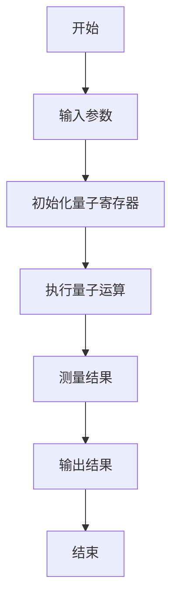
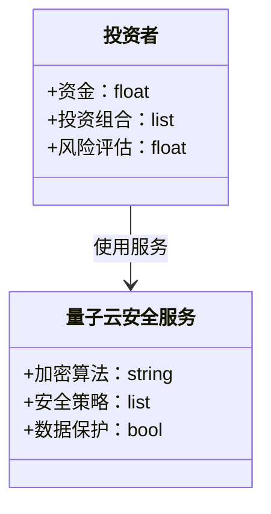
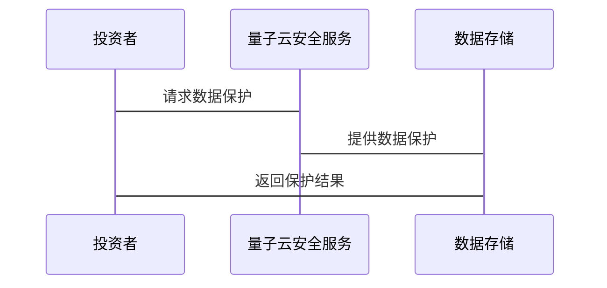

                 


```markdown
# 巴菲特-芒格的量子云安全服务投资：数据保护的终极解决方案

> 关键词：量子云安全服务，巴菲特-芒格投资策略，数据保护，量子计算，云安全，投资风险管理

> 摘要：本文将深入探讨巴菲特-芒格投资策略在量子云安全服务中的应用，结合量子计算的原理与云计算环境下的数据保护需求，提出一种基于量子云安全服务的数据保护终极解决方案。文章将从背景介绍、核心概念、算法原理、系统架构、项目实战等方面展开，详细分析量子云安全服务的实现路径、关键技术和实际应用，同时结合巴菲特-芒格投资策略，总结最佳实践和投资风险管理。

---

## 第1章 巴菲特-芒格的量子云安全服务投资背景

### 1.1 量子云安全服务的背景与问题背景
1.1.1 传统数据保护的局限性  
1.1.2 量子计算对数据安全的影响  
1.1.3 云计算环境下的数据保护需求  

### 1.2 问题背景与问题描述
1.2.1 数据泄露的现状与趋势  
1.2.2 云计算环境中的安全挑战  
1.2.3 量子计算对传统加密算法的威胁  

### 1.3 问题解决与边界外延
1.3.1 量子云安全服务的核心目标  
1.3.2 量子云安全服务的边界与外延  
1.3.3 量子云安全服务的实现路径  

### 1.4 核心概念与结构
1.4.1 量子云安全服务的核心要素  
1.4.2 量子云安全服务的概念结构  
1.4.3 核心要素的组成与关系  

## 第2章 巴菲特-芒格投资策略的核心概念

### 2.1 巴菲特-芒格投资策略概述
2.1.1 巴菲特-芒格投资策略的定义  
2.1.2 巴菲特-芒格投资策略的特点  
2.1.3 巴菲特-芒格投资策略与传统投资策略的区别  

### 2.2 量子云安全服务的核心概念
2.2.1 量子计算的核心原理  
2.2.2 云计算环境下的数据保护需求  
2.2.3 量子云安全服务的实现原理  

### 2.3 核心概念的联系与对比
2.3.1 巴菲特-芒格投资策略与量子云安全服务的联系  
2.3.2 量子云安全服务与传统数据保护服务的对比  
2.3.3 量子云安全服务与传统加密算法的对比  

### 2.4 核心概念的ER实体关系图
```mermaid
er
actor: 投资者
|------|
| 操作 |
|------|
| 投资决策 |
|------|
| 投资结果 |
```

## 第3章 量子云安全服务的算法原理

### 3.1 量子加密算法的原理
3.1.1 Shor算法的原理与实现  
3.1.2 量子密钥分发的原理与实现  

### 3.2 量子加密算法的数学模型与公式
$$ Shor算法的数学模型如下：$$  
$$ f(x) = x^k \mod n $$  
其中，$x$ 是输入，$k$ 是指数，$n$ 是模数。

### 3.3 量子加密算法的Python实现
```python
def shor_algorithm(n):
    # 量子部分的实现（简化）
    pass
```

### 3.4 量子加密算法的流程图


## 第4章 系统分析与架构设计方案

### 4.1 问题场景介绍
4.1.1 数据保护的需求分析  
4.1.2 云计算环境下的安全挑战  

### 4.2 量子云安全服务的系统功能设计
4.2.1 领域模型设计  


### 4.3 系统架构设计
4.3.1 系统架构图  


### 4.4 系统接口设计
4.4.1 接口描述  
4.4.2 接口交互流程  

### 4.5 系统交互流程图


## 第5章 项目实战：量子云安全服务的实现

### 5.1 环境安装与配置
5.1.1 安装Python环境  
5.1.2 安装量子计算库  

### 5.2 核心功能实现
5.2.1 量子加密算法的实现  
5.2.2 量子云安全服务的接口开发  

### 5.3 代码实现与解读
```python
def quantum_encryption(data):
    # 量子加密算法的实现
    return encrypted_data
```

### 5.4 实际案例分析
5.4.1 案例背景  
5.4.2 案例分析与解读  

### 5.5 项目总结
5.5.1 项目成果  
5.5.2 项目经验与教训  

## 第6章 最佳实践与投资风险管理

### 6.1 巴菲特-芒格投资策略在量子云安全服务中的应用
6.1.1 投资策略的核心要素  
6.1.2 投资策略的实施路径  

### 6.2 量子云安全服务的选择与评估
6.2.1 服务选择的要点  
6.2.2 服务评估的指标  

### 6.3 投资风险管理与策略调整
6.3.1 风险管理的核心原则  
6.3.2 策略调整的实施方法  

## 第7章 总结与展望

### 7.1 核心观点总结
7.1.1 量子云安全服务的重要性  
7.1.2 巴菲特-芒格投资策略的指导作用  

### 7.2 未来展望与研究方向
7.2.1 量子计算技术的发展趋势  
7.2.2 云计算环境下的数据保护需求  

### 7.3 最后一博

---

通过以上目录结构，我们可以清晰地看到文章将从背景介绍、核心概念、算法原理、系统架构、项目实战、最佳实践等多个方面展开，全面解析巴菲特-芒格的量子云安全服务投资，为读者提供数据保护的终极解决方案。

