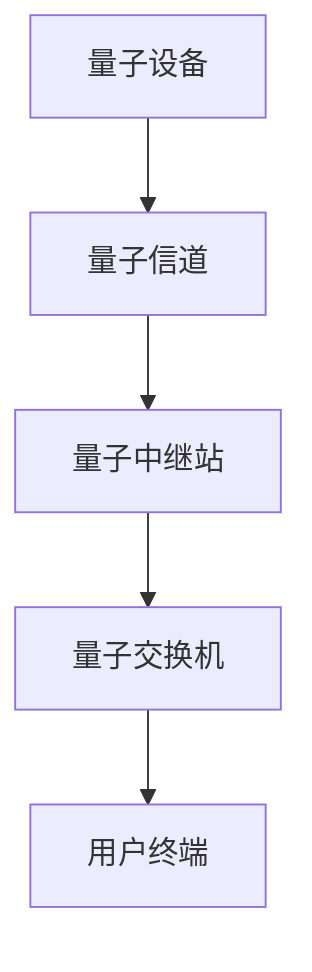
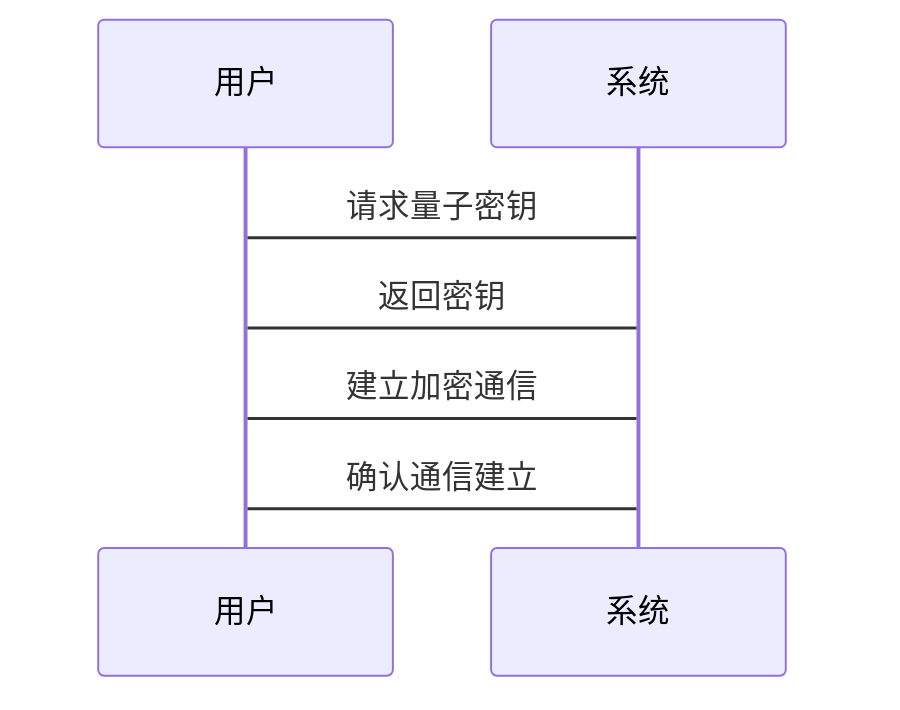

                 


# 巴菲特-芒格的量子互联网基础设施投资：下一代通信的骨干

## 关键词：量子互联网、巴菲特、芒格、投资策略、通信技术

## 摘要：量子互联网作为下一代通信技术的核心，具有革命性的潜力。本文结合巴菲特和芒格的投资理念，分析量子互联网的投资机会与挑战，探讨其技术原理和系统架构，提供投资策略和实战案例，为投资者和科技从业者提供深度洞察。

---

## 第1章：量子互联网的核心概念与背景

### 1.1 量子互联网的定义与技术优势

量子互联网是指利用量子力学原理构建的通信网络，主要依赖量子叠加和纠缠等特性，实现信息的安全传输。其技术优势包括：

- **安全性**：量子密钥分发（QKD）确保通信无法被截获。
- **高速性**：量子计算可以显著提升数据处理速度。
- **广泛应用**：适用于金融、国防、医疗等领域。

### 1.2 巴菲特与芒格的投资理念

- **巴菲特**：价值投资，寻找具有持续竞争优势的企业，强调安全边际和长期投资。
- **芒格**：多元思维模型，注重风险管理，避免情绪化决策。

### 1.3 量子互联网的投资背景

随着数字经济的发展，量子互联网成为各国竞争的焦点。其市场潜力巨大，但技术门槛高，投资周期长。

### 1.4 量子互联网基础设施的核心要素

包括量子网络、量子中继站和量子交换机，确保通信的安全性和稳定性。

---

## 第2章：量子互联网的技术原理与数学模型

### 2.1 量子通信的基本原理

- **量子叠加**：信息以叠加态存在，测量后坍塌为确定态。
- **量子纠缠**：两个粒子的量子状态相互关联，无论距离多远。

公式：$$ | \psi \rangle = \frac{1}{\sqrt{2}} (|0\rangle + |1\rangle) $$

### 2.2 量子计算的核心算法

- **Shor算法**：用于大数分解，威胁现有加密技术。
- **Grover算法**：优化搜索算法，提升数据检索效率。

### 2.3 量子互联网的数学模型

- 图论模型：描述量子网络的节点和边。
- 量子信道容量：计算通信能力。

### 2.4 技术挑战与解决方案

- **量子噪声**：通过量子纠错码（如表面码）解决。
- **量子中继技术**：延长通信距离。

---

## 第3章：巴菲特-芒格投资理念的深度分析

### 3.1 巴菲特的价值投资原则

- 强调企业的内在价值，寻找具有竞争优势的企业。
- 安全边际：买入价格低于内在价值。

### 3.2 芒格的多元思维模型

- 结合多个学科的思维方式，避免单一视角的局限性。
- 逆向思维：从反方向思考问题。

### 3.3 投资背景

- 量子互联网市场潜力大，但技术复杂，投资周期长。

---

## 第4章：量子互联网基础设施的投资分析与策略

### 4.1 量子通信与量子计算的投资机会

- **通信领域**：QKD技术在金融和国防中的应用。
- **计算领域**：量子计算在药物研发和密码学中的应用。

### 4.2 巴菲特和芒格的投资策略

- **长期投资**：耐心等待投资机会。
- **风险管理**：分散投资，降低风险。

### 4.3 投资风险与应对措施

- **技术风险**：依赖研发进展。
- **市场风险**：市场竞争和技术替代。

---

## 第5章：量子互联网系统的系统分析与架构设计

### 5.1 系统架构

- **物理层**：量子信道和量子设备。
- **数据层**：量子密钥分发和量子计算。

### 5.2 系统架构图



### 5.3 接口设计与交互流程

- 用户与系统交互：请求量子密钥，建立加密通信。

### 5.4 交互流程图



---

## 第6章：量子互联网基础设施投资的项目实战

### 6.1 项目环境配置

- 硬件：量子设备和中继站。
- 软件：量子通信协议栈。

### 6.2 源代码实现

```python
import numpy as np

def quantum_key_distribution():
    # 生成随机密钥
    key = np.random.choice([0, 1], size=10)
    return key

# 示例调用
print(quantum_key_distribution())
```

### 6.3 案例分析

- 某量子通信网络的部署和测试，验证系统性能和安全性。

### 6.4 项目小结

量子互联网项目需要跨学科团队协作，技术门槛高，但潜力巨大。

---

## 第7章：总结与展望

### 7.1 全文总结

量子互联网作为下一代通信技术，具有巨大的投资潜力。巴菲特和芒格的投资理念为投资者提供了重要的指导。

### 7.2 投资展望

未来，量子互联网将在多个领域广泛应用，投资者需关注技术进展和市场动态。

### 7.3 最佳实践 tips

- 长期投资，耐心等待。
- 保持学习，紧跟技术趋势。
- 风险管理，分散投资。

---

通过本文的系统分析，读者可以全面理解量子互联网的投资机会、技术挑战和未来展望，为投资决策提供有力支持。

