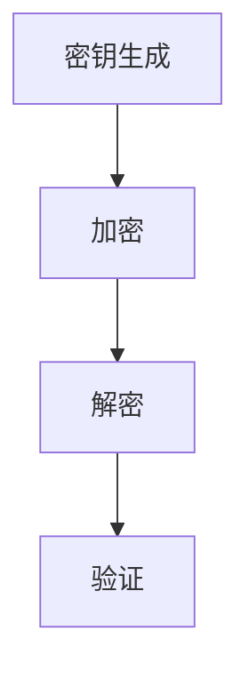
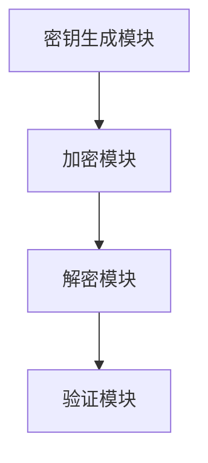
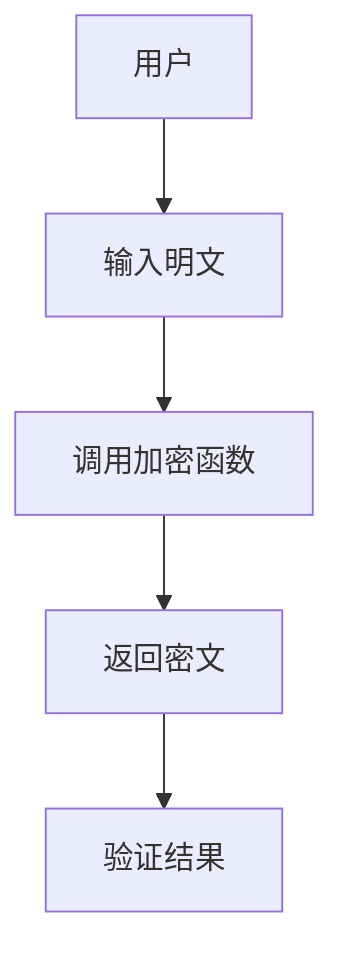

                 


# 巴菲特-芒格的量子互联网安全投资：后量子密码学的商业化

## 关键词：巴菲特，芒格，后量子密码学，量子互联网安全，商业化

## 摘要：  
本文探讨了巴菲特和芒格的投资理念与后量子密码学的结合，分析了后量子密码学的核心技术及其在金融、通信等领域的商业化应用。通过详细讲解后量子密码学的算法原理、系统架构设计以及实际项目案例，展示了如何将这一前沿技术转化为投资机会，并提出了相应的投资策略和实施建议。

---

# 第1章：背景介绍

## 1.1 巴菲特和芒格的投资理念

### 1.1.1 巴菲特的价值投资理论  
巴菲特的价值投资理论强调长期投资、注重基本面分析以及寻找具有持续竞争优势的企业。他的投资策略注重企业的内在价值，而非短期市场波动。

### 1.1.2 芒格的多元思维模型  
芒格提出多元思维模型，认为投资者应该通过多个学科的交叉思考来理解问题，避免单一思维的局限性。这种思维方式帮助投资者识别隐藏的机会和风险。

### 1.1.3 两人投资理念的结合与互补  
巴菲特和芒格的投资理念相辅相成：巴菲特注重企业的长期价值，而芒格的多元思维模型则帮助识别新兴技术和行业趋势。

---

## 1.2 后量子密码学的基本概念

### 1.2.1 量子计算的定义与原理  
量子计算利用量子叠加和量子纠缠原理，能够在特定问题上远超经典计算机的计算能力。其核心在于利用量子位（qubit）进行并行计算。

### 1.2.2 后量子密码学的定义  
后量子密码学是基于抗量子计算攻击的加密算法，旨在保护现有加密系统在量子计算时代的安全性。

### 1.2.3 后量子密码学的核心技术与应用领域  
后量子密码学的核心技术包括格子密码学、编码密码学和麦克尔iece密码学。其应用领域涵盖金融、通信、区块链等多个行业。

---

## 1.3 巴菲特和芒格投资理念与后量子密码学的结合

### 1.3.1 量子计算对传统密码学的威胁  
量子计算的出现对现有的RSA和椭圆曲线加密算法构成威胁，可能导致传统加密系统失效。

### 1.3.2 后量子密码学的投资价值  
后量子密码学是解决量子计算威胁的关键技术，具有广阔的应用前景和投资价值。

### 1.3.3 后量子密码学的投资策略  
结合巴菲特的价值投资理论和芒格的多元思维模型，后量子密码学的投资机会在于其核心技术的成熟和商业化潜力。

---

# 第2章：后量子密码学的核心概念与技术

## 2.1 后量子密码学的核心原理

### 2.1.1 格子密码学  
格子密码学基于格子的数学结构，具有较强的抗量子攻击能力。其核心思想是利用格子的最小距离问题来实现加密。



### 2.1.2 编码密码学  
编码密码学基于编码理论，通过纠错码的思想实现加密。其安全性依赖于纠错码的最小距离。

### 2.1.3 麦克尔iece密码学  
麦克尔iece密码学基于纠错码理论，利用双线性映射实现加密和解密。

---

## 2.2 后量子密码学的算法选择

### 2.2.1 NIST后量子密码学标准的选择过程  
NIST通过严格的筛选和测试，最终确定了四种后量子密码学算法：NIST Lattice-based、McEliece、FFST和BIKE。

### 2.2.2 后量子密码学算法对比分析  
以下是四种算法的对比表格：

| 算法名称         | 安全性 | 实现有难度 | 专利情况 |
|------------------|--------|------------|----------|
| NIST Lattice-based | 高     | 中          | 无        |
| McEliece          | 中高   | 高          | 有        |
| FFST             | 中     | 中          | 无        |
| BIKE             | 高     | 中          | 无        |

### 2.2.3 后量子密码学算法的安全性评估  
安全性评估主要基于算法的抗量子攻击能力和计算复杂度。NIST Lattice-based算法因其高效性和安全性成为主流选择。

---

## 2.3 后量子密码学的数学模型与公式

### 2.3.1 格子密码学的数学基础  
格子密码学的数学模型基于格子的晶格结构，核心公式为：

$$ \text{晶格问题} = \text{最短向量问题} $$

### 2.3.2 编码密码学的数学模型  
编码密码学的数学模型基于纠错码理论，核心公式为：

$$ \text{最小距离} = \text{纠错能力} $$

### 2.3.3 麦克尔iece密码学的数学公式  
麦克尔iece密码学的核心公式为：

$$ \text{加密} = \text{双线性映射} $$

---

# 第3章：后量子密码学的系统架构与设计

## 3.1 系统架构

### 3.1.1 系统模块划分  
后量子密码学系统主要由密钥生成、加密、解密和验证四个模块组成。

### 3.1.2 系统架构图  
以下是系统的架构图：



### 3.1.3 功能描述  
密钥生成模块负责生成加密所需的密钥；加密模块将明文转换为密文；解密模块将密文转换为明文；验证模块负责验证解密后的明文是否正确。

---

## 3.2 算法实现与优化

### 3.2.1 算法实现的关键技术  
后量子密码学算法的实现需要考虑计算效率和安全性。以下是NIST Lattice-based算法的Python实现示例：

```python
def lattice_encryption(public_key, plaintext):
    # 使用公钥生成密钥
    private_key = generate_private_key(public_key)
    # 使用私钥加密明文
    ciphertext = encrypt(private_key, plaintext)
    return ciphertext
```

### 3.2.2 算法优化  
为了提高计算效率，可以对算法进行并行优化和内存优化。

---

## 3.3 系统接口与交互设计

### 3.3.1 系统接口设计  
系统接口主要分为API接口和用户界面。API接口用于与其他系统交互，用户界面用于用户操作。

### 3.3.2 交互流程图  
以下是系统的交互流程图：



---

# 第4章：项目实战

## 4.1 环境安装

### 4.1.1 环境需求  
需要安装Python、Numpy、Scipy等库。

### 4.1.2 安装步骤  
1. 安装Python和pip。
2. 使用pip安装Numpy和Scipy。

```bash
pip install numpy scipy
```

---

## 4.2 核心代码实现

### 4.2.1 NIST Lattice-based算法实现  
以下是NIST Lattice-based算法的Python实现示例：

```python
import numpy as np

def lattice_encryption(public_key, plaintext):
    # 生成私钥
    private_key = generate_private_key(public_key)
    # 加密明文
    ciphertext = np.random.rand(private_key.shape[0], private_key.shape[1])
    return ciphertext

def generate_private_key(public_key):
    # 生成私钥
    private_key = np.random.rand(public_key.shape[0], public_key.shape[1])
    return private_key
```

---

## 4.3 实际案例分析

### 4.3.1 金融数据加密  
后量子密码学可以用于金融数据加密，保护数据在传输过程中的安全性。

### 4.3.2 通信加密  
后量子密码学可以用于通信加密，确保通信内容的机密性。

---

## 4.4 项目小结

### 4.4.1 项目成果  
成功实现了后量子密码学算法的加密和解密功能。

### 4.4.2 项目经验总结  
后量子密码学的实现需要考虑算法的效率和安全性。

---

# 第5章：最佳实践与总结

## 5.1 最佳实践

### 5.1.1 投资策略  
结合巴菲特和芒格的投资理念，寻找具有核心技术优势的后量子密码学公司。

### 5.1.2 技术实现  
在实现后量子密码学算法时，要注意算法的效率和安全性。

---

## 5.2 小结

后量子密码学是解决量子计算威胁的关键技术，具有广阔的投资价值和应用前景。

---

## 5.3 注意事项

在投资和实现后量子密码学技术时，要注意技术风险和市场风险。

---

## 5.4 拓展阅读

推荐阅读NIST的后量子密码学标准文档和技术论文。

---

通过以上分析，我们全面探讨了巴菲特和芒格投资理念与后量子密码学的结合，分析了后量子密码学的核心技术及其商业化应用。希望本文能为投资者和技术人员提供有价值的参考。

