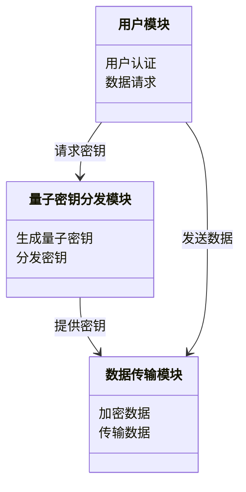
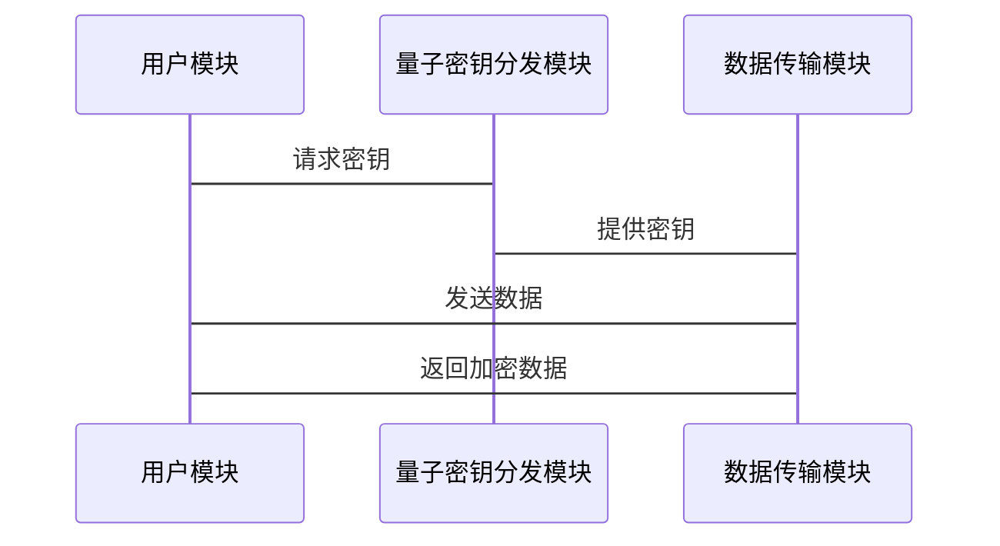

                 


# 巴菲特-芒格的量子互联网投资：通信安全的新范式

## 关键词

- 巴菲特
- 芒格
- 量子互联网
- 通信安全
- 投资策略
- 量子计算
- 数据加密

## 摘要

本文探讨了巴菲特和芒格的投资哲学与量子互联网技术的结合，特别是在通信安全领域的应用。通过分析量子计算和量子通信的基本原理，本文揭示了这些技术如何革新传统的投资策略，为投资者提供更安全、更高效的决策支持。文章详细讲解了量子算法、通信协议，并通过实际案例展示了量子互联网在投资中的潜力，为读者提供了深入的理论分析和实践指导。

---

## 第一部分：巴菲特与芒格的投资哲学

### 第1章：巴菲特与芒格的投资哲学

#### 1.1 巴菲特的价值投资理论

##### 1.1.1 价值投资的核心理念

价值投资是一种以内在价值为导向的投资策略，强调购买被市场低估的股票，并长期持有。巴菲特强调寻找那些具备持续竞争优势、良好管理和财务状况的公司，并以合理的价格买入。

##### 1.1.2 芒格的多元思维模型

芒格倡导通过多个学科的交叉思维来分析问题，避免单一思维的局限性。他强调在投资决策中考虑物理学、心理学、经济学等多方面的因素，以做出更全面的判断。

##### 1.1.3 投资中的长期主义

巴菲特和芒格都主张长期投资，避免短期波动的干扰。他们认为市场短期波动难以预测，而企业长期价值的实现才是投资的核心。

#### 1.2 巴菲特与芒格的成功案例分析

##### 1.2.1 可口可乐与比亚迪的投资分析

巴菲特对可口可乐的投资体现了他对品牌价值和稳定收益的重视。而他对比亚迪的投资则反映了对新能源行业的看好，体现了他对企业长期竞争优势的关注。

##### 1.2.2 芒格在Daily Journal的投资策略

芒格在Daily Journal的投资中展示了其多元思维模型的应用，通过分析管理层、财务状况和行业前景，做出明智的投资决策。

---

## 第二部分：量子互联网与通信安全

### 第2章：量子互联网的基础知识

#### 2.1 量子通信的原理

##### 2.1.1 量子叠加与量子纠缠

量子叠加允许量子系统处于多个状态的叠加态，而量子纠缠则使得两个或多个粒子之间形成一种特殊的关系，一个粒子的状态会立即影响另一个粒子的状态，无论距离多远。

##### 2.1.2 量子密钥分发（QKD）机制

QKD是一种利用量子力学原理在用户之间安全交换加密密钥的技术，确保密钥的安全传输，防止被窃取。

#### 2.2 量子互联网的架构

##### 2.2.1 量子中继站的作用

量子中继站用于延长量子通信的距离，通过中继站实现长距离的量子通信网络。

##### 2.2.2 量子网络的拓扑结构

量子网络的拓扑结构包括点对点、星形和网状结构，支持量子信息的高效传输和处理。

---

## 第三部分：通信安全的新范式

### 第3章：传统通信安全的局限性

#### 3.1 传统加密算法的弱点

##### 3.1.1 RSA算法的数学基础

RSA算法基于大数质因数分解的困难性，但随着计算能力的提升，其安全性逐渐受到威胁。

##### 3.1.2 SHA哈希函数的碰撞问题

传统哈希函数存在碰撞的可能性，量子计算机的出现使得这一问题更加突出，因为它们可以高效地解决这类问题。

#### 3.2 中间人攻击与数据泄露风险

##### 3.2.1 网络监听的现状

传统通信中的中间人攻击仍然存在，特别是在公共网络中，数据容易被截获和篡改。

##### 3.2.2 数据泄露对企业的影响

数据泄露可能导致企业声誉损失、法律风险和财务损失，尤其是在金融行业，数据安全至关重要。

---

## 第四部分：量子互联网投资的新范式

### 第4章：量子技术在投资中的应用

#### 4.1 量子计算对金融建模的影响

##### 4.1.1 量子算法在期权定价中的应用

量子计算机可以通过高效算法计算复杂金融模型，如期权定价中的蒙特卡罗模拟，提高计算效率。

##### 4.1.2 量子模拟在风险评估中的作用

量子模拟可以在更短的时间内完成复杂的金融风险评估，帮助投资者做出更明智的决策。

#### 4.2 量子通信对投资安全的保障

##### 4.2.1 数据传输的安全性提升

量子通信确保了数据传输的绝对安全性，防止数据在传输过程中被窃取或篡改。

##### 4.2.2 防止信息泄露的投资决策优势

通过量子通信技术，投资者可以确保信息的安全性，避免因信息泄露而导致的决策失误。

---

## 第五部分：算法原理与数学模型

### 第5章：量子算法的核心原理

#### 5.1 Shor算法的数学模型

##### Shor算法的步骤分解

Shor算法用于大数质因数分解，是量子计算机在密码学中的重要应用之一。其步骤包括周期寻找、模指数运算等。

##### Shor算法在量子计算机中的实现

通过量子傅里叶变换，Shor算法可以在多项式时间内完成质因数分解，远快于经典算法。

---

## 第六部分：系统分析与架构设计方案

### 第6章：系统架构与设计

#### 6.1 问题场景介绍

传统通信系统的安全性受到量子计算机的威胁，需要引入量子通信技术来提升安全性。

#### 6.2 系统功能设计

##### 领域模型设计

使用mermaid类图展示系统的各个模块，包括用户模块、量子密钥分发模块、数据传输模块等。



#### 6.3 系统架构设计

使用mermaid架构图展示系统的整体架构，包括量子中继站、量子交换机等核心组件。


#### 6.4 系统接口设计和交互流程图

展示系统中各模块之间的接口和交互流程。



---

## 第七部分：项目实战

### 第7章：项目实战

#### 7.1 环境安装

介绍如何搭建量子通信实验环境，包括量子计算机的模拟工具和相关软件的安装。

#### 7.2 系统核心实现

展示关键代码，如量子密钥分发的实现。

```python
def quantum_key_distribution():
    # 生成随机数
    import random
    key = ''.join(random.choice('01') for _ in range(100))
    return key
```

#### 7.3 代码应用解读

分析上述代码的作用，解释其在量子通信中的应用。

#### 7.4 实际案例分析

通过具体案例分析量子通信在投资中的实际应用，如提高数据传输安全性。

#### 7.5 项目小结

总结项目实现的过程和成果，强调量子通信技术的优势。

---

## 第八部分：最佳实践与总结

### 第8章：最佳实践

#### 8.1 投资策略建议

结合量子通信技术，建议投资者在选择标的时考虑其技术安全性和长期发展潜力。

#### 8.2 小结

总结全文内容，强调量子通信技术对投资安全的重要影响。

#### 8.3 注意事项

提醒读者在实际应用中注意技术局限性，合理评估量子技术的可行性。

#### 8.4 拓展阅读

推荐相关书籍和资源，帮助读者深入学习量子通信和投资策略的知识。

---

## 结语

本文通过详细分析巴菲特和芒格的投资理念，结合量子互联网技术，探讨了通信安全的新范式。从理论到实践，文章为读者提供了全面的指导，帮助他们在复杂的投资环境中做出明智决策。未来，随着量子技术的进一步发展，其在投资领域的应用将更加广泛，值得持续关注和研究。

