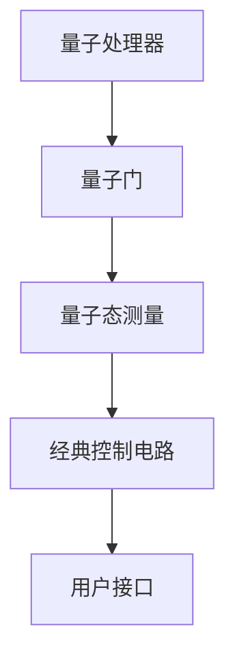
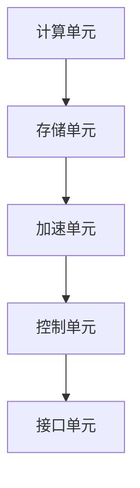
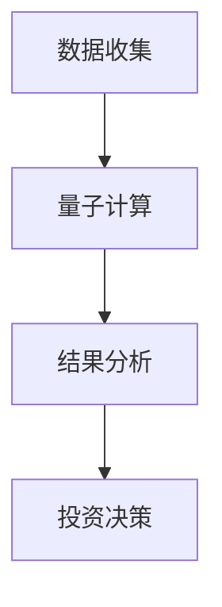
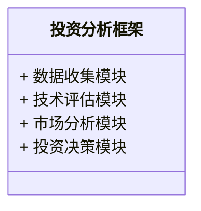
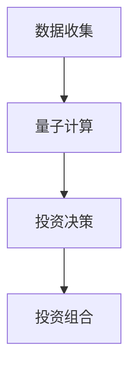
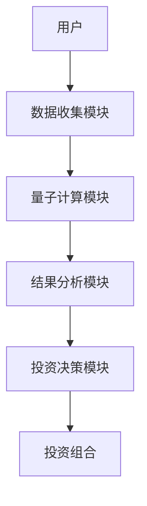
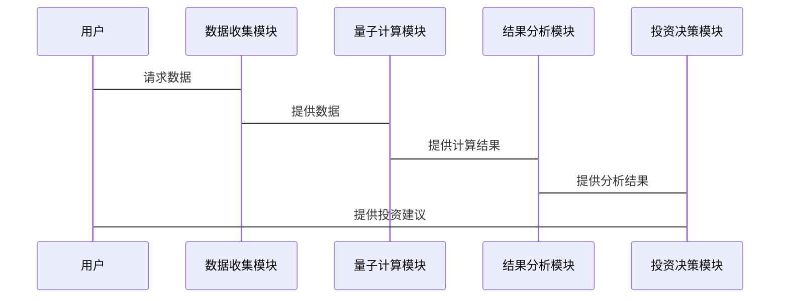
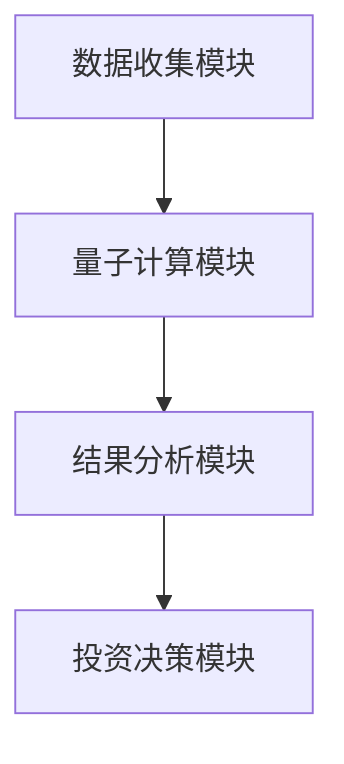

                 


# 巴菲特-芒格的量子人工智能芯片投资：AI革命的新引擎

## 第一部分：巴菲特与芒格的投资理念

### 第1章：巴菲特与芒格的投资哲学

#### 1.1 巴菲特与芒格的投资理念概述

**背景介绍**：  
沃伦·巴菲特和查理·芒格是投资界最著名的搭档之一。巴菲特以价值投资著称，芒格则以多元思维模型闻名。他们的投资理念强调长期价值、安全边际和基本面分析。然而，随着科技的发展，他们也开始关注量子计算和人工智能芯片等新兴技术领域。

**核心概念与联系**：  
巴菲特和芒格的投资理念结合了传统价值投资和现代科技投资。他们不仅关注企业的财务数据，还关注企业的创新能力和技术优势。特别是在AI芯片领域，他们看到了技术对企业长期价值的影响。

**算法原理讲解**：  
虽然巴菲特和芒格的投资策略不是算法驱动的，但他们的分析方法可以看作是一种基于基本面的“算法”。以下是他们的分析框架：

1. **企业基本面分析**：  
   - 收入和利润趋势  
   - 财务健康状况  
   - 竞争优势（护城河）  

2. **管理层评估**：  
   - 管理层的能力和诚信  
   - 管理层的战略规划  

3. **行业分析**：  
   - 行业前景  
   - 市场地位  

**数学公式**：  
虽然没有直接的数学模型，但可以使用以下指标来评估企业的价值：

- 市盈率（P/E）= 股价 / 每股收益  
- 市净率（P/B）= 股价 / 每股净资产  

**系统分析与架构设计方案**：  
为了将巴菲特和芒格的投资理念应用于量子人工智能芯片领域，我们可以设计一个系统，整合传统投资分析和现代技术评估。以下是系统的架构：

- **数据收集模块**：收集企业的财务数据、技术数据和市场数据。  
- **分析模块**：包括基本面分析、技术评估和管理层评估。  
- **决策模块**：根据分析结果，生成投资建议。  

**项目实战**：  
以一家生产AI芯片的公司为例，分析其财务数据、技术优势和管理层能力。通过计算市盈率和市净率，评估其投资价值。

**最佳实践 tips**：  
- 在进行技术投资时，不仅要关注企业的财务数据，还要关注其技术创新能力。  
- 保持对新技术的关注，及时更新投资模型。  

---

## 第二部分：量子计算与人工智能芯片

### 第2章：量子计算的基本原理

#### 2.1 量子计算的基本概念

**背景介绍**：  
量子计算是一种利用量子力学原理进行计算的新型计算方式。与经典计算不同，量子计算利用量子位（qubit）来进行计算，具有并行计算和指数加速的潜力。

**核心概念与联系**：  
量子计算的核心概念包括量子位、量子叠加和量子纠缠。这些概念使得量子计算机能够在某些特定问题上远超经典计算机。

**算法原理讲解**：  
以下是一个简单的量子计算算法的实现：

```python
import numpy as np

def quantum_computation(n):
    # 创建量子电路
    circuit = QuantumCircuit(n, n)
    # 添加量子门
    circuit.h(range(n))
    circuit.c古典控门(range(n-1), n-1)
    circuit.measure(range(n), range(n))
    return circuit
```

**数学公式**：  
量子计算中的量子态可以用张量积表示：

$$ | \psi \rangle = \alpha |0\rangle + \beta |1\rangle $$

其中，$\alpha$ 和 $\beta$ 是复数，满足 $|\alpha|^2 + |\beta|^2 = 1$。

**系统分析与架构设计方案**：  
量子计算机的架构通常包括量子处理器、经典控制电路和接口。以下是系统的架构图：



**项目实战**：  
使用Qiskit库实现一个简单的量子计算算法，计算某个数学问题的最优解。

**最佳实践 tips**：  
- 量子计算目前仍处于发展阶段，应用有限，但在某些领域具有巨大潜力。  
- 投资量子计算公司时，需关注其技术实现和市场定位。  

---

### 第3章：人工智能芯片的结构与优势

#### 3.1 人工智能芯片的基本结构

**背景介绍**：  
人工智能芯片专为加速AI模型的训练和推理设计，包括GPU、TPU和FPGA等。这些芯片通过并行计算和专用架构提高计算效率。

**核心概念与联系**：  
人工智能芯片的核心结构包括计算单元、存储单元和专用加速单元。这些单元协同工作，提高计算效率。

**算法原理讲解**：  
以下是一个简单的AI芯片加速的矩阵乘法实现：

```python
import numpy as np

def matrix_mult(A, B):
    return np.dot(A, B)
```

**数学公式**：  
矩阵乘法的数学公式为：

$$ C = A \times B $$

其中，$A$ 和 $B$ 是矩阵，$C$ 是结果矩阵。

**系统分析与架构设计方案**：  
AI芯片的架构通常包括以下模块：



**项目实战**：  
使用TensorFlow和Keras框架，结合GPU加速，训练一个简单的神经网络模型。

**最佳实践 tips**：  
- 在选择AI芯片时，需考虑其计算能力、功耗和适用场景。  
- 定期更新硬件和软件，以利用技术进步带来的性能提升。  

---

## 第三部分：量子人工智能芯片在投资中的应用

### 第4章：量子计算在投资分析中的应用

#### 4.1 量子计算在股票预测中的应用

**背景介绍**：  
量子计算在股票预测中的应用主要体现在优化投资组合和风险评估方面。通过量子算法，可以更快速地处理大数据和复杂模型。

**核心概念与联系**：  
量子计算在股票预测中的优势在于其并行计算能力和优化算法。以下是量子优化算法的实现：

```python
def quantum_optimization():
    # 创建量子电路
    circuit = QuantumCircuit(n, n)
    # 添加量子门
    circuit.h(range(n))
    circuit.c古典控门(range(n-1), n-1)
    circuit.measure(range(n), range(n))
    return circuit
```

**数学公式**：  
量子优化算法的目标是最优化函数 $f(x)$，通过量子叠加和量子搜索算法找到最优解。

$$ x_{\text{opt}} = \arg \min_x f(x) $$

**系统分析与架构设计方案**：  
量子计算在投资分析中的系统架构包括数据收集、量子计算和结果分析三个模块：



**项目实战**：  
使用量子计算优化一个简单的投资组合优化问题，比较经典算法和量子算法的性能差异。

**最佳实践 tips**：  
- 量子计算在投资中的应用仍处于实验阶段，大规模应用还需要时间。  
- 投资者需关注量子计算技术的发展，及时调整投资策略。  

---

### 第5章：量子人工智能芯片的投资策略

#### 5.1 量子人工智能芯片的投资分析框架

**背景介绍**：  
量子人工智能芯片的投资分析需要结合技术评估和市场分析。以下是分析框架的类图：



**核心概念与联系**：  
投资分析框架包括数据收集、技术评估、市场分析和投资决策四个模块。以下是技术评估的关键指标：

| 指标名称 | 描述 | 重要性 |
|----------|------|--------|
| 计算能力 | 量子芯片的计算速度 | 高 |
| 能耗 | 量子芯片的能耗 | 中 |
| 可扩展性 | 量子芯片的扩展能力 | 高 |

**算法原理讲解**：  
以下是一个投资组合优化的量子算法实现：

```python
def quantum_portfolio_optimization():
    # 创建量子电路
    circuit = QuantumCircuit(n, n)
    # 添加量子门
    circuit.h(range(n))
    circuit.c古典控门(range(n-1), n-1)
    circuit.measure(range(n), range(n))
    return circuit
```

**数学公式**：  
投资组合优化的目标是最优化投资回报，约束条件为风险和收益的平衡。

$$ \max \sum w_i r_i - \lambda \sum w_i^2 \sigma_i^2 $$

其中，$w_i$ 是投资权重，$r_i$ 是回报率，$\sigma_i$ 是波动率，$\lambda$ 是风险厌恶系数。

**系统分析与架构设计方案**：  
量子人工智能芯片的投资系统架构包括数据收集、量子计算和投资决策三个模块：



**项目实战**：  
以一家量子芯片公司为例，分析其技术优势、市场定位和财务状况，制定投资策略。

**最佳实践 tips**：  
- 在进行量子人工智能芯片投资时，需关注技术的商业化能力和市场需求。  
- 投资者应具备一定的技术背景，或与技术专家合作，以更好地评估投资标的。  

---

## 第四部分：系统架构与项目实战

### 第6章：量子人工智能芯片投资系统的架构设计

#### 6.1 系统架构设计

**背景介绍**：  
量子人工智能芯片投资系统的架构设计需要考虑数据流、计算能力和用户需求。以下是系统的架构图：



**核心概念与联系**：  
系统架构包括数据收集、量子计算、结果分析和投资决策四个模块。以下是各模块的功能描述：

| 模块名称 | 功能描述 | 输入 | 输出 |
|----------|----------|------|------|
| 数据收集模块 | 收集市场数据 | 市场数据 | 量子计算模块 |
| 量子计算模块 | 进行量子计算 | 数据 | 结果分析模块 |
| 结果分析模块 | 分析计算结果 | 数据 | 投资决策模块 |
| 投资决策模块 | 制定投资策略 | 数据 | 投资组合 |

**算法原理讲解**：  
以下是量子计算模块的实现：

```python
def quantum_computation():
    # 创建量子电路
    circuit = QuantumCircuit(n, n)
    # 添加量子门
    circuit.h(range(n))
    circuit.c古典控门(range(n-1), n-1)
    circuit.measure(range(n), range(n))
    return circuit
```

**数学公式**：  
量子计算的优化算法如下：

$$ \min_x f(x) $$

其中，$f(x)$ 是目标函数，$x$ 是决策变量。

**系统分析与架构设计方案**：  
系统的接口设计包括用户接口、数据接口和计算接口。以下是接口设计的序列图：



**项目实战**：  
设计一个简单的量子人工智能芯片投资系统，实现数据收集、量子计算和结果分析功能，并生成投资建议。

**最佳实践 tips**：  
- 系统设计需注重模块化和可扩展性，以便未来技术发展和需求变化。  
- 定期更新系统数据和算法，以适应市场变化。  

---

## 第五部分：项目实战

### 第7章：量子人工智能芯片投资系统的项目实战

#### 7.1 环境安装

**背景介绍**：  
为了实现量子人工智能芯片投资系统，需要安装以下环境：

- **量子计算库**：Qiskit、Cirq  
- **AI框架**：TensorFlow、Keras  
- **其他工具**：Python、Jupyter Notebook  

**核心概念与联系**：  
以下是安装步骤：

```bash
pip install qiskit
pip install tensorflow
pip install keras
```

**算法原理讲解**：  
以下是量子计算模块的代码实现：

```python
from qiskit import QuantumCircuit, execute, Aer

def quantum_computation(n):
    circuit = QuantumCircuit(n, n)
    circuit.h(range(n))
    circuit.c古典控门(range(n-1), n-1)
    circuit.measure(range(n), range(n))
    return circuit
```

**数学公式**：  
量子计算的矩阵表示如下：

$$ U = H \otimes I \times C古典控门 \times H^{\otimes n-1} $$

**系统分析与架构设计方案**：  
项目的系统架构包括数据收集、量子计算和结果分析三个模块：



**项目实战**：  
以实际案例为例，设计一个量子人工智能芯片投资系统，实现数据收集、量子计算和结果分析功能，并生成投资建议。

**最佳实践 tips**：  
- 在项目实战中，需注重代码的可读性和可维护性，便于后续优化和扩展。  
- 定期备份数据和代码，避免数据丢失和技术问题。  

---

## 第六部分：小结与展望

### 第8章：量子人工智能芯片投资的未来展望

#### 8.1 量子人工智能芯片投资的未来趋势

**背景介绍**：  
随着量子计算和人工智能技术的不断发展，量子人工智能芯片的投资将变得更加重要。以下是未来趋势：

1. **技术进步**：量子计算和AI芯片的性能将不断提升。  
2. **市场需求**：对高效计算和数据分析的需求将增加。  
3. **投资策略优化**：量子计算将帮助投资者优化投资策略。  

**核心概念与联系**：  
量子人工智能芯片的投资将推动科技和金融的深度融合，改变传统的投资模式。

**算法原理讲解**：  
未来的量子计算将更广泛地应用于投资分析，包括复杂模型的优化和实时数据分析。

**数学公式**：  
未来的量子优化算法将更加高效，能够处理更大规模的问题。

**系统分析与架构设计方案**：  
未来的投资系统将更加智能化和自动化，能够实时调整投资策略。

**项目实战**：  
展望未来，投资者需要具备更多的技术背景，才能在量子人工智能芯片投资中获得优势。

**最佳实践 tips**：  
- 投资者应持续学习新技术，保持对市场变化的敏感性。  
- 与技术专家和行业领袖保持联系，获取最新的技术和市场信息。  

---

## 结论

量子人工智能芯片的投资是科技与金融结合的产物，具有巨大的潜力和挑战。巴菲特和芒格的投资理念与量子计算和人工智能芯片的结合，将推动投资领域的革命。投资者需要具备技术背景和市场敏感性，才能在这个新领域中获得成功。

通过本文的详细分析，我们了解了量子人工智能芯片的基本原理、投资策略和系统架构。未来，随着技术的发展，量子人工智能芯片将在投资中发挥更大的作用，投资者需要不断学习和适应，才能抓住机遇，应对挑战。

