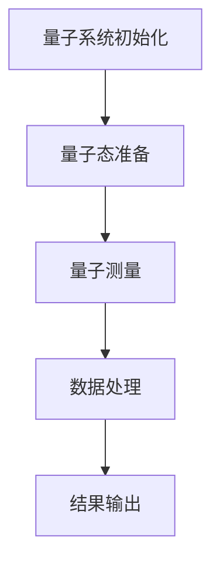

                 

# 巴菲特-芒格的量子传感医疗投资：精准诊断的新时代

> 关键词：巴菲特, 芒格, 量子传感, 医疗投资, 精准诊断

> 摘要：本文探讨了巴菲特和芒格的投资理念与量子传感技术在医疗领域的结合，分析了量子传感技术在精准诊断中的应用，并结合实际案例，提出了投资策略的建议。通过深入的技术分析和投资策略的结合，展示了如何利用量子传感技术推动医疗诊断的精准化和智能化。

---

## 第1章 巴菲特-芒格投资理念概述

### 1.1 巴菲特-芒格投资理念的核心思想

#### 1.1.1 巴菲特的价值投资理论

巴菲特的价值投资理论强调长期持有优质资产，关注企业的内在价值，而非市场的短期波动。他主张投资那些具有持续竞争优势、良好管理和稳定收益的企业。这种投资策略注重基本面分析，追求长期稳定的回报。

#### 1.1.2 芒格的多元思维模型

芒格的多元思维模型强调通过跨学科的思考，将各个领域的知识结合起来，形成一个完整的知识体系。他认为，投资者需要从多个角度理解企业，包括经济学、心理学、物理学等，从而做出更明智的投资决策。

#### 1.1.3 两人投资理念的共同点与差异

尽管巴菲特和芒格的投资理念有许多相似之处，但也有细微的差异。巴菲特更注重企业的财务指标和内在价值，而芒格则更强调企业的竞争优势和长期发展潜力。两人的理念都以长期主义为核心，但在具体操作和侧重点上有所不同。

### 1.2 巴菲特-芒格投资理念的现代应用

#### 1.2.1 从传统投资到科技驱动投资

随着科技的快速发展，传统的价值投资理念需要与时俱进。科技驱动的投资强调对新兴技术的关注，尤其是那些能够改变行业格局的技术，如人工智能、量子传感等。巴菲特和芒格的投资理念在这一背景下，逐渐向科技驱动型转变。

#### 1.2.2 量子传感技术的兴起与投资机会

量子传感技术作为一项前沿科技，正在迅速崛起。其在医疗领域的应用潜力巨大，尤其是在精准诊断方面。量子传感技术的高灵敏度和高精度，使其成为医疗领域的重要工具。这为投资者提供了新的机会，尤其是那些具有长期竞争优势的量子传感技术企业。

#### 1.2.3 精准医疗与投资的新模式

精准医疗的兴起为量子传感技术的应用提供了广阔的舞台。通过量子传感技术，医疗诊断可以更加精准，治疗方案可以更加个性化。这种模式不仅提高了医疗效果，也为投资者带来了新的利润增长点。

### 1.3 巴菲特-芒格投资理念的哲学基础

#### 1.3.1 投资中的长期主义

长期主义是巴菲特和芒格投资理念的核心。他们认为，短期的市场波动并不能决定企业的长期价值，真正的投资价值来自于企业的持续发展和内在价值的积累。

#### 1.3.2 风险控制与安全边际

芒格强调风险控制的重要性，认为投资者需要在投资中保持安全边际，避免过度冒险。巴菲特也强调安全边际，认为只有在价格低于内在价值时，才进行投资。

#### 1.3.3 投资中的认知优势

芒格的多元思维模型强调了认知的重要性。他认为，投资者需要通过广泛的阅读和思考，建立起跨学科的知识体系，从而在投资中获得认知优势。

### 1.4 本章小结

本章介绍了巴菲特和芒格的投资理念，分析了其在现代科技驱动投资中的应用，尤其是量子传感技术在医疗领域的潜力。同时，探讨了长期主义、风险控制和认知优势在投资中的重要性。

---

## 第2章 量子传感技术的基本原理

### 2.1 量子传感技术的定义与特点

#### 2.1.1 量子传感技术的定义

量子传感技术是基于量子力学原理，利用量子系统的特性进行测量和感知的技术。它利用量子纠缠、量子叠加等现象，实现对微弱信号的检测和高精度测量。

#### 2.1.2 量子传感技术的核心特点

量子传感技术具有高灵敏度、高精度、小型化和低功耗等特点。与传统传感技术相比，量子传感技术在灵敏度和精度上有了质的飞跃，能够检测到更微弱的信号。

#### 2.1.3 量子传感技术与传统传感技术的对比

| 特性         | 量子传感技术               | 传统传感技术               |
|--------------|---------------------------|---------------------------|
| 灵敏度       | 极高                      | 较低                      |
| 精度         | 极高                      | 较低                      |
| 小型化       | 易于集成                   | 较难集成                   |
| 低功耗       | 是                        | 否                        |

### 2.2 量子传感技术的数学模型

#### 2.2.1 量子力学基础

量子力学是量子传感技术的理论基础。量子系统的基本特性包括量子叠加、量子纠缠和量子测量。

#### 2.2.2 量子传感技术的数学公式

量子传感技术的核心是通过测量量子系统的特性来获取信息。假设我们有一个量子系统，其状态可以用密度矩阵表示：

$$
\rho = \begin{bmatrix}
p & q \\
q^* & 1-p
\end{bmatrix}
$$

其中，$p$ 是系统处于状态 $|0\rangle$ 的概率，$q$ 是量子纠缠的系数。

#### 2.2.3 量子传感技术的算法流程图

### 2.3 量子传感技术的应用领域

#### 2.3.1 量子传感技术在医疗领域的应用

量子传感技术在医疗领域的应用主要集中在精准诊断和治疗监测。例如，通过量子传感器可以实现对疾病的早期检测和精准诊断。

#### 2.3.2 量子传感技术在其他领域的应用

除了医疗领域，量子传感技术在环境监测、航空航天、能源勘探等领域也有广泛的应用。

#### 2.3.3 量子传感技术的未来发展

随着量子计算和量子通信技术的发展，量子传感技术将更加成熟，并在更多领域得到应用。

### 2.4 本章小结

本章详细介绍了量子传感技术的基本原理，包括其定义、特点和数学模型。同时，分析了其在医疗和其他领域的应用，并展望了未来的发展前景。

---

## 第3章 量子传感技术在精准医疗中的应用

### 3.1 量子传感技术在精准医疗中的核心作用

#### 3.1.1 精准医疗的定义与目标

精准医疗是指根据患者的个体特征，量身定制治疗方案，以提高治疗效果和减少副作用。其目标是实现疾病的个性化治疗和精准诊断。

#### 3.1.2 量子传感技术在精准医疗中的应用场景

量子传感技术在精准医疗中的应用场景包括疾病的早期检测、治疗方案的优化和患者监测等。

#### 3.1.3 量子传感技术对精准医疗的推动作用

量子传感技术的高灵敏度和高精度，使其能够检测到疾病早期的微弱信号，从而实现疾病的早期诊断和精准治疗。

### 3.2 量子传感技术在疾病诊断中的具体应用

#### 3.2.1 量子传感技术在癌症早期诊断中的应用

癌症的早期诊断对于提高治疗效果至关重要。量子传感技术可以通过检测癌细胞的微弱信号，实现癌症的早期诊断。

#### 3.2.2 量子传感技术在神经系统疾病诊断中的应用

神经系统疾病如阿尔茨海默病的诊断通常依赖于复杂的检测手段。量子传感技术可以通过检测神经信号的变化，实现疾病的早期诊断。

#### 3.2.3 量子传感技术在感染性疾病诊断中的应用

在感染性疾病诊断中，量子传感技术可以通过检测病原体的微弱信号，实现疾病的快速诊断。

### 3.3 量子传感技术与传统医疗诊断方法的对比

#### 3.3.1 传统医疗诊断方法的优缺点

传统医疗诊断方法的优点是技术成熟、成本较低，但其灵敏度和精度有限，难以实现疾病的早期诊断。

#### 3.3.2 量子传感技术的优势与局限性

量子传感技术的优势在于其高灵敏度和高精度，能够检测到微弱信号。但其局限性在于技术尚未完全成熟，成本较高。

#### 3.3.3 量子传感技术对医疗诊断的革命性影响

量子传感技术的出现，对医疗诊断领域带来了革命性的变化。通过实现疾病的早期诊断和精准治疗，量子传感技术将显著提高医疗效果。

### 3.4 本章小结

本章分析了量子传感技术在精准医疗中的核心作用，探讨了其在疾病诊断中的具体应用，并对比了传统诊断方法的优缺点，展望了量子传感技术对医疗诊断的革命性影响。

---

## 第4章 巴菲特-芒格投资理念与量子传感技术的结合

### 4.1 巴菲特-芒格投资理念与量子传感技术的契合点

#### 4.1.1 价值投资与技术创新的结合

巴菲特的价值投资理念与量子传感技术的创新性相契合。量子传感技术作为一种具有广阔前景的新兴技术，符合巴菲特对优质资产的定义。

#### 4.1.2 多元思维模型与量子传感技术的理解

芒格的多元思维模型为投资者理解量子传感技术提供了方法论支持。通过跨学科的思考，投资者可以更好地理解量子传感技术的潜力和风险。

#### 4.1.3 长期主义与量子传感技术的未来发展

巴菲

