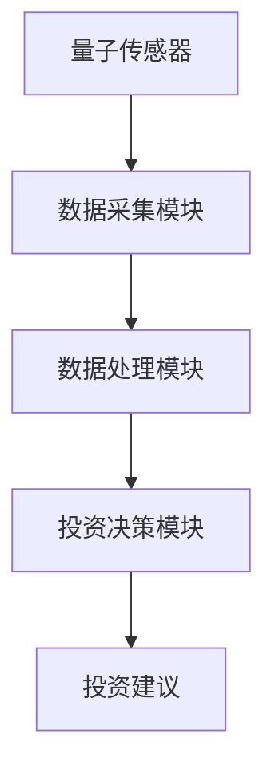
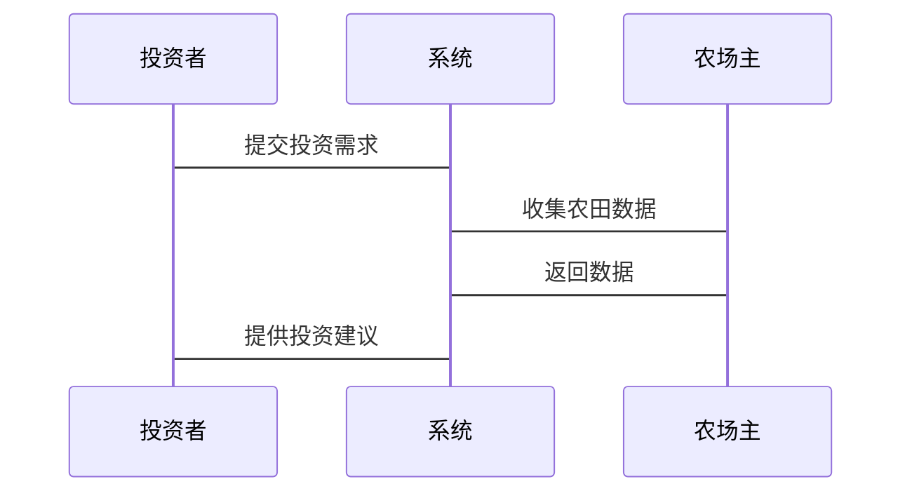

                 


# 巴菲特-芒格的量子传感器农业投资：精准农业的新时代

> 关键词：巴菲特, 芒格, 量子传感器, 精准农业, 投资策略, 农业技术, 数据分析

> 摘要：本文探讨了巴菲特和芒格的投资理念与量子传感器技术在精准农业中的结合，分析了量子传感器在农业投资中的应用潜力，提出了基于量子传感器的精准农业投资策略。通过实际案例分析，展示了如何利用量子传感器技术优化投资决策，推动精准农业的发展。

---

# 第一章: 巴菲特与芒格的投资哲学

## 1.1 巴菲特的价值投资理论

### 1.1.1 价值投资的核心要素
- **内在价值**：企业的真实价值，而非市场波动。
- **安全边际**：以低于内在价值的价格买入。
- **长期视角**：投资不是短期交易，而是长期价值的积累。

### 1.1.2 芒格的多元思维模型

- **多学科思维**：芒格强调将不同领域的知识融会贯通。
- **决策框架**：通过多元思维模型来分析问题，降低决策错误率。
- **逆向思维**：从问题的反面思考，找到更优解决方案。

## 1.2 巴菲特与芒格投资理念的农业化

### 1.2.1 农业投资的特殊性

- **周期性**：农业受自然条件和市场波动影响较大。
- **技术驱动**：农业科技是农业投资的核心驱动力。
- **长期性**：农业投资需要考虑土地、水资源和气候变化的长期影响。

### 1.2.2 量子传感器技术的引入

- **量子传感器的定义**：利用量子力学原理，实现高精度的物理量测量。
- **农业中的潜力**：用于土壤监测、气象预测、病虫害监测等领域。

---

# 第二章: 量子传感器技术与精准农业

## 2.1 量子传感器技术的背景与现状

### 2.1.1 量子传感器的基本原理

- **量子纠缠**：量子传感器利用量子纠缠效应，实现超灵敏的测量。
- **测量精度**：量子传感器的测量精度远高于传统传感器。

### 2.1.2 量子传感器在农业中的应用领域

- **土壤监测**：监测土壤湿度、温度、pH值等参数。
- **气象监测**：预测天气变化，优化农业决策。
- **病虫害监测**：通过传感器数据，提前发现病虫害。

## 2.2 量子传感器在精准农业中的具体应用

### 2.2.1 土壤监测与优化

- **土壤湿度监测**：实时监测土壤湿度，优化灌溉策略。
- **土壤温度监测**：通过温度数据，优化作物种植周期。

### 2.2.2 农作物生长监测

- **作物生长监测**：通过传感器数据，分析作物生长状况。
- **病虫害监测**：通过异常数据，提前发现病虫害。

## 2.3 量子传感器与精准农业的结合模式

### 2.3.1 数据采集与处理

- **数据采集**：量子传感器实时采集农田数据。
- **数据处理**：通过数据分析，优化农业生产决策。

### 2.3.2 数据分析与决策支持

- **数据建模**：利用大数据技术，建立作物生长模型。
- **决策支持**：基于数据模型，提供精准的农业投资建议。

---

# 第三章: 精准农业的背景与现状

## 3.1 精准农业的定义与特点

### 3.1.1 精准农业的定义

- 精准农业：利用现代信息技术，实现农业生产过程的精准化管理。

### 3.1.2 精准农业的核心特点

- **数据驱动**：精准农业依赖于大量数据的采集和分析。
- **技术支撑**：依赖于物联网、大数据、人工智能等技术。

## 3.2 精准农业的背景与发展趋势

### 3.2.1 精准农业的背景

- **资源短缺**：土地、水资源的短缺推动了精准农业的发展。
- **技术进步**：物联网、人工智能等技术的发展为精准农业提供了技术支持。

### 3.2.2 精准农业的未来发展方向

- **智能化**：利用人工智能优化农业生产。
- **绿色化**：减少资源浪费，实现可持续发展。

## 3.3 精准农业中的投资机会

### 3.3.1 技术投资机会

- **传感器技术**：量子传感器、物联网设备的投资机会。
- **数据分析技术**：大数据分析、人工智能的投资机会。

### 3.3.2 市场投资机会

- **农业供应链**：精准农业推动了农业供应链的优化。
- **农业服务**：精准农业催生了新的农业服务模式。

---

# 第四章: 量子传感器在精准农业中的投资策略

## 4.1 巴菲特-芒格投资模型的构建

### 4.1.1 投资模型的核心要素

- **企业基本面**：企业的财务状况、盈利能力。
- **管理层能力**：管理团队的能力和决策水平。
- **市场前景**：行业的市场潜力和发展空间。

### 4.1.2 投资模型的逻辑框架

- **数据驱动**：基于量子传感器数据，分析企业的实际经营状况。
- **价值评估**：通过量子传感器数据，评估企业的内在价值。

## 4.2 量子传感器数据对投资决策的影响

### 4.2.1 数据的采集与处理

- **数据采集**：量子传感器实时采集农田数据。
- **数据处理**：通过数据分析，优化农业生产决策。

### 4.2.2 数据的分析与预测

- **数据建模**：利用大数据技术，建立作物生长模型。
- **数据预测**：通过模型预测，优化农业投资决策。

## 4.3 投资策略的优化与实施

### 4.3.1 投资组合的优化

- **资产配置**：根据量子传感器数据，优化投资组合。
- **风险管理**：通过量子传感器数据，降低投资风险。

### 4.3.2 投资风险的控制

- **风险识别**：通过量子传感器数据，识别潜在风险。
- **风险评估**：评估风险的严重程度，制定应对策略。

---

# 第五章: 精准农业的投资决策支持系统

## 5.1 系统功能设计

### 5.1.1 系统架构设计

- **系统模块**：数据采集模块、数据分析模块、投资决策模块。
- **数据流**：数据采集→数据处理→投资决策。

### 5.1.2 系统接口设计

- **传感器接口**：与量子传感器设备对接。
- **数据接口**：与第三方数据分析平台对接。

## 5.2 系统架构设计

### 5.2.1 系统架构图



### 5.2.2 系统交互设计



---

# 第六章: 项目实战与案例分析

## 6.1 项目环境搭建

### 6.1.1 环境要求

- **硬件**：量子传感器设备、计算机。
- **软件**：Python编程环境、数据分析工具。

## 6.2 系统核心实现

### 6.2.1 量子传感器数据采集

```python
import serial

ser = serial.Serial('COM1', 9600)
data = ser.readline().decode()
print(data)
```

### 6.2.2 数据分析与处理

```python
import pandas as pd

data = pd.read_csv('agriculture_data.csv')
print(data.head())
```

## 6.3 案例分析

### 6.3.1 案例背景

- **案例地点**：某农场，种植小麦。
- **问题描述**：农场土壤湿度不均匀，导致小麦产量不稳定。

### 6.3.2 数据分析

```python
import matplotlib.pyplot as plt

data['humidity'].plot(kind='hist')
plt.show()
```

### 6.3.3 投资决策

- **建议**：优化灌溉策略，提高土壤湿度均匀性。
- **预期收益**：预计小麦产量提高10%。

---

# 第七章: 总结与展望

## 7.1 精准农业的发展前景

### 7.1.1 量子传感器技术的未来发展

- **技术突破**：量子传感器的测量精度将进一步提高。
- **应用拓展**：量子传感器将应用于更多农业领域。

## 7.2 巴菲特-芒格投资理念的延伸

### 7.2.1 投资理念的创新

- **数据驱动**：投资决策更加依赖数据支持。
- **技术驱动**：投资更加注重技术驱动型企业的价值。

## 7.3 未来的研究方向

### 7.3.1 量子传感器与农业投资的结合

- **深入研究**：量子传感器在更多农业场景中的应用。
- **技术创新**：开发更高效的量子传感器设备。

---

# 附录

## A. 参考文献

-巴菲特的书籍：《聪明的投资者》。
-芒格的书籍：《Poor Charlie's Almanack》。
-量子传感器技术的相关论文。

## B. 量子传感器技术文档

-详细的技术参数和使用手册。

---

# 后记

通过量子传感器技术的应用，精准农业迎来了新的发展机遇。巴菲特和芒格的投资理念与量子传感器技术的结合，为农业投资提供了新的思路。未来，随着技术的进步，精准农业将更加智能化、数据化，投资决策也将更加精准和科学。

