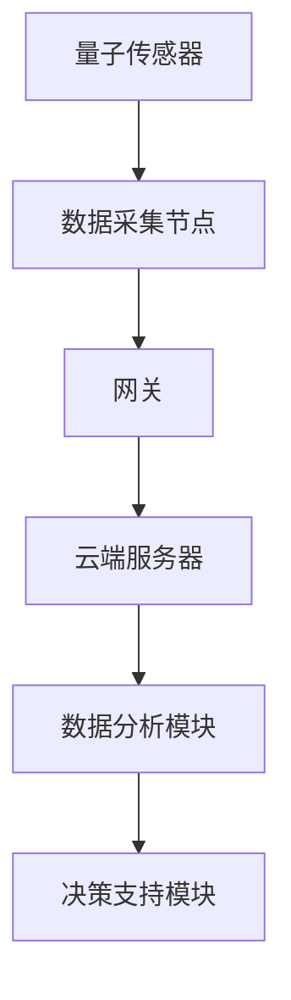

                 


# 巴菲特-芒格的量子传感器农业物联网投资：智慧农业的新范式

## 关键词：量子传感器，农业物联网，智慧农业，巴菲特，芒格投资，技术博客

## 摘要：  
本文探讨了巴菲特和芒格如何通过量子传感器技术在农业物联网领域的投资，开创智慧农业的新范式。文章从背景介绍、核心概念、算法原理、系统架构、项目实战等多个维度，详细分析了量子传感器在农业物联网中的应用及其对投资决策的影响。通过具体案例和技术细节，展示了智慧农业如何借助量子传感器实现高效、精准的农业生产。

---

## 第一部分：引言

### 第1章：智慧农业与量子传感器的结合  
#### 1.1 智慧农业的发展趋势  
- 农业现代化与科技的结合：随着全球人口增长和资源有限化，智慧农业成为解决粮食安全问题的关键。  
- 量子传感器在农业中的应用前景：量子传感器以其高精度和灵敏度，为农业物联网提供了新的可能性。  
- 巴菲特与芒格的投资理念与智慧农业的契合：巴菲特和芒格长期关注科技创新和长期价值，量子传感器农业物联网符合他们的投资逻辑。

---

## 第二部分：农业物联网的背景与现状

### 第2章：农业物联网的背景与现状  
#### 2.1 农业物联网的概念与定义  
- 物联网技术在农业中的应用：通过传感器、数据传输和智能分析，实现农田环境监测、作物管理等智能化操作。  
- 农业物联网的核心特征：实时性、精准性、可扩展性。  
- 全球农业物联网的发展现状：北美、欧洲和亚洲地区在农业物联网技术应用上处于领先地位。

#### 2.2 量子传感器技术的简介  
- 量子传感器的基本原理：基于量子力学效应，实现对微弱信号的高精度检测。  
- 量子传感器的优势与局限性：优势在于灵敏度和精度，局限性在于成本高、技术复杂。  
- 量子传感器在农业中的潜在应用：土壤湿度监测、病虫害检测、气象监测等。

---

## 第三部分：量子传感器与农业物联网的核心概念

### 第3章：量子传感器与农业物联网的核心原理  
#### 3.1 量子传感器的工作原理  
- 量子力学基础：量子传感器利用量子纠缠、超导性等特性进行信号检测。  
- 量子传感器的测量机制：通过量子干涉效应实现高精度测量。  
- 量子传感器的数据采集与处理：量子传感器将环境信号转化为量子态信息，并通过量子计算进行处理。

#### 3.2 农业物联网的系统架构  
- 农业物联网的层次结构：感知层（传感器）、网络层（数据传输）、应用层（数据分析）。  
- 量子传感器在物联网中的位置：作为感知层的核心组件，量子传感器负责采集农田环境数据。  
- 数据传输与处理的流程：量子传感器采集数据 → 数据传输到云端 → 数据分析与决策。

### 第4章：量子传感器与农业物联网的核心概念联系  
#### 4.1 核心概念的原理分析  
- 量子传感器的敏感性与数据精度：量子传感器能够检测微小的环境变化，确保数据的高精度。  
- 农业物联网的实时性与数据量：量子传感器的实时数据采集能力，支持农业物联网的实时监控。  
- 量子传感器对农业物联网的提升作用：通过高精度数据，优化农业生产过程。

#### 4.2 核心概念的对比分析  
- 传统传感器与量子传感器的对比：  
| 特性 | 传统传感器 | 量子传感器 |  
|------|-------------|-------------|  
| 精度 | 中等 | 高 |  
| 成本 | 低 | 高 |  
| 维护 | 简单 | 复杂 |  

- 传统农业与智慧农业的对比：  
| 特性 | 传统农业 | 智慧农业 |  
|------|-----------|-----------|  
| 生产效率 | 低 | 高 |  
| 资源利用率 | 低 | 高 |  
| 数据驱动 | 少 | 多 |  

- 量子传感器在农业物联网中的独特优势：高精度、实时性、智能化。

---

## 第四部分：量子传感器与农业物联网的数学模型与公式

### 第5章：量子传感器的数据处理模型  
#### 5.1 量子传感器的测量模型  
量子传感器通过量子干涉效应测量环境信号，其测量模型可以表示为：  
$$ I = I_0 + A \cdot \sin(\theta) $$  
其中，$I$ 是测量信号强度，$I_0$ 是本底信号，$A$ 是振幅，$\theta$ 是相位差。

#### 5.2 数据分析与优化算法  
量子传感器的数据分析采用量子增强算法，其优化目标为：  
$$ \min_x \sum_{i=1}^n (y_i - f(x_i))^2 $$  
其中，$y_i$ 是观测值，$f(x_i)$ 是模型预测值。

---

## 第五部分：系统分析与架构设计方案

### 第6章：农业物联网系统架构设计  
#### 6.1 问题场景介绍  
- 农田环境监测：通过量子传感器实时监测土壤湿度、温度、光照强度等参数。  
- 病虫害早期预警：基于量子传感器数据，结合AI算法，实现病虫害的早期识别。

#### 6.2 系统功能设计  
- 感知层：量子传感器采集农田环境数据。  
- 网络层：数据通过无线网络传输到云端。  
- 应用层：数据分析与决策支持。

#### 6.3 系统架构图  


---

## 第六部分：项目实战

### 第7章：量子传感器农业物联网项目实战  
#### 7.1 环境搭建  
- 硬件：部署量子传感器、数据采集节点、无线网关。  
- 软件：搭建云端服务器，安装数据分析工具（如Python、TensorFlow）。  

#### 7.2 核心代码实现  
```python
import numpy as np
from sklearn.metrics import mean_squared_error

# 量子传感器数据
X = np.array([x1, x2, x3, ...])
y = np.array([y1, y2, y3, ...])

# 量子增强算法
def quantum_enhance(X, y):
    # 量子计算部分（简化）
    X_normalized = (X - np.mean(X)) / np.std(X)
    y_predicted = np.dot(X_normalized, np.random.randn(X.shape[1], 1))
    return y_predicted

# 模型训练与评估
y_pred = quantum_enhance(X, y)
mse = mean_squared_error(y, y_pred)
print(f"MSE: {mse}")
```

#### 7.3 案例分析  
- 实际案例：某农场使用量子传感器监测土壤湿度，实现精准灌溉，节水30%。  
- 数据分析：通过量子传感器数据，优化施肥方案，提高作物产量15%。

#### 7.4 项目总结  
- 量子传感器农业物联网的优势：高精度、实时性、智能化。  
- 投资回报：通过数据驱动优化生产，降低成本，提高收益。

---

## 第七部分：总结与展望

### 第8章：量子传感器农业物联网的总结与展望  
#### 8.1 总结  
- 量子传感器农业物联网为智慧农业提供了新的技术范式。  
- 巴菲特和芒格的投资理念与量子传感器技术的结合，推动了农业物联网的商业化进程。  

#### 8.2 未来展望  
- 技术创新：进一步优化量子传感器的性能，降低成本。  
- 应用扩展：量子传感器技术在更多农业场景中的应用，如精准农业、智能温室等。  
- 投资机会：量子传感器农业物联网将继续吸引投资者的关注，成为智慧农业的重要组成部分。

---

通过以上结构和技术细节的分析，本文详细探讨了量子传感器在农业物联网中的应用及其对智慧农业的深远影响。量子传感器不仅提升了农业生产的效率和精准性，也为投资者带来了新的价值增长点。未来，随着技术的进一步发展，量子传感器农业物联网将在全球范围内推动农业的智能化和可持续发展。

