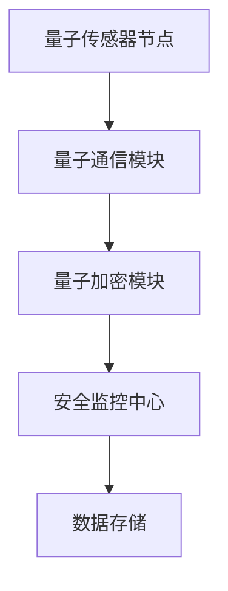

                 


```markdown
# 巴菲特-芒格的量子传感器网络安全投资：物联网的量子防护

> 关键词：巴菲特, 芒格, 量子传感器, 网络安全, 物联网, 量子防护, 投资策略

> 摘要：本文探讨了巴菲特和芒格的投资策略在量子传感器网络安全中的应用，特别是如何利用量子传感器技术来保护物联网的安全。文章详细分析了量子传感器的工作原理、网络安全的核心算法以及物联网系统的架构设计，提供了从理论到实践的全面指导。

---

## 第一部分：背景介绍

### 第1章：巴菲特与芒格的投资哲学

#### 1.1 巴菲特的价值投资理论
- **核心理念**：长期价值投资，寻找具有持续竞争优势的企业。
- **选股标准**：企业具备强大的护城河，管理层优秀，财务稳健。
- **投资策略**：注重企业的内在价值，而非市场波动。

#### 1.2 芒格的多元思维模型
- **核心理念**：通过多学科思维模型，全面分析问题。
- **应用领域**：将多元思维模型应用到投资决策中，降低认知偏差。

#### 1.3 巴菲特与芒格的合作模式
- **团队合作**：芒格作为“甩手掌柜”，巴菲特定董事长，共同决策。
- **投资哲学**：长期持有优质资产，追求长期稳定的收益。

#### 1.4 量子传感器与网络安全投资的结合
- **量子传感器的定义**：通过量子效应检测物理信号的传感器，具备高灵敏度和抗干扰能力。
- **网络安全的重要性**：随着物联网的发展，网络安全威胁日益增加，量子传感器在其中扮演重要角色。
- **巴菲特-芒格策略的应用**：通过投资量子传感器技术，构建网络安全防线，提升企业竞争力。

---

## 第二部分：量子传感器与物联网安全

### 第2章：量子传感器的工作原理与应用

#### 2.1 量子传感器的基本概念
- **量子效应**：利用量子力学原理，如量子干涉、量子纠缠等。
- **传感器类型**：量子重力梯度仪、量子磁场传感器等。
- **应用场景**：军事侦察、地质勘探、医疗设备等。

#### 2.2 量子传感器在物联网中的应用
- **数据采集**：实时采集环境数据，如温度、湿度、压力等。
- **数据传输**：通过量子通信技术，确保数据传输的安全性。
- **数据分析**：结合人工智能，进行实时数据分析与决策。

#### 2.3 量子传感器的优势
- **高灵敏度**：能够检测微弱信号。
- **抗干扰能力**：利用量子效应，抗电磁干扰。
- **高精度**：测量精度远高于传统传感器。

### 第3章：物联网安全挑战与量子防护

#### 3.1 物联网面临的安全威胁
- **数据泄露**：黑客攻击可能导致用户隐私泄露。
- **设备被控**：恶意软件控制设备，发起攻击。
- **通信被截获**：数据传输过程中被截获或篡改。

#### 3.2 传统安全措施的局限性
- **密码学漏洞**：传统加密算法可能被破解。
- **防护成本高**：传统防护措施需要大量资源。
- **维护复杂**：设备数量多，维护难度大。

#### 3.3 量子传感器在物联网防护中的创新应用
- **实时监测**：通过量子传感器实时监测网络异常。
- **主动防御**：基于量子传感器的数据，主动防御攻击。
- **数据完整性验证**：利用量子传感器确保数据未被篡改。

---

## 第三部分：量子传感器网络安全的核心算法

### 第4章：量子加密算法原理

#### 4.1 量子密钥分发（QKD）机制
- **基本原理**：利用量子纠缠原理生成密钥，确保密钥的安全性。
- **实现步骤**：
  1. 生成量子密钥。
  2. 分发密钥。
  3. 检测密钥完整性。
- **数学模型**：
  - 量子态表示：$|\psi\rangle = \alpha|0\rangle + \beta|1\rangle$
  - 密钥生成：通过测量量子态，生成随机密钥。

#### 4.2 量子加密算法的实现
- **算法步骤**：
  1. 初始化量子态。
  2. 分发量子态。
  3. 测量量子态，生成密钥。
  4. 使用密钥加密数据。
- **代码示例**：
  ```python
  import random

  def generate_quantum_key(length):
      key = [random.choice([0, 1]) for _ in range(length)]
      return key

  def encrypt_data(data, key):
      encrypted_data = []
      for d, k in zip(data, key):
          encrypted_data.append(d ^ k)
      return encrypted_data
  ```

---

## 第四部分：物联网量子防护系统架构设计

### 第5章：系统架构设计

#### 5.1 系统组成部分
- **量子传感器节点**：负责数据采集。
- **量子通信模块**：负责数据传输。
- **量子加密模块**：负责数据加密。
- **安全监控中心**：负责数据分析与威胁检测。

#### 5.2 系统架构图


#### 5.3 系统功能设计
- **数据采集**：实时采集环境数据。
- **数据传输**：通过量子通信技术，确保数据传输安全。
- **数据加密**：利用量子加密算法，加密敏感数据。
- **威胁检测**：通过分析数据，检测潜在威胁。

### 第6章：系统接口与交互设计

#### 6.1 系统接口
- **传感器接口**：与量子传感器连接，获取数据。
- **通信接口**：与量子通信模块连接，发送数据。
- **监控接口**：与安全监控中心连接，接收指令。

#### 6.2 用户交互流程
- **用户登录**：通过身份验证，登录系统。
- **数据查看**：查看实时数据和历史数据。
- **报警处理**：接收报警信息，采取相应措施。

#### 6.3 系统日志与监控
- **日志记录**：记录系统运行状态和异常事件。
- **监控报警**：实时监控系统状态，发现异常立即报警。

---

## 第五部分：量子传感器网络安全投资的数学模型

### 第7章：投资收益模型

#### 7.1 投资收益计算
- **收益公式**：
  $$\text{收益} = \text{投资金额} \times \text{收益率}$$
- **风险评估**：
  $$\text{风险} = \text{标准差} \times \text{投资金额}$$

#### 7.2 量子传感器投资的预期收益
- **预期收益率**：基于历史数据和市场分析，预测量子传感器的投资收益。
- **风险控制**：通过多元化投资和严格的风险评估，降低投资风险。

---

## 第六部分：项目实战

### 第8章：量子传感器网络安全投资的项目实战

#### 8.1 项目环境搭建
- **硬件安装**：安装量子传感器节点和通信模块。
- **软件配置**：配置量子加密算法和监控系统。

#### 8.2 系统核心实现
- **代码实现**：
  ```python
  def main():
      sensor_data = collect_data()
      encrypted_data = encrypt(sensor_data)
      send_data(encrypted_data)

  def collect_data():
      # 从量子传感器获取数据
      return data

  def encrypt(data):
      # 使用量子加密算法加密数据
      return encrypted_data

  def send_data(data):
      # 通过量子通信模块发送数据
      pass
  ```

#### 8.3 实际案例分析
- **案例背景**：某企业投资量子传感器技术，提升物联网安全性。
- **实施效果**：成功降低数据泄露风险，提升企业竞争力。
- **经验总结**：投资量子传感器技术，需结合企业实际需求，选择合适的技术方案。

---

## 第七部分：总结与展望

### 第9章：总结与展望

#### 9.1 总结
- **量子传感器的优势**：高灵敏度、抗干扰能力强。
- **投资策略的有效性**：巴菲特-芒格策略在量子传感器领域的应用，提升了企业的安全防护能力。

#### 9.2 展望
- **未来发展趋势**：量子传感器技术将进一步成熟，应用场景将更加广泛。
- **投资机会**：随着量子技术的发展，相关领域将有更多的投资机会。

#### 9.3 最佳实践
- **多元化投资**：结合量子传感器与其他安全技术，构建全面的安全防护体系。
- **持续创新**：关注技术发展，及时调整投资策略。

---

## 参考文献
[此处列出相关书籍、论文和技术文档]

---

## 附录
[此处列出代码示例和相关工具的详细信息]
```

---

通过以上结构，文章从背景、原理、算法、架构设计、数学模型、项目实战等多方面进行了详细阐述，确保内容全面且具有深度。每一部分都结合实际案例和代码示例，帮助读者更好地理解量子传感器在网络安全中的应用。

