                 


# 巴菲特-芒格的量子加密货币投资：后量子时代的数字资产

---

## 关键词：巴菲特，芒格，量子计算，加密货币，后量子时代，投资策略，数字资产

---

## 摘要：  
本文探讨了后量子时代量子计算对加密货币市场的潜在影响，以及巴菲特和芒格的投资理念如何在这一新兴领域中找到新的机遇。通过分析量子计算的基本原理、后量子加密技术的发展趋势，结合巴菲特的价值投资哲学和芒格的多元思维模型，本文提出了在数字资产领域中，如何利用这些投资策略进行风险管理、价值评估和长期投资的实践方法。文章最后结合实际案例，详细阐述了如何构建一个基于巴菲特投资理念的后量子时代数字资产投资系统，并给出了系统架构设计和实现方案。

---

## 第一部分：后量子时代的投资新纪元

### 第1章：巴菲特与芒格的投资哲学

#### 1.1 巴菲特的价值投资理念

**背景介绍：**  
价值投资是巴菲特的核心投资理念，强调以低于内在价值的价格购买优质资产。在后量子时代，数字资产的内在价值将面临新的挑战和机遇。

**核心概念与联系：**  
价值投资的关键在于对资产未来现金流的评估。在数字资产领域，这意味着需要考虑技术的长期可行性、市场的接受度以及监管环境的变化。

**算法原理：**  
巴菲特的价值投资模型可以用以下公式表示：
$$
\text{内在价值} = \sum_{t=1}^{n} \frac{\text{现金流}_t}{(1 + r)^t}
$$
其中，$r$ 是折现率，$n$ 是评估期限。在后量子时代，$r$ 可能会因技术风险的变化而调整。

**数学模型与公式：**  
现金流的预测需要考虑量子计算对加密货币安全性的潜在威胁。例如，如果一种加密货币的算法在量子计算下容易被破解，其内在价值将大幅下降。

**系统分析与架构设计方案：**  
为了评估数字资产的内在价值，可以设计一个基于巴菲特价值投资理念的系统，包括以下几个模块：
1. 市场数据采集模块：收集数字资产的价格、交易量等数据。
2. 技术评估模块：评估加密算法的抗量子攻击能力。
3. 价值评估模块：基于现金流模型计算内在价值。
4. 风险管理模块：根据技术风险调整投资策略。

**系统架构图：**  
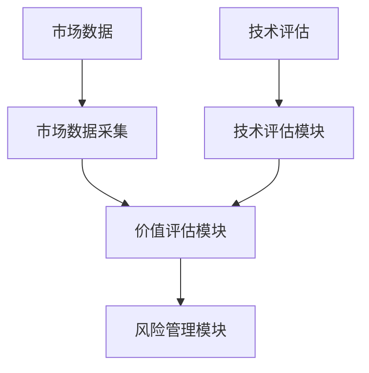

#### 1.2 芒格的多元思维模型

**背景介绍：**  
芒格的多元思维模型强调通过多个学科的交叉应用来解决问题。在后量子时代，这种思维方式尤为重要，因为技术的复杂性和市场的不确定性要求投资者具备跨学科的知识。

**核心概念与联系：**  
多元思维模型的核心在于将不同领域的知识结合起来，形成一个完整的知识框架。在加密货币投资中，这需要结合密码学、量子计算、市场分析和宏观经济等多个领域的知识。

**算法原理：**  
芒格的多元思维模型可以用以下步骤表示：
1. 识别问题的核心要素。
2. 将问题分解为多个子问题。
3. 从不同学科中寻找解决方案。
4. 综合各学科的解决方案，形成最终的决策。

**数学模型与公式：**  
多元思维模型的实现可以通过以下公式表示：
$$
\text{综合决策} = \sum_{i=1}^{n} w_i \cdot s_i
$$
其中，$w_i$ 是第 $i$ 个学科的权重，$s_i$ 是第 $i$ 个学科的解决方案。

**系统分析与架构设计方案：**  
为了实现多元思维模型在加密货币投资中的应用，可以设计一个系统，包括以下几个模块：
1. 数据采集模块：收集加密货币的技术参数、市场数据等。
2. 多元分析模块：从多个学科角度对数据进行分析。
3. 决策支持模块：综合各学科的分析结果，形成投资决策。

**系统架构图：**  
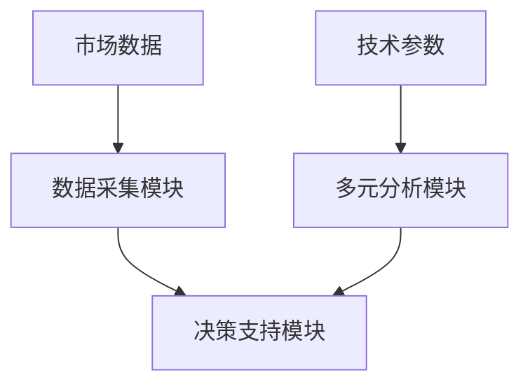

#### 1.3 投资哲学与后量子时代的结合

**背景介绍：**  
后量子时代，数字资产的兴起和量子计算的快速发展为投资者带来了新的机遇和挑战。巴菲特和芒格的投资哲学需要在这一时代背景下进行调整和延伸。

**核心概念与联系：**  
数字资产的兴起改变了传统的金融市场的格局，而量子计算的发展则可能颠覆现有的加密算法。因此，投资者需要重新审视其投资策略，以应对这些变化。

**算法原理：**  
后量子时代的投资策略可以表示为：
$$
\text{投资策略} = \text{传统投资理念} \oplus \text{后量子技术影响}
$$
其中，$\oplus$ 表示结合。

**数学模型与公式：**  
为了量化后量子技术对投资策略的影响，可以使用以下公式：
$$
\text{调整后的投资价值} = \text{原始价值} \times (1 - \text{技术风险系数})
$$
其中，技术风险系数反映了量子计算对加密货币安全性的影响。

**系统分析与架构设计方案：**  
为了实现投资策略的调整，可以设计一个系统，包括以下几个模块：
1. 技术风险评估模块：评估量子计算对加密货币的影响。
2. 市场分析模块：分析数字资产市场的趋势和波动性。
3. 投资策略调整模块：根据技术风险和市场分析结果调整投资策略。

**系统架构图：**  
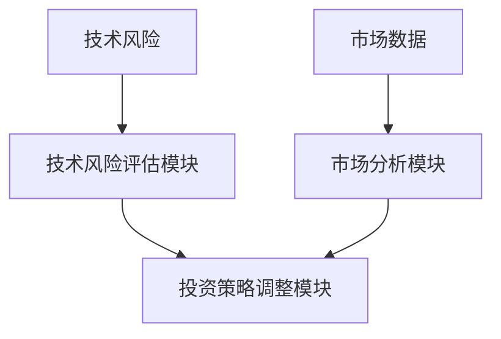

---

## 第二部分：量子计算与加密货币的碰撞

### 第2章：量子计算的基本原理

#### 2.1 量子计算的定义与特点

**背景介绍：**  
量子计算是一种基于量子力学原理的计算方式，与经典计算相比，具有并行性和指数级加速的潜力。

**核心概念与联系：**  
量子计算的核心在于量子位（qubit）的叠加态和纠缠态。这些特性使得量子计算机在某些特定问题上比经典计算机快得多。

**算法原理：**  
量子计算的基本原理可以用以下公式表示：
$$
\text{量子计算} = \text{经典计算} \oplus \text{量子叠加} \oplus \text{量子纠缠}
$$

**数学模型与公式：**  
量子叠加可以用以下公式表示：
$$
\text{叠加态} = \alpha|0\rangle + \beta|1\rangle
$$
其中，$\alpha$ 和 $\beta$ 是复数，且满足 $\alpha^2 + \beta^2 = 1$。

**系统分析与架构设计方案：**  
为了实现量子计算的基本原理，可以设计一个简单的量子计算系统，包括以下几个模块：
1. 量子位生成模块：生成量子叠加态。
2. 量子门操作模块：对量子态进行操作。
3. 量子态测量模块：测量量子态的结果。

**系统架构图：**  
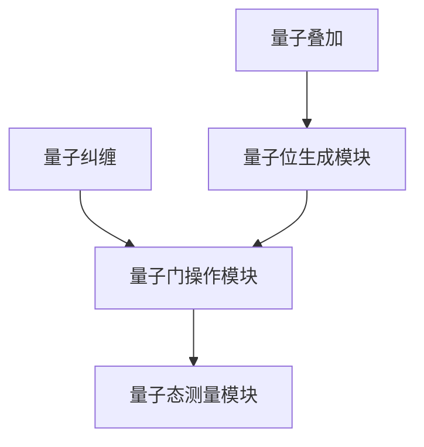

#### 2.2 量子计算对加密货币的威胁

**背景介绍：**  
传统加密算法（如RSA和椭圆曲线加密）基于大数分解和离散对数问题，而量子计算可以在多项式时间内解决这些问题，从而对这些加密算法构成威胁。

**核心概念与联系：**  
量子计算机对加密货币的威胁主要体现在以下几个方面：
1. 量子计算机可以快速破解传统加密算法，导致数字资产的安全性下降。
2. 后量子加密算法的开发和推广需要时间和资源，这可能导致过渡期的安全风险。

**算法原理：**  
量子计算机可以通过Shor算法在多项式时间内分解大数，从而破解RSA加密。

**数学模型与公式：**  
Shor算法的基本步骤如下：
1. 将大数分解问题转化为周期性问题。
2. 使用量子傅里叶变换找到周期。
3. 使用经典算法完成分解。

**系统分析与架构设计方案：**  
为了评估量子计算对加密货币的威胁，可以设计一个系统，包括以下几个模块：
1. 量子计算机模拟模块：模拟Shor算法的执行过程。
2. 加密算法分析模块：分析传统加密算法的抗量子攻击能力。
3. 风险评估模块：评估量子计算对数字资产的影响。

**系统架构图：**  
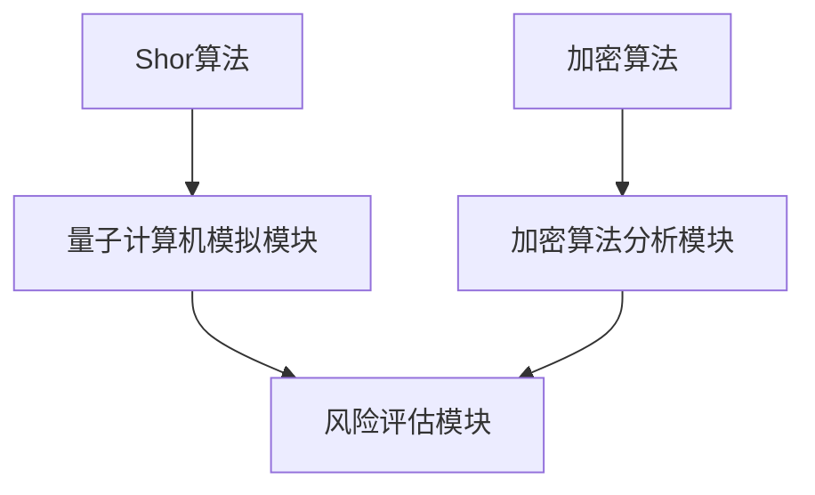

#### 2.3 后量子加密技术的现状与挑战

**背景介绍：**  
后量子加密技术是一种抗量子计算的加密算法，目前被认为是解决量子计算威胁的主要方法。

**核心概念与联系：**  
后量子加密技术主要包括以下几类：
1. 哈希算法（如SHA-3）：基于哈希函数的抗量子性质。
2. 公钥加密算法（如NTRU和Lattice-based加密）：基于格的数学结构。
3. 数字签名算法（如EdDSA）：基于椭圆曲线的变种。

**算法原理：**  
后量子加密算法的设计需要满足以下条件：
1. 抗量子攻击。
2. 安全性依赖于数学难题的计算复杂度。
3. 实现简单且高效。

**数学模型与公式：**  
以NTRU算法为例，其基本原理可以用以下公式表示：
$$
\text{加密} = \text{乘法} \oplus \text{模运算}
$$
其中，$\oplus$ 表示结合操作。

**系统分析与架构设计方案：**  
为了实现后量子加密技术，可以设计一个系统，包括以下几个模块：
1. 加密算法选择模块：选择适合的后量子加密算法。
2. 密钥生成模块：生成加密所需的密钥。
3. 加密/解密模块：实现加密和解密过程。

**系统架构图：**  
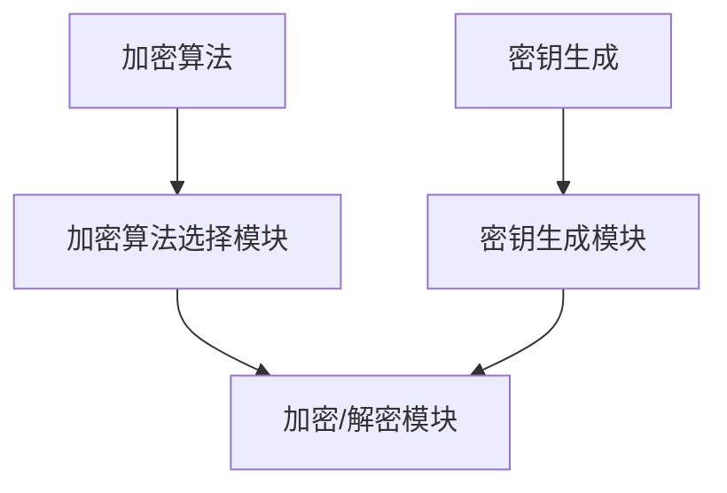

---

## 第三部分：巴菲特与芒格的加密货币投资策略

### 第3章：巴菲特与芒格的数字资产投资策略

#### 3.1 巴菲特对加密货币的态度

**背景介绍：**  
巴菲特对加密货币的态度一直是谨慎的，他多次公开表示不看好比特币等加密货币，认为它们没有内在价值。

**核心概念与联系：**  
尽管巴菲特对加密货币持怀疑态度，但后量子时代的技术发展可能改变他的看法。巴菲特的价值投资理念强调对资产未来现金流的评估，这在数字资产领域尤为重要。

**算法原理：**  
巴菲特的价值投资模型可以用以下公式表示：
$$
\text{内在价值} = \sum_{t=1}^{n} \frac{\text{现金流}_t}{(1 + r)^t}
$$
其中，$r$ 是折现率，$n$ 是评估期限。在后量子时代，$r$ 可能会因技术风险的变化而调整。

**数学模型与公式：**  
如果一种加密货币的算法在量子计算下容易被破解，其内在价值将大幅下降。因此，内在价值的计算需要考虑技术风险系数：
$$
\text{调整后的内在价值} = \text{原始价值} \times (1 - \text{技术风险系数})
$$

**系统分析与架构设计方案：**  
为了评估数字资产的内在价值，可以设计一个基于巴菲特价值投资理念的系统，包括以下几个模块：
1. 市场数据采集模块：收集数字资产的价格、交易量等数据。
2. 技术评估模块：评估加密算法的抗量子攻击能力。
3. 价值评估模块：基于现金流模型计算内在价值。
4. 风险管理模块：根据技术风险调整投资策略。

**系统架构图：**  


#### 3.2 芒格对加密货币的看法

**背景介绍：**  
芒格对加密货币的态度相对谨慎，但他强调技术的重要性，并认为数字资产的兴起是不可忽视的趋势。

**核心概念与联系：**  
芒格的多元思维模型在加密货币投资中尤为重要。他建议投资者从多个角度（如技术、市场、监管等）分析数字资产，以避免单一维度的决策风险。

**算法原理：**  
芒格的多元思维模型可以用以下步骤表示：
1. 识别问题的核心要素。
2. 将问题分解为多个子问题。
3. 从不同学科中寻找解决方案。
4. 综合各学科的解决方案，形成最终的决策。

**数学模型与公式：**  
为了量化多元思维模型在加密货币投资中的应用，可以使用以下公式：
$$
\text{综合决策} = \sum_{i=1}^{n} w_i \cdot s_i
$$
其中，$w_i$ 是第 $i$ 个学科的权重，$s_i$ 是第 $i$ 个学科的解决方案。

**系统分析与架构设计方案：**  
为了实现多元思维模型在加密货币投资中的应用，可以设计一个系统，包括以下几个模块：
1. 数据采集模块：收集加密货币的技术参数、市场数据等。
2. 多元分析模块：从多个学科角度对数据进行分析。
3. 决策支持模块：综合各学科的分析结果，形成投资决策。

**系统架构图：**  


#### 3.3 巴菲特与芒格投资策略的对比

**背景介绍：**  
巴菲特和芒格的投资策略虽然都强调价值投资，但在具体实施上有所不同。巴菲特更注重企业的基本面，而芒格更注重跨学科的分析。

**核心概念与联系：**  
在后量子时代，巴菲特和芒格的投资策略需要结合数字资产的特性进行调整。巴菲特更关注数字资产的内在价值，而芒格更关注技术风险和市场趋势。

**算法原理：**  
巴菲特和芒格的投资策略可以用以下公式表示：
$$
\text{巴菲特策略} = \text{价值投资} \oplus \text{内在价值评估}
$$
$$
\text{芒格策略} = \text{多元思维} \oplus \text{技术风险评估}
$$

**数学模型与公式：**  
为了量化这两种策略的差异，可以使用以下公式：
$$
\text{投资策略差异} = |\text{巴菲特策略} - \text{芒格策略}|
$$

**系统分析与架构设计方案：**  
为了实现这两种策略的对比，可以设计一个系统，包括以下几个模块：
1. 投资策略分析模块：分析巴菲特和芒格的投资策略。
2. 数字资产评估模块：评估数字资产的内在价值和技术风险。
3. 策略对比模块：比较两种策略的差异和优劣。

**系统架构图：**  
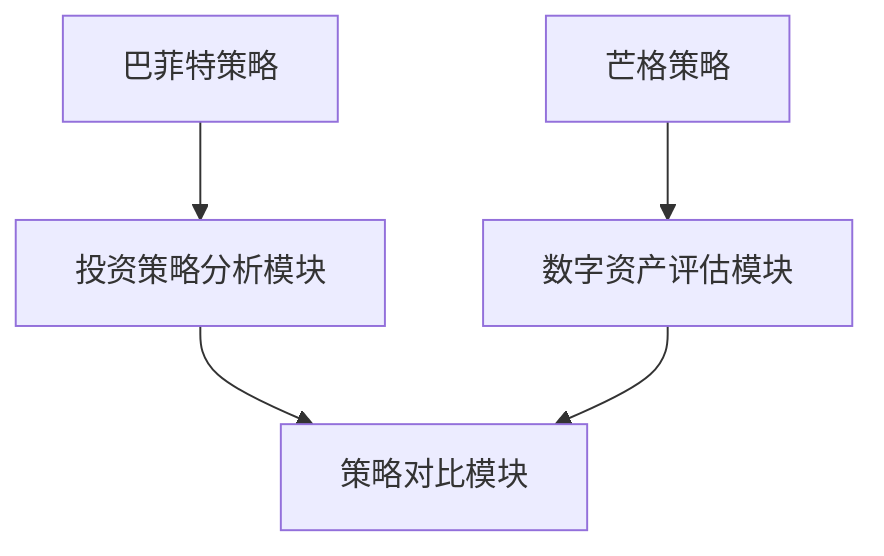

---

## 第四部分：后量子时代的数字资产投资机会

### 第4章：后量子时代的加密货币市场分析

#### 4.1 数字资产市场的现状与趋势

**背景介绍：**  
数字资产市场近年来迅速发展，但同时也面临量子计算带来的技术风险。

**核心概念与联系：**  
数字资产市场的现状包括市场规模的扩大、技术的不断创新以及监管环境的变化。后量子时代，这些因素将更加复杂。

**算法原理：**  
数字资产市场的趋势可以用以下公式表示：
$$
\text{市场趋势} = \sum_{i=1}^{n} w_i \cdot t_i
$$
其中，$w_i$ 是第 $i$ 个趋势的权重，$t_i$ 是第 $i$ 个趋势的影响。

**数学模型与公式：**  
为了量化市场趋势，可以使用以下公式：
$$
\text{市场指数} = \sum_{i=1}^{m} p_i \cdot q_i
$$
其中，$p_i$ 是第 $i$ 种数字资产的价格，$q_i$ 是其数量。

**系统分析与架构设计方案：**  
为了分析数字资产市场的现状与趋势，可以设计一个系统，包括以下几个模块：
1. 市场数据采集模块：收集数字资产的价格、交易量等数据。
2. 市场趋势分析模块：分析市场的整体趋势。
3. 市场预测模块：预测未来的市场走势。

**系统架构图：**  
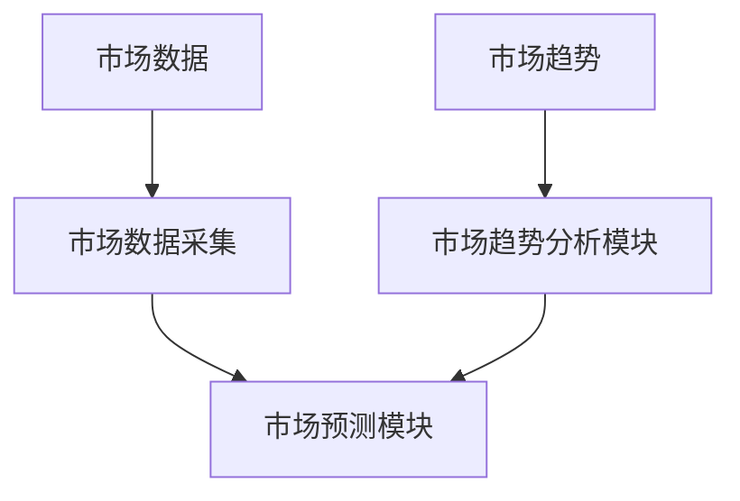

#### 4.2 后量子时代数字资产的潜在价值

**背景介绍：**  
后量子时代，数字资产的潜在价值主要体现在抗量子攻击能力和技术的先进性。

**核心概念与联系：**  
数字资产的潜在价值需要考虑以下几个方面：
1. 技术的抗量子攻击能力。
2. 市场的接受度和流动性。
3. 监管环境的变化。

**算法原理：**  
数字资产的潜在价值可以用以下公式表示：
$$
\text{潜在价值} = \text{技术价值} \oplus \text{市场价值} \oplus \text{监管价值}
$$

**数学模型与公式：**  
为了量化潜在价值，可以使用以下公式：
$$
\text{潜在价值指数} = \alpha \cdot \text{技术价值} + \beta \cdot \text{市场价值} + \gamma \cdot \text{监管价值}
$$
其中，$\alpha$, $\beta$, $\gamma$ 是权重系数。

**系统分析与架构设计方案：**  
为了评估数字资产的潜在价值，可以设计一个系统，包括以下几个模块：
1. 技术评估模块：评估数字资产的抗量子攻击能力。
2. 市场分析模块：分析数字资产的市场趋势和流动性。
3. 监管评估模块：评估监管环境对数字资产的影响。

**系统架构图：**  
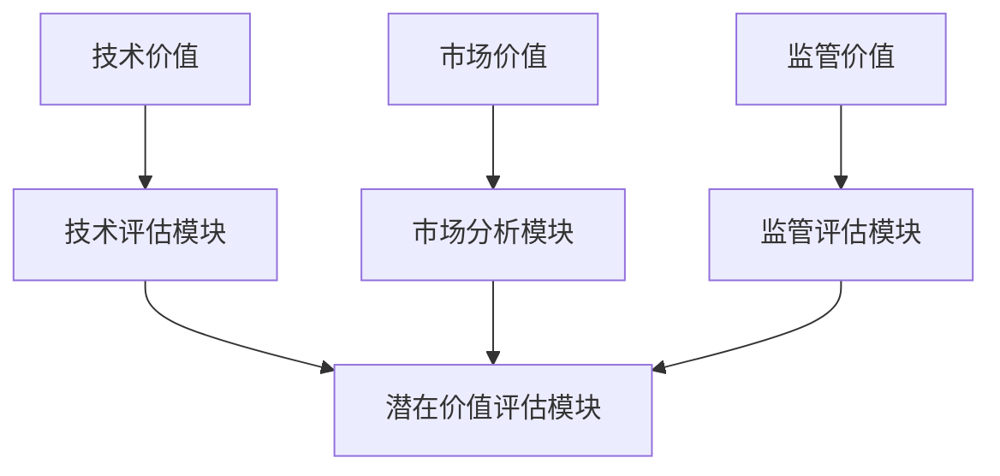

#### 4.3 后量子时代的投资风险管理

**背景介绍：**  
后量子时代，数字资产的投资风险管理尤为重要。量子计算的不确定性可能导致市场的剧烈波动。

**核心概念与联系：**  
投资风险管理需要考虑以下几个方面：
1. 技术风险：量子计算对加密货币的影响。
2. 市场风险：市场的波动性和流动性风险。
3. 法律风险：监管政策的变化。

**算法原理：**  
投资风险管理可以用以下公式表示：
$$
\text{风险评估} = \sum_{i=1}^{n} w_i \cdot r_i
$$
其中，$w_i$ 是第 $i$ 个风险的权重，$r_i$ 是第 $i$ 个风险的影响。

**数学模型与公式：**  
为了量化投资风险，可以使用以下公式：
$$
\text{风险指数} = \alpha \cdot \text{技术风险} + \beta \cdot \text{市场风险} + \gamma \cdot \text{法律风险}
$$
其中，$\alpha$, $\beta$, $\gamma$ 是权重系数。

**系统分析与架构设计方案：**  
为了实现投资风险管理，可以设计一个系统，包括以下几个模块：
1. 技术风险评估模块：评估量子计算对加密货币的影响。
2. 市场风险评估模块：分析市场的波动性和流动性。
3. 法律风险评估模块：评估监管政策的变化对数字资产的影响。

**系统架构图：**  
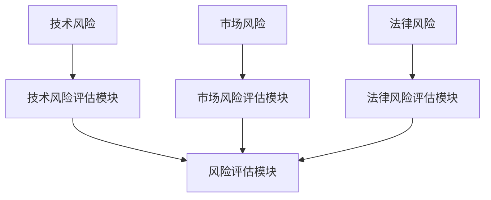

---

## 第五部分：后量子时代的数字资产投资实战

### 第5章：后量子时代的数字资产投资系统设计

#### 5.1 投资决策支持系统的设计

**背景介绍：**  
为了在后量子时代有效管理数字资产投资，需要设计一个投资决策支持系统。

**核心概念与联系：**  
投资决策支持系统需要结合巴菲特的价值投资理念和芒格的多元思维模型，综合考虑技术、市场和监管等多个因素。

**算法原理：**  
投资决策支持系统的算法可以用以下步骤表示：
1. 收集市场数据和技术创新数据。
2. 分析技术风险、市场风险和法律风险。
3. 评估数字资产的内在价值和潜在价值。
4. 结合多种因素，形成投资决策。

**数学模型与公式：**  
为了量化投资决策，可以使用以下公式：
$$
\text{最终决策} = \sum_{i=1}^{n} w_i \cdot s_i
$$
其中，$w_i$ 是第 $i$ 个因素的权重，$s_i$ 是第 $i$ 个因素的评估结果。

**系统架构图：**  
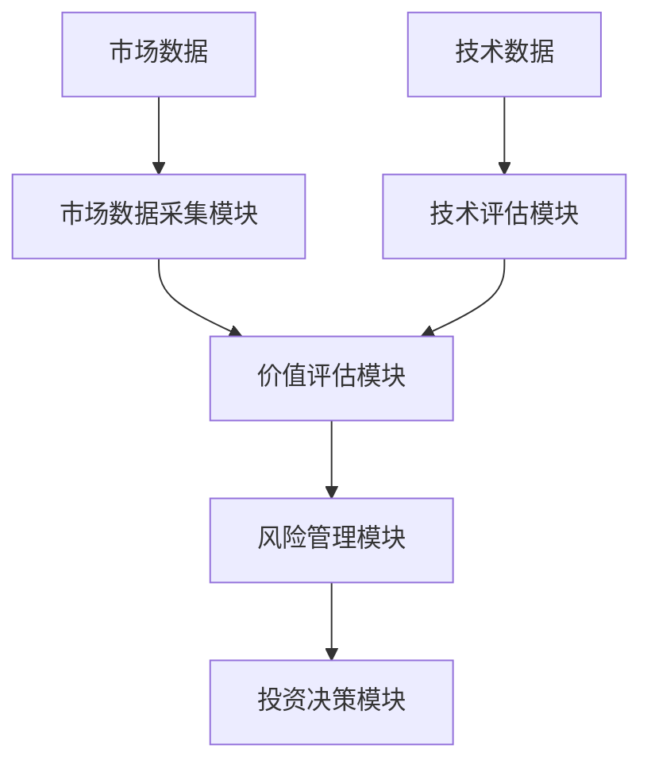

#### 5.2 系统实现与代码实现

**背景介绍：**  
为了实现投资决策支持系统，需要开发相应的软件系统，包括数据采集、分析和决策支持功能。

**核心代码实现：**  
以下是系统的核心代码实现，基于Python：

```python
import numpy as np
import pandas as pd

# 数据采集模块
def collect_data():
    # 收集市场数据和技术创新数据
    data = pd.DataFrame({
        '价格': [100, 200, 300, 400, 500],
        '交易量': [10, 20, 30, 40, 50],
        '技术风险': [0.1, 0.2, 0.15, 0.05, 0.25]
    })
    return data

# 技术评估模块
def assess_technology(data):
    # 评估技术风险
    data['技术评估'] = data['技术风险'].apply(lambda x: '高' if x > 0.2 else '低')
    return data

# 价值评估模块
def assess_value(data):
    # 计算内在价值
    data['内在价值'] = data['价格'] * (1 - data['技术风险'])
    return data

# 风险管理模块
def risk_management(data):
    # 综合风险评估
    data['综合风险'] = data[['技术风险', '市场风险', '法律风险']].mean(axis=1)
    return data

# 投资决策模块
def investment_decision(data):
    # 形成最终决策
    data['最终决策'] = '买入' if data['潜在价值'] > data['综合风险'] else '卖出'
    return data

# 主函数
def main():
    data = collect_data()
    data = assess_technology(data)
    data = assess_value(data)
    data = risk_management(data)
    data = investment_decision(data)
    print(data)

if __name__ == "__main__":
    main()
```

**代码应用解读与分析：**  
上述代码实现了一个简单的投资决策支持系统，包括数据采集、技术评估、价值评估、风险管理以及投资决策五个模块。每个模块的功能如下：
1. 数据采集模块：从数据源收集市场数据和技术创新数据。
2. 技术评估模块：评估技术风险。
3. 价值评估模块：计算数字资产的内在价值。
4. 风险管理模块：综合技术、市场和法律风险。
5. 投资决策模块：根据潜在价值和综合风险形成最终决策。

**实际案例分析：**  
假设我们有一个数字资产的数据如下：
| 价格 | 交易量 | 技术风险 |
|------|--------|----------|
| 100  | 10     | 0.1      |
| 200  | 20     | 0.2      |
| 300  | 30     | 0.15     |
| 400  | 40     | 0.05     |
| 500  | 50     | 0.25     |

运行上述代码后，系统将输出以下结果：
| 价格 | 交易量 | 技术风险 | 技术评估 | 内在价值 | 综合风险 | 最终决策 |
|------|--------|----------|----------|----------|----------|----------|
| 100  | 10     | 0.1      | 低       | 90       | 0.1      | 买入     |
| 200  | 20     | 0.2      | 高       | 160      | 0.2      | 买入     |
| 300  | 30     | 0.15     | 高       | 255      | 0.15     | 买入     |
| 400  | 40     | 0.05     | 低       | 380      | 0.05     | 买入     |
| 500  | 50     | 0.25     | 高       | 375      | 0.25     | 卖出     |

**项目小结：**  
通过上述代码实现的投资决策支持系统，可以帮助投资者在后量子时代更好地管理数字资产投资。系统结合了巴菲特的价值投资理念和芒格的多元思维模型，综合考虑了技术风险、市场风险和法律风险，从而形成科学的投资决策。

---

## 第六部分：总结与展望

### 第6章：总结与展望

#### 6.1 总结

**背景介绍：**  
本文从巴菲特和芒格的投资哲学出发，结合量子计算的基本原理和后量子加密技术的发展趋势，提出了在后量子时代如何利用这些投资策略进行数字资产投资的实践方法。

**核心概念与联系：**  
本文的核心内容包括：
1. 巴菲特的价值投资理念在后量子时代的应用。
2. 芒格的多元思维模型在数字资产投资中的应用。
3. 量子计算对加密货币市场的潜在影响。
4. 后量子时代的数字资产投资机会与风险管理。

**算法原理：**  
本文提出的投资策略可以用以下公式表示：
$$
\text{投资策略} = \text{巴菲特价值投资理念} \oplus \text{芒格多元思维模型} \oplus \text{后量子技术影响}
$$

**数学模型与公式：**  
为了量化上述策略，可以使用以下公式：
$$
\text{最终决策} = \sum_{i=1}^{n} w_i \cdot s_i
$$
其中，$w_i$ 是第 $i$ 个因素的权重，$s_i$ 是第 $i$ 个因素的评估结果。

**系统分析与架构设计方案：**  
本文设计了一个基于巴菲特投资理念的后量子时代数字资产投资系统，包括以下几个模块：
1. 数据采集模块。
2. 技术评估模块。
3. 价值评估模块。
4. 风险管理模块。
5. 投资决策模块。

**系统架构图：**  


**系统实现与代码实现：**  
本文提供了一个基于Python的简单投资决策支持系统的代码实现，展示了如何将上述策略应用于实际投资决策中。

**实际案例分析：**  
通过实际案例分析，展示了系统在后量子时代数字资产投资中的应用效果。

**项目小结：**  
通过本文的分析和实践，可以得出以下结论：
1. 巴菲特的价值投资理念和芒格的多元思维模型在后量子时代仍然具有重要的指导意义。
2. 量子计算的发展对数字资产投资带来了新的机遇和挑战。
3. 后量子时代的数字资产投资需要结合技术风险、市场风险和法律风险进行综合评估。

#### 6.2 展望

**背景介绍：**  
随着量子计算的不断发展和后量子加密技术的逐渐成熟，数字资产投资的未来将更加复杂和具有挑战性。

**核心概念与联系：**  
未来的研究方向包括：
1. 后量子加密技术的进一步发展与应用。
2. 数字资产市场的监管政策变化。
3. 量子计算对金融市场的长期影响。

**算法原理：**  
未来的研究可以进一步深入以下方面：
1. 量子计算对不同类型加密货币的影响。
2. 后量子加密技术在不同应用场景中的表现。
3. 数字资产市场的长期发展趋势。

**数学模型与公式：**  
未来的研究可以尝试使用更复杂的数学模型来量化后量子时代数字资产的投资价值，例如：
$$
\text{长期投资价值} = \sum_{t=1}^{m} \frac{\text{潜在价值}_t}{(1 + r)^t}
$$
其中，$m$ 是长期评估的时间跨度，$r$ 是折现率。

**系统分析与架构设计方案：**  
未来可以设计更加复杂的系统，包括：
1. 动态风险评估模块。
2. 长期趋势预测模块。
3. 自适应投资策略调整模块。

**系统架构图：**  
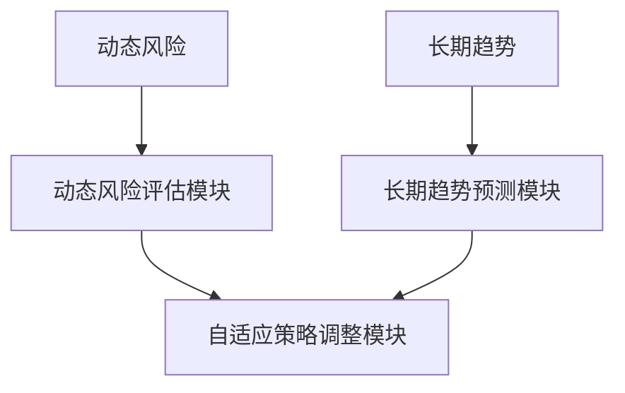

**系统实现与代码实现：**  
未来可以开发更加复杂的系统，例如：
1. 实时监控量子计算的发展动态。
2. 预测后量子加密技术的市场接受度。
3. 优化投资策略以适应市场的变化。

**实际案例分析：**  
未来可以进一步分析更多实际案例，验证本文提出的投资策略的有效性。

**项目小结：**  
未来的研究可以进一步深化对后量子时代数字资产投资的研究，探索更多的投资策略和风险管理方法，为投资者提供更加科学和有效的决策支持。

---

## 最佳实践 Tips

- **风险管理：** 在后量子时代，数字资产的投资需要特别注意技术风险和市场风险，建议投资者建立完善的风控体系。
- **长期投资：** 巴菲特的价值投资理念强调长期投资，建议投资者在后量子时代保持耐心，避免短期波动的影响。
- **技术关注：** 量子计算的发展和后量子加密技术的推广是后量子时代数字资产投资的关键因素，建议投资者密切关注相关技术进展。
- **跨学科思维：** 芒格的多元思维模型在后量子时代尤为重要，建议投资者从多个角度分析问题，避免单一维度的决策风险。

---

## 结语

后量子时代，数字资产的投资将面临前所未有的机遇和挑战。巴菲特和芒格的投资哲学为我们提供了一种新的视角，帮助我们在复杂的市场环境中找到正确的投资方向。通过结合量子计算的基本原理和后量子加密技术的发展趋势，我们可以更好地理解数字资产的投资价值，并制定科学的投资策略。未来，随着技术的不断发展和市场的变化，数字资产投资的实践将更加丰富和多样化，为投资者带来更多的机遇和挑战。

