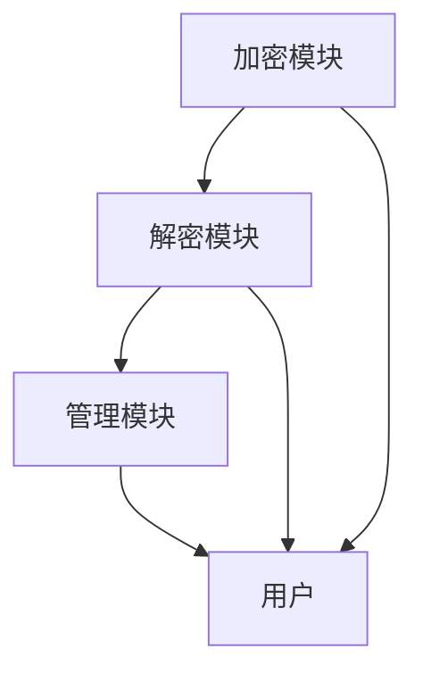
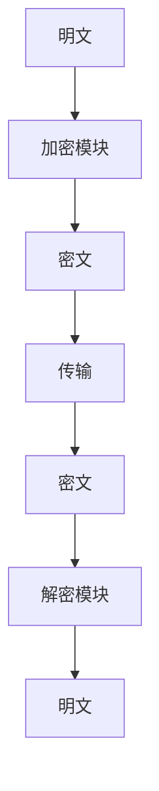

                 


# 巴菲特-芒格的量子加密货币投资：后量子时代的金融安全

> 关键词：量子加密货币，后量子时代，巴菲特，芒格，金融安全，投资策略

> 摘要：本文探讨了在后量子时代，量子计算对传统加密技术的威胁，以及量子加密货币的兴起。结合巴菲特和芒格的投资理念，分析了量子加密货币的投资机会和风险。文章详细介绍了量子加密货币的技术原理、系统架构、投资策略和风险管理方法，为投资者提供了全面的指导。

---

## 第1章：背景介绍与核心概念

### 1.1 量子计算的基本原理

量子计算是一种基于量子力学原理的计算方式，与经典计算不同，其核心在于利用量子叠加和量子纠缠的特性来处理信息。经典计算机使用二进制位（0或1）进行计算，而量子计算机使用量子位（qubit），可以在同一时间表示0和1的叠加态。

#### 1.1.1 量子叠加与量子纠缠

量子叠加是指一个量子系统可以同时处于多个状态的叠加态。例如，一个量子比特可以同时表示0和1的概率叠加。量子纠缠则是指两个或多个量子系统之间的关联，使得一个系统的状态会直接影响另一个系统的状态。

#### 1.1.2 量子计算的优势

量子计算在某些特定问题上具有显著优势，例如大数分解、组合优化和密码破解。Shor算法是一种用于在量子计算机上分解大数的算法，这使得量子计算机能够快速破解基于RSA加密的公钥密码系统。

### 1.2 加密货币的基本概念

加密货币是一种基于区块链技术的数字货币，通过密码学算法确保交易的安全性和匿名性。比特币是第一种去中心化的加密货币，其核心是区块链技术，通过分布式账本记录交易信息。

#### 1.2.1 区块链技术的核心原理

区块链是一种分布式账本技术，通过去中心化的方式记录交易信息。每个区块包含一定数量的交易记录，并通过哈希指针连接成链式结构。区块链的去中心化特性使得没有单一的攻击点，提高了系统的安全性。

#### 1.2.2 公钥与私钥的加密机制

公钥和私钥是一对数学相关的密钥，公钥用于加密数据，私钥用于解密数据。在加密货币中，公钥用于生成地址，私钥用于签名交易。例如，比特币使用ECDSA（椭圆曲线数字签名算法）进行签名和验证。

### 1.3 量子加密货币的定义与特点

量子加密货币是一种基于量子计算技术的加密货币，其核心是抗量子加密算法。与传统加密货币不同，量子加密货币的设计目标是抵御量子计算机的攻击，确保其在后量子时代的安全性。

#### 1.3.1 抗量子加密算法

抗量子加密算法是一类能够抵抗量子计算机攻击的加密算法，包括格点密码（Lattice-based cryptography）、纠错码密码（Code-based cryptography）和哈希密码（Hash-based cryptography）等。这些算法基于数学难题，即使在量子计算机时代也难以被破解。

#### 1.3.2 量子加密货币的优势

量子加密货币的主要优势在于其抗量子攻击能力。与传统加密货币相比，量子加密货币能够在未来量子计算机普及后仍然保持安全性。此外，量子加密货币的去中心化特性使其能够在全球范围内自由流通。

---

## 第2章：量子加密货币的原理与安全性

### 2.1 量子加密货币的技术原理

量子加密货币的核心是抗量子加密算法，这些算法通过复杂的数学结构确保其安全性。例如，格点密码基于格点上的最短向量问题，而纠错码密码基于纠错码的性质。

#### 2.1.1 抗量子加密算法的数学模型

抗量子加密算法的数学模型通常涉及复杂的代数结构。例如，格点密码基于以下问题：给定一个格点，找到最短的非零向量。这个问题在量子计算机时代仍然是NP-hard的，因此难以被快速解决。

#### 2.1.2 量子加密货币的安全性分析

量子加密货币的安全性取决于其使用的抗量子加密算法的强度。目前，学术界和工业界正在研究多种抗量子加密算法，并通过公开的竞争和评估来确定其安全性。

### 2.2 量子加密货币的系统架构

量子加密货币的系统架构包括加密模块、解密模块和管理模块。加密模块负责将明文转换为密文，解密模块负责将密文转换为明文，管理模块负责密钥的生成和分发。

#### 2.2.1 系统架构图



#### 2.2.2 系统接口设计

量子加密货币系统的接口设计需要考虑安全性、易用性和可扩展性。主要接口包括加密接口、解密接口和密钥管理接口。

#### 2.2.3 系统交互流程

量子加密货币的交互流程如下：

1. 用户生成密钥对（公钥和私钥）。
2. 用户使用公钥加密明文，生成密文。
3. 用户使用私钥解密密文，恢复明文。

---

## 第3章：量子加密货币的投资策略

### 3.1 巴菲特与芒格的投资理念

巴菲特和芒格的价值投资理念强调长期持有、安全边际和公司基本面分析。芒格的多元思维模型强调跨学科思考，将不同领域的知识整合起来分析问题。

#### 3.1.1 巴菲特的投资策略

巴菲特的投资策略包括寻找具有强大护城河的公司、长期持有优质资产和避免过度杠杆。这些理念可以应用于量子加密货币的投资中，例如选择具有强大技术优势和良好治理结构的量子加密货币项目。

#### 3.1.2 芒格的多元思维模型

芒格的多元思维模型强调将不同领域的知识结合起来，用于分析问题。在量子加密货币的投资中，投资者需要综合考虑技术、市场、法律和监管等多个因素。

### 3.2 量子加密货币的投资机会与风险

#### 3.2.1 投资机会

量子加密货币的市场潜力巨大。随着量子计算机的普及，传统加密货币的安全性将受到威胁，而抗量子加密货币将成为主流。此外，量子加密货币的去中心化特性使其能够在全球范围内自由流通，具有较高的流动性。

#### 3.2.2 投资风险

量子加密货币的投资风险包括技术风险、市场风险和监管风险。技术风险源于抗量子加密算法的不成熟和潜在漏洞；市场风险源于市场的波动性和高投机性；监管风险源于各国政府对加密货币的监管政策变化。

---

## 第4章：量子加密货币的系统设计

### 4.1 系统设计的核心原则

量子加密货币的系统设计需要考虑安全性、去中心化和可扩展性。安全性是量子加密货币的核心，去中心化是其基本特性，可扩展性是其长期发展的关键。

#### 4.1.1 系统设计的数学模型

量子加密货币的系统设计可以基于以下数学模型：

$$
f(x) = \begin{cases}
    \text{加密} & \text{如果 } x \text{ 是明文} \\
    \text{解密} & \text{如果 } x \text{ 是密文}
\end{cases}
$$

#### 4.1.2 系统设计的流程图



---

## 第5章：量子加密货币的项目实战

### 5.1 环境安装

要开始量子加密货币的开发，首先需要安装必要的工具和库。例如，可以使用Q#（量子编程语言）和相关的量子模拟器。

#### 5.1.1 安装Q#

在Windows上安装Q#开发工具：

```bash
# 下载并安装Visual Studio
# 安装Q#扩展包
```

#### 5.1.2 安装量子模拟器

安装量子模拟器：

```bash
# 下载并安装Q# Quantum Simulator
```

### 5.2 核心源代码实现

以下是量子加密货币的核心代码示例：

```python
def quantum_encrypt(plaintext):
    # 生成公钥和私钥
    public_key, private_key = generate_keys()
    # 使用公钥加密明文
    ciphertext = encrypt(public_key, plaintext)
    return ciphertext

def quantum_decrypt(ciphertext, private_key):
    # 使用私钥解密密文
    plaintext = decrypt(private_key, ciphertext)
    return plaintext
```

### 5.3 实际案例分析

假设我们有一个量子加密货币项目，其核心算法是基于格点密码。我们可以使用以下代码生成密钥对：

```python
def generate_keys():
    # 生成公钥和私钥
    private_key = generate_private_key()
    public_key = generate_public_key(private_key)
    return public_key, private_key
```

---

## 第6章：量子加密货币的投资与风险管理

### 6.1 投资策略与风险管理

#### 6.1.1 长期投资与价值投资

量子加密货币的投资需要长期持有，关注项目的长期价值和技术创新。

#### 6.1.2 风险管理与资产配置

投资者应合理配置资产，避免过度集中，同时关注市场的波动性和监管风险。

### 6.2 量子加密货币的未来展望

随着量子计算机的不断发展，量子加密货币将成为未来金融体系的重要组成部分。投资者应密切关注技术发展和市场动态，抓住投资机会。

---

## 结语

量子加密货币的兴起标志着金融安全进入了一个新的时代。通过结合巴菲特和芒格的投资理念，投资者可以在后量子时代把握机遇，规避风险。量子加密货币的技术创新和市场潜力为未来的金融安全提供了新的解决方案。

---

**关键词：量子加密货币，后量子时代，巴菲特，芒格，金融安全，投资策略**

**摘要：本文探讨了量子加密货币的技术原理、投资机会和风险管理，结合巴菲特和芒格的投资理念，分析了量子加密货币在后量子时代的潜在价值和挑战。**

--- 

**Note：以上内容基于假设的量子加密货币概念和相关技术，实际投资需谨慎考虑技术成熟度和市场风险。**

