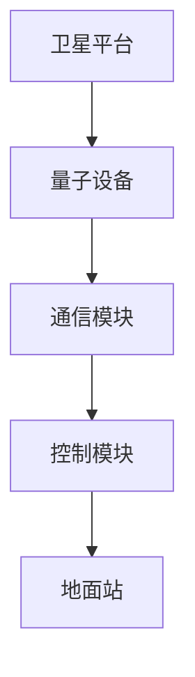

                 

# 巴菲特-芒格的量子加密通信卫星投资：全球安全通信的新标准

> 关键词：巴菲特，芒格，量子加密通信，卫星，投资策略，全球安全通信，技术创新

> 摘要：本文探讨了巴菲特和芒格的投资理念与量子加密通信卫星技术的结合，分析了其在全球安全通信领域的重要性和潜在影响。通过详细的技术分析和投资策略探讨，本文揭示了量子加密通信卫星的投资价值及其对未来全球通信安全的深远意义。

---

# 第1章 巴菲特与芒格的投资理念

## 1.1 巴菲特的价值投资哲学

### 1.1.1 巴菲特的价值投资理念
- **长期投资**：巴菲特强调长期投资，寻找具有持续竞争优势和良好治理的企业。
- **安全边际**：通过低估买入价和高估卖出价来确保投资的安全性。
- **股东价值**：关注企业的长期价值，而非短期股价波动。

### 1.1.2 芒格的多元思维模型
- **跨学科思维**：芒格倡导将不同领域的知识结合起来，形成一个完整的知识框架。
- **决策框架**：通过多维度分析，避免决策偏差，提高投资决策的准确性。

### 1.1.3 巴菲特与芒格合作的标志性案例
- **伯克希尔哈撒韦公司**：通过长期持有优质企业，实现股东价值的最大化。
- **价值投资的成功案例**：如可口可乐、IBM等，展示了价值投资的长期收益。

## 1.2 巴菲特与芒格投资策略的核心要素

### 1.2.1 长期投资与价值发现
- **长期视角**：关注企业的长期盈利能力，而非短期市场波动。
- **价值发现**：寻找市场价格低于内在价值的企业进行投资。

### 1.2.2 风险控制与安全边际
- **风险管理**：通过分散投资和严格筛选降低风险。
- **安全边际**：确保买入价低于企业的真实价值，以应对市场波动。

### 1.2.3 股东权益最大化原则
- **股东价值**：通过长期投资和优质企业管理，实现股东权益的最大化。

## 1.3 巴菲特与芒格投资理念的现代应用

### 1.3.1 科技创新与投资机会
- **技术创新**：关注科技领域的创新企业，寻找具有颠覆性技术的投资机会。
- **数字经济**：在数字化转型中寻找投资标的，如量子通信、人工智能等。

### 1.3.2 数字经济时代的投资策略
- **技术驱动**：关注技术驱动型企业的长期价值。
- **数据安全**：在数字经济中，数据安全成为核心投资方向。

### 1.3.3 全球化视角下的投资布局
- **全球化**：关注全球市场的机会，寻找具有全球竞争优势的企业。
- **区域市场**：结合不同地区的经济特点，优化投资组合。

## 1.4 本章小结
本章介绍了巴菲特和芒格的投资理念，强调长期投资、价值发现和风险控制。这些理念在现代科技投资中具有重要意义，特别是在量子通信等高科技领域，其投资策略为技术创新和市场应用提供了重要指导。

---

# 第2章 量子加密通信卫星的技术原理

## 2.1 量子加密通信的基本概念

### 2.1.1 量子通信的定义与特点
- **定义**：量子通信是一种利用量子态进行信息传递的技术，具有极高的安全性。
- **特点**：不可窃听、不可复制、高速传输。

### 2.1.2 量子密钥分发（QKD）的原理
- **QKD概述**：通过量子态传输密钥，确保密钥的安全分发。
- **量子态传输**：利用量子纠缠和叠加原理实现密钥分发。

### 2.1.3 量子加密通信的优势与挑战
- **优势**：安全性极高，传输速度快。
- **挑战**：技术复杂性高，成本高昂。

## 2.2 量子加密通信卫星的组成与功能

### 2.2.1 卫星平台的技术架构
- **卫星平台**：包括通信模块、量子设备和控制模块。
- **通信模块**：负责数据的传输和处理。
- **量子设备**：实现量子态的生成和传输。

### 2.2.2 量子通信设备的核心组件
- **量子源**：生成量子态的设备。
- **量子测量设备**：用于测量量子态的设备。
- **量子纠缠设备**：实现量子纠缠的设备。

### 2.2.3 卫星通信链路的实现过程
- **链路建立**：卫星与地面站建立通信链路。
- **量子态传输**：通过卫星传输量子态信息。
- **密钥分发**：实现密钥的安全分发。

## 2.3 量子加密通信的数学模型与算法

### 2.3.1 量子密钥分发的数学公式
- **密钥分发公式**：通过量子态传输实现密钥分发。
- **数学模型**：描述量子态的数学表达式。

### 2.3.2 量子态叠加与纠缠原理
- **量子态叠加**：量子态可以同时处于多个状态。
- **量子纠缠**：两个或多个量子态之间存在关联。

### 2.3.3 量子加密算法的实现流程
- **算法流程**：从密钥生成到数据加密的详细步骤。

## 2.4 本章小结
本章详细介绍了量子加密通信的基本原理和技术实现，重点分析了量子密钥分发的数学模型和算法实现。量子加密通信的技术复杂性决定了其在安全通信领域的独特地位。

---

# 第3章 巴菲特与芒格投资理念与量子加密通信卫星的结合

## 3.1 巴菲特与芒格投资理念与量子通信的契合点

### 3.1.1 价值投资与技术创新的结合
- **技术创新**：量子通信是具有颠覆性的技术，符合价值投资的长期视角。
- **企业价值**：关注量子通信企业的内在价值，寻找具有竞争优势的企业。

### 3.1.2 长期投资与量子通信技术的成熟周期
- **技术成熟周期**：量子通信技术仍处于发展阶段，需要长期投资。
- **市场潜力**：量子通信市场具有巨大的发展潜力。

### 3.1.3 安全边际与量子通信的安全性保障
- **安全性**：量子通信的安全性是其核心优势，符合安全边际的投资理念。
- **风险管理**：通过技术优势和市场地位降低投资风险。

## 3.2 量子加密通信卫星的投资价值分析

### 3.2.1 量子通信市场的潜力与前景
- **市场规模**：量子通信市场正在快速发展，具有巨大的增长潜力。
- **技术优势**：量子加密通信的技术优势使其在安全通信领域具有竞争力。

### 3.2.2 卫星通信行业的现状与发展趋势
- **行业现状**：卫星通信行业正在经历技术升级和市场扩展。
- **发展趋势**：量子加密通信卫星将成为未来卫星通信的核心技术。

### 3.2.3 量子加密通信卫星的核心竞争优势
- **安全性**：量子加密通信的安全性远高于传统加密技术。
- **市场定位**：在安全通信市场中占据领先地位。

## 3.3 巴菲特与芒格投资策略在量子通信领域的应用

### 3.3.1 价值发现与技术创新的结合
- **技术创新**：量子通信是具有颠覆性的技术创新，符合价值投资的长期视角。
- **企业价值**：寻找具有技术创新能力和竞争优势的量子通信企业。

### 3.3.2 风险控制与量子通信技术的不确定性
- **技术不确定性**：量子通信技术仍处于发展阶段，存在一定的技术风险。
- **风险管理**：通过多元化投资和严格筛选降低技术风险。

### 3.3.3 股东权益最大化与量子通信企业的长期价值
- **股东权益**：通过长期投资实现股东权益的最大化。
- **企业价值**：寻找具有长期增长潜力的量子通信企业。

## 3.4 本章小结
本章分析了巴菲特和芒格的投资理念与量子加密通信卫星技术的契合点，探讨了其在量子通信领域的投资价值和策略。通过技术创新和长期投资，量子加密通信卫星将成为未来安全通信的核心技术。

---

# 第4章 量子加密通信卫星的系统架构与实现

## 4.1 量子加密通信卫星的系统组成

### 4.1.1 卫星平台的硬件架构
- **硬件组成**：包括量子设备、通信模块和控制模块。
- **功能模块**：实现量子态的生成、传输和控制。

### 4.1.2 量子通信设备的核心组件
- **量子源**：生成量子态的设备。
- **量子测量设备**：测量量子态的设备。
- **量子纠缠设备**：实现量子纠缠的设备。

### 4.1.3 通信链路的传输协议
- **传输协议**：定义量子态传输的规则和流程。
- **链路管理**：实现卫星与地面站之间的通信链路管理。

## 4.2 量子加密通信的算法实现

### 4.2.1 量子密钥分发的协议流程
- **协议流程**：从密钥生成到分发的详细步骤。
- **算法实现**：描述量子密钥分发的数学模型和实现流程。

### 4.2.2 量子态测量与纠缠的实现方法
- **量子态测量**：通过测量量子态实现密钥分发。
- **量子纠缠**：实现量子纠缠的步骤和方法。

### 4.2.3 量子加密算法的优化与改进
- **算法优化**：通过优化算法提高量子加密通信的安全性和效率。
- **技术改进**：结合最新技术实现算法的改进和优化。

## 4.3 量子加密通信卫星的系统架构图

## 4.4 本章小结
本章详细分析了量子加密通信卫星的系统架构与实现，重点介绍了其硬件组成、通信协议和算法实现。通过系统的分析，为量子加密通信卫星的技术实现提供了理论基础。

---

# 第5章 投资策略与风险管理

## 5.1 巴菲特与芒格的投资策略

### 5.1.1 价值发现与长期投资
- **价值发现**：寻找具有技术创新和竞争优势的企业。
- **长期投资**：通过长期持有实现股东价值的最大化。

### 5.1.2 风险控制与安全边际
- **风险控制**：通过多元化投资和严格筛选降低投资风险。
- **安全边际**：确保买入价低于企业的真实价值。

## 5.2 量子加密通信卫星的投资策略

### 5.2.1 市场分析与投资机会
- **市场分析**：分析量子通信市场的潜力和趋势。
- **投资机会**：寻找具有技术创新和竞争优势的量子通信企业。

### 5.2.2 技术评估与企业价值
- **技术评估**：评估量子通信技术的成熟度和可行性。
- **企业价值**：寻找具有长期增长潜力的量子通信企业。

## 5.3 风险管理与投资组合优化

### 5.3.1 风险控制策略
- **分散投资**：通过多元化投资降低风险。
- **严格筛选**：选择具有竞争优势和良好治理的企业。

### 5.3.2 投资组合优化
- **组合优化**：通过优化投资组合实现风险与收益的平衡。
- **动态调整**：根据市场变化和企业情况动态调整投资组合。

## 5.4 本章小结
本章探讨了巴菲特和芒格的投资策略在量子通信领域的应用，强调价值发现、长期投资和风险管理的重要性。通过科学的投资策略和严格的风险控制，投资者可以在量子通信领域实现稳健的投资收益。

---

# 第6章 安全挑战与解决方案

## 6.1 量子加密通信的安全挑战

### 6.1.1 技术挑战
- **技术复杂性**：量子通信技术复杂，实现难度大。
- **成本高昂**：量子通信技术的研发和应用成本高。

### 6.1.2 市场挑战
- **市场认知度**：量子通信技术的认知度低，市场接受度有限。
- **竞争压力**：传统加密技术的市场竞争激烈。

## 6.2 安全解决方案

### 6.2.1 技术创新与研发投入
- **技术创新**：通过技术创新解决技术难题。
- **研发投入**：加大研发投入，推动技术进步。

### 6.2.2 标准化与规范化
- **标准化**：制定量子通信技术的标准和规范。
- **规范化**：推动量子通信技术的规范化应用。

## 6.3 本章小结
本章分析了量子加密通信的安全挑战，提出了技术创新和标准化的解决方案。通过技术创新和标准化，可以有效解决量子通信技术的安全性和应用难题。

---

# 第7章 未来展望与结论

## 7.1 未来展望

### 7.1.1 量子通信技术的发展趋势
- **技术进步**：量子通信技术将不断进步，实现更高效的安全通信。
- **市场扩展**：量子通信市场将逐步扩大，应用领域将不断扩展。

### 7.1.2 巴菲特与芒格投资理念的延续
- **技术创新**：继续关注技术创新和价值投资。
- **长期投资**：坚持长期投资，寻找具有竞争优势的企业。

## 7.2 结论

### 7.2.1 投资与技术创新的结合
- **结合意义**：巴菲特和芒格的投资理念与量子通信技术的结合，为全球安全通信提供了新的标准。
- **未来影响**：量子通信技术将成为全球安全通信的核心技术，推动通信行业的革命性变革。

## 7.3 本章小结
本章总结了量子通信技术的发展趋势和投资理念的未来影响，强调投资与技术创新的结合对未来全球安全通信的重要意义。

---

# 附录

## 附录A 量子加密通信算法的数学模型

## 附录B 量子通信系统架构图

## 附录C 投资策略与风险管理的详细分析

---

**摘要**：本文通过分析巴菲特和芒格的投资理念，探讨其与量子加密通信卫星技术的结合，揭示了其在全球安全通信领域的重要性和潜在影响。通过详细的技术分析和投资策略探讨，本文揭示了量子加密通信卫星的投资价值及其对未来全球通信安全的深远意义。

