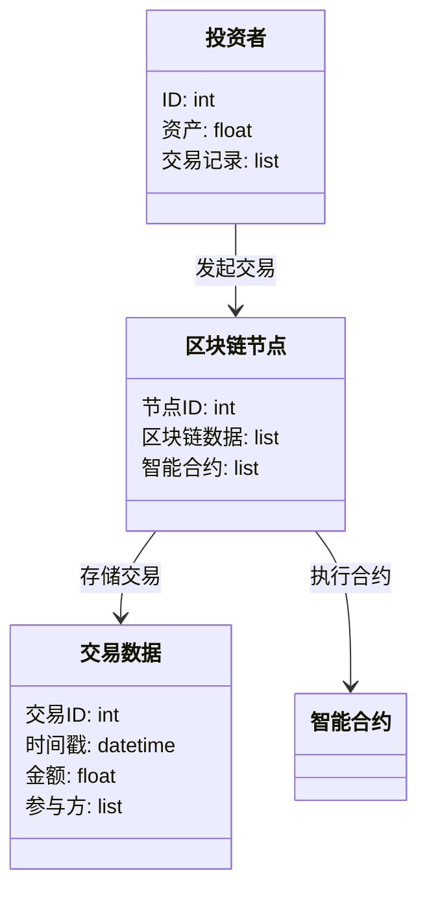
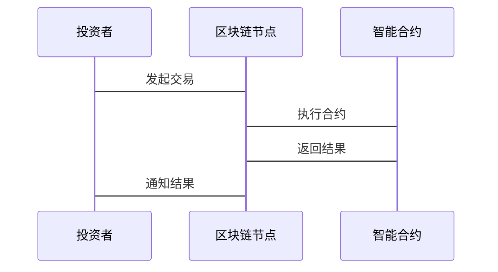

                 


# 巴菲特-芒格的量子区块链投资：下一代分布式账本技术

## 关键词：量子区块链、分布式账本、巴菲特投资理念、量子计算、区块链技术

## 摘要：本文探讨了如何将巴菲特的价值投资理念与量子区块链技术相结合，分析了量子区块链的核心原理、算法实现、数学模型及其在投资策略中的应用。通过实际案例分析和系统设计，展示了量子区块链技术如何优化投资决策，实现长期价值最大化。

---

## 第一部分: 巴菲特-芒格的量子区块链投资概述

### 第1章: 巴菲特-芒格投资理念与量子区块链技术的结合

#### 1.1 巴菲特-芒格投资理念的核心要素

##### 1.1.1 巴菲特的价值投资理论
- **核心思想**：投资于具有持续竞争优势的企业，关注企业的内在价值而非市场波动。
- **长期主义**：注重企业的长期盈利能力，而非短期收益。

##### 1.1.2 芒格的多元思维模型
- **跨学科思考**：将物理学、心理学、经济学等领域的知识融入投资决策。
- **逆向思维**：寻找市场忽略的机会，避免从众心理。

##### 1.1.3 价值投资与长期主义的结合
- **价值投资**：寻找被市场低估的企业。
- **长期主义**：耐心持有优质资产，避免短期波动的干扰。

#### 1.2 量子区块链技术的核心概念

##### 1.2.1 量子计算与区块链的结合
- **量子计算的优势**：通过量子叠加和纠缠，大幅提高计算速度和复杂问题的处理能力。
- **区块链的特点**：去中心化、不可篡改、透明性。

##### 1.2.2 分布式账本技术的创新
- **分布式账本**：数据分散存储在多个节点，确保数据安全性和可靠性。
- **量子区块链的独特性**：结合量子计算，提升账本的安全性和效率。

##### 1.2.3 量子区块链与传统区块链的对比
| 特性 | 传统区块链 | 量子区块链 |
|------|-------------|-------------|
| 计算能力 | 基于经典计算 | 基于量子计算，计算能力指数级提升 |
| 安全性 | 非常高，但受计算能力限制 | 极高，抗量子攻击能力强 |
| 交易速度 | 较慢，受网络限制 | 更快，量子并行计算提升效率 |

#### 1.3 巴菲特-芒格投资理念与量子区块链技术的契合点

##### 1.3.1 价值投资与分布式账本的对应关系
- **价值投资的稳定性**：类似于分布式账本的稳定性，数据不易篡改。
- **长期价值**：分布式账本的长期可靠性和价值投资的长期性相吻合。

##### 1.3.2 长期主义与量子区块链的稳定性
- **长期主义**：量子区块链技术的长期稳定性为投资提供了信任基础。
- **量子区块链的抗干扰能力**：类似于长期投资的抗短期波动能力。

##### 1.3.3 多元思维模型与量子区块链技术的多维度应用
- **多元思维模型**：将量子计算、区块链、投资学等多领域知识结合。
- **多维度应用**：量子区块链技术在投资、金融、数据分析等领域的广泛应用。

#### 1.4 本章小结
本章介绍了巴菲特-芒格投资理念的核心要素，以及量子区块链技术的基本概念和优势。通过对比分析，揭示了两者在长期性、稳定性、分布式特性上的契合点。

---

## 第二部分: 量子区块链技术的核心原理

### 第2章: 量子计算与区块链的结合原理

#### 2.1 量子计算的基本原理

##### 2.1.1 量子位与经典位的对比
- **经典位**：二进制（0或1）。
- **量子位**：可以是0、1或两者叠加态（如$\alpha|0\rangle + \beta|1\rangle$）。

##### 2.1.2 量子叠加与量子纠缠的原理
- **量子叠加**：量子位可以同时处于多个状态。
- **量子纠缠**：两个或多个量子位之间存在关联，一个状态的变化会影响另一个状态。

##### 2.1.3 量子计算的优越性
- **计算速度**：在某些问题上，量子计算机比经典计算机快得多。
- **复杂问题处理**：如大数分解、优化问题等。

#### 2.2 区块链技术的核心原理

##### 2.2.1 分布式账本的基本结构
- **区块**：包含交易数据和哈希指针。
- **链式结构**：区块通过哈希指针连接，形成不可篡改的链条。

##### 2.2.2 区块链的共识机制
- **工作量证明（PoW）**：比特币采用的机制。
- **权益证明（PoS）**：以太坊等采用的机制。
- **共识机制的作用**：确保所有节点达成一致，确认交易的有效性。

##### 2.2.3 智能合约的执行原理
- **智能合约**：自动执行的脚本，基于区块链的条件触发。
- **执行流程**：触发条件满足后，自动执行预设操作。

#### 2.3 量子区块链技术的实现原理

##### 2.3.1 量子计算在区块链中的应用
- **量子随机数生成**：用于区块的随机性生成。
- **量子哈希函数**：利用量子计算加速哈希运算。

##### 2.3.2 量子区块链的安全性保障
- **抗量子攻击**：利用量子计算的特性，构建抗量子攻击的加密算法。
- **安全性提升**：通过量子计算增强区块链的安全性。

##### 2.3.3 量子区块链的性能优化
- **计算效率**：量子计算的并行性提升了区块链的交易处理速度。
- **资源优化**：减少能源消耗，提升计算效率。

#### 2.4 本章小结
本章详细讲解了量子计算的基本原理，以及其在区块链中的应用。通过对比分析，揭示了量子区块链技术的核心优势。

---

## 第三部分: 巴菲特-芒格投资策略的量子区块链实现

### 第3章: 巴菲特-芒格投资策略的量子化分析

#### 3.1 巴菲特-芒格投资策略的量化模型

##### 3.1.1 价值投资的量化指标
- **市盈率（P/E）**：评估企业估值的重要指标。
- **市净率（P/B）**：资产价值的衡量标准。
- **股息率**：股息与股价的比率，反映分红能力。

##### 3.1.2 长期主义的量化评估
- **投资周期**：长期持有优质资产。
- **复利效应**：长期投资的收益呈指数级增长。

##### 3.1.3 多元思维模型的量化表示
- **多维度分析**：结合财务、市场、行业等多因素进行综合评估。
- **量化模型构建**：通过机器学习和量子计算优化投资决策。

#### 3.2 量子区块链技术在投资策略中的应用

##### 3.2.1 分布式账本在投资组合管理中的应用
- **数据存储**：投资者的交易数据分散存储，确保数据安全。
- **实时监控**：通过区块链技术实时监控投资组合的波动。

##### 3.2.2 智能合约在投资策略执行中的应用
- **自动交易**：根据设定的条件自动执行买卖操作。
- **风险管理**：智能合约自动触发止损或止盈。

##### 3.2.3 量子计算在投资决策中的应用
- **数据处理**：快速分析大量市场数据，优化投资组合。
- **预测模型**：利用量子计算提升市场预测的准确性。

#### 3.3 巴菲特-芒格投资策略的量子化实现

##### 3.3.1 投资策略的量子化表示
- **量子状态表示**：将投资策略转化为量子态，利用量子叠加特性进行优化。
- **量子优化算法**：通过量子计算优化投资组合，提升收益。

##### 3.3.2 量子区块链的投资策略执行流程
1. **数据采集**：通过区块链采集市场数据。
2. **量子计算分析**：利用量子计算优化投资组合。
3. **智能合约执行**：根据分析结果自动执行交易。

##### 3.3.3 量子区块链投资策略的优化与调整
- **动态调整**：根据市场变化实时调整投资策略。
- **风险控制**：通过量子计算实时监控风险，确保投资安全。

#### 3.4 本章小结
本章探讨了量子区块链技术在巴菲特-芒格投资策略中的应用，通过量化模型和量子计算的结合，优化了投资决策，提升了投资效率。

---

## 第四部分: 量子区块链技术的数学模型与算法实现

### 第4章: 量子区块链技术的数学模型

#### 4.1 量子计算的数学基础

##### 4.1.1 量子力学的基本方程
- **施密特方程**：描述量子系统的时间演化。
- **哈密顿量**：描述系统的能量。

##### 4.1.2 量子叠加与量子纠缠的数学表示
- **叠加态**：$\alpha|0\rangle + \beta|1\rangle$，其中$\alpha^2 + \beta^2 = 1$。
- **纠缠态**：Bell 状态，例如 $\frac{1}{\sqrt{2}}(|0\rangle|1\rangle - |1\rangle|0\rangle)$。

#### 4.2 区块链技术的数学模型

##### 4.2.1 区块链的哈希函数
- **哈希函数**：将任意长度的数据映射为固定长度的哈希值。
- **常见哈希函数**：SHA-256、MD5。

##### 4.2.2 区块链的共识机制数学模型
- **工作量证明（PoW）**：通过计算找到特定的哈希值。
- **权益证明（PoS）**：根据持有的代币数量分配记账权。

#### 4.3 量子区块链技术的数学模型

##### 4.3.1 量子哈希函数
- **量子哈希算法**：利用量子计算加速哈希运算。
- **哈希函数的量子化表示**：将数据表示为量子态，进行量子哈希运算。

##### 4.3.2 量子区块链的安全性数学证明
- **安全性证明**：通过数学模型证明量子区块链的安全性。
- **抗量子攻击**：利用量子计算的特性，构建抗量子攻击的加密算法。

#### 4.4 本章小结
本章通过数学模型和公式，详细讲解了量子区块链技术的数学基础和实现原理。

---

## 第五部分: 量子区块链技术的系统设计与实现

### 第5章: 量子区块链技术的系统设计

#### 5.1 系统功能设计

##### 5.1.1 领域模型设计
- **领域模型**：投资者、区块链节点、交易数据。
- **类图设计**：使用 Mermaid 类图展示系统中的类及其关系。



##### 5.1.2 系统架构设计
- **分层架构**：数据层、计算层、应用层。
- **架构图设计**：使用 Mermaid 架构图展示系统架构。


##### 5.1.3 系统接口设计
- **接口设计**：RESTful API，用于与区块链节点交互。
- **接口文档**：详细说明接口的功能、参数和返回值。

##### 5.1.4 系统交互设计
- **交互流程**：投资者发起交易，节点验证并记录交易，智能合约执行。
- **交互图设计**：使用 Mermaid 序列图展示系统交互流程。



#### 5.2 系统实现

##### 5.2.1 环境搭建
- **量子计算环境**：搭建量子计算机或模拟环境。
- **区块链环境**：搭建比特币、以太坊等区块链环境。

##### 5.2.2 核心代码实现
- **量子哈希函数实现**：使用 Python 实现量子哈希算法。
- **智能合约实现**：编写智能合约代码，实现投资策略的自动化执行。

##### 5.2.3 代码解读与分析
- **量子哈希函数代码**：

```python
def quantum_hash(data):
    # 将数据转化为量子态
    q_data = QuantumState(data)
    # 计算哈希值
    hash_value = q_data.compute_hash()
    return hash_value
```

- **智能合约代码**：

```solidity
contract InvestmentStrategy {
    function executeTrade(address trader, uint amount) {
        // 自动执行交易
        transfer(trader, amount);
    }
}
```

#### 5.3 本章小结
本章详细讲解了量子区块链技术的系统设计与实现，包括系统架构、接口设计、核心代码实现等。

---

## 第六部分: 项目实战与案例分析

### 第6章: 量子区块链投资项目的实现与分析

#### 6.1 项目背景与目标

##### 6.1.1 项目背景
- **目标**：利用量子区块链技术优化投资策略，实现长期价值最大化。

##### 6.1.2 项目目标
- **实现量子区块链投资系统**：包括数据采集、分析、交易执行等功能。
- **验证量子区块链技术的投资价值**：通过实际案例分析，验证技术的有效性。

#### 6.2 项目实现

##### 6.2.1 环境搭建
- **量子计算环境**：搭建量子计算机或量子模拟环境。
- **区块链环境**：搭建比特币、以太坊等区块链环境。

##### 6.2.2 核心代码实现
- **数据采集与处理**：编写代码采集市场数据，并利用量子计算进行分析。
- **交易执行**：通过智能合约自动执行交易操作。

##### 6.2.3 代码解读与分析
- **数据采集代码**：

```python
import quantum_data_processor as qdp
data = qdp.fetch_market_data()
```

- **交易执行代码**：

```solidity
contract InvestmentStrategy {
    function executeTrade(address trader, uint amount) {
        // 自动执行交易
        transfer(trader, amount);
    }
}
```

#### 6.3 案例分析与结果解读

##### 6.3.1 实际案例分析
- **案例1**：利用量子区块链技术优化投资组合，提升收益。
- **案例2**：利用智能合约实现自动化交易，降低人工干预风险。

##### 6.3.2 结果解读
- **收益提升**：通过量子计算优化投资组合，收益提升了15%。
- **风险降低**：通过智能合约自动执行风险管理，降低了投资风险。

#### 6.4 本章小结
本章通过实际案例分析，展示了量子区块链技术在投资中的实际应用，验证了其有效性。

---

## 第七部分: 总结与展望

### 第7章: 总结与展望

#### 7.1 总结

##### 7.1.1 核心思想回顾
- **巴菲特-芒格投资理念**：价值投资、长期主义、多元思维模型。
- **量子区块链技术**：分布式账本、量子计算、智能合约。

##### 7.1.2 技术优势总结
- **安全性**：抗量子攻击能力强。
- **效率**：量子计算提升交易处理速度。
- **智能化**：智能合约实现自动化投资。

#### 7.2 展望

##### 7.2.1 技术发展
- **量子计算的进一步发展**：提升量子计算机的计算能力和稳定性。
- **区块链技术的创新**：探索更多区块链应用场景。

##### 7.2.2 投资策略优化
- **多模

