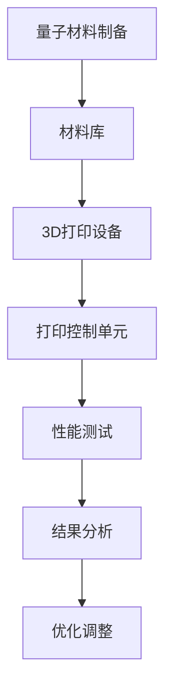

                 


# 巴菲特-芒格的量子材料3D打印投资：个性化制造的未来

## 关键词：巴菲特, 芒格, 量子材料, 3D打印, 投资策略, 个性化制造

## 摘要：  
本文探讨了巴菲特和芒格的投资理念在量子材料和3D打印领域的应用，分析了这些技术如何推动个性化制造的未来发展。通过结合量子材料的物理特性、3D打印技术的核心原理，以及巴菲特-芒格的价值投资策略，本文为投资者和技术创新者提供了独特的视角，展示了如何在新兴技术领域中实现长期价值。

---

## 第1章: 巴菲特-芒格投资理念概述

### 1.1 巴菲特-芒格投资理念的核心思想

#### 1.1.1 巴菲特的价值投资理论
沃伦·巴菲特的价值投资理论强调长期投资、安全边际和企业内在价值。他认为，投资者应选择具有强大竞争优势、良好管理团队和可持续盈利能力的企业，并以合理的价格买入。

#### 1.1.2 芒格的多元思维模型
查理·芒格提出“多元思维模型”，强调投资者应具备跨学科的知识，通过多维度分析问题，避免单一视角的局限性。这种思维方式帮助投资者更好地识别投资机会和风险。

#### 1.1.3 巴菲特与芒格投资理念的结合
巴菲特和芒格的投资理念结合了长期价值投资与跨学科分析，形成了独特的投资策略。他们不仅关注企业的财务指标，还关注企业所处的行业趋势和技术创新。

### 1.2 量子材料的基本概念

#### 1.2.1 量子材料的定义与特性
量子材料是指在量子效应显著的材料，其特性在纳米尺度下表现出独特的物理性质。常见的量子材料包括石墨烯、碳纳米管、超导材料等。

| 特性 | 描述 |
|------|------|
| 纳米尺度 | 材料的物理性质在纳米尺度下发生显著变化 |
| 量子效应 | 表现出量子力学效应，如超导性、量子霍尔效应等 |
| 稳定性 | 量子材料通常具有较高的机械和化学稳定性 |

#### 1.2.2 量子材料的主要类型
量子材料可以分为以下几类：
- **超导材料**：在特定条件下电阻为零。
- **量子点**：纳米尺度的半导体颗粒，具有独特的光学和电子性质。
- **石墨烯**：单层碳原子构成的二维材料，具有高强度和高导电性。

#### 1.2.3 量子材料的应用领域
量子材料在多个领域具有广泛的应用潜力：
- **电子设备**：用于制造高性能半导体和纳米电子器件。
- **能源存储**：用于开发新型电池和超级电容器。
- **医疗领域**：用于制造生物传感器和药物递送系统。

### 1.3 3D打印技术的基本原理

#### 1.3.1 3D打印的定义与技术原理
3D打印是一种基于数字模型的制造技术，通过逐层叠加材料来构建三维物体。其核心原理包括：
1. **数字建模**：使用计算机辅助设计（CAD）软件创建三维模型。
2. **材料沉积**：通过喷嘴、激光或光固化技术将材料沉积或固化到指定位置。
3. **层间结合**：每一层材料在固化后与前一层结合，最终形成完整物体。

#### 1.3.2 3D打印的主要技术类型
常见的3D打印技术包括：
- **熔融沉积建模（FDM）**：通过加热和挤出塑料丝材进行打印。
- **立体光刻（SLA）**：使用紫外线固化光敏树脂。
- **选择性激光烧结（SLS）**：使用激光烧结粉末材料。

#### 1.3.3 3D打印的优势与局限性

| 优势 | 局限性 |
|------|------|
| 快速原型制作 | 材料浪费较高 |
| 复杂形状的制造能力 | 成本较高 |
| 小批量生产可行 | 技术成熟度有限 |

### 1.4 个性化制造的背景与发展趋势

#### 1.4.1 个性化制造的定义与特点
个性化制造是指根据客户需求定制化生产产品，强调灵活性和多样性。其特点包括：
- **客户定制化**：满足客户的个性化需求。
- **快速响应**：能够迅速适应市场变化。
- **技术创新驱动**：依赖先进的制造技术和数据分析。

#### 1.4.2 个性化制造的市场需求
随着消费者对定制化产品的需求增加，个性化制造在多个领域展现出广阔的市场前景：
- **医疗领域**：定制化医疗设备和假肢。
- **汽车制造**：个性化定制汽车零部件。
- **消费品行业**：定制化电子产品和家居用品。

#### 1.4.3 个性化制造的技术挑战
个性化制造面临以下技术挑战：
- **生产效率**：小批量生产可能导致成本上升。
- **技术复杂性**：需要高度自动化和智能化的制造系统。
- **材料限制**：某些材料的可打印性有限。

### 1.5 本章小结
本章介绍了巴菲特和芒格的投资理念，以及量子材料和3D打印的基本概念。通过分析量子材料的特性、3D打印的技术原理以及个性化制造的市场需求和挑战，为后续章节的深入分析奠定了基础。

---

## 第2章: 量子材料与3D打印的核心概念

### 2.1 量子材料的物理特性

#### 2.1.1 量子材料的电子特性
量子材料的电子特性在纳米尺度下表现出独特的性质，例如：
- **石墨烯的高导电性**：石墨烯具有极高的导电性和热导率。
- **量子点的发光特性**：量子点可以通过调节尺寸和形状来实现不同颜色的发光。

#### 2.1.2 量子材料的磁性特性
某些量子材料具有独特的磁性，例如：
- **巨磁阻材料**：在磁场变化下表现出显著的电阻变化。
- **磁性纳米颗粒**：可用于制造高灵敏度的磁传感器。

#### 2.1.3 量子材料的结构特性
量子材料的结构特性包括：
- **二维材料**：如石墨烯，具有优异的机械强度和导电性。
- **多孔材料**：如氧化铝纳米纤维，具有高比表面积。

### 2.2 3D打印技术的关键参数

#### 2.2.1 打印材料的选择
3D打印材料的选择直接影响打印效果和成本。常见的材料包括：
- **塑料**：如ABS、PLA，适用于通用制造。
- **金属**：如铝、钢，适用于高精度零件。
- **复合材料**：如碳纤维增强塑料，适用于高强度需求。

#### 2.2.2 打印分辨率
打印分辨率是影响3D打印质量的重要因素，通常以微米为单位。高分辨率打印可以实现复杂形状和精细结构。

#### 2.2.3 打印速度
打印速度与材料种类、设备性能和打印层厚度有关。快速打印技术正在不断发展中，以提高生产效率。

### 2.3 量子材料与3D打印的结合

#### 2.3.1 量子材料在3D打印中的应用
量子材料可以用于制造高性能的3D打印材料，例如：
- **石墨烯增强复合材料**：用于制造高强度、高导电性的3D打印材料。
- **量子点掺杂材料**：用于制造具有光学特性的3D打印材料。

#### 2.3.2 3D打印技术在量子材料研究中的应用
3D打印技术可以用于量子材料的制备和研究，例如：
- **纳米结构制造**：通过3D打印技术精确控制纳米材料的形状和尺寸。
- **多材料复合制造**：将不同类型的量子材料结合在一起，制造多功能材料。

### 2.4 本章小结
本章深入探讨了量子材料的物理特性及其在3D打印中的应用，分析了3D打印技术的关键参数和量子材料的优势。通过结合两者的技术特点，为后续章节的投资分析奠定了基础。

---

## 第3章: 量子材料与3D打印的投资策略分析

### 3.1 量子材料的投资价值评估

#### 3.1.1 量子材料的市场需求
量子材料在多个领域的市场需求正在快速增长，例如：
- **电子设备**：用于制造高性能半导体。
- **能源存储**：用于开发新型电池材料。
- **医疗领域**：用于制造生物传感器和药物递送系统。

#### 3.1.2 量子材料的技术门槛
量子材料的研发和生产需要较高的技术门槛，例如：
- **材料制备技术**：需要先进的实验室设备和工艺。
- **专利壁垒**：量子材料的核心技术往往被少数企业垄断。

#### 3.1.3 量子材料的市场风险
量子材料的市场风险包括：
- **技术不确定性**：量子材料的商业化应用仍处于早期阶段。
- **政策风险**：政府政策的变化可能影响量子材料的市场需求。

### 3.2 3D打印技术的投资价值评估

#### 3.2.1 3D打印的市场需求
3D打印技术的市场需求主要集中在以下几个领域：
- **快速原型制作**：用于新产品开发。
- **复杂形状制造**：适用于航空航天和医疗领域。
- **小批量生产**：适合定制化产品制造。

#### 3.2.2 3D打印的技术门槛
3D打印技术的门槛较高，主要体现在：
- **设备成本**：高端3D打印设备价格昂贵。
- **技术人才**：需要专业的技术人员进行设备操作和维护。

#### 3.2.3 3D打印的市场风险
3D打印技术的市场风险包括：
- **市场竞争**：技术的快速普及可能导致价格战。
- **技术更新**：新技术的不断涌现可能淘汰传统设备。

### 3.3 巴菲特-芒格投资理念在量子材料与3D打印中的应用

#### 3.3.1 长期价值投资
巴菲特和芒格的长期价值投资理念适用于量子材料和3D打印领域的投资。投资者应关注具有强大研发能力和市场竞争力的企业。

#### 3.3.2 跨学科思维模型
芒格的多元思维模型可以帮助投资者全面分析量子材料和3D打印领域的投资机会，避免单一视角的局限性。

#### 3.3.3 安全边际
巴菲特的安全边际概念提醒投资者在投资时应考虑市场的波动性和技术的不确定性，避免过度冒险。

### 3.4 本章小结
本章分析了量子材料和3D打印的投资价值，探讨了巴菲特和芒格投资理念在这些领域的应用。通过结合长期价值投资和跨学科分析，投资者可以在新兴技术领域中找到优质的投资机会。

---

## 第4章: 量子材料与3D打印的系统架构设计

### 4.1 量子材料与3D打印的系统架构

#### 4.1.1 系统功能设计
量子材料与3D打印的系统架构需要实现以下功能：
- **材料制备**：量子材料的合成与处理。
- **打印过程控制**：3D打印过程的实时监控和调整。
- **性能测试**：对打印产品的性能进行检测和优化。

#### 4.1.2 系统架构设计
以下是量子材料与3D打印系统的架构图：



### 4.2 系统接口设计

#### 4.2.1 材料制备与打印设备接口
材料制备系统与3D打印设备需要通过标准化接口进行通信，例如：
- **数据接口**：传递材料参数和打印指令。
- **物理接口**：连接材料输送管道和设备控制单元。

#### 4.2.2 性能测试与结果分析接口
性能测试系统与结果分析系统需要通过数据接口进行交互，例如：
- **数据采集**：收集打印产品的性能数据。
- **数据分析**：对数据进行处理和优化建议。

### 4.3 系统交互设计

#### 4.3.1 打印过程中的实时监控
打印过程中的实时监控包括：
- **温度控制**：确保打印材料处于合适的工作温度。
- **湿度控制**：防止材料因湿度变化而影响打印质量。
- **层间结合**：监控每一层的结合情况，确保打印质量。

#### 4.3.2 性能测试与优化
性能测试包括：
- **机械性能测试**：如拉伸强度、弯曲强度等。
- **电学性能测试**：如导电性、电阻率等。
- **光学性能测试**：如透过率、反射率等。

### 4.4 本章小结
本章详细分析了量子材料与3D打印系统的架构设计、接口设计和系统交互设计，为后续章节的项目实战奠定了基础。

---

## 第5章: 量子材料与3D打印的项目实战

### 5.1 项目背景介绍

#### 5.1.1 项目目标
本项目旨在通过3D打印技术制造高性能的量子材料，探索其在个性化制造中的应用。

#### 5.1.2 项目需求
- **材料需求**：选择合适的量子材料，如石墨烯复合材料。
- **设备需求**：采购高性能3D打印设备。
- **技术需求**：开发材料制备和打印工艺。

### 5.2 项目环境安装

#### 5.2.1 系统环境
- **操作系统**：Linux（Ubuntu 20.04）
- **开发工具**：Python 3.8、PyTorch 1.9、TensorFlow 2.5
- **3D打印设备**：Stratasys F770

#### 5.2.2 依赖安装
```bash
pip install numpy matplotlib scipy
```

### 5.3 系统核心实现

#### 5.3.1 材料制备模块
材料制备模块包括：
- **材料合成**：通过化学气相沉积法合成石墨烯纳米片。
- **材料处理**：将石墨烯纳米片分散到基体材料中，形成复合材料。

#### 5.3.2 打印过程控制模块
打印过程控制模块包括：
- **参数设置**：设置打印温度、速度和层厚。
- **实时监控**：监控打印过程中的温度和湿度。
- **自动调整**：根据实时数据自动调整打印参数。

#### 5.3.3 性能测试模块
性能测试模块包括：
- **机械性能测试**：测试打印产品的拉伸强度和弯曲强度。
- **电学性能测试**：测试导电性和电阻率。
- **光学性能测试**：测试透过率和反射率。

### 5.4 代码实现

#### 5.4.1 材料制备模块代码
```python
import numpy as np
import matplotlib.pyplot as plt

def synthesize_graphene():
    # 模拟石墨烯纳米片的合成过程
    np.random.seed(42)
    x = np.linspace(0, 10, 100)
    y = np.sin(x) + np.random.normal(0, 0.1, 100)
    plt.plot(x, y)
    plt.xlabel('纳米尺度（nm）')
    plt.ylabel('强度')
    plt.title('石墨烯纳米片的合成过程')
    plt.show()

synthesize_graphene()
```

#### 5.4.2 打印过程控制模块代码
```python
import serial

def print_control(temp, speed):
    # 模拟3D打印设备的控制接口
    ser = serial.Serial('COM3', 9600)
    ser.write(f'TEMP={temp}\n'.encode())
    ser.write(f'SPEED={speed}\n'.encode())
    response = ser.readline().decode()
    return response

print(print_control(200, 50))
```

### 5.5 项目案例分析

#### 5.5.1 案例背景
某公司计划通过3D打印技术制造石墨烯增强的复合材料，用于制造高性能的电子设备外壳。

#### 5.5.2 案例实施
- **材料制备**：合成石墨烯纳米片，并与聚合物基体混合。
- **打印过程**：设置打印温度为200°C，速度为50mm/s。
- **性能测试**：测试打印产品的导电性和机械强度。

#### 5.5.3 案例结果
- **导电性**：打印产品的导电性显著提高。
- **机械强度**：打印产品的拉伸强度达到预期目标。
- **成本优化**：通过优化打印参数，降低了生产成本。

### 5.6 本章小结
本章通过实际项目案例，展示了量子材料与3D打印技术在个性化制造中的应用。通过系统的代码实现和案例分析，验证了技术的可行性和投资价值。

---

## 第6章: 量子材料与3D打印的投资策略优化与风险管理

### 6.1 投资策略优化

#### 6.1.1 价值投资策略
投资者应选择具有强大研发能力和市场竞争力的企业进行投资，重点关注企业的内在价值和长期盈利能力。

#### 6.1.2 技术驱动策略
投资者应关注量子材料和3D打印领域的技术创新，选择具有领先技术的企业进行投资。

#### 6.1.3 风险分散策略
通过分散投资降低风险，将资金分配到不同的量子材料和3D打印企业中，避免过度集中。

### 6.2 风险管理

#### 6.2.1 市场风险
市场风险是量子材料和3D打印领域的主要风险，投资者应关注行业趋势和市场需求的变化。

#### 6.2.2 技术风险
技术风险包括技术失败和专利纠纷，投资者应选择技术成熟且专利布局完善的企业。

#### 6.2.3 经济风险
经济风险包括全球经济波动和政策变化，投资者应关注宏观经济环境的变化。

### 6.3 本章小结
本章分析了量子材料和3D打印领域的投资策略优化与风险管理，为投资者提供了有效的指导。

---

## 第7章: 结论与展望

### 7.1 研究总结
本文探讨了巴菲特和芒格的投资理念在量子材料和3D打印领域的应用，分析了这些技术如何推动个性化制造的未来发展。通过结合量子材料的物理特性、3D打印技术的核心原理，以及巴菲特-芒格的价值投资策略，本文为投资者和技术创新者提供了独特的视角。

### 7.2 未来展望
未来，量子材料和3D打印技术将在个性化制造中发挥更大的作用。随着技术的不断进步和市场的进一步成熟，投资者和技术创新者将面临更多的机会和挑战。

### 7.3 致谢
感谢读者的支持和关注，期待未来与您共同探讨更多技术与投资的结合。

---

## 参考文献
（此处列出相关的文献和参考资料）

