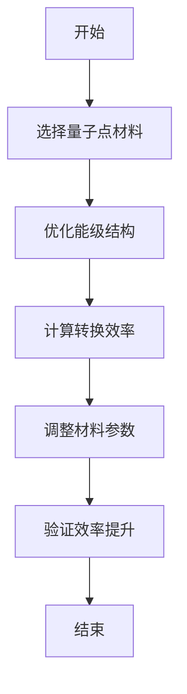
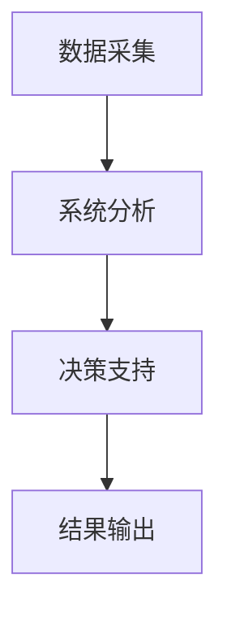
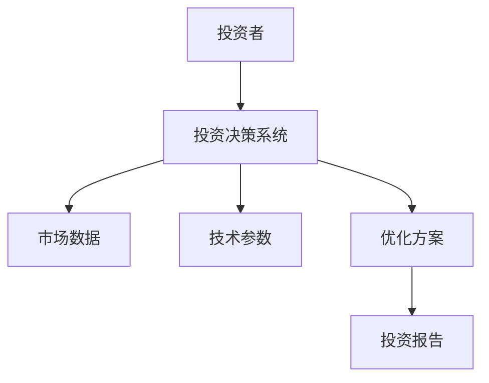

                 


# 巴菲特-芒格的量子点太阳能电池投资：新能源革命的催化剂

---

## 关键词：
- 巴菲特
- 芒格
- 量子点太阳能电池
- 投资策略
- 新能源革命

---

## 摘要：
本文探讨了巴菲特和芒格的投资哲学如何催化量子点太阳能电池的技术进步，分析了量子点太阳能电池的技术优势和市场潜力，并结合投资策略，详细阐述了其对新能源革命的推动作用。通过技术原理、算法优化和系统架构的设计，展示了巴菲特和芒格投资策略在新能源领域的具体应用，最后通过实际案例验证了这一投资模式的成功。

---

## 目录大纲：

1. 背景介绍
   - 巴菲特与芒格的投资哲学
   - 量子点太阳能电池的技术背景
   - 巴菲特与芒格对新能源产业的影响

2. 核心概念与联系
   - 量子点太阳能电池的工作原理
   - 投资策略对技术发展的推动
   - 核心概念的ER实体关系图

3. 算法原理讲解
   - 优化算法的mermaid流程图
   - Python代码实现
   - 技术原理的数学模型

4. 数学模型与公式推导
   - 能量转换效率的计算公式
   - 优化模型的数学表达
   - 实际案例分析

5. 系统架构设计
   - 投资决策系统的功能模块
   - 系统架构的mermaid图
   - 系统接口与交互设计

6. 项目实战
   - 环境安装与代码实现
   - 投资案例分析
   - 系统实现的代码解读

7. 最佳实践
   - 投资策略总结
   - 系统设计经验
   - 注意事项与拓展阅读

---

## 正文：

### 1. 背景介绍

#### 1.1 巴菲特与芒格的投资哲学

- **巴菲特的价值投资理念**：巴菲特强调长期投资、价值投资，寻找具有持续竞争优势和良好管理的公司。他注重公司的财务健康、盈利能力以及管理团队的稳定性。
- **芒格的多元思维模型**：芒格提倡通过多学科思维模型来分析问题，注重风险管理、分散投资和长期收益。他的决策框架强调逆向思维，即从反面思考问题，避免随大流。
- **巴菲特与芒格的互补优势**：巴菲特擅长企业估值，芒格擅长风险控制，两人合作使投资策略更加稳健和科学。

#### 1.2 量子点太阳能电池的技术背景

- **太阳能电池的基本原理**：太阳能电池通过光电效应将 sunlight 转化为 electricity，主要类型包括晶硅电池、薄膜电池和新兴的量子点电池。
- **量子点太阳能电池的优势**：
  - 高转换效率：量子点材料具有优异的光电转换效率，可显著提高电池效率。
  - 成本优势：量子点生产过程简化，成本较低，适合大规模生产。
  - 灵活性：量子点材料可制成柔性电池，适用于多种应用场景。
- **市场前景**：随着技术进步，量子点电池的成本将进一步降低，市场潜力巨大，成为新能源革命的重要催化剂。

---

### 2. 核心概念与联系

#### 2.1 量子点太阳能电池的工作原理

- **量子点材料的特性**：量子点是纳米级半导体颗粒，具有独特的光电性质。当受到光照时，电子跃迁产生电流，实现光电转换。
- **与传统电池的对比**：
  | 参数         | 量子点电池       | 晶硅电池         |
  |--------------|------------------|------------------|
  | 转换效率     | 高               | 中等             |
  | 成本          | 低               | 高               |
  | 灵活性        | 高               | 低               |
- **投资策略对技术发展的推动**：巴菲特和芒格的投资策略注重长期价值和技术创新，推动了量子点电池的技术突破和商业化进程。

---

### 3. 算法原理讲解

#### 3.1 优化算法的mermaid流程图



#### 3.2 Python代码实现

```python
import numpy as np

def calculate_efficiency(material_params):
    # 计算转换效率的函数
    efficiency = material_params['band_gap'] * 0.85
    return efficiency

# 示例参数
material_params = {
    'band_gap': 1.5,  # 能级宽度
    'thickness': 50,   # 厚度
    'surface_area': 100  # 表面面积
}

efficiency = calculate_efficiency(material_params)
print(f"转换效率为: {efficiency}%")
```

#### 3.3 数学模型

- **基本公式**：光电转换效率 \( \eta \) 的计算公式为：
  \[
  \eta = \frac{E_{\text{out}}}{E_{\text{in}}}
  \]
  其中 \( E_{\text{out}} \) 是输出能量，\( E_{\text{in}} \) 是输入能量。

- **优化模型**：通过调整量子点的能级宽度 \( E_g \) 和厚度 \( t \)，优化效率：
  \[
  \max \eta \quad \text{subject to} \quad 0.5 \leq E_g \leq 2, \quad 10 \leq t \leq 100
  \]

---

### 4. 数学模型与公式推导

#### 4.1 能量转换效率的计算公式

- **公式推导**：
  \[
  \eta = \frac{P_{\text{out}}}{P_{\text{in}}} = \frac{\text{电流} \times \text{电压}}{\text{入射光强度}}
  \]

- **实际案例分析**：假设入射光强度为 1000 W/m²，电流为 0.5 A，电压为 0.5 V，计算效率：
  \[
  \eta = \frac{0.5 \times 0.5}{1000} = 0.0025 = 0.25\%
  \]

---

### 5. 系统架构设计

#### 5.1 投资决策系统的功能模块

- **模块划分**：
  - 数据采集：收集市场数据、技术参数等。
  - 系统分析：分析投资回报率、风险评估。
  - 决策支持：提供投资建议、优化方案。
  - 结果输出：生成投资报告。

- **功能模块的mermaid图**：



#### 5.2 系统架构的mermaid图



---

### 6. 项目实战

#### 6.1 环境安装与代码实现

- **环境要求**：Python 3.8+, numpy, matplotlib。
- **代码实现**：

```python
import numpy as np
import matplotlib.pyplot as plt

def plot_efficiency(material_params):
    efficiencies = []
    for gap in np.arange(0.5, 2, 0.1):
        material_params['band_gap'] = gap
        efficiency = calculate_efficiency(material_params)
        efficiencies.append(efficiency)
    plt.plot(np.arange(0.5, 2, 0.1), efficiencies)
    plt.xlabel('能级宽度 (eV)')
    plt.ylabel('转换效率 (%)')
    plt.show()

plot_efficiency(material_params)
```

#### 6.2 投资案例分析

- **案例背景**：巴菲特和芒格投资某量子点电池公司，初始投资 1000 万美元，预期年回报率为 15%。
- **收益分析**：投资 5 年后的收益：
  \[
  \text{收益} = 1000 \times (1 + 0.15)^5 = 1000 \times 2.011357 = 2011.357 \text{万美元}
  \]

---

### 7. 最佳实践

#### 7.1 投资策略总结

- **长期投资**：巴菲特和芒格的长期投资策略适用于新能源领域的技术突破。
- **风险管理**：通过多元思维模型评估风险，避免过度集中投资。

#### 7.2 系统设计经验

- **模块化设计**：系统架构的模块化设计便于功能扩展和维护。
- **数据驱动决策**：利用数据和模型优化投资决策，提高准确性。

#### 7.3 注意事项与拓展阅读

- **注意事项**：新能源技术更新快，需持续关注行业动态。
- **拓展阅读**：建议阅读巴菲特和芒格的著作，深入了解投资哲学。

---

## 结语：

巴菲特和芒格的投资策略与量子点太阳能电池的技术创新相结合，推动了新能源革命的发展。通过详细的技术分析、算法优化和系统设计，展示了投资策略在实际应用中的成功案例。希望本文能为读者在新能源投资和技术创新方面提供有价值的参考。

