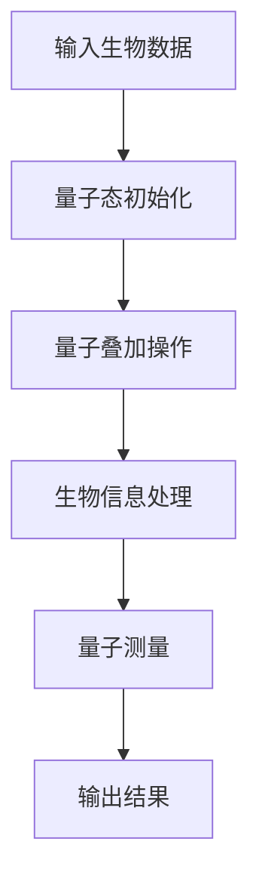
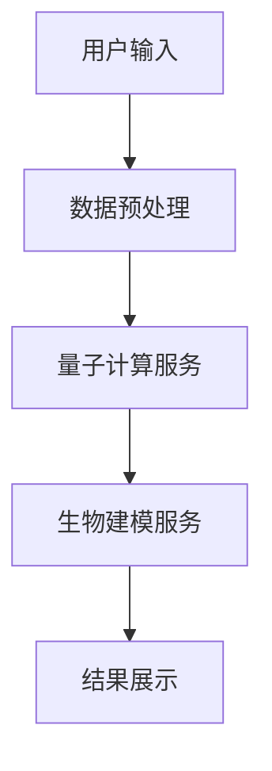
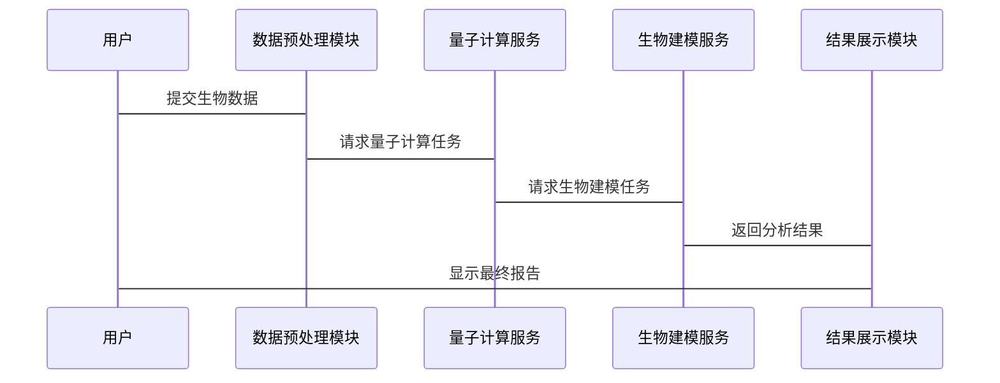

                 


# 巴菲特-芒格的量子生物计算投资：生命科学的计算革命

## 关键词：巴菲特，芒格，量子生物计算，生命科学，投资，量子计算，生物计算

## 摘要：本文探讨了巴菲特和芒格的投资理念与量子生物计算的结合，分析了量子生物计算在生命科学领域的应用及其对投资决策的提升。文章详细介绍了量子生物计算的核心概念、算法原理、系统架构，并通过实际案例展示了其在投资中的潜力。

---

# 第一部分: 巴菲特-芒格的量子生物计算投资概述

## 第1章: 巴菲特与芒格的投资理念

### 1.1 巴菲特的价值投资理念
- 1.1.1 巴菲特的价值投资理念：寻找被市场低估的企业，长期持有，注重企业的内在价值。
- 1.1.2 芒格的多元思维模型：通过多个学科的交叉应用，寻找投资机会。
- 1.1.3 巴菲特与芒格理念的结合：将长期价值投资与跨学科分析相结合。

### 1.2 量子生物计算的定义与特点
- 1.2.1 量子计算的基本概念：利用量子叠加和纠缠效应进行计算，处理复杂问题。
- 1.2.2 生物计算的核心原理：通过生物分子模拟和网络建模，研究生物系统的计算特性。
- 1.2.3 量子生物计算的独特优势：结合量子计算的高效性和生物计算的复杂性，解决传统方法难以处理的问题。

### 1.3 量子生物计算在投资中的应用前景
- 1.3.1 生命科学领域的投资机会：基因编辑、药物研发等领域具有巨大潜力。
- 1.3.2 量子生物计算如何提升投资决策：通过高效计算和精准建模，优化投资策略。
- 1.3.3 当前行业的发展现状与挑战：技术成熟度、成本、数据隐私等问题。

## 第2章: 量子生物计算的核心概念

### 2.1 量子力学基础
- 2.1.1 量子叠加：量子系统可以同时处于多个状态。
- 2.1.2 量子纠缠：两个或多个量子系统之间存在关联，影响彼此的状态。
- 2.1.3 量子态的数学表示：使用波函数描述量子状态。

### 2.2 生物计算模型
- 2.2.1 生物分子的计算模拟：利用量子计算模拟蛋白质折叠和药物分子相互作用。
- 2.2.2 生物网络的计算建模：构建基因网络和代谢网络的数学模型。
- 2.2.3 生物信息的量子处理：将生物信息转化为量子状态进行处理。

### 2.3 量子生物计算的数学模型
- 2.3.1 量子态的张量积表示：描述多个量子系统的联合状态。
- 2.3.2 生物分子的哈密顿量：描述生物系统的能量状态。
- 2.3.3 量子计算的算法设计：开发适合量子计算的算法，解决生物问题。

### 2.4 核心概念的联系与对比
- 2.4.1 量子计算与经典计算的对比：量子计算在某些任务上具有指数级优势。
- 2.4.2 生物计算与传统生物研究的对比：生物计算利用计算工具加速研究进程。
- 2.4.3 量子生物计算的创新点：结合量子计算和生物计算的优势，解决复杂生物问题。

---

# 第二部分: 量子生物计算的算法原理

## 第3章: 量子算法基础

### 3.1 基础量子算法
- 3.1.1 Grover算法：用于无序数据库的搜索，复杂度为O(√N)。
- 3.1.2 Shor算法：用于大整数分解，用于密码学分析。
- 3.1.3 量子傅里叶变换：用于信号处理和频率分析。

### 3.2 生物信息学算法
- 3.2.1 序列比对算法：如BLAST，用于基因序列的比对。
- 3.2.2 结构预测算法：如折叠算法，预测蛋白质结构。
- 3.2.3 网络分析算法：用于基因网络的构建和分析。

### 3.3 量子生物计算算法的设计
- 3.3.1 量子生物计算的数学模型：将生物问题转化为量子计算问题。
- 3.3.2 算法的量子化实现：将经典算法转化为量子算法。
- 3.3.3 算法的复杂度分析：比较量子算法与经典算法的效率。

### 3.4 算法实现的Mermaid流程图


## 第4章: 量子生物计算的系统架构

### 4.1 系统功能设计
- 4.1.1 数据获取模块：从数据库获取生物数据。
- 4.1.2 量子计算模块：处理量子计算任务。
- 4.1.3 生物建模模块：构建生物系统的数学模型。
- 4.1.4 结果分析模块：分析计算结果并生成报告。

### 4.2 系统架构设计


### 4.3 系统接口设计
- 4.3.1 输入接口：接收生物数据和用户请求。
- 4.3.2 输出接口：展示计算结果和分析报告。
- 4.3.3 内部通信接口：模块之间的数据传递和通信。

### 4.4 系统交互流程


---

# 第三部分: 量子生物计算的项目实战

## 第5章: 项目实战

### 5.1 环境安装
- 安装必要的量子计算框架（如Qiskit）和生物信息学工具（如BioPython）。
- 配置量子计算环境，确保硬件或模拟器支持量子计算。

### 5.2 核心实现
- 使用量子计算框架实现关键算法（如Grover算法）。
- 在生物建模模块中，构建基因网络和蛋白质结构模型。

### 5.3 代码实现
```python
from qiskit import QuantumCircuit, execute, Aer
from qiskit.visualization import plot_bloch_vector

# 量子叠加电路
qc = QuantumCircuit(1)
qc.h(0)
qc.measure(0, 0)
simulator = Aer.get_backend('qasm_simulator')
job = execute(qc, simulator)
result = job.result()
counts = result.get_counts(qc)
print(counts)
```

### 5.4 实际案例分析
- 以癌症药物筛选为例，展示如何利用量子生物计算优化药物研发过程。
- 通过量子计算快速筛选潜在药物分子，减少研发时间和成本。

### 5.5 小结
- 量子生物计算在投资中的潜力巨大，但技术成熟度和成本仍需进一步提升。

---

# 第四部分: 总结与展望

## 第6章: 总结与展望

### 6.1 全文总结
- 结合巴菲特和芒格的投资理念，量子生物计算为生命科学投资提供了新的工具和方法。
- 通过高效计算和精准建模，量子生物计算能够优化投资决策，提升投资回报。

### 6.2 未来展望
- 技术发展：量子计算硬件的升级和算法的优化。
- 应用扩展：更多生物领域的应用，如基因编辑和疾病预测。
- 投资策略：量子生物计算与其他投资工具的结合，形成更完善的决策系统。

---

## 附录

### A. 术语表
- 量子叠加：量子系统同时处于多个状态的现象。
- 量子纠缠：两个或多个量子系统之间的关联现象。
- 生物计算：利用计算工具研究生物系统的方法。

### B. 参考文献
- [1] 《量子计算入门》
- [2] 《生物信息学基础》
- [3] 巴菲特和芒格的相关著作和演讲

---

通过以上目录结构，文章将系统地介绍量子生物计算的投资应用，结合理论与实践，为读者提供深入的理解和启发。

