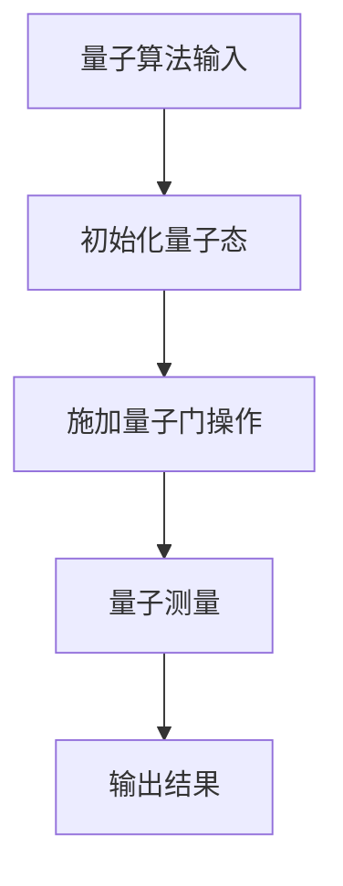
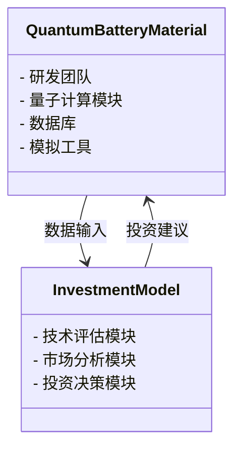
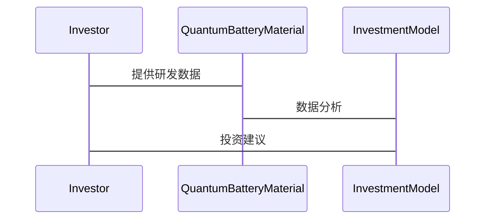

                 


# 巴菲特-芒格的量子电池材料研发投资：能源革命的关键突破

---

## 关键词：
量子电池材料、巴菲特、芒格、能源革命、投资策略、技术突破

---

## 摘要：
本文探讨了巴菲特和芒格在量子电池材料研发领域的投资策略，分析了量子电池材料的技术原理及其在能源革命中的潜力。文章从背景介绍、核心概念、算法原理、系统架构、项目实战等多维度展开，结合实际案例，揭示了巴菲特和芒格的投资逻辑，并展望了量子电池材料对能源行业的深远影响。

---

## 第一部分：背景介绍

### 第1章：能源危机与量子电池材料的崛起

#### 1.1 当前能源危机的现状
能源危机是全球性问题，传统能源的不可再生性和环境问题促使人类寻找新的能源解决方案。电池技术作为清洁能源存储的核心，成为解决能源危机的关键。

#### 1.2 传统电池技术的局限性
传统锂离子电池存在能量密度低、循环寿命短、安全性差等问题，难以满足新能源汽车、可再生能源存储等领域的高性能需求。

#### 1.3 量子电池材料的潜在优势
量子电池材料利用量子效应提升能量存储和转换效率，具有更高的能量密度、更长的循环寿命和更好的安全性。其研发被认为是能源革命的关键技术突破。

---

### 第2章：量子电池材料的基本概念

#### 2.1 量子材料的定义与分类
量子材料是指在量子效应主导下表现出特殊物理性质的材料，包括量子限域材料、量子阱材料、量子点材料等。

#### 2.2 量子效应在电池中的应用
量子效应可以显著提升电池的充放电性能，例如通过量子限域效应提高能量密度，通过量子隧穿效应提升充放电速度。

#### 2.3 量子电池材料的性能特点
- 高能量密度
- 长循环寿命
- 高安全性
- 快速充放电能力

---

## 第二部分：核心概念与联系

### 第3章：量子电池材料的科学基础

#### 3.1 量子力学基础
量子力学是量子电池材料研发的理论基础。关键概念包括：
- 量子叠加：$|\psi\rangle = \alpha|0\rangle + \beta|1\rangle$，其中$\alpha^2 + \beta^2 = 1$。
- 量子纠缠：两个或多个粒子之间形成强关联，改变其中一个粒子的状态会立即影响另一个粒子的状态。

#### 3.2 量子计算在材料模拟中的应用
通过量子计算模拟电池材料的电子结构，可以更高效地优化材料性能。例如，利用量子算法计算材料的能带结构和电子跃迁过程。

#### 3.3 量子效应与电池性能的关系
通过量子效应优化电池材料的电子结构，可以显著提升电池的能量密度和充放电效率。

---

### 第4章：巴菲特与芒格的投资逻辑

#### 4.1 巴菲特的价值投资理念
巴菲特强调投资具有持续竞争优势的企业，注重企业的基本面和长期价值。他将这一理念扩展到量子电池材料领域，关注技术领先性和市场需求。

#### 4.2 芒格的多元思维模型
芒格强调通过跨学科思维解决复杂问题。他将物理学、化学、经济学等领域的知识结合起来，评估量子电池材料的投资潜力。

#### 4.3 投资决策的关键要素
- 技术可行性：量子电池材料的性能是否能够突破现有技术瓶颈。
- 市场需求：清洁能源市场是否具备足够的规模和增长潜力。
- 团队能力：研发团队的技术实力和执行力。

---

## 第三部分：算法原理与技术实现

### 第5章：量子电池材料的算法模拟

#### 5.1 量子计算在材料模拟中的应用
通过量子计算模拟电池材料的电子结构，可以更精确地优化材料性能。例如，利用量子算法计算材料的能带结构和电子跃迁过程。

#### 5.2 量子算法的流程图


#### 5.3 Python代码实现
```python
import numpy as np
from qiskit import QuantumCircuit, Aer, execute

# 定义量子电路
qc = QuantumCircuit(2, 2)
qc.h(0)
qc.cx(0, 1)
qc.measure(0, 0)
qc.measure(1, 1)

# 模拟器执行
backend = Aer.get_backend('qasm_simulator')
job = execute(qc, backend)
result = job.result()

# 解释结果
print("结果分布：", result.get_counts())
```

---

### 第6章：系统架构与实现

#### 6.1 系统功能设计


#### 6.2 系统接口设计
- 输入接口：接受电池材料的量子态数据和市场数据。
- 输出接口：提供投资建议和优化方案。

#### 6.3 交互流程图


---

## 第四部分：项目实战与案例分析

### 第7章：量子电池材料研发的项目实战

#### 7.1 项目环境与工具安装
- 开发环境：Python 3.8+
- 工具包：qiskit、numpy、scipy
- 数据库：MongoDB

#### 7.2 核心代码实现
```python
def simulate_quantum_material(material_data):
    # 初始化量子电路
    qc = QuantumCircuit(len(material_data))
    qc.h(range(len(material_data)))  # 应用H门
    qc.cx(range(len(material_data)-1), range(1, len(material_data)))  # 应用CNOT门
    qc.measure_all()
    return qc

# 执行模拟
qc = simulate_quantum_material(material_data)
result = execute(qc, backend).result()
print("模拟结果：", result.get_counts())
```

#### 7.3 项目小结
通过量子计算模拟电池材料的性能，可以更高效地优化材料设计，显著缩短研发周期。

---

## 第五部分：总结与展望

### 第8章：量子电池材料投资的未来展望

#### 8.1 投资要点总结
- 关注量子电池材料的技术突破。
- 评估市场需求和政策支持。
- 选择具有强大研发能力的企业。

#### 8.2 注意事项
- 量子电池材料的研发周期较长，存在技术失败风险。
- 市场竞争可能加剧，需关注技术壁垒。

#### 8.3 未来趋势
随着量子计算技术的进步，量子电池材料的研发将加速，能源革命将迎来更多突破。

---

## 结语
巴菲特和芒格的投资策略为量子电池材料的研发提供了重要支持，而量子电池材料的突破也将推动能源革命的进一步发展。技术与投资的结合，将为人类可持续发展提供新的动力。

---

