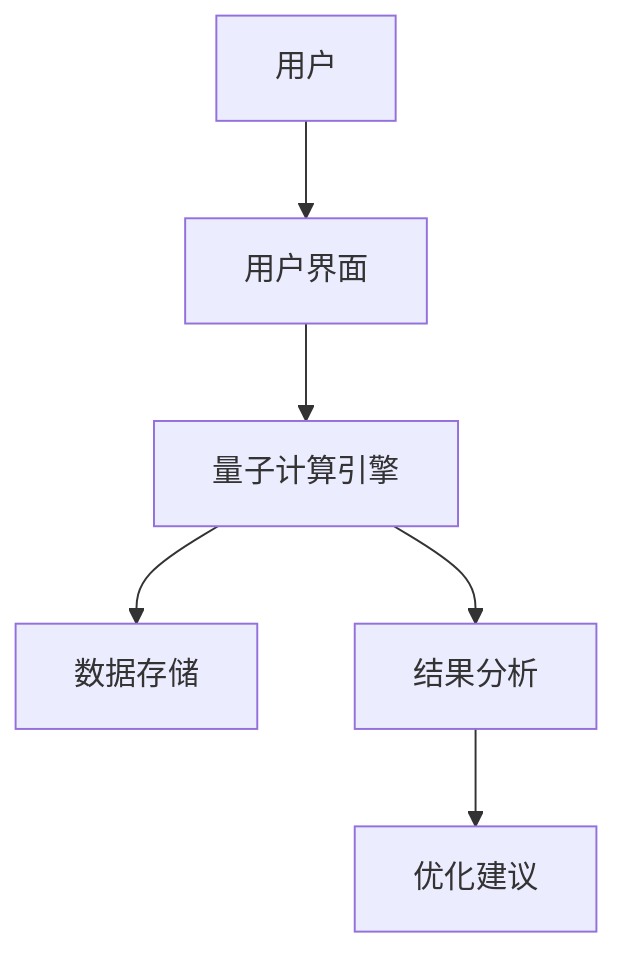
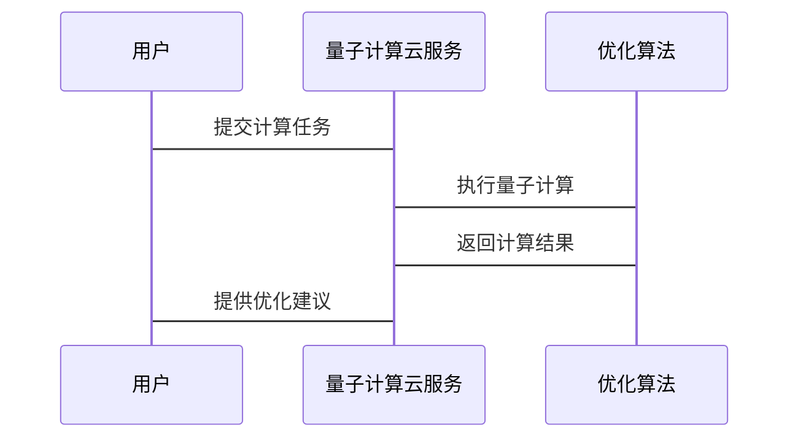

                 


# 巴菲特-芒格的量子计算云服务投资：计算能力民主化的新纪元

> 关键词：量子计算云服务，巴菲特，芒格，投资策略，计算能力民主化

> 摘要：本文探讨了巴菲特和芒格如何通过量子计算云服务进行投资，并分析了这种技术如何推动计算能力的民主化。文章从量子计算的基本概念、投资价值、应用场景、系统架构设计、项目实战等方面展开，结合具体案例，详细阐述了量子计算云服务在投资中的应用及其对社会的影响。

---

## 第一章: 量子计算云服务的背景与概念

### 1.1 量子计算的基本概念

#### 1.1.1 量子计算的定义与基本原理

量子计算是一种基于量子力学原理的计算方式，利用量子叠加和量子纠缠等特性进行信息处理。与经典计算机使用二进制位不同，量子计算机使用量子位（qubit），能够在同一时间处理大量可能性。

**量子叠加**：量子位可以同时处于0和1的状态，这种特性使得量子计算机能够并行处理多个计算路径。

**量子纠缠**：两个或多个量子位之间可以形成纠缠状态，一个量子位的状态会立即影响另一个量子位的状态，无论它们相隔多远。

#### 1.1.2 量子计算与经典计算的区别

| 特性 | 经典计算 | 量子计算 |
|------|----------|-----------|
| 基础 | 二进制 | 量子位 |
| 并行性 | 串行处理 | 并行处理 |
| 处理能力 | 善于处理确定性问题 | 善于处理复杂优化问题 |

#### 1.1.3 量子计算的优势与局限性

**优势**：
- 处理复杂问题时速度远超经典计算机，如因式分解、优化问题等。
- 在密码学、材料科学等领域具有潜在突破性应用。

**局限性**：
- 量子计算机目前仍处于早期阶段，仅在特定问题上表现优异。
- 量子位易受干扰，稳定性较差。

### 1.2 量子计算云服务的定义与特点

#### 1.2.1 量子计算云服务的定义

量子计算云服务是通过云计算平台提供量子计算机的计算能力，用户可以通过互联网访问量子计算机，无需拥有实体设备。

#### 1.2.2 量子计算云服务的核心特征

- **按需使用**：用户可以根据需求灵活调整计算资源。
- **远程访问**：通过网络接口与量子计算机交互。
- **资源池化**：多个用户共享量子计算资源。

#### 1.2.3 量子计算云服务的应用场景

- **金融投资**：用于股票分析、风险评估、资产优化。
- **物流优化**：解决运输路径优化问题。
- **药物研发**：加速分子结构分析。

### 1.3 计算能力民主化的概念

#### 1.3.1 计算能力民主化的定义

计算能力民主化是指通过技术手段，使所有人都能平等地访问和使用强大的计算资源，打破传统计算能力的垄断。

#### 1.3.2 计算能力民主化的历史背景

- 20世纪末：个人计算机的普及使计算能力从大型机构走向个人。
- 21世纪初：云计算的兴起进一步推动了计算能力的民主化。

#### 1.3.3 计算能力民主化对社会的影响

- **缩小数字鸿沟**：让更多人能够接触到先进的计算资源。
- **促进创新**：个人和小企业也能利用强大的计算能力进行创新。

### 1.4 巴菲特与芒格的投资理念

#### 1.4.1 巴菲特的价值投资理论

巴菲特的价值投资理论强调以低于内在价值的价格买入优质资产，长期持有，等待价值回归。

#### 1.4.2 芒格的多元思维模型

芒格提倡通过多个学科的交叉应用来解决复杂问题，强调理性思维和独立思考。

#### 1.4.3 巴菲特与芒格投资理念的结合

- **长期投资**：巴菲特长期持有优质资产的理念。
- **跨学科思维**：芒格的多元思维模型在投资决策中的应用。

---

## 第二章: 量子计算云服务的投资价值

### 2.1 量子计算云服务的市场现状

#### 2.1.1 全球量子计算市场的发展现状

- **市场增长迅速**：量子计算市场年复合增长率预计超过50%。
- **主要参与者**：IBM、谷歌、微软等科技巨头。

#### 2.1.2 量子计算云服务的主要供应商

| 公司 | 主要服务 |
|------|----------|
| IBM | IBM Q |
| 谷歌 | Google Quantum |
| 微软 | Microsoft Quantum |

#### 2.1.3 量子计算云服务的市场规模预测

- 到2030年，量子计算云服务市场规模预计将达到数百亿美元。

### 2.2 量子计算云服务的投资机会

#### 2.2.1 量子计算在金融领域的应用

- **股票分析**：利用量子算法快速分析市场数据。
- **风险管理**：优化风险模型，降低投资风险。

#### 2.2.2 量子计算在优化问题中的应用

- **资产配置**：通过量子优化算法找到最优资产组合。
- **物流优化**：降低运输成本。

#### 2.2.3 量子计算在密码学中的应用

- **加密算法**：量子计算机能够破解现有的加密算法，推动新的加密技术的发展。

### 2.3 巴菲特与芒格的投资策略

#### 2.3.1 巴菲特的长期投资策略

- **长期持有**：巴菲特长期持有优质资产，等待价值增长。

#### 2.3.2 芒格的跨学科思维在投资中的应用

- **多角度分析**：芒格通过多个学科的交叉应用，寻找投资机会。

#### 2.3.3 巴菲特与芒格投资策略的结合

- **价值投资与量子计算**：巴菲特长期持有的理念与量子计算云服务的投资机会相结合。

---

## 第三章: 量子计算云服务的投资应用

### 3.1 量子计算在金融投资中的应用

#### 3.1.1 量子计算在股票分析中的应用

- **市场预测**：利用量子算法预测股票价格走势。

#### 3.1.2 量子计算在风险管理中的应用

- **风险模型优化**：通过量子优化算法构建更精确的风险模型。

#### 3.1.3 量子计算在资产配置中的应用

- **投资组合优化**：利用量子计算找到最优的资产配置方案。

### 3.2 量子计算云服务的投资优化算法

#### 3.2.1 量子计算优化算法的基本原理

- **量子叠加**：同时考虑多个可能性，找到最优解。

#### 3.2.2 量子计算优化算法的实现步骤

1. **问题建模**：将投资问题转化为数学模型。
2. **量子算法设计**：设计量子算法求解问题。
3. **结果分析**：分析量子算法的结果，优化投资策略。

#### 3.2.3 量子计算优化算法的数学模型

量子优化算法的目标是最小化或最大化一个函数，通常表示为：

$$ \min_{x} f(x) $$

其中，$x$ 是量子位的状态，$f(x)$ 是目标函数。

### 3.3 量子计算在投资组合管理中的应用

#### 3.3.1 投资组合优化的定义与目标

- **定义**：在给定风险和收益的情况下，找到最优的资产组合。
- **目标**：最大化收益，最小化风险。

#### 3.3.2 量子计算在投资组合优化中的优势

- **计算速度**：量子计算机能够快速处理大量数据，找到最优解。

#### 3.3.3 量子计算在投资组合优化中的具体实现

1. **问题建模**：将投资组合优化问题转化为数学模型。
2. **量子算法设计**：设计量子算法求解优化问题。
3. **结果分析**：分析量子算法的结果，优化投资组合。

---

## 第四章: 量子计算云服务的系统架构设计

### 4.1 量子计算云服务的系统架构

#### 4.1.1 系统功能设计

- **用户界面**：提供用户友好的操作界面。
- **量子计算引擎**：执行量子计算任务。
- **数据存储**：存储用户数据和计算结果。

#### 4.1.2 系统架构图



#### 4.1.3 系统接口设计

- **API接口**：提供RESTful API，方便用户调用量子计算服务。
- **安全接口**：保证数据传输的安全性。

#### 4.1.4 系统交互流程



---

## 第五章: 量子计算云服务的项目实战

### 5.1 环境搭建

#### 5.1.1 量子计算云服务的安装

- **选择云服务提供商**：如IBM Q、Google Quantum等。
- **注册并登录**：创建账户，获取API密钥。

#### 5.1.2 开发环境配置

- **安装必要的工具**：如Qiskit（量子计算工具包）。
- **配置环境变量**：设置API密钥和相关路径。

### 5.2 核心代码实现

#### 5.2.1 量子计算优化算法的实现

```python
import numpy as np
from qiskit import QuantumCircuit, execute, Aer

def quantum_optimization(n_qubits):
    circuit = QuantumCircuit(n_qubits)
    # 添加量子门操作
    circuit.h(range(n_qubits))
    circuit.cx(0, 1)
    circuit.cx(1, 2)
    circuit.cx(2, 3)
    circuit.measure_all()
    return circuit

# 执行量子计算
simulator = Aer.get_backend('qasm_simulator')
result = execute(quantum_optimization(4), simulator).result()
print(result.get_counts())
```

#### 5.2.2 优化算法的具体实现

```python
def portfolio_optimization(risk_matrix, return_vector):
    n = len(risk_matrix)
    circuit = QuantumCircuit(n)
    # 添加量子门操作
    circuit.h(range(n))
    circuit.cx(0, 1)
    circuit.cx(1, 2)
    circuit.cx(2, 3)
    circuit.measure_all()
    return circuit
```

### 5.3 实际案例分析

#### 5.3.1 投资组合优化的案例

- **输入数据**：风险矩阵和收益向量。
- **执行量子计算**：通过量子优化算法找到最优投资组合。
- **结果分析**：输出优化后的投资组合及其收益和风险。

#### 5.3.2 量子计算在股票分析中的应用

- **数据输入**：股票的历史价格和市场数据。
- **量子计算执行**：预测股票价格走势。
- **结果分析**：生成投资建议。

### 5.4 代码应用解读与分析

- **量子计算优化算法的实现**：通过量子叠加和纠缠特性，同时考虑多个可能性，找到最优解。
- **投资组合优化的具体实现**：结合量子计算和优化算法，实现投资组合的最优配置。

---

## 第六章: 巴菲特与芒格的量子计算云服务投资案例分析

### 6.1 投资案例分析

#### 6.1.1 投资组合优化案例

- **案例背景**：假设一个投资组合包含多只股票，目标是找到最优的资产配置。
- **量子计算的应用**：通过量子优化算法找到最优的资产配置方案。

#### 6.1.2 风险管理案例

- **案例背景**：假设市场出现波动，需要进行风险管理。
- **量子计算的应用**：通过量子计算优化算法，快速调整投资组合，降低风险。

### 6.2 投资效果评估

#### 6.2.1 投资收益的提高

- **量子计算的优势**：通过量子优化算法，提高投资收益。

#### 6.2.2 投资风险的降低

- **量子计算的应用**：通过量子计算优化算法，降低投资风险。

### 6.3 未来投资机会

#### 6.3.1 量子计算在金融领域的未来发展

- **新的投资机会**：随着量子计算技术的成熟，更多的投资机会将被发现。

#### 6.3.2 巴菲特与芒格投资理念的延续

- **长期投资**：巴菲特长期持有的理念将继续指导量子计算云服务的投资。

---

## 第七章: 结论与展望

### 7.1 量子计算云服务的未来发展

#### 7.1.1 技术进步

- **量子计算机的性能提升**：随着技术的发展，量子计算机的性能将不断提升。

#### 7.1.2 应用领域扩展

- **更多行业应用**：量子计算将在更多领域得到应用，如医疗、能源等。

### 7.2 巴菲特与芒格投资理念的延伸

#### 7.2.1 长期投资策略的延续

- **量子计算云服务的长期投资价值**：巴菲特长期持有的理念将继续指导量子计算云服务的投资。

#### 7.2.2 多元思维模型的扩展

- **跨学科思维的应用**：芒格的多元思维模型将在更多领域得到应用。

### 7.3 投资者需要注意的问题

#### 7.3.1 技术风险

- **量子计算技术的不成熟**：目前量子计算技术尚不成熟，存在一定的技术风险。

#### 7.3.2 市场风险

- **市场竞争加剧**：随着更多企业进入量子计算领域，市场竞争将更加激烈。

### 7.4 未来研究方向

#### 7.4.1 量子计算算法的优化

- **算法改进**：进一步优化量子计算算法，提高计算效率。

#### 7.4.2 量子计算在金融领域的深入研究

- **更多应用探索**：探索量子计算在金融领域的更多应用，如高频交易、信用评估等。

---

## 第八章: 小结与注意事项

### 8.1 小结

- **量子计算云服务的优势**：通过量子计算云服务，投资者可以利用强大的计算能力，优化投资策略，提高投资收益。
- **巴菲特与芒格投资理念的结合**：将巴菲特长期投资理念与芒格的多元思维模型结合起来，指导量子计算云服务的投资。

### 8.2 注意事项

- **技术风险**：量子计算技术尚不成熟，投资者需注意技术风险。
- **市场风险**：市场竞争加剧，投资者需关注市场动态。

### 8.3 未来展望

- **技术进步**：随着量子计算技术的发展，量子计算云服务的投资价值将不断提升。
- **应用扩展**：量子计算将在更多领域得到应用，为投资者提供更多投资机会。

---

## 附录: 额外资源与阅读材料

### 1. 推荐书籍

- 《量子计算入门》
- 《巴菲特投资策略》

### 2. 在线资源

- IBM Q 公共量子计算平台
- Google Quantum 开发者文档

### 3. 专业期刊

- 《量子计算与投资》
- 《量子信息与计算》

---

**注**：本文仅为大纲，具体内容需根据实际需求进行扩展和补充。

