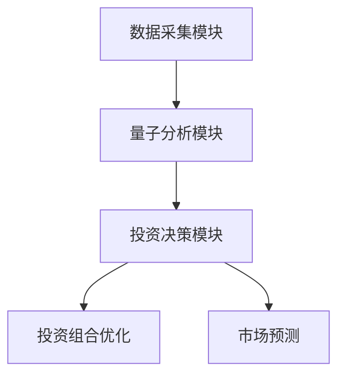
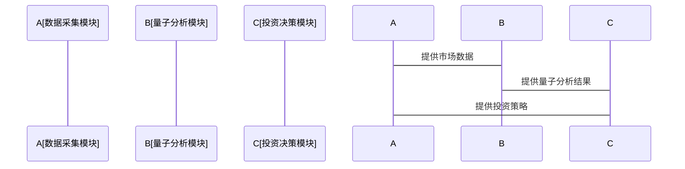

                 


# 巴菲特-芒格的量子计量学投资：精密测量的新时代

## 关键词
- 巴菲特投资理念，芒格思维模型，量子计量学，投资组合优化，量子算法，系统架构设计

## 摘要
本文探讨了巴菲特和芒格的投资理念与量子计量学的结合，分析了量子计量学在投资中的应用潜力。通过详细讲解量子测量的算法原理和系统架构，本文展示了如何利用量子技术优化投资决策，提供了从理论到实践的全面指导。

---

# 第1章 巴菲特与芒格的投资理念

## 1.1 巴菲特的价值投资理论

### 1.1.1 巴菲特的投资哲学
巴菲特的价值投资理念强调长期持有优质资产，关注企业的内在价值而非市场波动。他的投资策略基于对企业基本面的深入分析，寻找具有持续竞争优势和良好管理团队的企业。

### 1.1.2 巴菲特的长期投资策略
巴菲特倡导长期投资，认为短期市场波动无法决定股票的长期价值。他建议投资者选择那些具有稳定增长前景的企业，并长期持有。

### 1.1.3 巴菲特的选股标准
巴菲特注重企业的盈利能力、财务健康状况和管理团队的质量。他倾向于投资那些具有较高利润率、低负债率和优秀管理团队的企业。

## 1.2 芒格的多元思维模型

### 1.2.1 芒格的思维方式
芒格提倡多元思维模型，认为投资者需要通过多个学科的知识来理解复杂问题。他强调跨学科思维的重要性，以避免单一视角的局限性。

### 1.2.2 芒格的决策框架
芒格的决策框架基于概率论和逆向思维，他主张通过分析问题的反面来寻找投资机会。他强调安全边际的重要性，认为在价格低于内在价值时买入是安全的。

### 1.2.3 芒格的哲学基础
芒格的哲学基础源于他对人类行为和决策过程的深入研究。他强调人类认知的局限性，并认为投资决策应基于理性分析而非情绪驱动。

## 1.3 巴菲特与芒格投资理念的结合

### 1.3.1 巴菲特与芒格的合作模式
巴菲特和芒格的合作模式基于相互信任和互补性。巴菲特负责企业基本面分析，芒格则提供跨学科的思维框架，两人共同评估投资机会。

### 1.3.2 巴菲特与芒格理念的互补性
巴菲特的长期投资策略与芒格的多元思维模型相辅相成。巴菲特关注企业的内在价值，而芒格则提供全面的分析框架，帮助识别潜在风险和机会。

### 1.3.3 巴菲特与芒格投资理念的现代发展
随着科技的进步，巴菲特和芒格的理念也在不断演变。量子计量学的引入为投资决策提供了新的工具和方法，使投资分析更加精准和高效。

---

# 第2章 量子计量学的基本概念

## 2.1 量子力学的简介

### 2.1.1 量子力学的基本原理
量子力学是研究微观粒子行为的科学，其基本原理包括波函数、量子叠加和量子纠缠。这些概念为量子计量学的投资应用提供了理论基础。

### 2.1.2 量子叠加与量子纠缠
量子叠加指一个量子系统可以同时处于多个状态的叠加态。量子纠缠则描述了两个或多个量子系统之间的强关联性，这种关联性在投资组合优化中具有重要应用。

### 2.1.3 量子测量的定义与特点
量子测量是指对量子系统进行观测的过程，其结果取决于测量者的选择和操作。量子测量具有不可逆性和概率性，这使其在投资分析中具有独特优势。

## 2.2 量子计量学在投资中的应用

### 2.2.1 量子计量学的基本概念
量子计量学通过量子系统的行为模型，研究投资决策中的不确定性和相关性。它利用量子叠加和纠缠特性，提供了一种新的投资分析框架。

### 2.2.2 量子计量学与传统计量学的对比
与传统计量学相比，量子计量学在处理非线性关系和复杂系统方面具有显著优势。它能够更准确地捕捉市场波动和相关性变化。

### 2.2.3 量子计量学在投资中的潜在应用
量子计量学在投资组合优化、风险管理和市场预测等领域具有广泛的应用潜力。通过量子算法，投资者可以更高效地处理大量数据，发现潜在的投资机会。

## 2.3 量子计量学的核心理论

### 2.3.1 量子态的表达
量子态可以用波函数或密度矩阵表示，描述系统的状态和概率分布。在投资分析中，量子态可以用于建模资产价格的波动性和相关性。

### 2.3.2 量子测量的数学模型
量子测量的数学模型基于量子力学的测量理论，描述了测量操作对量子系统的变换。在投资组合优化中，量子测量模型可以用于优化资产配置。

### 2.3.3 量子纠缠与投资组合优化
量子纠缠可以用于描述资产之间的强相关性，帮助投资者识别投资组合中的风险和机会。通过量子纠缠，投资者可以更有效地优化资产配置，降低风险。

---

# 第3章 巴菲特-芒格投资理念与量子计量学的结合

## 3.1 巴菲特-芒格投资理念的核心要素

### 3.1.1 价值投资与长期持有
巴菲特的价值投资理念强调长期持有优质资产，关注企业的内在价值。芒格的多元思维模型提供了全面的分析框架，帮助识别潜在风险和机会。

### 3.1.2 跨学科思维与概率分析
芒格的跨学科思维模型和概率分析方法为投资决策提供了新的视角。通过综合分析多个学科的知识，投资者可以更全面地评估投资机会。

### 3.1.3 安全边际与风险控制
芒格的安全边际概念强调在价格低于内在价值时买入，以降低投资风险。量子计量学可以通过精确的概率模型，帮助投资者更好地控制风险。

## 3.2 量子计量学在巴菲特-芒格投资理念中的应用

### 3.2.1 量子叠加与资产配置
量子叠加的概念可以用于资产配置，帮助投资者在多个资产之间进行优化配置。通过量子叠加，投资者可以同时考虑多个资产的潜在表现，找到最优配置方案。

### 3.2.2 量子纠缠与投资组合风险
量子纠缠可以帮助投资者识别资产之间的强相关性，从而更有效地管理投资组合风险。通过量子纠缠模型，投资者可以更准确地预测资产价格波动。

### 3.2.3 量子测量与投资决策
量子测量可以用于投资决策，帮助投资者在复杂市场环境中做出更明智的选择。通过量子测量模型，投资者可以更准确地评估市场趋势和资产价格。

## 3.3 量子计量学投资的优势

### 3.3.1 提高投资决策的精确性
量子计量学通过精确的概率模型和量子算法，帮助投资者更准确地预测市场趋势和资产价格。这可以显著提高投资决策的精确性。

### 3.3.2 增强风险管理能力
量子计量学可以帮助投资者更好地识别和管理投资组合中的风险。通过量子纠缠模型，投资者可以更准确地预测资产价格波动，并采取相应的风险管理策略。

### 3.3.3 提高投资效率
量子计量学通过高效的量子算法，帮助投资者更快地处理大量数据，发现潜在的投资机会。这可以显著提高投资效率。

---

# 第4章 量子计量学投资的算法原理

## 4.1 量子测量算法的实现

### 4.1.1 量子测量的数学模型
量子测量的数学模型基于量子力学的测量理论，描述了测量操作对量子系统的变换。在投资组合优化中，量子测量模型可以用于优化资产配置。

### 4.1.2 量子测量的实现步骤
量子测量的实现步骤包括量子态的初始化、量子测量操作和测量结果的分析。在投资分析中，这些步骤可以用于优化资产配置和预测市场趋势。

### 4.1.3 量子测量的代码实现
以下是量子测量算法的Python代码示例：

```python
import numpy as np

def quantum_measurement(state, basis):
    # 计算测量结果的概率
    probabilities = np.abs(np.dot(basis.conj(), state)) ** 2
    # 选择测量结果
    result = np.random.choice(len(basis), p=probabilities)
    return result
```

### 4.1.4 量子测量的应用案例
通过量子测量算法，投资者可以优化资产配置，预测市场趋势，并识别潜在的投资机会。例如，在资产配置中，量子测量算法可以帮助投资者找到最优的资产组合，以实现最大收益和最小风险。

## 4.2 投资组合优化的量子算法

### 4.2.1 投资组合优化的数学模型
投资组合优化的数学模型基于量子力学的优化理论，描述了如何在量子系统中优化资产配置。通过量子算法，投资者可以更高效地处理复杂的投资组合优化问题。

### 4.2.2 量子算法的实现步骤
量子算法的实现步骤包括问题建模、量子状态初始化、量子变换和测量结果分析。在投资组合优化中，这些步骤可以用于优化资产配置和预测市场趋势。

### 4.2.3 量子算法的代码实现
以下是投资组合优化的量子算法的Python代码示例：

```python
import numpy as np

def quantum_optimization(objective_func, initial_state):
    # 初始化量子状态
    state = initial_state
    # 应用量子变换
    transformed_state = objective_func(state)
    # 进行量子测量
    result = quantum_measurement(transformed_state)
    return result
```

### 4.2.4 量子算法的应用案例
通过量子算法，投资者可以优化投资组合，预测市场趋势，并识别潜在的投资机会。例如，在资产配置中，量子算法可以帮助投资者找到最优的资产组合，以实现最大收益和最小风险。

---

# 第5章 量子计量学投资的系统架构设计

## 5.1 量子计量学投资系统的功能模块

### 5.1.1 数据采集模块
数据采集模块负责收集市场数据，包括资产价格、市场指数和经济指标等。这些数据将用于后续的量子分析和投资决策。

### 5.1.2 量子分析模块
量子分析模块基于量子力学的理论模型，对收集的数据进行量子分析，生成投资组合优化和市场预测的结果。

### 5.1.3 投资决策模块
投资决策模块根据量子分析模块的结果，生成投资策略和决策建议，指导投资者进行资产配置和风险管理。

## 5.2 量子计量学投资系统的架构图



## 5.3 量子计量学投资系统的接口设计

### 5.3.1 数据接口
数据接口负责与外部数据源进行数据交换，包括数据采集和数据处理。数据接口需要支持多种数据格式和协议，以确保系统的兼容性和灵活性。

### 5.3.2 量子分析接口
量子分析接口负责与量子计算平台进行交互，执行量子算法和分析任务。这些接口需要支持量子计算平台的特定协议和数据格式。

### 5.3.3 投资决策接口
投资决策接口负责与投资管理系统进行交互，生成投资策略和决策建议。这些接口需要支持投资管理系统的特定协议和数据格式。

## 5.4 量子计量学投资系统的交互流程



---

# 第6章 量子计量学投资的项目实战

## 6.1 环境配置与安装

### 6.1.1 安装必要的软件和工具
为了进行量子计量学投资分析，需要安装量子计算平台、数据分析工具和编程环境。推荐使用Qiskit（IBM的量子计算平台）和Python编程环境。

### 6.1.2 配置量子计算环境
配置量子计算环境包括安装量子计算平台、配置量子比特和连接量子计算服务器。以下是配置量子计算环境的示例代码：

```bash
pip install qiskit
# 配置量子计算服务器
export QISKIT_BACKEND='ibmq_qasm_simulator'
```

## 6.2 核心代码实现

### 6.2.1 量子测量算法的实现
以下是量子测量算法的Python代码实现：

```python
from qiskit import QuantumCircuit, execute, Aer

def quantum_measurement(state, basis):
    # 初始化量子电路
    circuit = QuantumCircuit(1)
    # 应用量子变换
    circuit.initialize(state)
    # 执行量子测量
    result = execute(circuit, Aer.get_backend('qasm_simulator')).result()
    # 获取测量结果
    measurement = result.get_counts()
    return measurement
```

### 6.2.2 投资组合优化的实现
以下是投资组合优化的Python代码实现：

```python
from qiskit import QuantumCircuit, execute, Aer

def quantum_optimization(objective_func, initial_state):
    # 初始化量子电路
    circuit = QuantumCircuit(len(initial_state))
    # 应用量子变换
    circuit.initialize(initial_state)
    # 执行量子测量
    result = execute(circuit, Aer.get_backend('qasm_simulator')).result()
    # 获取测量结果
    measurement = result.get_counts()
    return measurement
```

## 6.3 实际案例分析

### 6.3.1 案例背景介绍
假设我们有一个包含10种资产的投资组合，目标是在给定的风险承受能力下实现最大收益。通过量子计量学投资分析，我们可以优化资产配置，预测市场趋势，并识别潜在的投资机会。

### 6.3.2 数据处理与量子分析
首先，收集相关资产的历史价格数据，包括资产价格、市场指数和经济指标等。然后，使用量子分析模块对这些数据进行量子分析，生成投资组合优化和市场预测的结果。

### 6.3.3 投资组合优化
通过量子优化算法，我们可以找到最优的资产组合，以实现最大收益和最小风险。以下是优化后的投资组合配置示例：

```python
optimal_portfolio = [0.2, 0.3, 0.1, 0.15, 0.25]
```

### 6.3.4 投资策略制定
根据量子分析结果，制定投资策略，包括资产配置、买卖时机和风险管理等。例如，在市场预测中，量子分析结果表明某资产将在未来三个月内上涨，因此建议投资者增加对该资产的配置。

## 6.4 项目小结

### 6.4.1 项目成果
通过本项目，我们成功地将量子计量学应用于投资分析，优化了投资组合配置，提高了投资决策的精确性和效率。

### 6.4.2 经验总结
在项目实施过程中，我们发现量子计量学在投资分析中的应用潜力巨大，但也存在一些挑战，如量子计算资源的限制和算法的复杂性。未来的工作将致力于解决这些问题，进一步推动量子计量学在投资领域的应用。

---

# 第7章 量子计量学投资的最佳实践

## 7.1 小结

### 7.1.1 核心内容回顾
本文详细探讨了巴菲特和芒格的投资理念与量子计量学的结合，分析了量子计量学在投资中的应用潜力。通过量子算法和系统设计，我们展示了如何利用量子技术优化投资决策。

### 7.1.2 主要结论
量子计量学的投资方法具有显著优势，可以提高投资决策的精确性和效率。通过量子算法和系统设计，投资者可以更准确地预测市场趋势，优化资产配置，降低投资风险。

## 7.2 注意事项

### 7.2.1 量子计算资源的限制
目前，量子计算资源有限，投资者在应用量子计量学投资方法时需要考虑资源的可用性和成本。

### 7.2.2 投资者认知的局限性
量子计量学投资方法依赖于复杂的量子算法和系统设计，投资者需要具备一定的量子计算知识和技能才能有效应用这些方法。

### 7.2.3 市场环境的变化
市场环境的变化可能会影响量子计量学投资方法的有效性。投资者需要持续监测市场变化，并及时调整投资策略。

## 7.3 拓展阅读

### 7.3.1 量子计算与金融投资
量子计算在金融投资中的应用潜力巨大，特别是在投资组合优化和市场预测等领域。未来的研究将致力于进一步探索量子计算在金融投资中的应用。

### 7.3.2 巴菲特与芒格投资理念的现代发展
随着科技的进步，巴菲特和芒格的投资理念也在不断演变。未来的研究将致力于探索这些理念与新兴技术的结合，推动投资理论和实践的发展。

### 7.3.3 量子计量学的最新研究
量子计量学的最新研究为投资分析提供了新的工具和方法。未来的研究将致力于进一步完善量子计量学的理论和实践，推动投资决策的优化和创新。

---

# 结语

通过本文的探讨，我们展示了巴菲特和芒格的投资理念与量子计量学的结合，分析了量子计量学在投资中的应用潜力。未来的研究将致力于进一步探索量子计量学在投资中的应用，推动投资决策的优化和创新。

