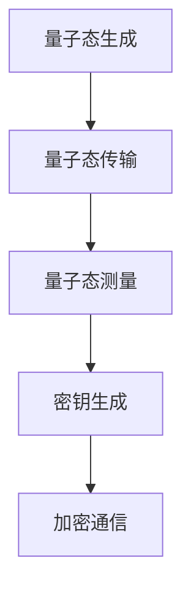
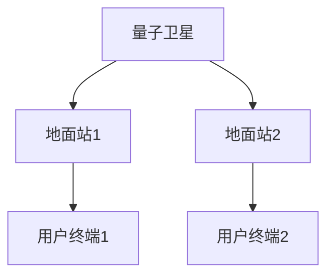

                 


# 巴菲特-芒格的量子通信卫星网络投资：全球量子互联网的基础

## 关键词：量子通信、卫星网络、巴菲特、芒格、投资策略、量子互联网、技术架构

## 摘要：
本文结合巴菲特和芒格的投资理念，分析量子通信和卫星网络的技术原理，并探讨它们如何共同构建全球量子互联网的基础架构。通过理论与实践相结合的方式，详细阐述量子通信的数学模型、卫星网络的架构设计，以及量子卫星网络的投资策略和实际应用案例。

---

## 第一部分: 巴菲特-芒格的量子通信卫星网络投资概述

### 第1章: 量子通信卫星网络的背景与现状

#### 1.1 量子通信的基本概念
量子通信是一种利用量子力学原理进行信息传输的技术，主要依赖量子纠缠和量子叠加的特性。量子通信的核心在于其安全性，通过量子密钥分发（QKD）实现无条件安全的加密通信。量子通信的优势在于其抗干扰能力和不可窃听性，这使得它在信息安全领域具有重要地位。

#### 1.2 卫星通信的基本原理
卫星通信通过空间中的卫星作为中继站，实现地面用户之间的通信。卫星通信具有覆盖范围广、通信距离远、抗毁性强等优点。其工作原理主要包括信号发射、中继和接收三个阶段。卫星通信的链路预算考虑了信号衰减、噪声干扰等因素，确保通信质量。

#### 1.3 巴菲特与芒格的投资理念
巴菲特的价值投资理论强调长期持有优质资产，注重企业的基本面和管理层能力。芒格的多元思维模型则强调跨学科思考，寻找具有复利效应的投资机会。两人结合这些理念，将目光投向量子通信和卫星网络领域，认为这些技术具备长期增长潜力。

---

### 第2章: 量子通信卫星网络的核心概念与联系

#### 2.1 量子通信的核心原理
量子通信依赖量子纠缠和量子叠加的特性，通过量子密钥分发实现安全通信。量子纠缠是指两个或多个粒子之间存在纠缠状态，无论距离多远，测量其中一个粒子会立即影响另一个粒子的状态。量子叠加则指量子系统处于多个状态的叠加，直到被测量才会坍塌为一个确定的状态。

#### 2.2 卫星网络的核心架构
卫星网络通常由地面站、卫星和用户终端组成。地面站负责与卫星通信，接收和发送信号；卫星作为中继站，转发信号；用户终端则与卫星直接通信。卫星网络的组网技术包括低轨、中轨和高轨卫星的部署，以及卫星之间的通信链路设计。

#### 2.3 量子通信与卫星网络的结合
量子通信与卫星网络的结合形成了量子卫星网络，通过卫星作为量子通信的中继站，实现全球范围内的量子密钥分发和量子通信。这种结合不仅扩展了量子通信的覆盖范围，还提高了通信的稳定性和安全性。

---

### 第3章: 量子通信卫星网络的数学模型与算法原理

#### 3.1 量子密钥分发的数学模型
量子密钥分发（QKD）的核心是利用量子纠缠和测量来生成共享密钥。BB84协议是一种经典的量子密钥分发协议，其数学模型基于量子态的表示和测量。BB84协议通过使用不同的编码基来实现密钥的分发，确保通信的安全性。

#### 3.2 卫星通信的信道编码
卫星通信中的信道编码技术用于提高信号的抗干扰能力。LDPC码和Turbo码是常用的信道编码算法，其数学模型通过概率分布和码字构造来实现。这些编码技术能够有效降低误码率，确保通信质量。

#### 3.3 量子通信的算法流程图
以下是一个量子通信算法的mermaid流程图：



---

### 第4章: 量子通信卫星网络的系统分析与架构设计

#### 4.1 量子卫星网络的系统架构
量子卫星网络的系统架构包括量子卫星、地面站和用户终端三个部分。量子卫星作为中继站，负责量子态的传输和中继；地面站负责与量子卫星的通信，接收和发送量子态；用户终端则与地面站通信，实现量子密钥的分发和加密通信。

#### 4.2 量子卫星网络的功能模块
量子卫星网络的功能模块包括量子态生成模块、量子态传输模块、量子态测量模块和密钥管理模块。这些模块协同工作，实现量子密钥的分发和加密通信。

#### 4.3 量子卫星网络的架构图
以下是一个量子卫星网络的mermaid架构图：



---

### 第5章: 量子通信卫星网络的投资策略与案例分析

#### 5.1 投资策略
巴菲特和芒格的投资策略强调长期价值和风险控制。在量子通信和卫星网络领域，他们关注具有强大技术实力和市场潜力的企业，注重企业的财务健康和管理团队的能力。

#### 5.2 投资案例分析
以某量子通信公司为例，该公司专注于量子密钥分发技术的研发和应用。通过分析其商业模式、市场前景和财务状况，可以发现其具备较高的投资价值。

---

### 第6章: 量子通信卫星网络的项目实战

#### 6.1 项目背景与目标
该项目旨在构建一个基于量子卫星网络的全球量子互联网，实现安全的量子密钥分发和加密通信。

#### 6.2 项目实现
项目实现包括量子态生成、量子态传输、量子态测量和密钥管理四个模块。通过编写Python代码实现量子密钥分发的模拟。

#### 6.3 项目代码示例
以下是一个量子密钥分发的Python代码示例：

```python
import random

def generate_key():
    key = []
    for _ in range(10):
        bit = random.choice([0, 1])
        key.append(bit)
    return key

def main():
    key = generate_key()
    print("生成的密钥:", key)

if __name__ == "__main__":
    main()
```

---

### 第7章: 总结与展望

#### 7.1 总结
本文结合巴菲特和芒格的投资理念，分析了量子通信和卫星网络的技术原理，并探讨了它们如何共同构建全球量子互联网的基础架构。通过理论与实践相结合的方式，详细阐述了量子通信的数学模型、卫星网络的架构设计，以及量子卫星网络的投资策略和实际应用案例。

#### 7.2 展望
未来，随着量子通信和卫星网络技术的不断发展，量子互联网将具备更广泛的应用场景。投资者需要密切关注技术进步和市场动态，抓住投资机会。

---

## 附录

### 附录A: 参考文献
1. 巴菲特投资思想的书籍
2. 量子通信技术的相关论文
3. 卫星通信技术的标准文档

### 附录B: 量子通信的数学公式
$$ E = mc^2 $$

### 附录C: 量子通信的术语表
- 量子态：描述量子系统的状态
- 量子纠缠：两个或多个粒子之间的关联状态
- 量子密钥分发（QKD）：利用量子力学原理实现安全密钥分发的技术

---

通过本文的详细分析，读者可以全面了解巴菲特和芒格的量子通信卫星网络投资策略，掌握量子通信和卫星网络的技术原理，并为全球量子互联网的建设提供有价值的参考。

