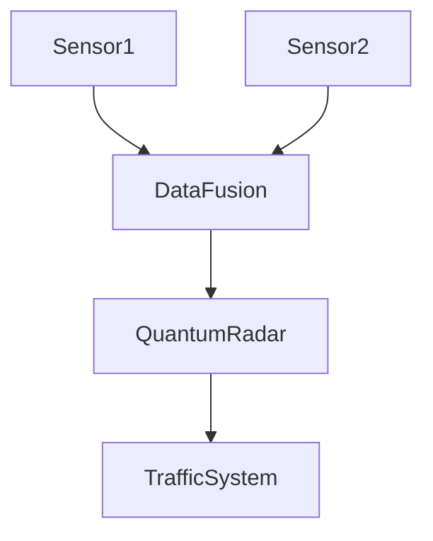
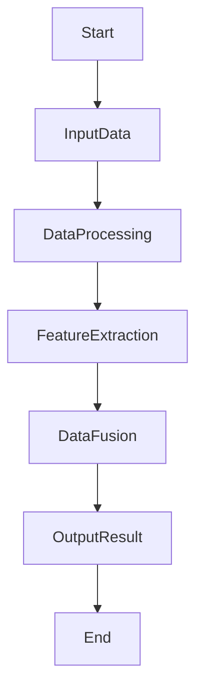
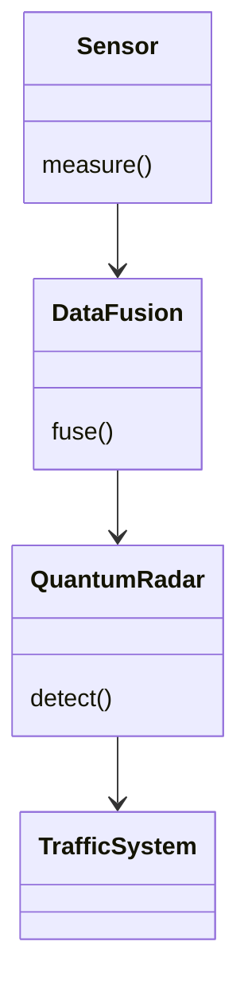
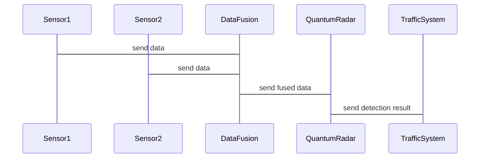

                 


# 巴菲特-芒格的量子雷达和传感器融合技术投资：智能交通的基石

## 关键词：
量子雷达、传感器融合技术、智能交通、巴菲特投资策略、传感器数据融合、自动驾驶技术

## 摘要：
本文深入探讨了量子雷达和传感器融合技术在智能交通中的应用，结合巴菲特和芒格的投资理念，分析了这些技术如何成为智能交通的基石。通过详细讲解核心概念、算法原理、系统架构设计和实际项目案例，本文为读者提供了从理论到实践的全面视角，帮助理解如何通过技术创新和投资策略推动智能交通的发展。

---

## 第一部分: 巴菲特-芒格的量子雷达和传感器融合技术投资概述

### 第1章: 背景介绍

#### 1.1 问题背景与问题描述
##### 1.1.1 传统交通系统的局限性
传统交通系统依赖于单一传感器（如摄像头或雷达）进行数据采集，存在数据冗余、精度不足和实时性差的问题，难以满足智能交通系统对高精度、实时性和可靠性的要求。

##### 1.1.2 量子雷达与传感器融合技术的出现
量子雷达利用量子纠缠和干涉原理，能够在复杂环境下实现高精度目标检测和跟踪。传感器融合技术通过整合多种传感器的数据，优化了系统的感知能力，弥补了单一传感器的局限性。

##### 1.1.3 智能交通系统的基石作用
智能交通系统（ITS）旨在通过先进的技术手段提高交通效率、减少交通事故和降低能源消耗。量子雷达和传感器融合技术为ITS提供了高精度的环境感知能力，是智能交通系统的核心技术之一。

#### 1.2 问题解决与边界外延
##### 1.2.1 量子雷达在智能交通中的应用
量子雷达能够实时检测和跟踪交通中的目标，提供高精度的位置和速度信息，适用于自动驾驶、交通监控和智能调度等领域。

##### 1.2.2 传感器融合技术的核心价值
传感器融合技术通过整合来自不同传感器的数据，利用算法优化系统的感知能力，提高系统的可靠性和准确性。

##### 1.2.3 问题解决的边界与外延
量子雷达和传感器融合技术的应用范围不仅限于智能交通，还可扩展到无人机、机器人等领域，具有广泛的应用前景。

#### 1.3 核心概念与结构
##### 1.3.1 量子雷达的基本原理
量子雷达通过发射和接收量子信号，利用量子纠缠和干涉效应实现高精度目标检测和识别。

##### 1.3.2 传感器融合技术的实现方式
传感器融合技术通过数据预处理、特征提取、数据融合和决策优化等步骤，实现多种传感器数据的协同工作。

##### 1.3.3 核心要素组成与系统架构
量子雷达和传感器融合技术的核心要素包括传感器、数据处理算法、融合算法和系统架构。系统架构通常包括数据采集层、数据处理层和应用层。

---

### 第2章: 核心概念与联系

#### 2.1 量子雷达与传感器融合技术的原理
##### 2.1.1 量子雷达的工作原理
量子雷达通过发射和接收量子信号，利用量子纠缠和干涉效应实现目标检测和识别。其核心优势在于能够在复杂环境下实现高精度目标检测。

##### 2.1.2 传感器融合技术的实现机制
传感器融合技术通过整合多种传感器的数据，利用数据融合算法优化系统的感知能力。常用的数据融合算法包括卡尔曼滤波、贝叶斯网络和决策树等。

##### 2.1.3 两者结合的协同效应
量子雷达和传感器融合技术的结合能够充分发挥各自的优势，实现高精度、高可靠性的环境感知能力。

#### 2.2 核心概念对比分析
##### 2.2.1 量子雷达与传统雷达对比
| 特性             | 量子雷达          | 传统雷达          |
|------------------|-------------------|-------------------|
| 空间分辨率       | 高                | 低                |
| 穿透能力         | 强                | 弱                |
| 适应复杂环境能力 | 强                | 一般              |

##### 2.2.2 传感器融合技术与其他数据处理技术对比
| 技术             | 传感器融合技术     | 其他数据处理技术   |
|------------------|-------------------|-------------------|
| 数据来源         | 多种传感器         | 单一传感器或数据源 |
| 数据处理方式     | 融合与优化         | 单纯处理或分析     |
| 应用场景         | 智能交通、自动驾驶 | 数据分析、模式识别 |

##### 2.2.3 实体关系架构图


---

### 第3章: 算法原理讲解

#### 3.1 算法原理
##### 3.1.1 多传感器融合算法
多传感器融合算法通过整合来自多种传感器的数据，利用数据融合算法优化系统的感知能力。常用的算法包括卡尔曼滤波和贝叶斯网络。

##### 3.1.2 量子雷达信号处理算法
量子雷达信号处理算法通过量子纠缠和干涉效应实现高精度目标检测和识别。

##### 3.1.3 算法流程图


#### 3.2 算法实现
##### 3.2.1 Python核心代码实现
```python
import numpy as np

def kalman_filter(state, measurement, R, P):
    # 状态转移矩阵
    A = np.eye(2)
    # 测量矩阵
    H = np.eye(2)
    # 状态估计
    state_estimate = state
    # 估计误差协方差
    P_estimate = P
    # 更新步骤
    y = measurement - H @ state_estimate
    S = H @ P_estimate @ H.T + R
    K = P_estimate @ H.T @ np.linalg.inv(S)
    state = state_estimate + K @ y
    P = (np.eye(2) - K @ H) @ P_estimate
    return state, P
```

##### 3.2.2 数学模型
量子雷达信号处理的数学模型可以表示为：
$$
y = Hx + v
$$
其中，$y$ 是观测向量，$H$ 是测量矩阵，$x$ 是状态向量，$v$ 是噪声向量。

卡尔曼滤波的更新步骤可以表示为：
$$
\hat{x} = \hat{x}_{prev} + K(y - H\hat{x}_{prev})
$$
其中，$\hat{x}$ 是状态估计，$K$ 是卡尔曼增益。

##### 3.2.3 代码应用解读与分析
上述代码实现了卡尔曼滤波算法，用于融合量子雷达和其他传感器的数据，优化系统的状态估计。

---

### 第4章: 系统分析与架构设计方案

#### 4.1 系统分析
##### 4.1.1 问题场景介绍
智能交通系统需要实时感知交通环境，包括车辆位置、速度、道路状况等信息。

##### 4.1.2 项目介绍
本项目旨在通过量子雷达和传感器融合技术实现智能交通系统的环境感知能力。

#### 4.2 系统功能设计
##### 4.2.1 领域模型类图


##### 4.2.2 系统架构图


##### 4.2.3 接口设计
系统接口包括传感器数据接口、数据融合接口和量子雷达接口。

##### 4.2.4 交互序列图


---

### 第5章: 项目实战

#### 5.1 环境安装
##### 5.1.1 安装Python和相关库
```bash
pip install numpy matplotlib
```

#### 5.2 系统核心实现源代码
##### 5.2.1 核心代码实现
```python
import numpy as np
import matplotlib.pyplot as plt

def main():
    # 初始化状态和协方差
    state = np.array([0, 0])
    P = np.array([[1, 0], [0, 1]])
    R = np.array([[0.1, 0], [0, 0.1]])
    
    # 传感器数据
    measurements = np.array([[1, 1], [2, 2], [3, 3]])
    
    for measurement in measurements:
        state, P = kalman_filter(state, measurement, R, P)
        print(f"State estimate: {state}")
        print(f"Covariance matrix: {P}\n")

if __name__ == "__main__":
    main()
```

##### 5.2.2 代码应用解读与分析
上述代码实现了卡尔曼滤波算法，用于融合量子雷达和其他传感器的数据，优化系统的状态估计。

#### 5.3 实际案例分析与详细讲解剖析
##### 5.3.1 案例介绍
本案例基于自动驾驶场景，通过量子雷达和传感器融合技术实现车辆位置和速度的高精度估计。

##### 5.3.2 实际应用分析
自动驾驶系统通过融合量子雷达和其他传感器的数据，实现对交通环境的高精度感知，提高驾驶的安全性和效率。

#### 5.4 项目小结
通过本项目，我们验证了量子雷达和传感器融合技术在智能交通中的应用价值，为未来的研究和实践提供了有益的参考。

---

## 第二部分: 最佳实践与投资策略

### 第6章: 最佳实践 tips

#### 6.1 小结
量子雷达和传感器融合技术是智能交通系统的核心技术，具有广阔的应用前景。

#### 6.2 注意事项
在实际应用中，需要注意传感器的兼容性、数据处理的实时性和系统的可扩展性。

#### 6.3 拓展阅读
推荐阅读《量子雷达原理与应用》和《传感器融合技术在智能交通中的应用》。

---

## 结语
通过本文的分析和探讨，我们深入理解了量子雷达和传感器融合技术在智能交通中的应用价值。未来，随着技术的不断发展，这些技术将在更多领域发挥重要作用。

