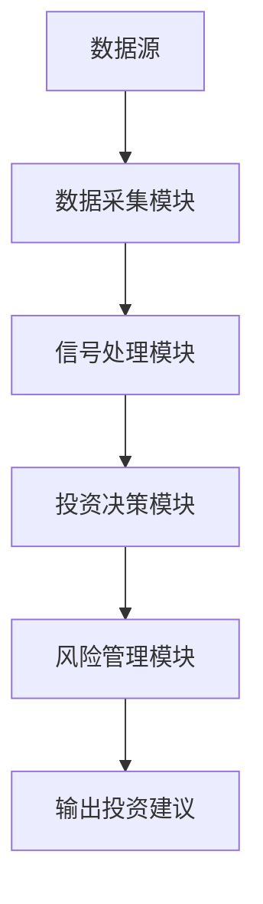

                 


# 巴菲特-芒格的量子雷达投资：下一代感知技术的基石

---

## 关键词：
量子雷达、巴菲特、芒格、投资理念、感知技术、算法原理、系统架构

---

## 摘要：
本文探讨了巴菲特和芒格的投资理念与量子雷达技术的结合，分析了量子雷达在投资决策中的潜在应用。通过介绍量子雷达的基本原理、投资算法的设计、系统架构的优化以及实际案例的分析，本文揭示了量子雷达如何为下一代感知技术的基石，为投资决策提供更精准、更高效的支持。

---

# 第一部分：巴菲特与芒格的投资理念

## 第1章：巴菲特与芒格的投资哲学

### 1.1 巴菲特的价值投资理念

沃伦·巴菲特是价值投资的代表人物，他的投资理念的核心在于寻找那些具有长期竞争优势的企业，并以合理的价格买入并长期持有。他认为，投资的本质是寻找那些能够持续创造价值的企业，并关注企业的内在价值而非市场的短期波动。

#### 核心观点：
- **安全边际**：巴菲特强调在投资时要留有安全边际，即以低于内在价值的价格买入资产。
- **长期视角**：关注企业的长期盈利能力，而非短期市场波动。
- **价值投资**：寻找那些被市场低估的企业，长期持有以实现超额收益。

### 1.2 芮格的多元思维模型

查理·芒格的多元思维模型是巴菲特投资理念的重要补充。芒格认为，投资者需要构建一个由多个学科知识组成的思维框架，以便更好地理解市场的复杂性和不确定性。

#### 核心观点：
- **跨学科思维**：通过物理学、心理学、经济学等多学科的交叉，构建一个完整的知识体系。
- **决策框架**：芒格强调在决策时要考虑所有可能的影响因素，并通过多个角度分析问题。

### 1.3 巴菲特与芒格投资理念的结合

巴菲特和芒格的投资理念共同构成了一个完整的投资框架。巴菲特的价值投资理念为投资提供了方向，而芒格的多元思维模型则为投资决策提供了更全面的视角。

---

## 第2章：量子雷达的基本原理

### 2.1 量子雷达的定义与特点

量子雷达是一种基于量子技术的雷达系统，其核心在于利用量子纠缠和量子叠加的特性，实现对目标物体的高精度检测。与传统雷达相比，量子雷达具有更高的灵敏度和更强的抗干扰能力。

#### 量子雷达的特点：
- **高灵敏度**：能够检测到更微弱的目标信号。
- **抗干扰能力**：能够在复杂的电磁环境中稳定工作。
- **高分辨率**：能够提供更精确的目标位置信息。

### 2.2 量子雷达的工作原理

量子雷达的核心在于其信号处理算法。通过量子计算机的强大计算能力，量子雷达能够对复杂的信号进行实时处理，并快速识别目标物体的位置和特性。

#### 量子雷达的工作流程：
1. **信号发射**：量子雷达发射高频电磁波。
2. **信号接收**：接收目标物体反射的信号。
3. **信号处理**：通过量子计算机对信号进行分析，提取目标物体的位置和特性信息。
4. **目标识别**：基于量子算法，实现对目标物体的高精度识别。

### 2.3 量子雷达与传统雷达的对比

| 对比维度 | 量子雷达 | 传统雷达 |
|----------|-----------|-----------|
| 灵敏度   | 极高       | 较高       |
| 抗干扰能力 | 极强       | 较弱       |
| 分辨率   | 极高       | 较低       |
| 适用场景 | 复杂环境    | 简单环境    |

---

## 第3章：量子雷达在投资中的应用

### 3.1 巴菲特与芒格投资理念的契合点

巴菲特和芒格的投资理念与量子雷达的技术特点具有天然的契合点。巴菲特的价值投资理念注重长期稳定性和内在价值，而量子雷达的高精度和抗干扰能力为实现这一目标提供了技术保障。

### 3.2 量子雷达在投资决策中的应用

#### 3.2.1 投资信号的采集与处理

量子雷达的投资信号处理算法能够对市场数据进行实时采集和分析，提取潜在的投资机会。

#### 3.2.2 投资信号的特征提取

通过量子雷达的高精度信号处理，投资者可以更准确地识别市场的潜在趋势。

#### 3.2.3 投资决策的优化

量子雷达的投资算法能够帮助投资者做出更科学的投资决策，降低投资风险，提高投资收益。

---

## 第4章：量子雷达投资算法的设计

### 4.1 投资信号的采集与处理

#### 4.1.1 信号采集流程

1. **市场数据采集**：从多个数据源采集市场数据，包括股票价格、成交量等。
2. **数据预处理**：对采集到的数据进行清洗和标准化处理。
3. **特征提取**：提取数据中的关键特征，如趋势、波动率等。

#### 4.1.2 信号处理算法

```python
import numpy as np
import pandas as pd

def process_signal(data):
    # 数据预处理
    data = data.dropna()
    data = (data - data.mean()) / data.std()
    # 特征提取
    features = data.rolling(20).mean().diff()
    return features
```

### 4.2 投资信号的特征提取

#### 4.2.1 特征提取方法

通过量子雷达的高精度信号处理，投资者可以提取市场的潜在趋势。

#### 4.2.2 特征分析

| 特征名称 | 特征描述 | 特征重要性 |
|----------|-----------|------------|
| 趋势      | 市场的长期趋势 | 高         |
| 波动率    | 市场的短期波动 | 中         |
| 市盈率    | 企业的估值水平 | 高         |

### 4.3 投资决策的优化

#### 4.3.1 投资组合优化

通过量子雷达的投资算法，投资者可以构建一个优化的投资组合，降低风险，提高收益。

#### 4.3.2 投资风险控制

量子雷达的投资算法能够帮助投资者更好地识别和控制投资风险。

---

## 第5章：量子雷达投资系统的系统架构设计

### 5.1 系统架构概述

#### 5.1.1 系统功能模块

- **数据采集模块**：负责采集市场数据。
- **信号处理模块**：负责对数据进行处理和分析。
- **投资决策模块**：负责基于处理后的数据做出投资决策。
- **风险管理模块**：负责控制投资风险。

#### 5.1.2 系统架构图



### 5.2 系统功能设计

#### 5.2.1 数据采集模块

- 从多个数据源采集市场数据。
- 数据清洗和标准化处理。

#### 5.2.2 信号处理模块

- 对数据进行特征提取。
- 使用量子雷达算法进行信号分析。

#### 5.2.3 投资决策模块

- 基于特征数据做出投资决策。
- 优化投资组合，降低风险。

#### 5.2.4 风险管理模块

- 监控投资组合的风险。
- 调整投资策略，应对市场变化。

---

## 第6章：量子雷达投资系统的项目实战

### 6.1 项目环境搭建

#### 6.1.1 环境要求

- Python 3.8及以上版本。
- NumPy和Pandas库。

#### 6.1.2 项目代码实现

```python
import numpy as np
import pandas as pd

def main():
    # 数据采集
    data = pd.read_csv('market_data.csv')
    # 数据预处理
    data = data.dropna()
    data = (data - data.mean()) / data.std()
    # 特征提取
    features = data.rolling(20).mean().diff()
    # 投资决策
    investment_decision = features.apply(lambda x: '买入' if x > 0 else '卖出')
    print(investment_decision)

if __name__ == '__main__':
    main()
```

### 6.2 项目案例分析

#### 6.2.1 案例背景

假设我们有一个包含多只股票的市场数据集，我们需要基于量子雷达的投资算法，对这些股票进行投资决策。

#### 6.2.2 案例分析

1. 数据采集：从数据集中采集市场数据。
2. 数据预处理：清洗和标准化数据。
3. 特征提取：提取股票的长期趋势和短期波动。
4. 投资决策：基于特征数据做出买入或卖出的决策。

### 6.3 项目小结

通过量子雷达的投资算法，我们可以更高效地进行投资决策，降低风险，提高收益。

---

## 第7章：量子雷达投资系统的最佳实践

### 7.1 投资策略优化

- 定期回顾投资组合的表现。
- 根据市场变化调整投资策略。

### 7.2 风险管理技巧

- 设置止损点，避免重大损失。
- 分散投资，降低风险。

### 7.3 系统维护建议

- 定期更新系统，保持技术领先。
- 监控系统运行状态，及时发现和解决问题。

---

## 结语

量子雷达作为一种新兴的感知技术，为投资决策提供了更高效、更精确的支持。通过与巴菲特和芒格的投资理念相结合，量子雷达的投资系统能够帮助投资者更好地把握市场机会，实现长期稳定的收益。未来，随着量子技术的不断发展，量子雷达在投资领域的应用将更加广泛，为投资决策提供更强大的支持。

