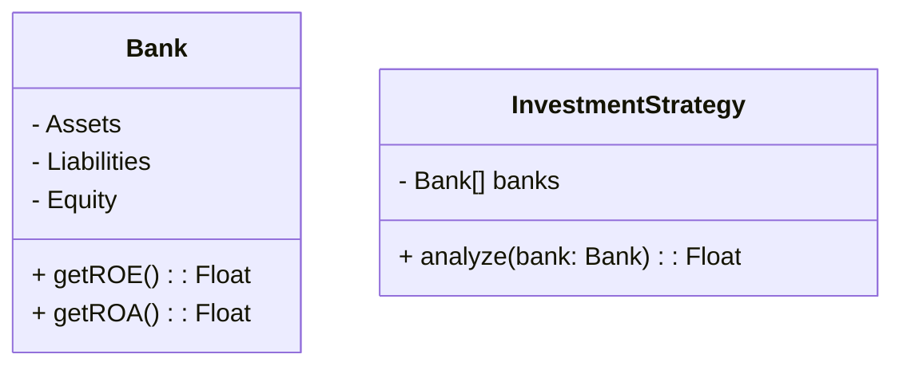
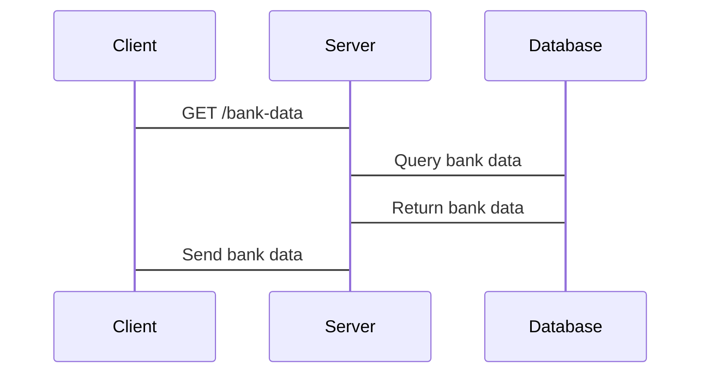

                 


# 巴菲特-芒格的银行股投资策略：看重稳定性和规模

> **关键词**：巴菲特、芒格、银行股、投资策略、稳定性、规模、风险管理  
> **摘要**：本文深入探讨巴菲特和芒格在银行股投资中的核心策略，分析他们如何通过稳定性与规模这两个关键因素进行投资决策，并结合实际案例和系统架构，提供可操作的投资框架与实战指导。

---

## 第1章 巴菲特-芒格投资策略的背景与核心理念

### 1.1 巴菲特与芒格的投资哲学
#### 1.1.1 巴菲特的投资理念概述
- 巴菲特的“价值投资”理念强调寻找具有长期竞争优势的企业，注重企业的内在价值。
- 他主张投资于那些简单易懂、易于分析的行业，银行股因其稳定的收益和可预测性成为其偏好的选择。

#### 1.1.2 芒格的多元思维模型
- 芒格提倡通过跨学科思维模型来分析问题，将复杂的经济现象分解为简单的逻辑关系。
- 他强调对银行股的分析需要结合宏观经济、行业趋势和企业基本面。

#### 1.1.3 巴菲特与芒格合作的投资策略
- 两人共同强调长期投资、价值发现和风险控制，银行股因其稳定的收益和防御性特征成为他们的重点关注对象。

### 1.2 银行股投资的特殊性
#### 1.2.1 银行行业的特点与风险
- 银行行业具有较高的杠杆率，容易受到经济周期波动的影响。
- 银行股的盈利能力与利率水平密切相关，利率上升会压缩银行的净息差。

#### 1.2.2 银行股的波动性与稳定性
- 银行股通常具有较高的波动性，但其收益相对稳定，适合长期投资者。

#### 1.2.3 银行股在投资组合中的作用
- 银行股作为防御性资产，能够在市场下跌时提供稳定收益，平衡投资组合的风险。

### 1.3 巴菲特-芒格银行股投资策略的核心要素
#### 1.3.1 稳定性：ROE与ROA的双重考量
- **ROE（股东权益回报率）**：衡量银行的盈利能力，ROE越高，股东的回报越大。
- **ROA（资产回报率）**：衡量银行的资产使用效率，ROA高表明银行能够更有效地利用资产创造利润。

#### 1.3.2 规模：资产规模与市场份额的重要性
- 资产规模大的银行通常具有更强的抗风险能力，能够在经济下行周期中维持稳定的收益。
- 市场份额大的银行具有更强的定价权和客户基础，能够通过规模效应降低成本。

#### 1.3.3 护城河：银行的竞争优势分析
- 护城河是指银行在行业中的竞争优势，包括品牌、客户忠诚度、成本优势等。
- 巴菲特和芒格倾向于投资那些具有强大护城河的银行，这些银行能够在长期竞争中保持优势。

---

## 第2章 巴菲特-芒格银行股投资策略的核心框架

### 2.1 投资策略的三要素
#### 2.1.1 企业盈利能力分析
- 通过ROE、ROA等指标分析银行的盈利能力，选择那些具有持续盈利能力的企业。

#### 2.1.2 财务健康状况评估
- 评估银行的资产负债表、利润表和现金流量表，确保银行具有健康的财务状况。

#### 2.1.3 行业地位与竞争优势
- 分析银行在行业中的地位，选择那些具有竞争优势的企业。

### 2.2 稳定性与规模的量化指标
#### 2.2.1 净利润增长率
- 净利润增长率是衡量银行盈利能力的重要指标，增长率稳定且较高的银行更具投资价值。

#### 2.2.2 资产回报率（ROA）
- ROA是衡量银行资产使用效率的重要指标，ROA高表明银行能够更有效地利用资产创造利润。

#### 2.2.3 股东权益回报率（ROE）
- ROE是衡量银行股东回报的重要指标，ROE高表明银行能够为股东创造更多价值。

### 2.3 财务指标分析与投资决策
#### 2.3.1 资产负债表分析
- 评估银行的资产质量、负债结构和资本充足性，确保银行具有健康的财务状况。

#### 2.3.2 利润表分析
- 分析银行的收入来源、成本结构和盈利能力，选择那些具有稳定盈利能力的银行。

#### 2.3.3 现金流量表分析
- 评估银行的现金流健康状况，确保银行具有稳定的现金流支持其运营和发展。

---

## 第3章 巴菲特-芒格银行股投资策略的实施步骤

### 3.1 确定投资目标
#### 3.1.1 明确投资目标与收益预期
- 确定投资目标，包括预期收益、投资期限和风险承受能力。

#### 3.1.2 确定投资期限与风险承受能力
- 根据自身的投资目标和风险偏好，选择合适的投资期限和风险承受能力。

#### 3.1.3 选择适合的银行股标的
- 根据财务指标和行业地位，选择那些具有稳定性和规模优势的银行股标的。

### 3.2 深入分析与评估
#### 3.2.1 企业基本面分析
- 分析银行的财务状况、盈利能力和发展潜力。

#### 3.2.2 行业环境分析
- 分析银行所处的行业环境，包括宏观经济、行业竞争和政策环境。

#### 3.2.3 管理层能力评估
- 评估银行的管理层能力，选择那些具有优秀管理团队的银行。

### 3.3 投资组合的构建与优化
#### 3.3.1 资产配置策略
- 根据投资目标和风险偏好，选择合适资产配置策略。

#### 3.3.2 风险控制与分散投资
- 通过分散投资降低风险，避免过度集中于某一银行或行业。

#### 3.3.3 定期评估与调整
- 定期评估投资组合的绩效，根据市场变化和企业状况进行调整。

---

## 第4章 巴菲特-芒格银行股投资策略的风险管理

### 4.1 风险识别与评估
#### 4.1.1 市场风险
- 市场风险是指由于市场价格波动导致的投资损失。

#### 4.1.2 信用风险
- 信用风险是指银行客户违约导致的损失风险。

#### 4.1.3 利率风险
- 利率风险是指由于利率变动导致的银行资产和负债价值的变动风险。

### 4.2 风险控制的策略与工具
#### 4.2.1 保险策略
- 通过购买保险来转移风险。

#### 4.2.2 对冲策略
- 通过金融衍生工具对冲风险。

#### 4.2.3 资产多样化配置
- 通过分散投资降低风险。

### 4.3 巴菲特-芒格的风险管理原则
#### 4.3.1 保持充足的安全边际
- 通过选择具有安全边际的银行股标的，降低投资风险。

#### 4.3.2 避免过度杠杆
- 避免过度依赖杠杆，降低企业的财务风险。

#### 4.3.3 留足缓冲空间
- 保持一定的财务缓冲空间，应对突发事件和市场波动。

---

## 第5章 巴菲特-芒格银行股投资策略的实战案例

### 5.1 美国银行（Bank of America）
#### 5.1.1 投资背景与策略
- 美国银行是全球最大的银行之一，具有强大的规模和市场份额。

#### 5.1.2 财务指标分析
- ROE和ROA均保持在较高水平，表明其具有稳定的盈利能力。

#### 5.1.3 投资结果
- 通过长期持有美国银行股票，巴菲特和芒格获得了稳定的收益。

### 5.2 富国银行（Wells Fargo）
#### 5.2.1 投资背景与策略
- 富国银行是美国另一家大型银行，具有强大的品牌和客户基础。

#### 5.2.2 财务指标分析
- 具有较高的ROE和ROA，显示出其较强的盈利能力。

#### 5.2.3 投资结果
- 通过长期持有富国银行股票，巴菲特和芒格实现了稳定的收益。

---

## 第6章 系统分析与架构设计方案

### 6.1 问题场景介绍
- 通过系统化的方法分析银行股的投资策略，结合技术手段优化投资决策。

### 6.2 系统功能设计
#### 6.2.1 领域模型设计
- 使用mermaid图展示银行股分析的领域模型。



#### 6.2.2 系统架构设计
- 使用mermaid图展示银行股投资系统的架构设计。

```mermaid
archiecture
    client -> Server: HTTP request
    Server -> Database: Query data
    Database -> BankDatabase: Get bank data
    Server -> AnalysisEngine: Analyze data
    AnalysisEngine -> InvestmentStrategy: Execute strategy
    Server -> client: Return result
```

#### 6.2.3 系统接口设计
- 定义系统接口，包括数据获取、分析和结果返回。

#### 6.2.4 系统交互设计
- 使用mermaid图展示系统交互流程。



---

## 第7章 项目实战

### 7.1 环境安装
- 安装Python和必要的数据分析库（如Pandas、NumPy）。

### 7.2 系统核心实现源代码
```python
import pandas as pd

def calculate_roe(df):
    return df['net_income'] / df['equity']

def calculate_roa(df):
    return df['net_income'] / df['assets']

def analyze_banks(banks_data):
    banks_data['roe'] = calculate_roe(banks_data)
    banks_data['roa'] = calculate_roa(banks_data)
    return banks_data

# 示例数据
data = {
    'bank': ['Bank of America', 'Wells Fargo', 'JPMorgan'],
    'assets': [1000, 900, 1200],
    'equity': [80, 70, 90],
    'net_income': [50, 40, 60]
}

banks_data = pd.DataFrame(data)
result = analyze_banks(banks_data)
print(result)
```

### 7.3 代码应用解读与分析
- 代码实现银行股的ROE和ROA计算，帮助投资者评估银行的盈利能力。

### 7.4 实际案例分析
- 以美国银行和富国银行为例，分析其财务指标和投资策略。

### 7.5 项目小结
- 总结项目实施过程，强调技术与投资策略的结合。

---

## 第8章 最佳实践 tips、小结、注意事项、拓展阅读

### 8.1 小结
- 总结巴菲特和芒格的银行股投资策略，强调稳定性和规模的重要性。

### 8.2 注意事项
- 投资者应结合市场环境和企业状况，灵活调整投资策略。

### 8.3 拓展阅读
- 推荐进一步阅读巴菲特和芒格的投资经典著作，深入理解其投资理念。

---

## 第9章 附录

### 9.1 关键术语解释
- 解释本文中涉及的关键术语和概念。

### 9.2 数据来源说明
- 说明数据来源和获取方式。

### 9.3 参考文献
- 列出本文参考的文献和资料。

---

通过以上结构和内容安排，本文旨在为读者提供一个全面、系统且实用的巴菲特-芒格银行股投资策略分析，结合理论与实践，帮助读者在投资决策中实现稳定性和规模的双重目标。

