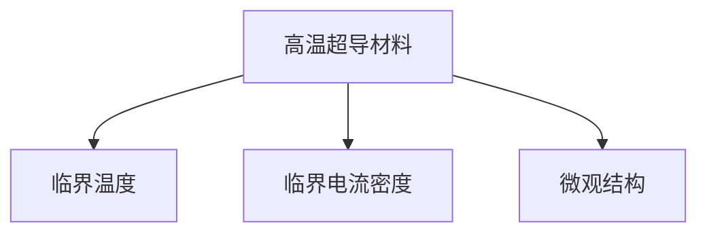
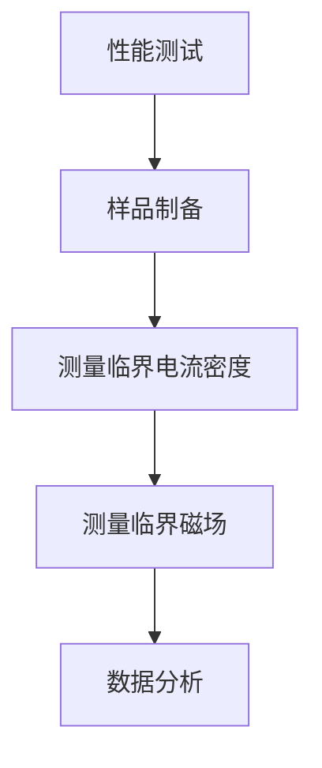
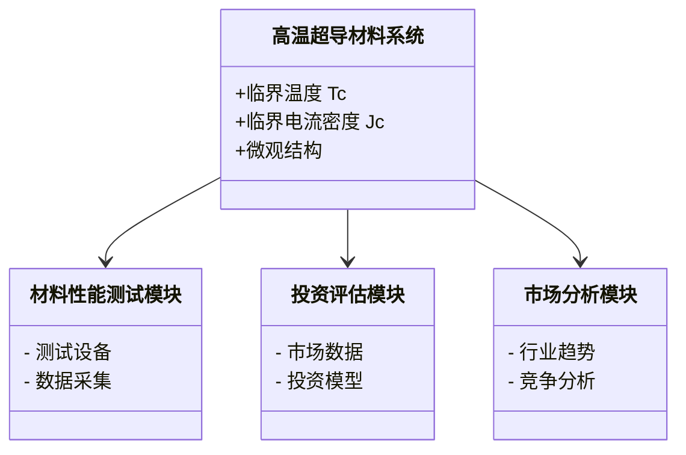
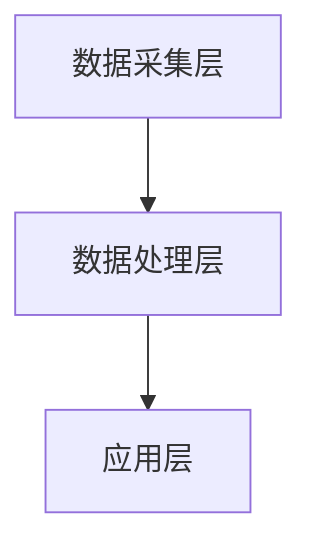

                 


# 巴菲特-芒格的高温超导材料投资：能源传输的革命

> 关键词：高温超导材料，巴菲特，芒格，能源传输，投资策略，物理特性

> 摘要：本文探讨了高温超导材料在能源传输领域的革命性应用，分析了巴菲特和芒格的投资策略，并结合高温超导材料的物理特性、数学模型和系统架构，详细解读了其在能源传输中的潜力和实际应用案例。

---

## 第一部分: 高温超导材料与能源传输革命

### 第1章: 高温超导材料概述

#### 1.1 高温超导材料的基本概念

高温超导材料是一种能够在高温环境下表现出超导特性的材料。超导性是指材料在特定条件下电阻为零，电流可以在其中无损耗地流动。与传统超导材料相比，高温超导材料具有更高的临界温度（Tc），能够在液氮温度以上实现超导，这极大地降低了制冷成本，使其在实际应用中更具可行性。

高温超导材料的主要类型包括氧化物超导体（如钡铁氧体）和重元素超导体（如砷化铌基材料）。这些材料在能源传输、医疗设备、量子计算等领域具有广泛的应用潜力。

#### 1.2 巴菲特与芒格的投资策略

巴菲特和芒格是全球著名的价值投资者，他们的投资策略以长期稳健著称。巴菲特强调“以合理的价格购买优秀的公司”，而芒格则强调多元思维模型，即从多个学科的角度分析问题。两人对高温超导材料的投资，源于对能源传输领域革命性变革的洞察。

高温超导材料在能源传输中的应用可以显著降低能量损耗，提高传输效率。这不仅能够节省能源成本，还能减少碳排放，符合全球可持续发展的趋势。巴菲特和芒格通过深入研究高温超导材料的技术潜力和市场前景，判断其具有长期的投资价值。

#### 1.3 能源传输的重要性

能源传输是现代社会的支柱之一，传统的电力传输系统存在能量损耗高、效率低的问题。高温超导材料的应用可以显著降低这些损耗，提高能源传输的效率和安全性。例如，在高压输电线路中使用高温超导电缆，可以减少能量损失，降低运营成本，并支持大规模可再生能源的接入。

高温超导材料在能源传输中的应用，不仅能够提高现有电网的效率，还能支持新型能源基础设施的建设，如可再生能源发电站和智能电网。这种技术的推广，将对全球能源结构的转型产生深远影响。

---

### 第2章: 高温超导材料的核心原理

#### 2.1 高温超导材料的物理特性

高温超导材料的物理特性是其在能源传输中应用的基础。以下是其关键特性：

1. **临界电流密度（Jc）**：高温超导材料在超导状态下可以承载的电流密度远高于传统导体。例如，某些高温超导材料的临界电流密度可以达到10^6 A/cm²，远高于铜或铝的电流承载能力。

2. **临界磁场（Hc）**：高温超导材料在外部磁场超过临界值时会失去超导性。这一特性使其在某些应用场景中需要考虑磁场的控制。

3. **热力学稳定性**：高温超导材料在高温下的稳定性使其更适合实际应用。液氮温度（约77 K）的制冷技术已经非常成熟，这使得高温超导材料的商业化成为可能。

#### 2.2 高温超导材料的数学模型

为了更好地理解高温超导材料的性能，我们可以建立以下数学模型：

1. **临界电流密度公式**：
   $$ J_c = \frac{A}{T} $$
   其中，A为材料常数，T为温度。该公式表明，临界电流密度与温度呈反比关系。

2. **临界磁场公式**：
   $$ H_c = \frac{B}{\mu_0} $$
   其中，B为磁场强度，μ₀为真空磁导率。该公式用于描述材料在不同磁场下的临界状态。

#### 2.3 高温超导材料的对比分析

为了更好地理解高温超导材料的优势，我们可以将其与传统导体进行对比分析。

**对比表格**：

| 材料类型       | 临界温度 (K) | 临界电流密度 (A/mm²) | 应用领域                         |
|----------------|--------------|-----------------------|----------------------------------|
| 常导材料       | < 100        | < 100                | 传统输电、工业设备             |
| 超导材料       | > 100        | > 1000               | 新能源传输、医疗设备、量子计算 |

**ER实体关系图**：



---

### 第3章: 高温超导材料的算法原理

#### 3.1 高温超导材料的制备方法

高温超导材料的制备方法多种多样，以下是三种主要方法的流程图：

1. **液相法**：
   ```mermaid
   graph TD
       A[液相法] --> B[溶解原料]
       B --> C[搅拌混合]
       C --> D[高温煅烧]
       D --> E[冷却]
   ```

2. **溶胶-凝胶法**：
   ```mermaid
   graph TD
       A[溶胶-凝胶法] --> B[制备前驱体]
       B --> C[煅烧]
       C --> D[后处理]
   ```

3. **化学气相沉积法（CVD）**：
   ```mermaid
   graph TD
       A[CVD法] --> B[蒸发原料]
       B --> C[沉积薄膜]
       C --> D[后处理]
   ```

#### 3.2 高温超导材料的性能测试

高温超导材料的性能测试是其应用于能源传输的关键步骤。以下是性能测试的流程图：



---

### 第4章: 高温超导材料的系统架构设计

#### 4.1 系统功能设计

高温超导材料的系统功能设计包括以下几个模块：

1. **材料性能测试模块**：负责测试高温超导材料的临界电流密度和临界磁场。
2. **投资评估模块**：基于测试结果和市场数据，评估高温超导材料的投资价值。
3. **市场分析模块**：分析高温超导材料在能源传输领域的市场前景。

**领域模型类图**：



#### 4.2 系统架构设计

高温超导材料系统的架构设计如下：

1. **数据采集层**：负责采集高温超导材料的性能数据。
2. **数据处理层**：对数据进行分析和处理。
3. **应用层**：提供用户界面，展示分析结果。

**系统架构图**：



---

### 第5章: 高温超导材料的项目实战

#### 5.1 环境安装

为了进行高温超导材料的性能测试，需要安装以下环境：

1. **测试设备**：包括超导材料测试仪、低温环境设备等。
2. **数据分析工具**：如Python、MATLAB等。

#### 5.2 核心代码实现

以下是高温超导材料性能测试的核心代码示例：

```python
# 高温超导材料性能测试代码

import numpy as np

def calculate_critical_current(T, A):
    return A / T

def calculate_critical_magnetic_field(B, mu_0):
    return B / mu_0

# 示例数据
A = 1000  # 材料常数
mu_0 = 4 * np.pi * 1e-7  # 真空磁导率
B = 1e-3  # 磁场强度

T = 77  # 温度，单位为K

Jc = calculate_critical_current(T, A)
Hc = calculate_critical_magnetic_field(B, mu_0)

print(f"临界电流密度: {Jc} A/mm²")
print(f"临界磁场: {Hc} T")
```

#### 5.3 代码解读与分析

上述代码实现了高温超导材料临界电流密度和临界磁场的计算。通过输入不同的温度和磁场强度，可以得到材料的性能指标。这些指标是评估高温超导材料投资价值的重要依据。

---

### 第6章: 最佳实践与小结

#### 6.1 投资策略

1. **长期视角**：高温超导材料的应用需要时间，投资者应以长期视角看待其发展。
2. **技术跟踪**：密切关注高温超导材料的技术进步和市场动态。
3. **风险管理**：合理分散投资风险，避免过度集中。

#### 6.2 小结

高温超导材料在能源传输领域的应用具有革命性潜力。通过巴菲特和芒格的投资策略，我们可以看到其背后的技术价值和市场前景。高温超导材料的物理特性、数学模型和系统架构，为其在能源传输中的广泛应用奠定了基础。未来，随着技术的进一步发展，高温超导材料将在能源革命中发挥更加重要的作用。

---

通过本文的详细分析，我们不仅了解了高温超导材料的基本概念和物理特性，还探讨了其在能源传输中的应用潜力。结合巴菲特和芒格的投资策略，我们可以更好地理解高温超导材料的投资价值和技术前景。

