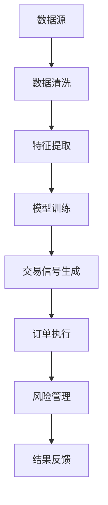
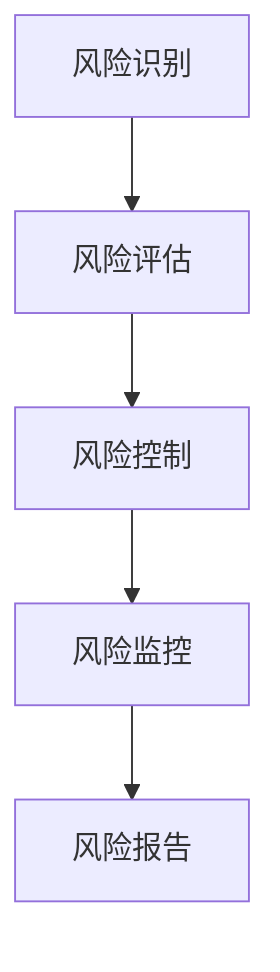

                 


# 巴菲特-芒格看AI在金融服务中的应用：机遇与风险

## 关键词：
- 巴菲特，芒格，人工智能，金融服务，投资策略，风险管理

## 摘要：
本文探讨了巴菲特和芒格的投资理念与AI在金融领域的应用相结合的可能性，分析了AI在金融服务中的机遇与风险。通过技术背景、算法原理、系统设计和实战案例，展示了AI如何改变金融行业，同时提出了应对风险的最佳实践。

---

## 第一部分：引言

### 第1章：AI在金融服务中的应用现状
#### 1.1 巴菲特与芒格的投资理念
- **1.1.1 巴菲特的价值投资策略**  
  巴菲特强调长期投资和价值投资，寻找具有持续竞争优势的企业。他的投资哲学基于基本面分析和安全边际，避免短期市场波动的干扰。

- **1.1.2 芒格的多元思维模型**  
  芒格提倡构建跨学科的知识框架，通过多维度思考来做出更明智的决策。这种思维方式可以帮助投资者避免认知偏差，提高决策的准确性。

- **1.1.3 巴菲特与芒格的投资哲学**  
  两人共同强调深入研究、长期投资和风险管理。他们的理念与现代AI技术相结合，可能会为金融行业带来新的变革。

#### 1.2 AI技术在金融领域的应用背景
- **1.2.1 人工智能在金融行业的应用现状**  
  AI技术在金融领域的应用日益广泛，包括算法交易、风险评估、客户画像等。这些技术提高了金融决策的效率和准确性。

- **1.2.2 巴菲特与芒格对AI技术的看法**  
  尽管巴菲特曾对AI在投资中的作用表示怀疑，但他也意识到AI技术的强大潜力。芒格则强调，AI是工具，而非替代人类判断的决定因素。

- **1.2.3 AI如何改变金融服务模式**  
  AI通过自动化和智能化，优化了金融服务流程，提升了用户体验。它可以帮助投资者更高效地分析数据，做出更明智的投资决策。

---

## 第二部分：巴菲特与芒格的投资理念与AI结合

### 第2章：巴菲特与芒格的投资策略
#### 2.1 巴菲特的价值投资策略
- **2.1.1 价值投资的核心原则**  
  价值投资强调购买低于内在价值的股票，长期持有，关注企业的基本面，而非短期市场波动。

- **2.1.2 巴菲特的选股标准**  
  巴菲特倾向于投资那些具有持续盈利能力和强大竞争优势的企业。他关注企业的ROE（净资产收益率）、管理层素质和行业地位。

- **2.1.3 长期投资与风险管理**  
  巴菲特强调长期投资，避免频繁交易。他通过分散投资和严格的风险控制来降低投资组合的风险。

#### 2.2 芒格的多元思维模型
- **2.2.1 多元思维模型的定义**  
  多元思维模型是指通过多个学科的知识框架来分析问题，避免单一视角的局限性。

- **2.2.2 多元思维模型在投资中的应用**  
  芒格通过物理学、心理学、经济学等多个学科的知识来分析企业，评估其内在价值和竞争优势。

- **2.2.3 多元思维模型与AI的结合**  
  AI技术可以辅助投资者构建多元思维模型，通过数据分析和模式识别，帮助投资者发现潜在的风险和机会。

#### 2.3 巴菲特与芒格的投资哲学
- **2.3.1 投资中的心理学因素**  
  巴菲特和芒格都强调心理因素在投资中的重要性，包括情绪控制、决策疲劳和认知偏差。

- **2.3.2 巴菲特与芒格的决策框架**  
  他们的决策框架基于长期视角和深入研究，结合定量分析和定性判断，确保投资决策的稳健性。

- **2.3.3 投资中的长期主义**  
  长期主义是巴菲特和芒格投资理念的核心，他们相信时间是优秀企业的盟友，耐心和坚持是成功的基石。

---

## 第三部分：AI在金融服务中的技术基础

### 第3章：机器学习在金融中的应用
#### 3.1 机器学习的基本概念
- **3.1.1 机器学习的定义与分类**  
  机器学习是一种通过数据训练模型，使其能够做出预测或决策的技术。主要分为监督学习、无监督学习和强化学习。

- **3.1.2 机器学习在金融中的应用场景**  
  包括股票价格预测、信用评分、欺诈检测和风险评估等。

#### 3.2 自然语言处理（NLP）在金融中的应用
- **3.2.1 NLP的基本概念**  
  NLP是一种处理自然语言数据的技术，能够从文本中提取信息，识别情感和意图。

- **3.2.2 NLP在金融中的应用**  
  包括新闻分析、公司财报解读和市场情绪分析等。

#### 3.3 时间序列分析在金融中的应用
- **3.3.1 时间序列分析的基本概念**  
  时间序列分析是一种通过历史数据预测未来趋势的技术，常用于股票价格和经济指标的预测。

- **3.3.2 时间序列分析在金融中的应用**  
  包括股票价格预测、外汇交易和经济趋势分析等。

---

## 第四部分：AI在金融服务中的具体应用

### 第4章：算法交易
#### 4.1 算法交易的基本概念
- **4.1.1 算法交易的定义**  
  算法交易是指通过计算机算法自动执行交易决策，通常基于市场数据和预设的策略。

- **4.1.2 算法交易的优势**  
  包括高频交易、低延迟和高效率，能够在短时间内完成大量交易。

#### 4.2 算法交易的实现
- **4.2.1 算法交易的流程**  
  包括数据收集、信号生成、订单执行和风险管理等步骤。

- **4.2.2 算法交易的数学模型**  
  常见的算法包括移动平均线、相对强弱指数和统计套利模型。

### 第4章：风险管理
#### 4.3 风险管理的基本概念
- **4.3.1 风险管理的定义**  
  风险管理是指识别、评估和控制投资中的风险，以保护投资组合免受损失。

- **4.3.2 风险管理在金融中的重要性**  
  风险管理是投资者实现长期稳定收益的关键因素，能够帮助投资者应对市场波动和突发事件。

#### 4.4 基于AI的风险管理
- **4.4.1 AI在风险管理中的应用**  
  包括信用评分、市场风险评估和压力测试等。

- **4.4.2 AI在风险管理中的优势**  
  AI能够快速处理大量数据，发现潜在风险，并提供实时监控和预警。

---

## 第五部分：系统分析与架构设计

### 第5章：AI金融系统的架构设计
#### 5.1 系统功能设计
- **5.1.1 系统功能模块**  
  包括数据采集、模型训练、信号生成、订单执行和风险管理等模块。

- **5.1.2 系统功能流程**  
  从数据采集到信号生成，再到订单执行，每个环节都需要高效协同。

#### 5.2 系统架构设计
- **5.2.1 系统架构图**  
  使用Mermaid图展示系统的整体架构，包括前端、后端和数据库。

- **5.2.2 系统模块设计**  
  每个模块的功能和接口设计，确保系统的高效运行。

#### 5.3 系统接口设计
- **5.3.1 接口定义**  
  包括数据接口、算法接口和交易接口等。

- **5.3.2 接口交互流程**  
  描述接口之间的数据流动和交互过程。

#### 5.4 系统交互设计
- **5.4.1 交互流程图**  
  使用Mermaid图展示系统的交互流程。

- **5.4.2 交互设计细节**  
  包括用户输入、系统响应和反馈机制等。

---

## 第六部分：项目实战

### 第6章：构建一个AI驱动的股票预测系统
#### 6.1 环境配置
- **6.1.1 环境搭建**  
  安装必要的Python库，如numpy、pandas、scikit-learn和tensorflow。

- **6.1.2 数据源选择**  
  选择可靠的金融数据源，如Yahoo Finance或Alpha Vantage。

#### 6.2 系统核心实现
- **6.2.1 数据预处理**  
  清洗数据、特征提取和数据归一化。

- **6.2.2 模型训练**  
  使用机器学习模型（如LSTM）进行训练，评估模型的性能。

- **6.2.3 信号生成**  
  基于模型预测生成交易信号，指导交易决策。

#### 6.3 实际案例分析
- **6.3.1 案例介绍**  
  以具体股票为例，展示系统的预测结果和交易策略。

- **6.3.2 案例分析**  
  对比实际价格与预测价格，评估系统的准确性。

#### 6.4 项目小结
- **6.4.1 项目总结**  
  总结项目的实现过程和取得的成果。

- **6.4.2 经验与教训**  
  总结在项目中遇到的问题和解决方法，为后续项目提供参考。

---

## 第七部分：结论与展望

### 第7章：AI在金融服务中的机遇与风险
#### 7.1 机遇
- **7.1.1 提高效率**  
  AI能够快速处理大量数据，提升金融服务的效率。

- **7.1.2 创新业务模式**  
  AI技术推动了新的金融服务模式，如智能投顾和个性化理财。

#### 7.2 风险
- **7.2.1 技术风险**  
  AI模型的准确性依赖于数据质量和算法设计，存在过拟合和数据偏差的风险。

- **7.2.2 数据隐私**  
  金融数据的隐私保护是AI应用中的重要挑战。

- **7.2.3 伦理问题**  
  AI的使用可能引发伦理争议，如算法歧视和不透明性。

#### 7.3 应对策略
- **7.3.1 技术优化**  
  提高模型的可解释性和鲁棒性。

- **7.3.2 数据治理**  
  建立严格的数据隐私保护机制，确保数据安全。

- **7.3.3 伦理规范**  
  制定明确的伦理准则，确保AI的使用符合社会价值观。

### 第8章：未来展望
- **8.1 未来发展趋势**  
  AI技术在金融领域的应用将更加深入，推动金融行业的智能化和自动化。

- **8.2 技术创新**  
  新算法和大数据技术的发展将进一步提升AI在金融中的应用效果。

- **8.3 投资策略的演变**  
  结合AI技术，投资策略将更加多元化和智能化，投资者能够更好地应对市场变化。

---

## 附录

### 附录A：相关代码实现
```python
# 示例代码：使用LSTM进行股票价格预测
import numpy as np
import pandas as pd
from sklearn.preprocessing import MinMaxScaler
from tensorflow.keras.models import Sequential
from tensorflow.keras.layers import LSTM, Dense

# 数据加载与预处理
data = pd.read_csv('stock_prices.csv')
data = data['Close'].values
data = data.reshape(-1, 1)
scaler = MinMaxScaler()
scaled_data = scaler.fit_transform(data)

# 划分训练集和测试集
train_size = int(len(scaled_data) * 0.8)
train_data = scaled_data[:train_size]
test_data = scaled_data[train_size:]

# 构建数据集
X_train = []
y_train = []
for i in range(60, len(train_data)):
    X_train.append(train_data[i-60:i])
    y_train.append(train_data[i])

X_train = np.array(X_train)
y_train = np.array(y_train)

# 模型训练
model = Sequential()
model.add(LSTM(128, return_sequences=True, input_shape=(60, 1)))
model.add(LSTM(64, return_sequences=False))
model.add(Dense(1))
model.compile(optimizer='adam', loss='mean_squared_error')
model.fit(X_train, y_train, epochs=50, batch_size=32)

# 模型预测
X_test = []
for i in range(60, len(test_data)):
    X_test.append(test_data[i-60:i])
X_test = np.array(X_test)

predicted_prices = model.predict(X_test)
predicted_prices = scaler.inverse_transform(predicted_prices)
```

### 附录B：系统架构图


### 附录C：风险管理流程图


---

## 结语
人工智能技术正在深刻改变金融服务行业，结合巴菲特和芒格的投资理念，AI的应用将为投资者带来新的机遇。然而，我们也需要正视技术带来的挑战，采取有效措施应对风险，确保AI技术的健康发展。未来，AI在金融领域的应用将更加广泛，我们需要持续关注技术创新和伦理规范，推动金融行业的智能化和可持续发展。

