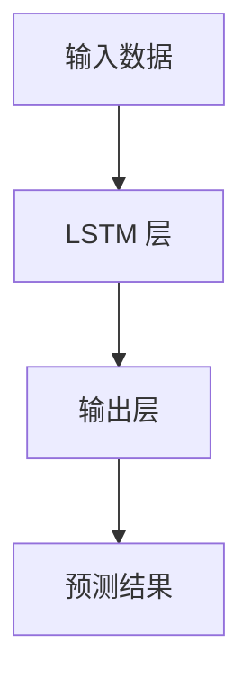
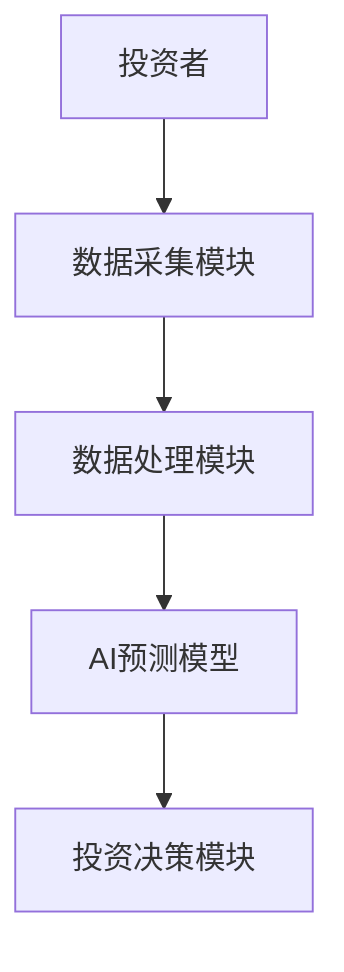

                 

# 巴菲特-芒格看人工智能：对投资决策的影响

## 关键词：巴菲特、芒格、人工智能、投资决策、价值投资、机器学习

## 摘要：  
本文探讨了巴菲特和芒格的投资理念如何与人工智能技术相结合，分析了AI技术在投资决策中的具体应用及其对传统投资策略的改变。文章从巴菲特和芒格的经典投资案例出发，结合当前人工智能技术的核心原理，深入分析了AI在数据处理、预测模型、风险评估等方面的优势，以及其对投资决策的深远影响。最后，本文总结了AI技术对投资行业的未来发展方向，并提出了投资者在AI时代应具备的新能力。

---

# 第1章 巴菲特与芒格的投资理念概述

## 1.1 巴菲特与芒格的投资哲学

### 1.1.1 巴菲特的价值投资理念

巴菲特的价值投资理念基于以下几个核心原则：

1. **长期投资**：巴菲特认为投资的本质是寻找那些具有持续竞争优势的企业，长期持有，等待价值的实现。
2. **安全边际**：在买入股票时，要留有一定的安全边际，即以低于内在价值的价格买入。
3. **企业价值**：关注企业的基本面，包括盈利能力、财务状况、行业地位等。

### 1.1.2 芒格的多元思维模型

芒格强调多元思维模型的重要性，认为投资者需要建立跨学科的知识体系，以便更好地理解企业的内在价值和市场动态。

1. **跨学科思维**：芒格倡导将物理学、心理学、经济学等学科的知识结合起来，形成多元化的思维方式。
2. **逆向思维**：芒格认为，成功的投资往往来自于逆向思考，寻找那些被市场忽视的机会。

### 1.1.3 价值投资的核心要素

价值投资的核心要素包括：

- **企业内在价值**：企业的未来现金流折现值。
- **市场价格**：低于内在价值时，投资具有安全边际。
- **竞争优势**：企业是否具有长期的竞争优势。

## 1.2 巴菲特与芒格的投资策略

### 1.2.1 长期投资与安全边际

巴菲特和芒格都强调长期投资的重要性。长期投资的核心在于寻找那些具有持续竞争优势的企业，并在市场低估时买入。

### 1.2.2 股东权益与企业价值评估

巴菲特和芒格都非常关注企业的股东权益回报率（ROE）和净利润率等指标，认为这些指标能够反映企业的盈利能力。

### 1.2.3 投资中的心理因素

芒格特别强调心理因素在投资中的重要性。他认为，投资者的情绪波动往往会导致错误的决策，因此需要通过多元思维模型来克服认知偏差。

## 1.3 巴菲特与芒格的投资案例分析

### 1.3.1 巴菲特的经典投资案例

1. **可口可乐公司**：巴菲特在20世纪80年代买入可口可乐的股票，并长期持有。他认为可口可乐具有强大的品牌优势和持续的盈利能力。
2. **美国运通**：巴菲特在20世纪90年代买入美国运通的股票，认为该公司具有强大的支付网络和客户基础。

### 1.3.2 芒格的决策智慧

1. **富国银行**：芒格在20世纪90年代买入富国银行的股票，认为该公司具有强大的财务实力和竞争优势。
2. **IBM**：芒格在2000年代初期卖出IBM的股票，认为该公司在技术领域的竞争优势逐渐减弱。

### 1.3.3 两人合作的投资模式

巴菲特和芒格的合作模式基于彼此的信任和互补性。巴菲特负责具体的股票分析，而芒格则负责从多元思维模型的角度提供决策支持。

## 1.4 本章小结

本章通过分析巴菲特和芒格的投资理念，揭示了价值投资的核心要素和长期投资的重要性。他们的投资哲学强调对企业内在价值的关注和对市场情绪的理性分析，为后续分析AI技术在投资中的应用奠定了基础。

---

# 第2章 人工智能的基本概念与现状

## 2.1 人工智能的定义与分类

### 2.1.1 人工智能的定义

人工智能（Artificial Intelligence, AI）是指计算机系统模拟人类智能的能力，包括学习、推理、自我改进等。

### 2.1.2 人工智能的分类

人工智能可以分为以下几类：

1. **弱人工智能（Narrow AI）**：专注于特定任务的AI，如语音识别、图像识别等。
2. **强人工智能（General AI）**：具有与人类相当或超越人类的通用智能。

### 2.1.3 当前主流的人工智能技术

当前主流的人工智能技术包括：

- **机器学习（Machine Learning）**：通过数据训练模型，使其能够从经验中学习。
- **深度学习（Deep Learning）**：基于人工神经网络的机器学习方法。
- **自然语言处理（NLP）**：处理和理解人类语言的技术。

## 2.2 人工智能的核心技术

### 2.2.1 机器学习

机器学习的核心在于通过数据训练模型，使其能够完成特定任务。常见的机器学习算法包括：

1. **监督学习**：模型通过标记好的数据进行训练。
2. **无监督学习**：模型通过未标记的数据进行训练。
3. **强化学习**：模型通过与环境交互来学习。

### 2.2.2 深度学习

深度学习是基于多层神经网络的机器学习方法，能够在处理复杂数据时表现出色。

### 2.2.3 自然语言处理

自然语言处理技术能够理解人类语言，并用于文本生成、情感分析等任务。

## 2.3 人工智能的现状与发展趋势

### 2.3.1 当前人工智能的应用领域

1. **图像识别**：广泛应用于安防、医疗等领域。
2. **语音识别**：应用于智能音箱、客服系统等。
3. **自然语言处理**：应用于智能客服、机器翻译等。

### 2.3.2 人工智能技术的未来趋势

1. **通用人工智能（AGI）**：开发具有通用智能的AI系统。
2. **人机协作**：AI与人类协作完成复杂任务。
3. **边缘计算**：AI技术向边缘计算方向发展。

### 2.3.3 人工智能对投资行业的影响

人工智能技术正在改变投资行业，包括：

1. **数据处理与分析**：AI能够快速处理大量数据，发现投资机会。
2. **预测模型**：AI能够构建复杂的预测模型，提高投资决策的准确性。
3. **风险评估**：AI能够帮助投资者评估投资风险。

## 2.4 本章小结

本章通过分析人工智能的基本概念和技术，揭示了AI技术在投资中的潜在应用。AI技术的快速发展为投资行业带来了新的机遇和挑战，需要投资者重新思考和调整投资策略。

---

# 第3章 人工智能在投资决策中的应用

## 3.1 数据分析与预测

### 3.1.1 数据清洗与特征提取

数据清洗是投资分析中的关键步骤，包括去除噪声数据、处理缺失值等。特征提取则是通过数据挖掘技术，找出对投资决策有重要影响的特征。

### 3.1.2 时间序列预测

时间序列预测是投资分析中的重要任务，如股票价格预测。常用的方法包括ARIMA、LSTM等。

### 3.1.3 股票价格预测模型

股票价格预测模型通常基于机器学习算法，如LSTM网络。以下是一个简单的LSTM模型示意图：

## 3.2 机器学习在投资决策中的应用

### 3.2.1 监督学习与非监督学习

监督学习用于分类和回归任务，如股票价格预测。非监督学习用于聚类分析，如客户分群。

### 3.2.2 分类与回归在投资中的应用

分类任务用于判断股票涨跌，回归任务用于预测股票价格。

### 3.2.3 聚类分析与投资组合优化

聚类分析可以帮助投资者发现市场中的潜在趋势，优化投资组合。

## 3.3 自然语言处理在投资中的应用

### 3.3.1 文本挖掘与情感分析

文本挖掘用于分析新闻、财报等文本数据，情感分析用于判断市场情绪。

### 3.3.2 新闻与社交媒体对股价的影响

社交媒体上的信息可能影响股价，NLP技术可以帮助投资者捕捉这些信息。

### 3.3.3 信息抽取与投资决策

信息抽取技术可以从新闻中提取关键信息，帮助投资者做出决策。

## 3.4 本章小结

本章通过分析人工智能在投资中的具体应用，揭示了AI技术在数据处理、预测模型和信息分析方面的优势。这些技术能够帮助投资者做出更科学的投资决策。

---

# 第4章 巴菲特与芒格视角下的AI投资分析

## 4.1 巴菲特对AI的评价

### 4.1.1 巴菲特对AI技术的肯定

巴菲特对AI技术表示肯定，认为其能够提高投资效率。

### 4.1.2 巴菲特对AI投资的谨慎态度

巴菲特认为AI技术可能会改变投资行业，但投资者仍需关注企业的基本面。

### 4.1.3 巴菲特对AI的长期视角

巴菲特认为AI技术是长期趋势，投资者需要适应这一变化。

## 4.2 芒格对AI的评价

### 4.2.1 芒格对AI技术的理性分析

芒格认为AI技术有潜力，但需要谨慎看待其应用。

### 4.2.2 芒格对AI投资的潜在风险

芒格认为AI技术可能导致过度依赖模型，忽视企业的基本面。

### 4.2.3 芒格对AI的哲学思考

芒格认为AI技术需要与人类的理性思维相结合，才能真正发挥作用。

## 4.3 巴菲特与芒格对AI投资的共识与分歧

### 4.3.1 两人的共同观点

- AI技术有潜力，能够提高投资效率。
- 投资者仍需关注企业的基本面。

### 4.3.2 两人的分歧

- 巴菲特更关注AI技术的长期影响，芒格则更关注其短期风险。
- 巴菲特认为AI技术能够帮助投资者，芒格则认为需要谨慎看待。

## 4.4 本章小结

本章通过分析巴菲特和芒格对AI投资的看法，揭示了AI技术在投资中的潜在优势和风险。投资者需要结合AI技术与传统投资理念，制定合理的投资策略。

---

# 第5章 AI对投资决策的深远影响

## 5.1 投资决策的AI驱动时代

### 5.1.1 数据驱动的投资决策

AI技术能够帮助投资者处理大量数据，发现投资机会。

### 5.1.2 投资决策的自动化与智能化

AI技术能够实现投资决策的自动化，提高投资效率。

## 5.2 AI技术对投资行业的变革

### 5.2.1 投资工具的智能化

AI技术能够优化投资工具，提供更精准的投资建议。

### 5.2.2 投资策略的多样化

AI技术能够帮助投资者制定多样化的投资策略。

## 5.3 投资者能力的重构

### 5.3.1 AI技术对投资能力的要求

投资者需要具备AI技术的基本知识，能够理解AI模型的输出结果。

### 5.3.2 投资者的心理调整

投资者需要克服对AI技术的盲目信任，保持理性思考。

## 5.4 本章小结

本章通过分析AI技术对投资决策的深远影响，揭示了投资行业的未来发展方向。投资者需要适应AI技术的应用，提升自身能力，以应对未来的投资挑战。

---

# 第6章 结论与展望

## 6.1 本章总结

本文通过分析巴菲特和芒格的投资理念，探讨了AI技术在投资决策中的应用。AI技术能够提高投资效率，但也需要结合传统投资理念，才能真正发挥作用。

## 6.2 对未来的展望

未来，AI技术将在投资行业发挥更大的作用，投资者需要结合AI技术与传统投资理念，制定合理的投资策略。

---

# 第7章 最佳实践与注意事项

## 7.1 最佳实践

### 7.1.1 结合AI技术与传统投资理念

投资者需要结合AI技术与传统投资理念，制定合理的投资策略。

### 7.1.2 保持理性思考

投资者需要克服对AI技术的盲目信任，保持理性思考。

## 7.2 注意事项

### 7.2.1 AI技术的应用风险

投资者需要关注AI技术的应用风险，如数据偏差、模型过拟合等。

### 7.2.2 数据隐私问题

投资者需要关注数据隐私问题，确保数据的安全性。

## 7.3 本章小结

本章通过总结最佳实践和注意事项，为投资者在AI时代的投资决策提供了指导。

---

# 附录

## 附录A：AI算法的数学模型

### 1. 线性回归模型

$$ y = \beta_0 + \beta_1 x + \epsilon $$

### 2. LSTM网络结构

$$ \text{ gates: } g_t, f_t, o_t $$
$$ \text{ cell state: } c_t $$
$$ \text{ hidden state: } h_t $$

## 附录B：系统架构设计

---

# 参考文献

1. 巴菲特股东大会 transcripts.
2. 芒格股东大会 transcripts.
3. 《人工智能: 理论与应用》.
4. 《投资学原理》.

--- 

# 结语

人工智能技术正在深刻改变投资行业，投资者需要结合传统投资理念与AI技术，制定合理的投资策略。巴菲特和芒格的投资哲学为我们提供了宝贵的启示，帮助我们在AI时代做出更明智的投资决策。

