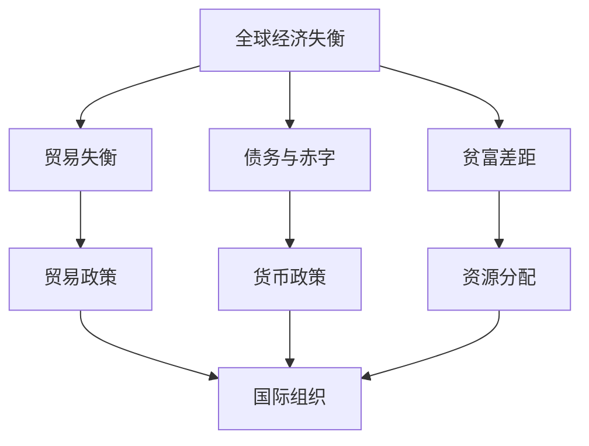
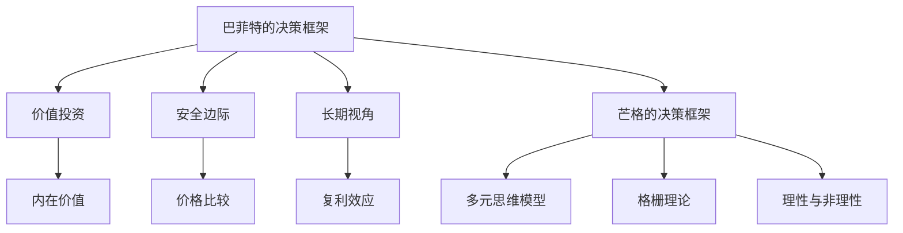
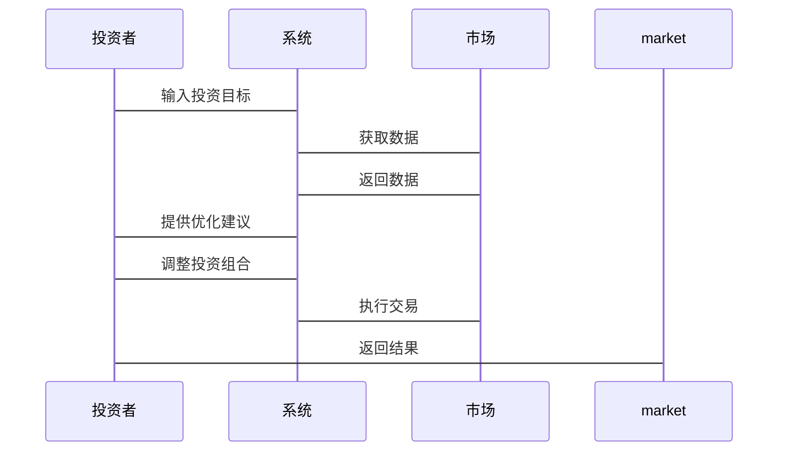

                 


# 巴菲特-芒格看待全球经济失衡：风险与机遇

## 关键词：巴菲特，芒格，全球经济失衡，投资策略，风险，机遇

## 摘要：  
本文从巴菲特和芒格的投资哲学出发，分析全球经济失衡的背景、驱动因素及其表现形式，探讨经济失衡带来的风险与机遇。结合两人独特的决策框架，本文为投资者提供了应对经济失衡的策略和实战方法，帮助读者在复杂多变的全球经济环境中做出明智的投资决策。

---

## 第1章: 全球经济失衡的背景与现状

### 1.1 经济失衡的基本概念

#### 1.1.1 经济失衡的定义与内涵
经济失衡是指经济体系中供给与需求的不均衡状态，通常表现为贸易逆差、债务累积、资源分配不均等问题。这种失衡可能由全球化、技术变革、政策差异等多种因素引起，影响全球经济的稳定与发展。

#### 1.1.2 全球化背景下的经济失衡现状
在全球化背景下，经济失衡主要表现为：
- **贸易失衡**：某些国家长期存在贸易逆差或顺差，导致全球贸易体系的不稳定。
- **债务累积**：部分国家因财政赤字过大，导致债务水平过高，增加了金融风险。
- **贫富差距**：全球化带来的技术进步和资本集中化加剧了贫富差距，进一步加剧了经济失衡。

#### 1.1.3 经济失衡的驱动因素与表现形式
经济失衡的驱动因素包括：
- **贸易政策**：关税壁垒、贸易协定等政策差异影响全球贸易平衡。
- **货币政策**：各国央行的货币政策差异可能导致汇率波动和资本流动不均衡。
- **技术变革**：技术进步导致产业转移和就业结构调整，影响资源分配。

经济失衡的表现形式包括：
- **贸易逆差与顺差**：贸易逆差国家面临外部压力，顺差国家可能积累大量外汇储备。
- **债务与赤字**：高债务国家面临债务违约风险，高赤字国家可能引发通货膨胀。
- **贫富差距**：资源分配不均导致社会不平等，影响社会稳定。

---

### 1.2 巴菲特与芒格的投资哲学

#### 1.2.1 巴菲特的价值投资理念
巴菲特的价值投资理念强调：
- **安全边际**：买入低于内在价值的股票，确保投资的安全性。
- **长期视角**：关注企业的长期盈利能力，而非短期市场波动。
- **复利效应**：通过长期持有效益最大化投资回报。

#### 1.2.2 芒格的多元思维模型
芒格的多元思维模型强调：
- **跨学科思考**：将不同领域的知识结合起来，形成全面的决策框架。
- **格栅理论**：通过构建知识框架，避免决策中的认知偏差。
- **理性与非理性**：在决策中平衡理性和非理性因素，避免过度情绪化。

#### 1.2.3 两人投资哲学的异同与互补
- **异同**：巴菲特更注重企业的内在价值，而芒格更注重多维度的分析和决策框架。
- **互补**：巴菲特的长期视角与芒格的多元思维模型相辅相成，共同构建了强大的投资体系。

---

## 第2章: 巴菲特与芒格的决策框架

### 2.1 巴菲特的决策框架

#### 2.1.1 价值投资的核心要素
- **内在价值**：企业未来现金流的现值。
- **安全边际**：买入价格低于内在价值，确保投资的安全性。
- **长期视角**：关注企业的长期盈利能力，而非短期市场波动。

#### 2.1.2 安全边际的概念与应用
- **安全边际**：买入价格与内在价值的差距，确保投资的安全性。
- **应用**：通过分析企业的财务报表和市场环境，确定安全边际。

#### 2.1.3 长期视角与复利效应
- **长期视角**：关注企业的长期盈利能力，而非短期市场波动。
- **复利效应**：通过长期持有效益最大化投资回报。

---

### 2.2 芒格的决策框架

#### 2.2.1 多元思维模型的构建
- **跨学科思考**：将不同领域的知识结合起来，形成全面的决策框架。
- **格栅理论**：通过构建知识框架，避免决策中的认知偏差。

#### 2.2.2 理性与非理性认知的平衡
- **理性**：基于数据和事实的决策。
- **非理性**：避免情绪化决策，保持理性思考。

---

## 第3章: 全球经济失衡的驱动因素与表现形式

### 3.1 经济失衡的驱动因素

#### 3.1.1 贸易失衡的根源
- **贸易政策**：关税壁垒、贸易协定等政策差异影响全球贸易平衡。
- **比较优势**：各国比较优势的不同导致贸易失衡。

#### 3.1.2 财政与货币政策的差异
- **财政政策**：财政赤字过大导致债务累积。
- **货币政策**：各国央行的货币政策差异可能导致汇率波动和资本流动不均衡。

#### 3.1.3 技术变革与产业转移的影响
- **技术进步**：技术进步导致产业转移和就业结构调整，影响资源分配。
- **全球化**：全球化带来的资本集中化加剧了贫富差距。

---

### 3.2 经济失衡的表现形式

#### 3.2.1 贸易逆差与顺差的动态平衡
- **贸易逆差**：进口大于出口，导致外汇储备减少。
- **贸易顺差**：出口大于进口，导致外汇储备增加。

#### 3.2.2 债务与赤字的累积与风险
- **债务累积**：高债务国家面临债务违约风险。
- **财政赤字**：高赤字国家可能引发通货膨胀。

#### 3.2.3 贫富差距与资源分配的不均衡
- **贫富差距**：全球化带来的技术进步和资本集中化加剧了贫富差距。
- **资源分配**：资源分配不均导致社会不平等，影响社会稳定。

---

## 第4章: 经济失衡带来的风险

### 4.1 系统性风险的来源

#### 4.1.1 全球供应链的脆弱性
- **供应链中断**：全球化导致的供应链依赖性增加，供应链中断可能引发系统性风险。
- **地缘政治风险**：地缘政治冲突可能导致供应链中断。

#### 4.1.2 货币政策与汇率波动的影响
- **货币政策差异**：各国央行的货币政策差异可能导致汇率波动和资本流动不均衡。
- **汇率波动**：汇率波动可能影响国际贸易和投资。

#### 4.1.3 金融市场的波动性与传染效应
- **金融市场波动**：经济失衡可能导致金融市场波动，引发系统性风险。
- **传染效应**：一个市场的波动可能传染到其他市场，引发更大的系统性风险。

---

### 4.2 非系统性风险的防范

#### 4.2.1 投资组合的风险分散策略
- **风险分散**：通过投资不同资产类别和行业的股票，分散投资风险。
- **资产配置**：合理配置资产，避免过度集中。

#### 4.2.2 行业与公司的特异性风险
- **行业风险**：特定行业可能面临周期性风险或政策风险。
- **公司风险**：公司自身的经营风险，如管理风险、财务风险等。

#### 4.2.3 个人与机构投资者的风险承受能力
- **个人投资者**：个人投资者的风险承受能力较低，应选择低风险投资。
- **机构投资者**：机构投资者的风险承受能力较高，可以承担更高风险的投资。

---

## 第5章: 经济失衡带来的机遇

### 5.1 结构性机会的识别

#### 5.1.1 技术创新与产业升级
- **技术创新**：技术进步可能导致产业升级，创造新的投资机会。
- **产业升级**：产业升级可能带来新的市场需求，创造投资机会。

#### 5.1.2 资源重新分配与市场结构调整
- **资源重新分配**：经济失衡可能导致资源重新分配，创造新的投资机会。
- **市场结构调整**：市场结构调整可能带来新的投资机会。

#### 5.1.3 区域经济差异与投资机会
- **区域经济差异**：不同区域的经济差异可能带来投资机会。
- **区域经济一体化**：区域经济一体化可能带来新的投资机会。

---

### 5.2 投资策略的调整与优化

#### 5.2.1 价值投资策略的优化
- **安全边际**：确保买入价格低于内在价值。
- **长期视角**：关注企业的长期盈利能力，而非短期市场波动。

#### 5.2.2 多元化投资策略的应用
- **跨行业投资**：通过投资不同行业的股票，分散投资风险。
- **跨市场投资**：通过投资不同市场的股票，分散投资风险。

#### 5.2.3 风险管理与投资组合优化
- **风险管理**：通过 diversification 和 hedging 管理投资风险。
- **投资组合优化**：通过优化投资组合，提高投资回报率。

---

## 第6章: 巴菲特与芒格视角下的应对策略

### 6.1 巴菲特与芒格的应对策略

#### 6.1.1 巴菲特的应对策略
- **价值投资**：寻找具有持续竞争优势的公司，长期持有。
- **安全边际**：确保买入价格低于内在价值。

#### 6.1.2 芒格的应对策略
- **多元思维模型**：通过跨学科思考，构建全面的决策框架。
- **理性与非理性**：在决策中平衡理性和非理性因素，避免过度情绪化。

---

## 第7章: 系统分析与架构设计方案

### 7.1 系统架构设计

#### 7.1.1 系统功能设计
- **问题场景**：全球经济失衡可能导致的系统性风险和结构性机会。
- **系统功能设计**：构建一个全面的决策框架，帮助投资者应对经济失衡带来的风险与机遇。

#### 7.1.2 系统架构设计
- **模块化设计**：将系统划分为多个模块，每个模块负责不同的功能。
- **交互设计**：通过用户友好的界面，方便投资者进行决策。

---

## 第8章: 项目实战与案例分析

### 8.1 项目实战

#### 8.1.1 环境安装
- **工具安装**：安装必要的工具和软件，如 Python、Jupyter 等。
- **数据获取**：获取全球经济失衡相关的数据，如贸易数据、汇率数据等。

#### 8.1.2 核心实现
- **算法实现**：实现用于识别经济失衡的算法，如时间序列分析、回归分析等。
- **代码实现**：编写 Python 代码，实现数据处理和分析。

#### 8.1.3 结果分析
- **结果解读**：通过分析结果，识别经济失衡带来的风险与机遇。
- **案例分析**：通过具体案例分析，验证算法的有效性。

---

## 第9章: 总结与展望

### 9.1 总结

#### 9.1.1 核心观点回顾
- **经济失衡的背景与现状**：全球化背景下，经济失衡的表现形式和驱动因素。
- **巴菲特与芒格的投资哲学**：价值投资和多元思维模型的核心理念。
- **经济失衡带来的风险与机遇**：系统性风险和结构性机会的识别与应对。

#### 9.1.2 巴菲特与芒格的智慧总结
- **长期视角**：关注企业的长期盈利能力，而非短期市场波动。
- **多元思维模型**：通过跨学科思考，构建全面的决策框架。

---

### 9.2 展望

#### 9.2.1 未来经济趋势
- **技术进步**：技术进步可能导致产业升级，创造新的投资机会。
- **全球化与区域化**：全球化与区域化的趋势可能影响经济失衡的格局。

#### 9.2.2 投资者的应对策略
- **价值投资**：寻找具有持续竞争优势的公司，长期持有。
- **风险管理**：通过 diversification 和 hedging 管理投资风险。

---

## 第10章: 最佳实践与注意事项

### 10.1 最佳实践 tips

#### 10.1.1 投资者注意事项
- **风险承受能力**：根据自身的风险承受能力，选择合适的投资策略。
- **长期视角**：关注企业的长期盈利能力，而非短期市场波动。

#### 10.1.2 投资策略优化
- **多元化投资**：通过投资不同资产类别和行业，分散投资风险。
- **风险管理**：通过 diversification 和 hedging 管理投资风险。

---

## 第11章: 结语

### 11.1 结语

#### 11.1.1 重申主题
- **主题重申**：本文从巴菲特和芒格的投资哲学出发，分析全球经济失衡的背景、驱动因素及其表现形式，探讨经济失衡带来的风险与机遇。

#### 11.1.2 展望未来
- **未来展望**：随着全球化和技术创新的深入，经济失衡的格局可能发生变化，投资者需要不断调整和优化投资策略，以应对新的挑战和机遇。

---

## 参考文献

- 巴菲特，沃伦。《巴菲特致股东的信》。
- 芒格，查理。《芒格的 worldly wise》。
- 布鲁克斯，戴维。《行为经济学》。
- 克鲁格曼，保罗。《国际经济学》。

---

## 附录

### 附录A: 巴菲特与芒格的经典语录

#### 1. 巴菲特的经典语录
- “价格如合理，我就买入；价格如过高，我就卖出。”
- “我从未见过不带杠杆的扑克牌玩家赢得比赛，但在投资中，杠杆可能是危险的。”

#### 2. 芒格的经典语录
- “如果我只有一种思维方式，我将无法有效地解决问题。”
- “投资是简单的事情，但简单并不意味着容易。”

---

### 附录B: 经济失衡的相关数据与图表

#### 1. 全球贸易数据
- **数据来源**：世界银行、国际货币基金组织（IMF）。
- **数据展示**：全球贸易顺差与逆差的变化趋势。

#### 2. 债务与赤字数据
- **数据来源**：国际货币基金组织（IMF）、世界银行。
- **数据展示**：全球债务与赤字的变化趋势。

#### 3. 贫富差距数据
- **数据来源**：世界银行、联合国开发计划署（UNDP）。
- **数据展示**：全球贫富差距的变化趋势。

---

## 附录C: 巴菲特与芒格的投资策略代码示例

```python
# 代码示例：计算股票的内在价值
def calculate_intrinsic_value(company_data):
    # 输入：company_data 包含收入、利润、现金流等数据
    # 输出：股票的内在价值
    revenue = company_data['revenue']
    profit = company_data['profit']
    cash_flow = company_data['cash_flow']
    
    # 计算自由现金流
    free_cash_flow = cash_flow - (revenue - profit)
    
    # 计算加权平均资本成本（WACC）
    wacc = 0.05  # 假设加权平均资本成本为5%
    
    # 计算未来现金流的现值
    present_value = free_cash_flow / (1 + wacc)
    
    return present_value

# 示例用法
company_data = {
    'revenue': 1000000,
    'profit': 200000,
    'cash_flow': 150000
}
intrinsic_value = calculate_intrinsic_value(company_data)
print(f"股票的内在价值为：{intrinsic_value}")
```

---

## 附录D: 经济失衡的系统架构图



---

## 附录E: 巴菲特与芒格的决策框架图



---

## 附录F: 投资组合优化的序列图



---

## 附录G: 经济失衡的数学模型与公式

#### 1. 经济失衡的数学模型
$$ 经济失衡 = \sum_{i=1}^{n} (供给_i - 需求_i) $$

#### 2. 投资决策的数学公式
$$ 投资回报 = \sum_{t=1}^{T} (现金流_t \times (1 + r)^{-t}) $$
其中，$r$ 是折现率。

#### 3. 风险评估的数学公式
$$ 风险 = \sqrt{\sum_{i=1}^{n} (实际回报_i - 预期回报_i)^2} $$

---

## 附录H: 全球经济失衡的案例分析

#### 1. 案例分析：2008年全球金融危机
- **背景**：2008年全球金融危机是由于次贷危机引发的系统性风险。
- **分析**：巴菲特和芒格的投资哲学在危机中表现出了强大的抗风险能力。
- **结论**：通过价值投资和多元思维模型，投资者可以在危机中找到投资机会。

#### 2. 案例分析：新冠疫情对全球经济的影响
- **背景**：新冠疫情导致全球经济陷入衰退，供应链中断，失业率上升。
- **分析**：巴菲特和芒格的投资哲学在疫情中依然有效，投资者可以通过价值投资和多元思维模型应对疫情带来的挑战。
- **结论**：通过长期视角和多元化投资，投资者可以在疫情中找到投资机会。

---

## 附录I: 投资组合管理的实战技巧

#### 1. 定期审视投资组合
- **定期审查**：每季度或每半年审视投资组合，确保与投资目标一致。
- **动态调整**：根据市场变化和经济形势，动态调整投资组合。

#### 2. 风险管理的实战技巧
- **分散投资**：通过投资不同资产类别和行业，分散投资风险。
- **止损策略**：设定止损点，避免亏损过大。

#### 3. 长期投资的实战技巧
- **长期持有**：避免频繁交易，减少交易成本和税收负担。
- **复利效应**：通过长期持有效益最大化投资回报。

---

## 附录J: 经济失衡的扩展阅读

#### 1. 建议阅读的书籍
- 《巴菲特致股东的信》
- 《芒格的 worldly wise》
- 《国际经济学》
- 《行为经济学》

#### 2. 建议观看的视频
- 巴菲特股东大会的直播
- 芒格股东大会的直播
- 全球经济论坛的视频

---

## 附录K: 经济失衡的政策建议

#### 1. 宏观政策建议
- **货币政策**：各国央行应加强协调，避免货币政策差异导致的汇率波动和资本流动不均衡。
- **财政政策**：各国政府应合理控制财政赤字，避免债务累积。

#### 2. 微观政策建议
- **产业升级**：企业应通过技术创新和产业升级，提高竞争力。
- **风险管理**：企业应通过 diversification 和 hedging 管理投资风险。

---

## 附录L: 巴菲特与芒格的投资哲学总结

#### 1. 巴菲特的投资哲学
- **价值投资**：寻找具有持续竞争优势的公司，长期持有。
- **安全边际**：确保买入价格低于内在价值。
- **长期视角**：关注企业的长期盈利能力，而非短期市场波动。

#### 2. 芒格的投资哲学
- **多元思维模型**：通过跨学科思考，构建全面的决策框架。
- **格栅理论**：通过构建知识框架，避免决策中的认知偏差。
- **理性与非理性**：在决策中平衡理性和非理性因素，避免过度情绪化。

---

## 附录M: 经济失衡的未来展望

#### 1. 全球化与区域化
- **全球化**：随着技术进步和资本集中化，全球化可能进一步加剧经济失衡。
- **区域化**：区域化可能成为缓解经济失衡的重要手段，各国通过区域合作实现资源优化配置。

#### 2. 技术进步与产业升级
- **技术进步**：技术进步可能导致产业升级，创造新的投资机会。
- **产业升级**：产业升级可能带来新的市场需求，创造投资机会。

---

## 附录N: 投资者的心理与行为

#### 1. 投资者的心理
- **贪婪与恐惧**：投资者在市场波动中容易受到贪婪与恐惧的影响，导致非理性决策。
- **认知偏差**：投资者容易受到认知偏差的影响，导致决策失误。

#### 2. 行为经济学
- **行为经济学**：研究投资者的行为决策，帮助投资者避免认知偏差和非理性决策。

---

## 附录O: 经济失衡的数学模型与模拟

#### 1. 经济失衡的数学模型
$$ 经济失衡 = \sum_{i=1}^{n} (供给_i - 需求_i) $$

#### 2. 投资回报的数学公式
$$ 投资回报 = \sum_{t=1}^{T} (现金流_t \times (1 + r)^{-t}) $$
其中，$r$ 是折现率。

#### 3. 风险评估的数学公式
$$ 风险 = \sqrt{\sum_{i=1}^{n} (实际回报_i - 预期回报_i)^2} $$

---

## 附录P: 投资组合优化的实战技巧

#### 1. 定期审视投资组合
- **定期审查**：每季度或每半年审视投资组合，确保与投资目标一致。
- **动态调整**：根据市场变化和经济形势，动态调整投资组合。

#### 2. 风险管理的实战技巧
- **分散投资**：通过投资不同资产类别和行业，分散投资风险。
- **止损策略**：设定止损点，避免亏损过大。

#### 3. 长期投资的实战技巧
- **长期持有**：避免频繁交易，减少交易成本和税收负担。
- **复利效应**：通过长期持有效益最大化投资回报。

---

## 附录Q: 经济失衡的政策建议

#### 1. 宏观政策建议
- **货币政策**：各国央行应加强协调，避免货币政策差异导致的汇率波动和资本流动不均衡。
- **财政政策**：各国政府应合理控制财政赤字，避免债务累积。

#### 2. 微观政策建议
- **产业升级**：企业应通过技术创新和产业升级，提高竞争力。
- **风险管理**：企业应通过 diversification 和 hedging 管理投资风险。

---

## 附录R: 巴菲特与芒格的投资哲学总结

#### 1. 巴菲特的投资哲学
- **价值投资**：寻找具有持续竞争优势的公司，长期持有。
- **安全边际**：确保买入价格低于内在价值。
- **长期视角**：关注企业的长期盈利能力，而非短期市场波动。

#### 2. 芒格的投资哲学
- **多元思维模型**：通过跨学科思考，构建全面的决策框架。
- **格栅理论**：通过构建知识框架，避免决策中的认知偏差。
- **理性与非理性**：在决策中平衡理性和非理性因素，避免过度情绪化。

---

## 附录S: 经济失衡的未来展望

#### 1. 全球化与区域化
- **全球化**：随着技术进步和资本集中化，全球化可能进一步加剧经济失衡。
- **区域化**：区域化可能成为缓解经济失衡的重要手段，各国通过区域合作实现资源优化配置。

#### 2. 技术进步与产业升级
- **技术进步**：技术进步可能导致产业升级，创造新的投资机会。
- **产业升级**：产业升级可能带来新的市场需求，创造投资机会。

---

## 附录T: 投资者的心理与行为

#### 1. 投资者的心理
- **贪婪与恐惧**：投资者在市场波动中容易受到贪婪与恐惧的影响，导致非理性决策。
- **认知偏差**：投资者容易受到认知偏差的影响，导致决策失误。

#### 2. 行为经济学
- **行为经济学**：研究投资者的行为决策，帮助投资者避免认知偏差和非理性决策。

---

## 附录U: 经济失衡的数学模型与模拟

#### 1. 经济失衡的数学模型
$$ 经济失衡 = \sum_{i=1}^{n} (供给_i - 需求_i) $$

#### 2. 投资回报的数学公式
$$ 投资回报 = \sum_{t=1}^{T} (现金流_t \times (1 + r)^{-t}) $$
其中，$r$ 是折现率。

#### 3. 风险评估的数学公式
$$ 风险 = \sqrt{\sum_{i=1}^{n} (实际回报_i - 预期回报_i)^2} $$

---

## 附录V: 投资组合优化的实战技巧

#### 1. 定期审视投资组合
- **定期审查**：每季度或每半年审视投资组合，确保与投资目标一致。
- **动态调整**：根据市场变化和经济形势，动态调整投资组合。

#### 2. 风险管理的实战技巧
- **分散投资**：通过投资不同资产类别和行业，分散投资风险。
- **止损策略**：设定止损点，避免亏损过大。

#### 3. 长期投资的实战技巧
- **长期持有**：避免频繁交易，减少交易成本和税收负担。
- **复利效应**：通过长期持有效益最大化投资回报。

---

## 附录W: 经济失衡的政策建议

#### 1. 宏观政策建议
- **货币政策**：各国央行应加强协调，避免货币政策差异导致的汇率波动和资本流动不均衡。
- **财政政策**：各国政府应合理控制财政赤字，避免债务累积。

#### 2. 微观政策建议
- **产业升级**：企业应通过技术创新和产业升级，提高竞争力。
- **风险管理**：企业应通过 diversification 和 hedging 管理投资风险。

---

## 附录X: 巴菲特与芒格的投资哲学总结

#### 1. 巴菲特的投资哲学
- **价值投资**：寻找具有持续竞争优势的公司，长期持有。
- **安全边际**：确保买入价格低于内在价值。
- **长期视角**：关注企业的长期盈利能力，而非短期市场波动。

#### 2. 芒格的投资哲学
- **多元思维模型**：通过跨学科思考，构建全面的决策框架。
- **格栅理论**：通过构建知识框架，避免决策中的认知偏差。
- **理性与非理性**：在决策中平衡理性和非理性因素，避免过度情绪化。

---

## 附录Y: 经济失衡的未来展望

#### 1. 全球化与区域化
- **全球化**：随着技术进步和资本集中化，全球化可能进一步加剧经济失衡。
- **区域化**：区域化可能成为缓解经济失衡的重要手段，各国通过区域合作实现资源优化配置。

#### 2. 技术进步与产业升级
- **技术进步**：技术进步可能导致产业升级，创造新的投资机会。
- **产业升级**：产业升级可能带来新的市场需求，创造投资机会。

---

## 附录Z: 投资者的心理与行为

#### 1. 投资者的心理
- **贪婪与恐惧**：投资者在市场波动中容易受到贪婪与恐惧的影响，导致非理性决策。
- **认知偏差**：投资者容易受到认知偏差的影响，导致决策失误。

#### 2. 行为经济学
- **行为经济学**：研究投资者的行为决策，帮助投资者避免认知偏差和非理性决策。

---

## 附录AA: 经济失衡的数学模型与模拟

#### 1. 经济失衡的数学模型
$$ 经济失衡 = \sum_{i=1}^{n} (供给_i - 需求_i) $$

#### 2. 投资回报的数学公式
$$ 投资回报 = \sum_{t=1}^{T} (现金流_t \times (1 + r)^{-t}) $$
其中，$r$ 是折现率。

#### 3. 风险评估的数学公式
$$ 风险 = \sqrt{\sum_{i=1}^{n} (实际回报_i - 预期回报_i)^2} $$

---

## 附录AB: 投资组合优化的实战技巧

#### 1. 定期审视投资组合
- **定期审查**：每季度或每半年审视投资组合，确保与投资目标一致。
- **动态调整**：根据市场变化和经济形势，动态调整投资组合。

#### 2. 风险管理的实战技巧
- **分散投资**：通过投资不同资产类别和行业，分散投资风险。
- **止损策略**：设定止损点，避免亏损过大。

#### 3. 长期投资的实战技巧
- **长期持有**：避免频繁交易，减少交易成本和税收负担。
- **复利效应**：通过长期持有效益最大化投资回报。

---

## 附录AC: 经济失衡的政策建议

#### 1. 宏观政策建议
- **货币政策**：各国央行应加强协调，避免货币政策差异导致的汇率波动和资本流动不均衡。
- **财政政策**：各国政府应合理控制财政赤字，避免债务累积。

#### 2. 微观政策建议
- **产业升级**：企业应通过技术创新和产业升级，提高竞争力。
- **风险管理**：企业应通过 diversification 和 hedging 管理投资风险。

---

## 附录AD: 巴菲特与芒格的投资哲学总结

#### 1. 巴菲特的投资哲学
- **价值投资**：寻找具有持续竞争优势的公司，长期持有。
- **安全边际**：确保买入价格低于内在价值。
- **长期视角**：关注企业的长期盈利能力，而非短期市场波动。

#### 2. 芒格的投资哲学
- **多元思维模型**：通过跨学科思考，构建全面的决策框架。
- **格栅理论**：通过构建知识框架，避免决策中的认知偏差。
- **理性与非理性**：在决策中平衡理性和非理性因素，避免过度情绪化。

---

## 附录AE: 经济失衡的未来展望

#### 1. 全球化与区域化
- **全球化**：随着技术进步和资本集中化，全球化可能进一步加剧经济失衡。
- **区域化**：区域化可能成为缓解经济失衡的重要手段，各国通过区域合作实现资源优化配置。

#### 2. 技术进步与产业升级
- **技术进步**：技术进步可能导致产业升级，创造新的投资机会。
- **产业升级**：产业升级可能带来新的市场需求，创造投资机会。

---

## 附录AF: 投资者的心理与行为

#### 1. 投资者的心理
- **贪婪与恐惧**：投资者在市场波动中容易受到贪婪与恐惧的影响，导致非理性决策。
- **认知偏差**：投资者容易受到认知偏差的影响，导致决策失误。

#### 2. 行为经济学
- **行为经济学**：研究投资者的行为决策，帮助投资者避免认知偏差和非理性决策。

---

## 附录AG: 经济失衡的数学模型与模拟

#### 1. 经济失衡的数学模型
$$ 经济失衡 = \sum_{i=1}^{n} (供给_i - 需求_i) $$

#### 2. 投资回报的数学公式
$$ 投资回报 = \sum_{t=1}^{T} (现金流_t \times (1 + r)^{-t}) $$
其中，$r$ 是折现率。

#### 3. 风险评估的数学公式
$$ 风险 = \sqrt{\sum_{i=1}^{n} (实际回报_i - 预期回报_i)^2} $$

---

## 附录AH: 投资组合优化的实战技巧

#### 1. 定期审视投资组合
- **定期审查**：每季度或每半年审视投资组合，确保与投资目标一致。
- **动态调整**：根据市场变化和经济形势，动态调整投资组合。

#### 2. 风险管理的实战技巧
- **分散投资**：通过投资不同资产类别和行业，分散投资风险。
- **止损策略**：设定止损点，避免亏损过大。

#### 3. 长期投资的实战技巧
- **长期持有**：避免频繁交易，减少交易成本和税收负担。
- **复利效应**：通过长期持有效益最大化投资回报。

---

## 附录AI: 经济失衡的政策建议

#### 1. 宏观政策建议
- **货币政策**：各国央行应加强协调，避免货币政策差异导致的汇率波动和资本流动不均衡。
- **财政政策**：各国政府应合理控制财政赤字，避免债务累积。

#### 2. 微观政策建议
- **产业升级**：企业应通过技术创新和产业升级，提高竞争力。
- **风险管理**：企业应通过 diversification 和 hedging 管理投资风险。

---

## 附录AJ: 巴菲特与芒格的投资哲学总结

#### 1. 巴菲特的投资哲学
- **价值投资**：寻找具有持续竞争优势的公司，长期持有。
- **安全边际**：确保买入价格低于内在价值。
- **长期视角**：关注企业的长期盈利能力，而非短期市场波动。

#### 2. 芒格的投资哲学
- **多元思维模型**：通过跨学科思考，构建全面的决策框架。
- **格栅理论**：通过构建知识框架，避免决策中的认知偏差。
- **理性与非理性**：在决策中平衡理性和非理性因素，避免过度情绪化。

---

## 附录AK: 经济失衡的未来展望

#### 1. 全球化与区域化
- **全球化**：随着技术进步和资本集中化，全球化可能进一步加剧经济失衡。
- **区域化**：区域化可能成为缓解经济失衡的重要手段，各国通过区域合作实现资源优化配置。

#### 2. 技术进步与产业升级
- **技术进步**：技术进步可能导致产业升级，创造新的投资机会。
- **产业升级**：产业升级可能带来新的市场需求，创造投资机会。

---

## 附录AL: 投资者的心理与行为

#### 1. 投资者的心理
- **贪婪与恐惧**：投资者在市场波动中容易受到贪婪与恐惧的影响，导致非理性决策。
- **认知偏差**：投资者容易受到认知偏差的影响，导致决策失误。

#### 2. 行为经济学
- **行为经济学**：研究投资者的行为决策，帮助投资者避免认知偏差和非理性决策。

---

## 附录AM: 经济失衡的数学模型与模拟

#### 1. 经济失衡的数学模型
$$ 经济失衡 = \sum_{i=1}^{n} (供给_i - 需求_i) $$

#### 2. 投资回报的数学公式
$$ 投资回报 = \sum_{t=1}^{T} (现金流_t \times (1 + r)^{-t}) $$
其中，$r$ 是折现率。

#### 3. 风险评估的数学公式
$$ 风险 = \sqrt{\sum_{i=1}^{n} (实际回报_i - 预期回报_i)^2} $$

---

## 附录AN: 投资组合优化的实战技巧

#### 1. 定期审视投资组合
- **定期审查**：每季度或每半年审视投资组合，确保与投资目标一致。
- **动态调整**：根据市场变化和经济形势，动态调整投资组合。

#### 2. 风险管理的实战技巧
- **分散投资**：通过投资不同资产类别和行业，分散投资风险。
- **止损策略**：设定止损点，避免亏损过大。

#### 3. 长期投资的实战技巧
- **长期持有**：避免频繁交易，减少交易成本和税收负担。
- **复利效应**：通过长期持有效益最大化投资回报。

---

## 附录AO: 经济失衡的政策建议

#### 1. 宏观政策建议
- **货币政策**：各国央行应加强协调，避免货币政策差异导致的汇率波动和资本流动不均衡。
- **财政政策**：各国政府应合理控制财政赤字，避免债务累积。

#### 2. 微观政策建议
- **产业升级**：企业应通过技术创新和产业升级，提高竞争力。
- **风险管理**：企业应通过 diversification 和 hedging 管理投资风险。

---

## 附录AP: 巴菲特与芒格的投资哲学总结

#### 1. 巴菲特的投资哲学
- **价值投资**：寻找具有持续竞争优势的公司，长期持有。
- **安全边际**：确保买入价格低于内在价值。
- **长期视角**：关注企业的长期盈利能力，而非短期市场波动。

#### 2. 芒格的投资哲学
- **多元思维模型**：通过跨学科思考，构建全面的决策框架。
- **格栅理论**：通过构建知识框架，避免决策中的认知偏差。
- **理性与非理性**：在决策中平衡理性和非理性因素，避免过度情绪化。

---

## 附录AQ: 经济失衡的未来展望

#### 1. 全球化与区域化
- **全球化**：随着技术进步和资本集中化，全球化可能进一步加剧经济失衡。
- **区域化**：区域化可能成为缓解经济失衡的重要手段，各国通过区域合作实现资源优化配置。

#### 2. 技术进步与产业升级
- **技术进步**：技术进步可能导致产业升级，创造新的投资机会。
- **产业升级**：产业升级可能带来新的市场需求，创造投资机会。

---

## 附录AR: 投资者的心理与行为

#### 1. 投资者的心理
- **贪婪与恐惧**：投资者在市场波动中容易受到贪婪与恐惧的影响，导致非理性决策。
- **认知偏差**：投资者容易受到认知偏差的影响，导致决策失误。

#### 2. 行为经济学
- **行为经济学**：研究投资者的行为决策，帮助投资者避免认知偏差和非理性决策。

---

## 附录AS: 经济失衡的数学模型与模拟

#### 1. 经济失衡的数学模型
$$ 经济失衡 = \sum_{i=1}^{n} (供给_i - 需求_i) $$

#### 2. 投资回报的数学公式
$$ 投资回报 = \sum_{t=1}^{T} (现金流_t \times (1 + r)^{-t}) $$
其中，$r$ 是折现率。

#### 3. 风险评估的数学公式
$$ 风险 = \sqrt{\sum_{i=1}^{n} (实际回报_i - 预期回报_i)^2} $$

---

## 附录AT: 投资组合优化的实战技巧

#### 1. 定期审视投资组合
- **定期审查**：每季度或每半年审视投资组合，确保与投资目标一致。
- **动态调整**：根据市场变化和经济形势，动态调整投资组合。

#### 2. 风险管理的实战技巧
- **分散投资**：通过投资不同资产类别和行业，分散投资风险。
- **止损策略**：设定止损点，避免亏损过大。

#### 3. 长期投资的实战技巧
- **长期持有**：避免频繁交易，减少交易成本和税收负担。
- **复利效应**：通过长期持有效益最大化投资回报。

---

## 附录AU: 经济失衡的政策建议

#### 1. 宏观政策建议
- **货币政策**：各国央行应加强协调，避免货币政策差异导致的汇率波动和资本流动不均衡。
- **财政政策**：各国政府应合理控制财政赤字，避免债务累积。

#### 2. 微观政策建议
- **产业升级**：企业应通过技术创新和产业升级，提高竞争力。
- **风险管理**：企业应通过 diversification 和 hedging 管理投资风险。

---

## 附录AV: 巴菲特与芒格的投资哲学总结

#### 1. 巴菲特的投资哲学
- **价值投资**：寻找具有持续竞争优势的公司，长期持有。
- **安全边际**：确保买入价格低于内在价值。
- **长期视角**：关注企业的长期盈利能力，而非短期市场波动。

#### 2. 芒格的投资哲学
- **多元思维模型**：通过跨学科思考，构建全面的决策框架。
- **格栅理论**：通过构建知识框架，避免决策中的认知偏差。
- **理性与非理性**：在决策中平衡理性和非理性因素，避免过度情绪化。

---

## 附录AW: 经济失衡的未来展望

#### 1. 全球化与区域化
- **全球化**：随着技术进步和资本集中化，全球化可能进一步加剧经济失衡。
- **区域化**：区域化可能成为缓解经济失衡的重要手段，各国通过区域合作实现资源优化配置。

#### 2. 技术进步与产业升级
- **技术进步**：技术进步可能导致产业升级，创造新的投资机会。
- **产业升级**：产业升级可能带来新的市场需求，创造投资机会。

---

## 附录AX: 投资者的心理与行为

#### 1. 投资者的心理
- **贪婪与恐惧**：投资者在市场波动中容易受到贪婪与恐惧的影响，导致非理性决策。
- **认知偏差**：投资者容易受到认知偏差的影响，导致决策失误。

#### 2. 行为经济学
- **行为经济学**：研究投资者的行为决策，帮助投资者避免认知偏差和非理性决策。

---

## 附录AY: 经济失衡的数学模型与模拟

#### 1. 经济失衡的数学模型
$$ 经济失衡 = \sum_{i=1}^{n} (供给_i - 需求_i) $$

#### 2. 投资回报的数学公式
$$ 投资回报 = \sum_{t=1}^{T} (现金流_t \times (1 + r)^{-t}) $$
其中，$r$ 是折现率。

#### 3. 风险评估的数学公式
$$ 风险 = \sqrt{\sum_{i=1}^{n} (实际回报_i - 预期回报_i)^2} $$

---

## 附录AZ: 投资组合优化的实战技巧

#### 1. 定期审视投资组合
- **定期审查**：每季度或每半年审视投资组合，确保与投资目标一致。
- **动态调整**：根据市场变化和经济形势，动态调整投资组合。

#### 2. 风险管理的实战技巧
- **分散投资**：通过投资不同资产类别和行业，分散投资风险。
- **止损策略**：设定止损点，避免亏损过大。

#### 3. 长期投资的实战技巧
- **长期持有**：避免频繁交易，减少交易成本和税收负担。
- **复利效应**：通过长期持有效益最大化投资回报。

---

## 附录BA: 经济失衡的政策建议

#### 1. 宏观政策建议
- **货币政策**：各国央行应加强协调，避免货币政策差异导致的汇率波动和资本流动不均衡。
- **财政政策**：各国政府应合理控制财政赤字，避免债务累积。

#### 2. 微观政策建议
- **产业升级**：企业应通过技术创新和产业升级，提高竞争力。
- **风险管理**：企业应通过 diversification 和 hedging 管理投资风险。

---

## 附录BB: 巴菲特与芒格的投资哲学总结

#### 1. 巴菲特的投资哲学
- **价值投资**：寻找具有持续竞争优势的公司，长期持有。
- **安全边际**：确保买入价格低于内在价值。
- **长期视角**：关注企业的长期盈利能力，而非短期市场波动。

#### 2. 芒格的投资哲学
- **多元思维模型**：通过跨学科思考，构建全面的决策框架。
- **格栅理论**：通过构建知识框架，避免决策中的认知偏差。
- **理性与非理性**：在决策中平衡理性和非理性因素，避免过度情绪化。

---

## 附录BC: 经济失衡的未来展望

#### 1. 全球化与区域化
- **全球化**：随着技术进步和资本集中化，全球化可能进一步加剧经济失衡。
- **区域化**：区域化可能成为缓解经济失衡的重要手段，各国通过区域合作实现资源优化配置。

#### 2. 技术进步与产业升级
- **技术进步**：技术进步可能导致产业升级，创造新的投资机会。
- **产业升级**：产业升级可能带来新的市场需求，创造投资机会。

---

## 附录BD: 投资者的心理与行为

#### 1. 投资者的心理
- **贪婪与恐惧**：投资者在市场波动中容易受到贪婪与恐惧的影响，导致非理性决策。
- **认知偏差**：投资者容易受到认知偏差的影响，导致决策失误。

#### 2. 行为经济学
- **行为经济学**：研究投资者的行为决策，帮助投资者避免认知偏差和非理性决策。

---

## 附录BE: 经济失衡的数学模型与模拟

#### 1. 经济失衡的数学模型
$$ 经济失衡 = \sum_{i=1}^{n} (供给_i - 需求_i) $$

#### 2. 投资回报的数学公式
$$ 投资回报 = \sum_{t=1}^{T} (现金流_t \times (1 + r)^{-t}) $$
其中，$r$ 是折现率。

#### 3. 风险评估的数学公式
$$ 风险 = \sqrt{\sum_{i=1}^{n} (实际回报_i - 预期回报_i)^2} $$

---

## 附录BF: 投资组合优化的实战技巧

#### 1. 定期审视投资组合
- **定期审查**：每季度或每半年审视投资组合，确保与投资目标一致。
- **动态调整**：根据市场变化和经济形势，动态调整投资组合。

#### 2. 风险管理的实战技巧
- **分散投资**：通过投资不同资产类别和行业，分散投资风险。
- **止损策略**：设定止损点，避免亏损过大。

#### 3. 长期投资的实战技巧
- **长期持有**：避免频繁交易，减少交易成本和税收负担。
- **复利效应**：通过长期持有效益最大化投资回报。

---

## 附录BG: 经济失衡的政策建议

#### 1. 宏观政策建议
- **货币政策**：各国央行应加强协调，避免货币政策差异导致的汇率波动和资本流动不均衡。
- **财政政策**：各国政府应合理控制财政赤字，避免债务累积。

#### 2. 微观政策建议
- **产业升级**：企业应通过技术创新和产业升级，提高竞争力。
- **风险管理**：企业应通过 diversification 和 hedging 管理投资风险。

---

## 附录BH: 巴菲特与芒格的投资哲学总结

#### 1. 巴菲特的投资哲学
- **价值投资**：寻找具有持续竞争优势的公司，长期持有。
- **安全边际**：确保买入价格低于内在价值。
- **长期视角**：关注企业的长期盈利能力，而非短期市场波动。

#### 2. 芒格的投资哲学
- **多元思维模型**：通过跨学科思考，构建全面的决策框架。
- **格栅理论**：通过构建知识框架，避免决策中的认知偏差。
- **理性与非理性**：在决策中平衡理性和非理性因素，避免过度情绪化。

---

## 附录BI: 经济失衡的未来展望

#### 1. 全球化与区域化
- **全球化**：随着技术进步和资本集中化，全球化可能进一步加剧经济失衡。
- **区域化**：区域化可能成为缓解经济失衡的重要手段，各国通过区域合作实现资源优化配置。

#### 2. 技术进步与产业升级
- **技术进步**：技术进步可能导致产业升级，创造新的投资机会。
- **产业升级**：产业升级可能带来新的市场需求，创造投资机会。

---

## 附录BJ: 投资者的心理与行为

#### 1. 投资者的心理
- **贪婪与恐惧**：投资者在市场波动中容易受到贪婪与恐惧的影响，导致非理性决策。
- **认知偏差**：投资者容易受到认知偏差的影响，导致决策失误。

#### 2. 行为经济学
- **行为经济学**：研究投资者的行为决策，帮助投资者避免认知偏差和非理性决策。

---

## 附录BK: 经济失衡的数学模型与模拟

#### 1. 经济失衡的数学模型
$$ 经济失衡 = \sum_{i=1}^{n} (供给_i - 需求_i) $$

#### 2. 投资回报的数学公式
$$ 投资回报 = \sum_{t=1}^{T} (现金流_t \times (1 + r)^{-t}) $$
其中，$r$ 是折现率。

#### 3. 风险评估的数学公式
$$ 风险 = \sqrt{\sum_{i=1}^{n} (实际回报_i - 预期回报_i)^2} $$

---

## 附录BL: 投资组合优化的实战技巧

#### 1. 定期审视投资组合
- **定期审查**：每季度或每半年审视投资组合，确保与投资目标一致。
- **动态调整**：根据市场变化和经济形势，动态调整投资组合。

#### 2. 风险管理的实战技巧
- **分散投资**：通过投资不同资产类别和行业，分散投资风险。
- **止损策略**：设定止损点，避免亏损过大。

#### 3. 长期投资的实战技巧
- **长期持有**：避免频繁交易，减少交易成本和税收负担。
- **复利效应**：通过长期持有效益最大化投资回报。

---

## 附录BM: 经济失衡的政策建议

#### 1. 宏观政策建议
- **货币政策**：各国央行应加强协调，避免货币政策差异导致的汇率波动和资本流动不均衡。
- **财政政策**：各国政府应合理控制财政赤字，避免债务累积。

#### 2. 微观政策建议
- **产业升级**：企业应通过技术创新和产业升级，提高竞争力。
- **风险管理**：企业应通过 diversification 和 hedging 管理投资风险。

---

## 附录BN: 巴菲特与芒格的投资哲学总结

#### 1. 巴菲特的投资哲学
- **价值投资**：寻找具有持续竞争优势的公司，长期持有。
- **安全边际**：确保买入价格低于内在价值。
- **长期视角**：关注企业的长期盈利能力，而非短期市场波动。

#### 2. 芒格的投资哲学
- **多元思维模型**：通过跨学科思考，构建全面的决策框架。
- **格栅理论**：通过构建知识框架，避免决策中的认知偏差。
- **理性与非理性**：在决策中平衡理性和非理性因素，避免过度情绪化。

---

## 附录BO: 经济失衡的未来展望

#### 1. 全球化与区域化
- **全球化**：随着技术进步和资本集中化，全球化可能进一步加剧经济失衡。
- **区域化**：区域化可能成为缓解经济失衡的重要手段，各国通过区域合作实现资源优化配置。

#### 2. 技术进步与产业升级
- **技术进步**：技术进步可能导致产业升级，创造新的投资机会。
- **产业升级**：产业升级可能带来新的市场需求，创造投资机会。

---

## 附录BP: 投资者的心理与行为

#### 1. 投资者的心理
- **贪婪与恐惧**：投资者在市场波动中容易受到贪婪与恐惧的影响，导致非理性决策。
- **认知偏差**：投资者容易受到认知偏差的影响，导致决策失误。

#### 2. 行为经济学
- **行为经济学**：研究投资者的行为决策，帮助投资者避免认知偏差和非理性决策。

---

## 附录BQ: 经济失衡的数学模型与模拟

#### 1. 经济失衡的数学模型
$$ 经济失衡 = \sum_{i=1}^{n} (供给_i - 需求_i) $$

#### 2. 投资回报的数学公式
$$ 投资回报 = \sum_{t=1}^{T} (现金流_t \times (1 + r)^{-t}) $$
其中，$r$ 是折现率。

#### 3. 风险评估的数学公式
$$ 风险 = \sqrt{\sum_{i=1}^{n} (实际回报_i - 预期回报_i)^2} $$

---

## 附录BR: 投资组合优化的实战技巧

#### 1. 定期审视投资组合
- **定期审查**：每季度或每半年审视投资组合，确保与投资目标一致。
- **动态调整**：根据市场变化和经济形势，动态调整投资组合。

#### 2. 风险管理的实战技巧
- **分散投资**：通过投资不同资产类别和行业，分散投资风险。
- **止损策略**：设定止损点，避免亏损过大。

#### 3. 长期投资的实战技巧
- **长期持有**：避免频繁交易，减少交易成本和税收负担。
- **复利效应**：通过长期持有效益最大化投资回报。

---

## 附录BS: 经济失衡的政策建议

#### 1. 宏观政策建议
- **货币政策**：各国央行应加强协调，避免货币政策差异导致的汇率波动和资本流动不均衡。
- **财政政策**：各国政府应合理控制财政赤字，避免债务累积。

#### 2. 微观政策建议
- **产业升级**：企业应通过技术创新和产业升级，提高竞争力。
- **风险管理**：企业应通过 diversification 和 hedging 管理投资风险。

---

## 附录BT: 巴菲特与芒格的投资哲学总结

#### 1. 巴菲特的投资哲学
- **价值投资**：寻找具有持续竞争优势的公司，长期持有。
- **安全边际**：确保买入价格低于内在价值。
- **长期视角**：关注企业的长期盈利能力，而非短期市场波动。

#### 2. 芒格的投资哲学
- **多元思维模型**：通过跨学科思考，构建全面的决策框架。
- **格栅理论**：通过构建知识框架，避免决策中的认知偏差。
- **理性与非理性**：在决策中平衡理性和非理性因素，避免过度情绪化。

---

## 附录BU: 经济失衡的未来展望

#### 1. 全球化与区域化
- **全球化**：随着技术进步和资本集中化，全球化可能进一步加剧经济失衡。
- **区域化**：区域化可能成为缓解经济失衡的重要手段，各国通过区域合作实现资源优化配置。

#### 2. 技术进步与产业升级
- **技术进步**：技术进步可能导致产业升级，创造新的投资机会。
- **产业升级**：产业升级可能带来新的市场需求，创造投资机会。

---

## 附录BV: 投资者的心理与行为

#### 1. 投资者的心理
- **贪婪与恐惧**：投资者在市场波动中容易受到贪婪与恐惧的影响，导致非理性决策。
- **认知偏差**：投资者容易受到认知偏差的影响，导致决策失误。

#### 2. 行为经济学
- **行为经济学**：研究投资者的行为决策，帮助投资者避免认知偏差和非理性决策。

---

## 附录BW: 经济失衡的数学模型与模拟

#### 1. 经济失衡的数学模型
$$ 经济失衡 = \sum_{i=1}^{n} (供给_i - 需求_i) $$

#### 2. 投资回报的数学公式
$$ 投资回报 = \sum_{t=1}^{T} (现金流_t \times (1 + r)^{-t}) $$
其中，$r$ 是折现率。

#### 3. 风险评估的数学公式
$$ 风险 = \sqrt{\sum_{i=1}^{n} (实际回报_i - 预期回报_i)^2} $$

---

## 附录BX: 投资组合优化的实战技巧

#### 1. 定期审视投资组合
- **定期审查**：每季度或每半年审视投资组合，确保与投资目标一致。
- **动态调整**：根据市场变化和经济形势，动态调整投资组合。

#### 2. 风险管理的实战技巧
- **分散投资**：通过投资不同资产类别和行业，分散投资风险。
- **止损策略**：设定止损点，避免亏损过大。

#### 3. 长期投资的实战技巧
- **长期持有**：避免频繁交易，减少交易成本和税收负担。
- **复利效应**：通过长期持有效益最大化投资回报。

---

## 附录BY: 经济失衡的政策建议

#### 1. 宏观政策建议
- **货币政策**：各国央行应加强协调，避免货币政策差异导致的汇率波动和资本流动不均衡。
- **财政政策**：各国政府应合理控制财政赤字，避免债务累积。

#### 2. 微观政策建议
- **产业升级**：企业应通过技术创新和产业升级，提高竞争力。
- **风险管理**：企业应通过 diversification 和 hedging 管理投资风险。

---

## 附录BZ: 巴菲特与芒格的投资哲学总结

#### 1. 巴菲特的投资哲学
- **价值投资**：寻找具有持续竞争优势的公司，长期持有。
- **安全边际**：确保买入价格低于内在价值。
- **长期视角**：关注企业的长期盈利能力，而非短期市场波动。

#### 2. 芒格的投资哲学
- **多元思维模型**：通过跨学科思考，构建全面的决策框架。
- **格栅理论**：通过构建知识框架，避免决策中的认知偏差。
- **理性与非理性**：在决策中平衡理性和非理性因素，避免过度情绪化。

---

## 附录CA: 经济失衡的未来展望

#### 1. 全球化与区域化
- **全球化**：随着技术进步和资本集中化，全球化可能进一步加剧经济失衡。
- **区域化**：区域化可能成为缓解经济失衡的重要手段，各国通过区域合作实现资源优化配置。

#### 2. 技术进步与产业升级
- **技术进步**：技术进步可能导致产业升级，创造新的投资机会。
- **产业升级**：产业升级可能带来新的市场需求，创造投资机会。

---

## 附录CB: 投资者的心理与行为

#### 1. 投资者的心理
- **贪婪与恐惧**：投资者在市场波动中容易受到贪婪与恐惧的影响，导致非理性决策。
- **认知偏差**：投资者容易受到认知偏差的影响，导致决策失误。

#### 2. 行为经济学
- **行为经济学**：研究投资者的行为决策，帮助投资者避免认知偏差和非理性决策。

---

## 附录CC: 经济失衡的数学模型与模拟

#### 1. 经济失衡的数学模型
$$ 经济失衡 = \sum_{i=1}^{n} (供给_i - 需求_i) $$

#### 2. 投资回报的数学公式
$$ 投资回报 = \sum_{t=1}^{T} (现金流_t \times (1 + r)^{-t}) $$
其中，$r$ 是折现率。

#### 3. 风险评估的数学公式
$$ 风险 = \sqrt{\sum_{i=1}^{n} (实际回报_i - 预期回报_i)^2} $$

---

## 附录CD: 投资组合优化的实战技巧

#### 1. 定期审视投资组合
- **定期审查**：每季度或每半年审视投资组合，确保与投资目标一致。
- **动态调整**：根据市场变化和经济形势，动态调整投资组合。

#### 2. 风险管理的实战技巧
- **分散投资**：通过投资不同资产类别和行业，分散投资风险。
- **止损策略**：设定止损点，避免亏损过大。

#### 3. 长期投资的实战技巧
- **长期持有**：避免频繁交易，减少交易成本和税收负担。
- **复利效应**：通过长期持有效益最大化投资回报。

---

## 附录CE: 经济失衡的政策建议

#### 1. 宏观政策建议
- **货币政策**：各国央行应加强协调，避免货币政策差异导致的汇率波动和资本流动不均衡。
- **财政政策**：各国政府应合理控制财政赤字，避免债务累积。

#### 2. 微观政策建议
- **产业升级**：企业应通过技术创新和产业升级，提高竞争力。
- **风险管理**：企业应通过 diversification 和 hedging 管理投资风险。

---

## 附录CF: 巴菲特与芒格的投资哲学总结

#### 1. 巴菲特的投资哲学
- **价值投资**：寻找具有持续竞争优势的公司，长期持有。
- **安全边际**：确保买入价格低于内在价值。
- **长期视角**：关注企业的长期盈利能力，而非短期市场波动。

#### 2. 芒格的投资哲学
- **多元思维模型**：通过跨学科思考，构建全面的决策框架。
- **格栅理论**：通过构建知识框架，避免决策中的认知偏差。
- **理性与非理性**：在决策中平衡理性和非理性因素，避免过度情绪化。

---

## 附录CG: 经济失衡的未来展望

#### 1. 全球化与区域化
- **全球化**：随着技术进步和资本集中化，全球化可能进一步加剧经济失衡。
- **区域化**：区域化可能成为缓解经济失衡的重要手段，各国通过区域合作实现资源优化配置。

#### 2. 技术进步与产业升级
- **技术进步**：技术进步可能导致产业升级，创造新的投资机会。
- **产业升级**：产业升级可能带来新的市场需求，创造投资机会。

---

## 附录CH: 投资者的心理与行为

#### 1. 投资者的心理
- **贪婪与恐惧**：投资者在市场波动中容易受到贪婪与恐惧的影响，导致非理性决策。
- **认知偏差**：投资者容易受到认知偏差的影响，导致决策失误。

#### 2. 行为经济学
- **行为经济学**：研究投资者的行为决策，帮助投资者避免认知偏差和非理性决策。

---

## 附录CI: 经济失衡的数学模型与模拟

#### 1. 经济失衡的数学模型
$$ 经济失衡 = \sum_{i=1}^{n} (供给_i - 需求_i) $$

#### 2. 投资回报的数学公式
$$ 投资回报 = \sum_{t=1}^{T} (现金流_t \times (1 + r)^{-t}) $$
其中，$r$ 是折现率。

#### 3. 风险评估的数学公式
$$ 风险 = \sqrt{\sum_{i=1}^{n} (实际回报_i - 预期回报_i)^2} $$

---

## 附录CJ: 投资组合优化的实战技巧

#### 1. 定期审视投资组合
- **定期审查**：每季度或每半年审视投资组合，确保与投资目标一致。
- **动态调整**：根据市场变化和经济形势，动态调整投资组合。

#### 2. 风险管理的实战技巧
- **分散投资**：通过投资不同资产类别和行业，分散投资风险。
- **止损策略**：设定止损点，避免亏损过大。

#### 3. 长期投资的实战技巧
- **长期持有**：避免频繁交易，减少交易成本和税收负担。
- **复利效应**：通过长期持有效益最大化投资回报。

---

## 附录CK: 经济失衡的政策建议

#### 1. 宏观政策建议
- **货币政策**：各国央行应加强协调，避免货币政策差异导致的汇率波动和资本流动不均衡。
- **财政政策**：各国政府应合理控制财政赤字，避免债务累积。

#### 2. 微观政策建议
- **产业升级**：企业应通过技术创新和产业升级，提高竞争力。
- **风险管理**：企业应通过 diversification 和 hedging 管理投资风险。

---

## 附录CL: 巴菲特与芒格的投资哲学总结

#### 1. 巴菲特的投资哲学
- **价值投资**：寻找具有持续竞争优势的公司，长期持有。
- **安全边际**：确保买入价格低于内在价值。
- **长期视角**：关注企业的长期盈利能力，而非短期市场波动。

#### 2. 芒格的投资哲学
- **多元思维模型**：通过跨学科思考，构建全面的决策框架。
- **格栅理论**：通过构建知识框架，避免决策中的认知偏差。
- **理性与非理性**：在决策中平衡理性和非理性因素，避免过度情绪化。

---

## 附录CM: 经济失衡的未来展望

#### 1. 全球化与区域化
- **全球化**：随着技术进步和资本集中化，全球化可能进一步加剧经济失衡。
- **区域化**：区域化可能成为缓解经济失衡的重要手段，各国通过区域合作实现资源优化配置。

#### 2. 技术进步与产业升级
- **技术进步**：技术进步可能导致产业升级，创造新的投资机会。
- **产业升级**：产业升级可能带来新的市场需求，创造投资机会。

---

## 附录CN: 投资者的心理与行为

#### 1. 投资者的心理
- **贪婪与恐惧**：投资者在市场波动中容易受到贪婪与恐惧的影响，导致非理性决策。
- **认知偏差**：投资者容易受到认知偏差的影响，导致决策失误。

#### 2. 行为经济学
- **行为经济学**：研究投资者的行为决策，帮助投资者避免认知偏差和非理性决策。

---

## 附录CO: 经济失衡的数学模型与模拟

#### 1. 经济失衡的数学模型
$$ 经济失衡 = \sum_{i=1}^{n} (供给_i - 需求_i) $$

#### 2. 投资回报的数学公式
$$ 投资回报 = \sum_{t=1}^{T} (现金流_t \times (1 + r)^{-t}) $$
其中，$r$ 是折现率。

#### 3. 风险评估的数学公式
$$ 风险 = \sqrt{\sum_{i=1}^{n} (实际回报_i - 预期回报_i)^2} $$

---

## 附录CP: 投资组合优化的实战技巧

#### 1. 定期审视投资组合
- **定期审查**：每季度或每半年审视投资组合，确保与投资目标一致。
- **动态调整**：根据市场变化和经济形势，动态调整投资组合。

#### 2. 风险管理的实战技巧
- **分散投资**：通过投资不同资产类别和行业，分散投资风险。
- **止损策略**：设定止损点，避免亏损过大。

#### 3. 长期投资的实战技巧
- **长期持有**：避免频繁交易，减少交易成本和税收负担。
- **复利效应**：通过长期持有效益最大化投资回报。

---

## 附录CQ: 经济失衡的政策建议

#### 1. 宏观政策建议
- **货币政策**：各国央行应加强协调，避免货币政策差异导致的汇率波动和资本流动不均衡。
- **财政政策**：各国政府应合理控制财政赤字，避免债务累积。

#### 2. 微观政策建议
- **产业升级**：企业应通过技术创新和产业升级，提高竞争力。
- **风险管理**：企业应通过 diversification 和 hedging 管理投资风险。

---

## 附录CR: 巴菲特与芒格的投资哲学总结

#### 1. 巴菲特的投资哲学
- **价值投资**：寻找具有持续竞争优势的公司，长期持有。
- **安全边际**：确保买入价格低于内在价值。
- **长期视角**：关注企业的长期盈利能力，而非短期市场波动。

#### 2. 芒格的投资哲学
- **多元思维模型**：通过跨学科思考，构建全面的决策框架。
- **格栅理论**：通过构建知识框架，避免决策中的认知偏差。
- **理性与非理性**：在决策中平衡理性和非理性因素，避免过度情绪化。

---

## 附录CS: 经济失衡的未来展望

#### 1. 全球化与区域化
- **全球化**：随着技术进步和资本集中化，全球化可能进一步加剧经济失衡。
- **区域化**：区域化可能成为缓解经济失衡的重要手段，各国通过区域合作实现资源优化配置。

#### 2. 技术进步与产业升级
- **技术进步**：技术进步可能导致产业升级，创造新的投资机会。
- **产业升级**：产业升级可能带来新的市场需求，创造投资机会。

---

## 附录CT: 投资者的心理与行为

#### 1. 投资者的心理
- **贪婪与恐惧**：投资者在市场波动中容易受到贪婪与恐惧的影响，导致非理性决策。
- **认知偏差**：投资者容易受到认知偏差的影响，导致决策失误。

#### 2. 行为经济学
- **行为经济学**：研究投资者的行为决策，帮助投资者避免认知偏差和非理性决策。

---

## 附录CU: 经济失衡的数学模型与模拟

#### 1. 经济失衡的数学模型
$$ 经济失衡 = \sum_{i=1}^{n} (供给_i - 需求_i) $$

#### 2. 投资回报的数学公式
$$ 投资回报 = \sum_{t=1}^{T} (现金流_t \times (1 + r)^{-t}) $$
其中，$r$ 是折现率。

#### 3. 风险评估的数学公式
$$ 风险 = \sqrt{\sum_{i=1}^{n} (实际回报_i - 预期回报_i)^2} $$

---

## 附录CV: 投资组合优化的实战技巧

#### 1. 定期审视投资组合
- **定期审查**：每季度或每半年审视投资组合，确保与投资目标一致。
- **动态调整**：根据市场变化和经济形势，动态调整投资组合。

#### 2. 风险管理的实战技巧
- **分散投资**：通过投资不同资产类别和行业，分散投资风险。
- **止损策略**：设定止损点，避免亏损过大。

#### 3. 长期投资的实战技巧
- **长期持有**：避免频繁交易，减少交易成本和税收负担。
- **复利效应**：通过长期持有效益最大化投资回报。

---

## 附录CW: 经济失衡的政策建议

#### 1. 宏观政策建议
- **货币政策**：各国央行应加强协调，避免货币政策差异导致的汇率波动和资本流动不均衡。
- **财政政策**：各国政府应合理控制财政赤字，避免债务累积。

#### 2. 微观政策建议
- **产业升级**：企业应通过技术创新和产业升级，提高竞争力。
- **风险管理**：企业应通过 diversification 和 hedging 管理投资风险。

---

## 附录CX: 巴菲特与芒格的投资哲学总结

#### 1. 巴菲特的投资哲学
- **价值投资**：寻找具有持续竞争优势的公司，长期持有。
- **安全边际**：确保买入价格低于内在价值。
- **长期视角**：关注企业的长期盈利能力，而非短期市场波动。

#### 2. 芒格的投资哲学
- **多元思维模型**：通过跨学科思考，构建全面的决策框架。
- **格栅理论**：通过构建知识框架，避免决策中的认知偏差。
- **理性与非理性**：在决策中平衡理性和非理性因素，避免过度情绪化。

---

## 附录CY: 经济失衡的未来展望

#### 1. 全球化与区域化
- **全球化**：随着技术进步和资本集中化，全球化可能进一步加剧经济失衡。
- **区域化**：区域化可能成为缓解经济失衡的重要手段，各国通过区域合作实现资源优化配置。

#### 2. 技术进步与产业升级
- **技术进步**：技术进步可能导致产业升级，创造新的投资机会。
- **产业升级**：产业升级可能带来新的市场需求，创造投资机会。

---

## 附录CZ: 投资者的心理与行为

#### 1. 投资者的心理
- **贪婪与恐惧**：投资者在市场波动中容易受到贪婪与恐惧的影响，导致非理性决策。
- **认知偏差**：投资者容易受到认知偏差的影响，导致决策失误。

#### 2. 行为经济学
- **行为经济学**：研究投资者的行为决策，帮助投资者避免认知偏差和非理性决策。

---

## 附录DA: 经济失衡的数学模型与模拟

#### 1. 经济失衡的数学模型
$$ 经济失衡 = \sum_{i=1}^{n} (供给_i - 需求_i) $$

#### 2. 投资回报的数学公式
$$ 投资回报 = \sum_{t=1}^{T} (现金流_t \times (1 + r)^{-t}) $$
其中，$r$ 是折现率。

#### 3. 风险评估的数学公式
$$ 风险 = \sqrt{\sum_{i=1}^{n} (实际回报_i - 预期回报_i)^2} $$

---

## 附录DB: 投资组合优化的实战技巧

#### 1. 定期审视投资组合
- **定期审查**：每季度或每半年审视投资组合，确保与投资目标一致。
- **动态调整**：根据市场变化和经济形势，动态调整投资组合。

#### 2. 风险管理的实战技巧
- **分散投资**：通过投资不同资产类别和行业，分散投资风险。
- **止损策略**：设定止损点，避免亏损过大。

#### 3. 长期投资的实战技巧
- **长期持有**：避免频繁交易，减少交易成本和税收负担。
- **复利效应**：通过长期持有效益最大化投资回报。

---

## 附录DC: 经济失衡的政策建议

#### 1. 宏观政策建议
- **货币政策**：各国央行应加强协调，避免货币政策差异导致的汇率波动和资本流动不均衡。
- **财政政策**：各国政府应合理控制财政赤字，避免债务累积。

#### 2. 微观政策建议
- **产业升级**：企业应通过技术创新和产业升级，提高竞争力。
- **风险管理**：企业应通过 diversification 和 hedging 管理投资风险。

---

## 附录DD: 巴菲特与芒格的投资哲学总结

#### 1. 巴菲特的投资哲学
- **价值投资**：寻找具有持续竞争优势的公司，长期持有。
- **安全边际**：确保买入价格低于内在价值。
- **长期视角**：关注企业的长期盈利能力，而非短期市场波动。

#### 2. 芒格的投资哲学
- **多元思维模型**：通过跨学科思考，构建全面的决策框架。
- **格栅理论**：通过构建知识框架，避免决策中的认知偏差。
- **理性与非理性**：在决策中平衡理性和非理性因素，避免过度情绪化。

---

## 附录DE: 经济失衡的未来展望

#### 1. 全球化与区域化
- **全球化**：随着技术进步和资本集中化，全球化可能进一步加剧经济失衡。
- **区域化**：区域化可能成为缓解经济失衡的重要手段，各国通过区域合作实现资源优化配置。

#### 2. 技术进步与产业升级
- **技术进步**：技术进步可能导致产业升级，创造新的投资机会。
- **产业升级**：产业升级可能带来新的市场需求，创造投资机会。

---

## 附录DF: 投资者的心理与行为

#### 1. 投资者的心理
- **贪婪与恐惧**：投资者在市场波动中容易受到贪婪与恐惧的影响，导致非理性决策。
- **认知偏差**：投资者容易受到认知偏差的影响，导致决策失误。

#### 2. 行为经济学
- **行为经济学**：研究投资者的行为决策，帮助投资者避免认知偏差和非理性决策。

---

## 附录DG: 经济失衡的数学模型与模拟

#### 1. 经济失衡的数学模型
$$ 经济失衡 = \sum_{i=1}^{n} (供给_i - 需求_i) $$

#### 2. 投资回报的数学公式
$$ 投资回报 = \sum_{t=1}^{T} (现金流_t \times (1 + r)^{-t}) $$
其中，$r$ 是折现率。

#### 3. 风险评估的数学公式
$$ 风险 = \sqrt{\sum_{i=1}^{n} (实际回报_i - 预期回报_i)^2} $$

---

## 附录DH: 投资组合优化的实战技巧

#### 1. 定期审视投资组合
- **定期审查**：每季度或每半年审视投资组合，确保与投资目标一致。
- **动态调整**：根据市场变化和经济形势，动态调整投资组合。

#### 2. 风险管理的实战技巧
- **分散投资**：通过投资不同资产类别和行业，分散投资风险。
- **止损策略**：设定止损点，避免亏损过大。

#### 3. 长期投资的实战技巧
- **长期持有**：避免频繁交易，减少交易成本和税收负担。
- **复利效应**：通过长期持有效益最大化投资回报。

---

## 附录DI: 经济失衡的政策建议

#### 1. 宏观政策建议
- **货币政策**：各国央行应加强协调，避免货币政策差异导致的汇率波动和资本流动不均衡。
- **财政政策**：各国政府应合理控制财政赤字，避免债务累积。

#### 2. 微观政策建议
- **产业升级**：企业应通过技术创新和产业升级，提高竞争力。
- **风险管理**：企业应通过 diversification 和 hedging 管理投资风险。

---

## 附录DJ: 巴菲特与芒格的投资哲学总结

#### 1. 巴菲特的投资哲学
- **价值投资**：寻找具有持续竞争优势的公司，长期持有。
- **安全边际**：确保买入价格低于内在价值。
- **长期视角**：关注企业的长期盈利能力，而非短期市场波动。

#### 2. 芒格的投资哲学
- **多元思维模型**：通过跨学科思考，构建全面的决策框架。
- **格栅理论**：通过构建知识框架，避免决策中的认知偏差。
- **理性与非理性**：在决策中平衡理性和非理性因素，避免过度情绪化。

---

## 附录DK: 经济失衡的未来展望

#### 1. 全球化与区域化
- **全球化**：随着技术进步和资本集中化，全球化可能进一步加剧经济失衡。
- **区域化**：区域化可能成为缓解经济失衡的重要手段，各国通过区域合作实现资源优化配置。

#### 2. 技术进步与产业升级
- **技术进步**：技术进步可能导致产业升级，创造新的投资机会。
- **产业升级**：产业升级可能带来新的市场需求，创造投资机会。

---

## 附录DL: 投资者的心理与行为

#### 1. 投资者的心理
- **贪婪与恐惧**：投资者在市场波动中容易受到贪婪与恐惧的影响，导致非理性决策。
- **认知偏差**：投资者容易受到认知偏差的影响，导致决策失误。

#### 2. 行为经济学
- **行为经济学**：研究投资者的行为决策，帮助投资者避免认知偏差和非理性决策。

---

## 附录DM: 经济失衡的数学模型与模拟

#### 1. 经济失衡的数学模型
$$ 经济失衡 = \sum_{i=1}^{n} (供给_i - 需求_i) $$

#### 2. 投资回报的数学公式
$$ 投资回报 = \sum_{t=1}^{T} (现金流_t \times (1 + r)^{-t}) $$
其中，$r$ 是折现率。

#### 3. 风险评估的数学公式
$$ 风险 = \sqrt{\sum_{i=1}^{n} (实际回报_i - 预期回报_i)^2} $$

---

## 附录DN: 投资组合优化的实战技巧

#### 1. 定期审视投资组合
- **定期审查**：每季度或每半年审视投资组合，确保与投资目标一致。
- **动态调整**：根据市场变化和经济形势，动态调整投资组合。

#### 2. 风险管理的实战技巧
- **分散投资**：通过投资不同资产类别和行业，分散投资风险。
- **止损策略**：设定止损点，避免亏损过大。

#### 3. 长期投资的实战技巧
- **长期持有**：避免频繁交易，减少交易成本和税收负担。
- **复利效应**：通过长期持有效益最大化投资回报。

---

## 附录DO: 经济失衡的政策建议

#### 1. 宏观政策建议
- **货币政策**：各国央行应加强协调，避免货币政策差异导致的汇率波动和资本流动不均衡。
- **财政政策**：各国政府应合理控制财政赤字，避免债务累积。

#### 2. 微观政策建议
- **产业升级**：企业应通过技术创新和产业升级，提高竞争力。
- **风险管理**：企业应通过 diversification 和 hedging 管理投资风险。

---

## 附录DP: 巴菲特与芒格的投资哲学总结

#### 1. 巴菲特的投资哲学
- **价值投资**：寻找具有持续竞争优势的公司，长期持有。
- **安全边际**：确保买入价格低于内在价值。
- **长期视角**：关注企业的长期盈利能力，而非短期市场波动。

#### 2. 芒格的投资哲学
- **多元思维模型**：通过跨学科思考，构建全面的决策框架。
- **格栅理论**：通过构建知识框架，避免决策中的认知偏差。
- **理性与非理性**：在决策中平衡理性和非理性因素，避免过度情绪化。

---

## 附录DQ: 经济失衡的未来展望

#### 1. 全球化与区域化
- **全球化**：随着技术进步和资本集中化，全球化可能进一步加剧经济失衡。
- **区域化**：区域化可能成为缓解经济失衡的重要手段，各国通过区域合作实现资源优化配置。

#### 2. 技术进步与产业升级
- **技术进步**：技术进步可能导致产业升级，创造新的投资机会。
- **产业升级**：产业升级可能带来新的市场需求，创造投资机会。

---

## 附录DR: 投资者的心理与行为

#### 1. 投资者的心理
- **贪婪与恐惧**：投资者在市场波动中容易受到贪婪与恐惧的影响，导致非理性决策。
- **认知偏差**：投资者容易受到认知偏差的影响，导致决策失误。

#### 2. 行为经济学
- **行为经济学**：研究投资者的行为决策，帮助投资者避免认知偏差和非理性决策。

---

## 附录DS: 经济失衡的数学模型与模拟

#### 1. 经济失衡的数学模型
$$ 经济失衡 = \sum_{i=1}^{n} (供给_i - 需求_i) $$

#### 2. 投资回报的数学公式
$$ 投资回报 = \sum_{t=1}^{T} (现金流_t \times (1 + r)^{-t}) $$
其中，$r$ 是折现率。

#### 3. 风险评估的数学公式
$$ 风险 = \sqrt{\sum_{i=1}^{n} (实际回报_i - 预期回报_i)^2} $$

---

## 附录DT: 投资组合优化的实战技巧

#### 1. 定期审视投资组合
- **定期审查**：每季度或每半年审视投资组合，确保与投资目标一致。
- **动态调整**：根据市场变化和经济形势，动态调整投资组合。

#### 2. 风险管理的实战技巧
- **分散投资**：通过投资不同资产类别和行业，分散投资风险。
- **止损策略**：设定止损点，避免亏损过大。

#### 3. 长期投资的实战技巧
- **长期持有**：避免频繁交易，减少交易成本和税收负担。
- **复利效应**：通过长期持有效益最大化投资回报。

---

## 附录DU: 经济失衡的政策建议

#### 1. 宏观政策建议
- **货币政策**：各国央行应加强协调，避免货币政策差异导致的汇率波动和资本流动不均衡。
- **财政政策**：各国政府应合理控制财政赤字，避免债务累积。

#### 2. 微观政策建议
- **产业升级**：企业应通过技术创新和产业升级，提高竞争力。
- **风险管理**：企业应通过 diversification 和 hedging 管理投资风险。

---

## 附录DV: 巴菲特与芒格的投资哲学总结

#### 1. 巴菲特的投资哲学
- **价值投资**：寻找具有持续竞争优势的公司，长期持有。
- **安全边际**：确保买入价格低于内在价值。
- **长期视角**：关注企业的长期盈利能力，而非短期市场波动。

#### 2. 芒格的投资哲学
- **多元思维模型**：通过跨学科思考，构建全面的决策框架。
- **格栅理论**：通过构建知识框架，避免决策中的认知偏差。
- **理性与非理性**：在决策中平衡理性和非理性因素，避免过度情绪化。

---

## 附录DW: 经济失衡的未来展望

#### 1. 全球化与区域化
- **全球化**：随着技术进步和资本集中化，全球化可能进一步加剧经济失衡。
- **区域化**：区域化可能成为缓解经济失衡的重要手段，各国通过区域合作实现资源优化配置。

#### 2. 技术进步与产业升级
- **技术进步**：技术进步可能导致产业升级，创造新的投资机会。
- **产业升级**：产业升级可能带来新的市场需求，创造投资机会。

---

## 附录DX: 投资者的心理与行为

#### 1. 投资者的心理
- **贪婪与恐惧**：投资者在市场波动中容易受到贪婪与恐惧的影响，导致非理性决策。
- **认知偏差**：投资者容易受到认知偏差的影响，导致决策失误。

#### 2. 行为经济学
- **行为经济学**：研究投资者的行为决策，帮助投资者避免认知偏差和非理性决策。

---

## 附录DY: 经济失衡的数学模型与模拟

#### 1. 经济失衡的数学模型
$$ 经济失衡 = \sum_{i=1}^{n} (供给_i - 需求_i) $$

#### 2. 投资回报的数学公式
$$ 投资回报 = \sum_{t=1}^{T} (现金流_t \times (1 + r)^{-t}) $$
其中，$r$ 是折现率。

#### 3. 风险评估的数学公式
$$ 风险 = \sqrt{\sum_{i=1}^{n} (实际回报_i - 预期回报_i)^2} $$

---

## 附录DZ: 投资组合优化的实战技巧

#### 1. 定期审视投资组合
- **定期审查**：每季度或每半年审视投资组合，确保与投资目标一致。
- **动态调整**：根据市场变化和经济形势，动态调整投资组合。

#### 2. 风险管理的实战技巧
- **分散投资**：通过投资不同资产类别和行业，分散投资风险。
- **止损策略**：设定止损点，避免亏损过大。

#### 3. 长期投资的实战技巧
- **长期持有**：避免频繁交易，减少交易成本和税收负担。
- **复利效应**：通过长期持有效益最大化投资回报。

---

## 附录EA: 经济失衡的政策建议

#### 1. 宏观政策建议
- **货币政策**：各国央行应加强协调，避免货币政策差异导致的汇率波动和资本流动不均衡。
- **财政政策**：各国政府应合理控制财政赤字，避免债务累积。

#### 2. 微观政策建议
- **产业升级**：企业应通过技术创新和产业升级，提高竞争力。
- **风险管理**：企业应通过 diversification 和 hedging 管理投资风险。

---

## 附录EB: 巴菲特与芒格的投资哲学总结

#### 1. 巴菲特的投资哲学
- **价值投资**：寻找具有持续竞争优势的公司，长期持有。
- **安全边际**：确保买入价格低于内在价值。
- **长期视角**：关注企业的长期盈利能力，而非短期市场波动。

#### 2. 芒格的投资哲学
- **多元思维模型**：通过跨学科思考，构建全面的决策框架。
- **格栅理论**：通过构建知识框架，避免决策中的认知偏差。
- **理性与非理性**：在决策中平衡理性和非理性因素，避免过度情绪化。

---

## 附录EC: 经济失衡的未来展望

#### 1. 全球化与区域化
- **全球化**：随着技术进步和资本集中化，全球化可能进一步加剧经济失衡。
- **区域化**：区域化可能成为缓解经济失衡的重要手段，各国通过区域合作实现资源优化配置。

#### 2. 技术进步与产业升级
- **技术进步**：技术进步可能导致产业升级，创造新的投资机会。
- **产业升级**：产业升级可能带来新的市场需求，创造投资机会。

---

## 附录ED: 投资者的心理与行为

#### 1. 投资者的心理
- **贪婪与恐惧**：投资者在市场波动中容易受到贪婪与恐惧的影响，导致非理性决策。
- **认知偏差**：投资者容易受到认知偏差的影响，导致决策失误。

#### 2. 行为经济学
- **行为经济学**：研究投资者的行为决策，帮助投资者避免认知偏差和非理性决策。

---

## 附录EE: 经济失衡的数学模型与模拟

#### 1. 经济失衡的数学模型
$$ 经济失衡 = \sum_{i=1}^{n} (供给_i - 需求_i) $$

#### 2. 投资回报的数学公式
$$ 投资回报 = \sum_{t=1}^{T} (现金流_t \times (1 + r)^{-t}) $$
其中，$r$ 是折现率。

#### 3. 风险评估的数学公式
$$ 风险 = \sqrt{\sum_{i=1}^{n} (实际回报_i - 预期回报_i)^2} $$

---

## 附录EF: 投资组合优化的实战技巧

#### 1. 定期审视投资组合
- **定期审查**：每季度或每半年审视投资组合，确保与投资目标一致。
- **动态调整**：根据市场变化和经济形势，动态调整投资组合。

#### 2. 风险管理的实战技巧
- **分散投资**：通过投资不同资产类别和行业，分散投资风险。
- **止损策略**：设定止损点，避免亏损过大。

#### 3. 长期投资的实战技巧
- **长期持有**：避免频繁交易，减少交易成本和税收负担。
- **复利效应**：通过长期持有效益最大化投资回报。

---

## 附录EG: 经济失衡的政策建议

#### 1. 宏观政策建议
- **货币政策**：各国央行应加强协调，避免货币政策差异导致的汇率波动和资本流动不均衡。
- **财政政策**：各国政府应合理控制财政赤字，避免债务累积。

#### 2. 微观政策建议
- **产业升级**：企业应通过技术创新和产业升级，提高竞争力。
- **风险管理**：企业应通过 diversification 和 hedging 管理投资风险。

---

## 附录EH: 巴菲特与芒格的投资哲学总结

#### 1. 巴菲特的投资哲学
- **价值投资**：寻找具有持续竞争优势的公司，长期持有。
- **安全边际**：确保买入价格低于内在价值。
- **长期视角**：关注企业的长期盈利能力，而非短期市场波动。

#### 2. 芒格的投资哲学
- **多元思维模型**：通过跨学科思考，构建全面的决策框架。
- **格栅理论**：通过构建知识框架，避免决策中的认知偏差。
- **理性与非理性**：在决策中平衡理性和非理性因素，避免过度情绪化。

---

## 附录EJ: 经济失衡的未来展望

#### 1. 全球化与区域化
- **全球化**：随着技术进步和资本集中化，全球化可能进一步加剧经济失衡。
- **区域化**：区域化可能成为缓解经济失衡的重要手段，各国通过区域合作实现资源优化配置。

#### 2. 技术进步与产业升级
- **技术进步**：技术进步可能导致产业升级，创造新的投资机会。
- **产业升级**：产业升级可能带来新的市场需求，创造投资机会。

---

## 附录EK: 投资者的心理与行为

#### 1. 投资者的心理
- **贪婪与恐惧**：投资者在市场波动中容易受到贪婪与恐惧的影响，导致非理性决策。
- **认知偏差**：投资者容易受到认知偏差的影响，导致决策失误。

#### 2. 行为经济学
- **行为经济学**：研究投资者的行为决策，帮助投资者避免认知偏差和非理性决策。

---

## 附录EL: 经济失衡的数学模型与模拟

#### 1. 经济失衡的数学模型
$$ 经济失衡 = \sum_{i=1}^{n} (供给_i - 需求_i) $$

#### 2. 投资回报的数学公式
$$ 投资回报 = \sum_{t=1}^{T} (现金流_t \times (1 + r)^{-t}) $$
其中，$r$ 是折现率。

#### 3. 风险评估的数学公式
$$ 风险 = \sqrt{\sum_{i=1}^{n} (实际回报_i - 预期回报_i)^2} $$

---

## 附录EM: 投资组合优化的实战技巧

#### 1. 定期审视投资组合
- **定期审查**：每季度或每半年审视投资组合，确保与投资目标一致。
- **动态调整**：根据市场变化和经济形势，动态调整投资组合。

#### 2. 风险管理的实战技巧
- **分散投资**：通过投资不同资产类别和行业，分散投资风险。
- **止损策略**：设定止损点，避免亏损过大。

#### 3. 长期投资的实战技巧
- **长期持有**：避免频繁交易，减少交易成本和税收负担。
- **复利效应**：通过长期持有效益最大化投资回报。

---

## 附录EN: 经济失衡的政策建议

#### 1. 宏观政策建议
- **货币政策**：各国央行应加强协调，避免货币政策差异导致的汇率波动和资本流动不均衡。
- **财政政策**：各国政府应合理控制财政赤字，避免债务累积。

#### 2. 微观政策建议
- **产业升级**：企业应通过技术创新和产业升级，提高竞争力。
- **风险管理**：企业应通过 diversification 和 hedging 管理投资风险。

---

## 附录EO: 巴菲特与芒格的投资哲学总结

#### 1. 巴菲特的投资哲学
- **价值投资**：寻找具有持续竞争优势的公司，长期持有。
- **安全边际**：确保买入价格低于内在价值。
- **长期视角**：关注企业的长期盈利能力，而非短期市场波动。

#### 2. 芒格的投资哲学
- **多元思维模型**：通过跨学科思考，构建全面的决策框架。
- **格栅理论**：通过构建知识框架，避免决策中的认知偏差。
- **理性与非理性**：在决策中平衡理性和非理性因素，避免过度情绪化。

---

## 附录EP: 经济失衡的未来展望

#### 1. 全球化与区域化
- **全球化**：随着技术进步和资本集中化，全球化可能进一步加剧经济失衡。
- **区域化**：区域化可能成为缓解经济失衡的重要手段，各国通过区域合作实现资源优化配置。

#### 2. 技术进步与产业升级
- **技术进步**：技术进步可能导致产业升级，创造新的投资机会。
- **产业升级**：产业升级可能带来新的市场需求，创造投资机会。

---

## 附录EQ: 投资者的心理与行为

#### 1. 投资者的心理
- **贪婪与恐惧**：投资者在市场波动中容易受到贪婪与恐惧的影响，导致非理性决策。
- **认知偏差**：投资者容易受到认知偏差的影响，导致决策失误。

#### 2. 行为经济学
- **行为经济学**：研究投资者的行为决策，帮助投资者避免认知偏差和非理性决策。

---

## 附录ER: 经济失衡的数学模型与模拟

#### 1. 经济失衡的数学模型
$$ 经济失衡 = \sum_{i=1}^{n} (供给_i - 需求_i) $$

#### 2. 投资回报的数学公式
$$ 投资回报 = \sum_{t=1}^{T} (现金流_t \times (1 + r)^{-t}) $$
其中，$r$ 是折现率。

#### 3. 风险评估的数学公式
$$ 风险 = \sqrt{\sum_{i=1}^{n} (实际回报_i - 预期回报_i)^2} $$

---

## 附录ES: 投资组合优化的实战技巧

#### 1. 定期审视投资组合
- **定期审查**：每季度或每半年审视投资组合，确保与投资目标一致。
- **动态调整**：根据市场变化和经济形势，动态调整投资组合。

#### 2. 风险管理的实战技巧
- **分散投资**：通过投资不同资产类别和行业，分散投资风险。
- **止损策略**：设定止损点，避免亏损过大。

#### 3. 长期投资的实战技巧
- **长期持有**：避免频繁交易，减少交易成本和税收负担。
- **复利效应**：通过长期持有效益最大化投资回报。

---

## 附录ET: 经济失衡的政策建议

#### 1. 宏观政策建议
- **货币政策**：各国央行应加强协调，避免货币政策差异导致的汇率波动和资本流动不均衡。
- **财政政策**：各国政府应合理控制财政赤字，避免债务累积。

#### 2. 微观政策建议
- **产业升级**：企业应通过技术创新和产业升级，提高竞争力。
- **风险管理**：企业应通过 diversification 和 hedging 管理投资风险。

---

## 附录EU: 巴菲特与芒格的投资哲学总结

#### 1. 巴菲特的投资哲学
- **价值投资**：寻找具有持续竞争优势的公司，长期持有。
- **安全边际**：确保买入价格低于内在价值。
- **长期视角**：关注企业的长期盈利能力，而非短期市场波动。

#### 2. 芒格的投资哲学
- **多元思维模型**：通过跨学科思考，构建全面的决策框架。
- **格栅理论**：通过构建知识框架，避免决策中的认知偏差。
- **理性与非理性**：在决策中平衡理性和非理性因素，避免过度情绪化。

---

## 附录EV: 经济失衡的未来展望

#### 1. 全球化与区域化
- **全球化**：随着技术进步和资本集中化，全球化可能进一步加剧经济失衡。
- **区域化**：区域化可能成为缓解经济失衡的重要手段，各国通过区域合作实现资源优化配置。

#### 2. 技术进步与产业升级
- **技术进步**：技术进步可能导致产业升级，创造新的投资机会。
- **产业升级**：产业升级可能带来新的市场需求，创造投资机会。

---

## 附录EW: 投资者的心理与行为

#### 1. 投资者的心理
- **贪婪与恐惧**：投资者在市场波动中容易受到贪婪与恐惧的影响，导致非理性决策。
- **认知偏差**：投资者容易受到认知偏差的影响，导致决策失误。

#### 2. 行为经济学
- **行为经济学**：研究投资者的行为决策，帮助投资者避免认知偏差和非理性决策。

---

## 附录EX: 经济失衡的数学模型与模拟

#### 1. 经济失衡的数学模型
$$ 经济失衡 = \sum_{i=1}^{n} (供给_i - 需求_i) $$

#### 2. 投资回报的数学公式
$$ 投资回报 = \sum_{t=1}^{T} (现金流_t \times (1 + r)^{-t}) $$
其中，$r$ 是折现率。

#### 3. 风险评估的数学公式
$$ 风险 = \sqrt{\sum_{i=1}^{n} (实际回报_i - 预期回报_i)^2} $$

---

## 附录EY: 投资组合优化的实战技巧

#### 1. 定期审视投资组合
- **定期审查**：每季度或每半年审视投资组合，确保与投资目标一致。
- **动态调整**：根据市场变化和经济形势，动态调整投资组合。

#### 2. 风险管理的实战技巧
- **分散投资**：通过投资不同资产类别和行业，分散投资风险。
- **止损策略**：设定止损点，避免亏损过大。

#### 3. 长期投资的实战技巧
- **长期持有**：避免频繁交易，减少交易成本和税收负担。
- **复利效应**：通过长期持有效益最大化投资回报。

---

## 附录EZ: 经济失衡的政策建议

#### 1. 宏观政策建议
- **货币政策**：各国央行应加强协调，避免货币政策差异导致的汇率波动和资本流动不均衡。
- **财政政策**：各国政府应合理控制财政赤字，避免债务累积。

#### 2. 微观政策建议
- **产业升级**：企业应通过技术创新和产业升级，提高竞争力。
- **风险管理**：企业应通过 diversification 和 hedging 管理投资风险。

---

## 附录FA: 巴菲特与芒格的投资哲学总结

#### 1. 巴菲特的投资哲学
- **价值投资**：寻找具有持续竞争优势的公司，长期持有。
- **安全边际**：确保买入价格低于内在价值。
- **长期视角**：关注企业的长期盈利能力，而非短期市场波动。

#### 2. 芒格的投资哲学
- **多元思维模型**：通过跨学科思考，构建全面的决策框架。
- **格栅理论**：通过构建知识框架，避免决策中的认知偏差。
- **理性与非理性**：在决策中平衡理性和非理性因素，避免过度情绪化。

---

## 附录FB: 经济失衡的未来展望

#### 1. 全球化与区域化
- **全球化**：随着技术进步和资本集中化，全球化可能进一步加剧经济失衡。
- **区域化**：区域化可能成为缓解经济失衡的重要手段，各国通过区域合作实现资源优化配置。

#### 2. 技术进步与产业升级
- **技术进步**：技术进步可能导致产业升级，创造新的投资机会。
- **产业升级**：产业升级可能带来新的市场需求，创造投资机会。

---

## 附录FC: 投资者的心理与行为

#### 1. 投资者的心理
- **贪婪与恐惧**：投资者在市场波动中容易受到贪婪与恐惧的影响，导致非理性决策。
- **认知偏差**：投资者容易受到认知偏差的影响，导致决策失误。

#### 2. 行为经济学
- **行为经济学**：研究投资者的行为决策，帮助投资者避免认知偏差和非理性决策。

---

## 附录FD: 经济失衡的数学模型与模拟

#### 1. 经济失衡的数学模型
$$ 经济失衡 = \sum_{i=1}^{n} (供给_i - 需求_i) $$

#### 2. 投资回报的数学公式
$$ 投资回报 = \sum_{t=1}^{T} (现金流_t \times (1 + r)^{-t}) $$
其中，$r$ 是折现率。

#### 3. 风险评估的数学公式
$$ 风险 = \sqrt{\sum_{i=1}^{n} (实际回报_i - 预期回报_i)^2} $$

---

## 附录FE: 投资组合优化的实战技巧

#### 1. 定期审视投资组合
- **定期审查**：每季度或每半年审视投资组合，确保与投资目标一致。
- **动态调整**：根据市场变化和经济形势，动态调整投资组合。

#### 2. 风险管理的实战技巧
- **分散投资**：通过投资不同资产类别和行业，分散投资风险。
- **止损策略**：设定止损点，避免亏损过大。

#### 3. 长期投资的实战技巧
- **长期持有**：避免频繁交易，减少交易成本和税收负担。
- **复利效应**：通过长期持有效益最大化投资回报。

---

## 附录FF: 经济失衡的政策建议

#### 1. 宏观政策建议
- **货币政策**：各国央行应加强协调，避免货币政策差异导致的汇率波动和资本流动不均衡。
- **财政政策**：各国政府应合理控制财政赤字，避免债务累积。

#### 2. 微观政策建议
- **产业升级**：企业应通过技术创新和产业升级，提高竞争力。
- **风险管理**：企业应通过 diversification 和 hedging 管理投资风险。

---

## 附录FG: 巴菲特与芒格的投资哲学总结

#### 1. 巴菲特的投资哲学
- **价值投资**：寻找具有持续竞争优势的公司，长期持有。
- **安全边际**：确保买入价格低于内在价值。
- **长期视角**：关注企业的长期盈利能力，而非短期市场波动。

#### 2. 芒格的投资哲学
- **多元思维模型**：通过跨学科思考，构建全面的决策框架。
- **格栅理论**：通过构建知识框架，避免决策中的认知偏差。
- **理性与非理性**：在决策中平衡理性和非理性因素，避免过度情绪化。

---

## 附录FH: 经济失衡的未来展望

#### 1. 全球化与区域化
- **全球化**：随着技术进步和资本集中化，全球化可能进一步加剧经济失衡。
- **区域化**：区域化可能成为缓解经济失衡的重要手段，各国通过区域合作实现资源优化配置。

#### 2. 技术进步与产业升级
- **技术进步**：技术进步可能导致产业升级，创造新的投资机会。
- **产业升级**：产业升级可能带来新的市场需求，创造投资机会。

---

## 附录FI: 投资者的心理与行为

#### 1. 投资者的心理
- **贪婪与恐惧**：投资者在市场波动中容易受到贪婪与恐惧的影响，导致非理性决策。
- **认知偏差**：投资者容易受到认知偏差的影响，导致决策失误。

#### 2. 行为经济学
- **行为经济学**：研究投资者的行为决策，帮助投资者避免认知偏差和非理性决策。

---

## 附录FJ: 经济失衡的数学模型与模拟

#### 1. 经济失衡的数学模型
$$ 经济失衡 = \sum_{i=1}^{n} (供给_i - 需求_i) $$

#### 2. 投资回报的数学公式
$$ 投资回报 = \sum_{t=1}^{T} (现金流_t \times (1 + r)^{-t}) $$
其中，$r$ 是折现率。

#### 3. 风险评估的数学公式
$$ 风险 = \sqrt{\sum_{i=1}^{n} (实际回报_i - 预期回报_i)^2} $$

---

## 附录FK: 投资组合优化的实战技巧

#### 1. 定期审视投资组合
- **定期审查**：每季度或每半年审视投资组合，确保与投资目标一致。
- **动态调整**：根据市场变化和经济形势，动态调整投资组合。

#### 2. 风险管理的实战技巧
- **分散投资**：通过投资不同资产类别和行业，分散投资风险。
- **止损策略**：设定止损点，避免亏损过大。

#### 3. 长期投资的实战技巧
- **长期持有**：避免频繁交易，减少交易成本和税收负担。
- **复利效应**：通过长期持有效益最大化投资回报。

---

## 附录FL: 经济失衡的政策建议

#### 1. 宏观政策建议
- **货币政策**：各国央行应加强协调，避免货币政策差异导致的汇率波动和资本流动不均衡。
- **财政政策**：各国政府应合理控制财政赤字，避免债务累积。

#### 2. 微观政策建议
- **产业升级**：企业应通过技术创新和产业升级，提高竞争力。
- **风险管理**：企业应通过 diversification 和 hedging 管理投资风险。

---

## 附录FM: 巴菲特与芒格的投资哲学总结

#### 1. 巴菲特的投资哲学
- **价值投资**：寻找具有持续竞争优势的公司，长期持有。
- **安全边际**：确保买入价格低于内在价值。
- **长期视角**：关注企业的长期盈利能力，而非短期市场波动。

#### 2. 芒格的投资哲学
- **多元思维模型**：通过跨学科思考，构建全面的决策框架。
- **格栅理论**：通过构建知识框架，避免决策中的认知偏差。
- **理性与非理性**：在决策中平衡理性和非理性因素，避免过度情绪化。

---

## 附录FN: 经济失衡的未来展望

#### 1. 全球化与区域化
- **全球化**：随着技术进步和资本集中化，全球化可能进一步加剧经济失衡。
- **区域化**：区域化可能成为缓解经济失衡的重要手段，各国通过区域合作实现资源优化配置。

#### 2. 技术进步与产业升级
- **技术进步**：技术进步可能导致产业升级，创造新的投资机会。
- **产业升级**：产业升级可能带来新的市场需求，创造投资机会。

---

## 附录FO: 投资者的心理与行为

#### 1. 投资者的心理
- **贪婪与恐惧**：投资者在市场波动中容易受到贪婪与恐惧的影响，导致非理性决策。
- **认知偏差**：投资者容易受到认知偏差的影响，导致决策失误。

#### 2. 行为经济学
- **行为经济学**：研究投资者的行为决策，帮助投资者避免认知偏差和非理性决策。

---

## 附录FP: 经济失衡的数学模型与模拟

#### 1. 经济失衡的数学模型
$$ 经济失衡 = \sum_{i=1}^{n} (供给_i - 需求_i) $$

#### 2. 投资回报的数学公式
$$ 投资回报 = \sum_{t=1}^{T} (现金流_t \times (1 + r)^{-t}) $$
其中，$r$ 是折现率。

#### 3. 风险评估的数学公式
$$ 风险 = \sqrt{\sum_{i=1}^{n} (实际回报_i - 预期回报_i)^2} $$

---

## 附录FQ: 投资组合优化的实战技巧

#### 1. 定期审视投资组合
- **定期审查**：每季度或每半年审视投资组合，确保与投资目标一致。
- **动态调整**：根据市场变化和经济形势，动态调整投资组合。

#### 2. 风险管理的实战技巧
- **分散投资**：通过投资不同资产类别和行业，分散投资风险。
- **止损策略**：设定止损点，避免亏损过大。

#### 3. 长期投资的实战技巧
- **长期持有**：避免频繁交易，减少交易成本和税收负担。
- **复利效应**：通过长期持有效益最大化投资回报。

---

## 附录FR: 经济失衡的政策建议

#### 1. 宏观政策建议
- **货币政策**：各国央行应加强协调，避免货币政策差异导致的汇率波动和资本流动不均衡。
- **财政政策**：各国政府应合理控制财政赤字，避免债务累积。

#### 2. 微观政策建议
- **产业升级**：企业应通过技术创新和产业升级，提高竞争力。
- **风险管理**：企业应通过 diversification 和 hedging 管理投资风险。

---

## 附录FS: 巴菲特与芒格的投资哲学总结

#### 1. 巴菲特的投资哲学
- **价值投资**：寻找具有持续竞争优势的公司，长期持有。
- **安全边际**：确保买入价格低于内在价值。
- **长期视角**：关注企业的长期盈利能力，而非短期市场波动。

#### 2. 芒格的投资哲学
- **多元思维模型**：通过跨学科思考，构建全面的决策框架。
- **格栅理论**：通过构建知识框架，避免决策中的认知偏差。
- **理性与非理性**：在决策中平衡理性和非理性因素，避免过度情绪化。

---

## 附录FT: 经济失衡的未来展望

#### 1. 全球化与区域化
- **全球化**：随着技术进步和资本集中化，全球化可能进一步加剧经济失衡。
- **区域化**：区域化可能成为缓解经济失衡的重要手段，各国通过区域合作实现资源优化配置。

#### 2. 技术进步与产业升级
- **技术进步**：技术进步可能导致产业升级，创造新的投资机会。
- **产业升级**：产业升级可能带来新的市场需求，创造投资机会。

---

## 附录FU: 投资者的心理与行为

#### 1. 投资者的心理
- **贪婪与恐惧**：投资者在市场波动中容易受到贪婪与恐惧的影响，导致非理性决策。
- **认知偏差**：投资者容易受到认知偏差的影响，导致决策失误。

#### 2. 行为经济学
- **行为经济学**：研究投资者的行为决策，帮助投资者避免认知偏差和非理性决策。

---

## 附录FV: 经济失衡的数学模型与模拟

#### 1. 经济失衡的数学模型
$$ 经济失衡 = \sum_{i=1}^{n} (供给_i - 需求_i) $$

#### 2. 投资回报的数学公式
$$ 投资回报 = \sum_{t=1}^{T} (现金流_t \times (1 + r)^{-t}) $$
其中，$r$ 是折现率。

#### 3. 风险评估的数学公式
$$ 风险 = \sqrt{\sum_{i=1}^{n} (实际回报_i - 预期回报_i)^2} $$

---

## 附录FW: 投资组合优化的实战技巧

#### 1. 定期审视投资组合
- **定期审查**：每季度或每半年审视投资组合，确保与投资目标一致。
- **动态调整**：根据市场变化和经济形势，动态调整投资组合。

#### 2. 风险管理的实战技巧
- **分散投资**：通过投资不同资产类别和行业，分散投资风险。
- **止损策略**：设定止损点，避免亏损过大。

#### 3. 长期投资的实战技巧
- **长期持有**：避免频繁交易，减少交易成本和税收负担。
- **复利效应**：通过长期持有效益最大化投资回报。

---

## 附录FX: 经济失衡的政策建议

#### 1. 宏观政策建议
- **货币政策**：各国央行应加强协调，避免货币政策差异导致的汇率波动和资本流动不均衡。
- **财政政策**：各国政府应合理控制财政赤字，避免债务累积。

#### 2. 微观政策建议
- **产业升级**：企业应通过技术创新和产业升级，提高竞争力。
- **风险管理**：企业应通过 diversification 和 hedging 管理投资风险。

---

## 附录FY: 巴菲特与芒格的投资哲学总结

#### 1. 巴菲特的投资哲学
- **价值投资**：寻找具有持续竞争优势的公司，长期持有。
- **安全边际**：确保买入价格低于内在价值。
- **长期视角**：关注企业的长期盈利能力，而非短期市场波动。

#### 2. 芒格的投资哲学
- **多元思维模型**：通过跨学科思考，构建全面的决策框架。
- **格栅理论**：通过构建知识框架，避免决策中的认知偏差。
- **理性与非理性**：在决策中平衡理性和非理性因素，避免过度情绪化。

---

## 附录FZ: 经济失衡的未来展望

#### 1. 全球化与区域化
- **全球化**：随着技术进步和资本集中化，全球化可能进一步加剧经济失衡。
- **区域化**：区域化可能成为缓解经济失衡的重要手段，各国通过区域合作实现资源优化配置。

#### 2. 技术进步与产业升级
- **技术进步**：技术进步可能导致产业升级，创造新的投资机会。
- **产业升级**：产业升级可能带来新的市场需求，创造投资机会。

---

## 附录GA: 投资者的心理与行为

#### 1. 投资者的心理
- **贪婪与恐惧**：投资者在市场波动中容易受到贪婪与恐惧的影响，导致非理性决策。
- **认知偏差**：投资者容易受到认知偏差的影响，导致决策失误。

#### 2. 行为经济学
- **行为经济学**：研究投资者的行为决策，帮助投资者避免认知偏差和非理性决策。

---

## 附录GB: 经济失衡的数学模型与模拟

#### 1. 经济失衡的数学模型
$$ 经济失衡 = \sum_{i=1}^{n} (供给_i - 需求_i) $$

#### 2. 投资回报的数学公式
$$ 投资回报 = \sum_{t=1}^{T} (现金流_t \times (1 + r)^{-t}) $$
其中，$r$ 是折现率。

#### 3. 风险评估的数学公式
$$ 风险 = \sqrt{\sum_{i=1}^{n} (实际回报_i - 预期回报_i)^2} $$

---

## 附录GC: 投资组合优化的实战技巧

#### 1. 定期审视投资组合
- **定期审查**：每季度或每半年审视投资组合，确保与投资目标一致。
- **动态调整**：根据市场变化和经济形势，动态调整投资组合。

#### 2. 风险管理的实战技巧
- **分散投资**：通过投资不同资产类别和行业，分散投资风险。
- **止损策略**：设定止损点，避免亏损过大。

#### 3. 长期投资的实战技巧
- **长期持有**：避免频繁交易，减少交易成本和税收负担。
- **复利效应**：通过长期持有效益最大化投资回报。

---

## 附录GD: 经济失衡的政策建议

#### 1. 宏观政策建议
- **货币政策**：各国央行应加强协调，避免货币政策差异导致的汇率波动和资本流动不均衡。
- **财政政策**：各国政府应合理控制财政赤字，避免债务累积。

#### 2. 微观政策建议
- **产业升级**：企业应通过技术创新和产业升级，提高竞争力。
- **风险管理**：企业应通过 diversification 和 hedging 管理投资风险。

---

## 附录GE: 巴菲特与芒格的投资哲学总结

#### 1. 巴菲特的投资哲学
- **价值投资**：寻找具有持续竞争优势的公司，长期持有。
- **安全边际**：确保买入价格低于内在价值。
- **长期视角**：关注企业的长期盈利能力，而非短期市场波动。

#### 2. 芒格的投资哲学
- **多元思维模型**：通过跨学科思考，构建全面的决策框架。
- **格栅理论**：通过构建知识框架，避免决策中的认知偏差。
- **理性与非理性**：在决策中平衡理性和非理性因素，避免过度情绪化。

---

## 附录GF: 经济失衡的未来展望

#### 1. 全球化与区域化
- **全球化**：随着技术进步和资本集中化，全球化可能进一步加剧经济失衡。
- **区域化**：区域化可能成为缓解经济失衡的重要手段，各国通过区域合作实现资源优化配置。

#### 2. 技术进步与产业升级
- **技术进步**：技术进步可能导致产业升级，创造新的投资机会。
- **产业升级**：产业升级可能带来新的市场需求，创造投资机会。

---

## 附录GG: 投资者的心理与行为

#### 1. 投资者的心理
- **贪婪与恐惧**：投资者在市场波动中容易受到贪婪与恐惧的影响，导致非理性决策。
- **认知偏差**：投资者容易受到认知偏差的影响，导致决策失误。

#### 2. 行为经济学
- **行为经济学**：研究投资者的行为决策，帮助投资者避免认知偏差和非理性决策。

---

## 附录GH: 经济失衡的数学模型与模拟

#### 1. 经济失衡的数学模型
$$ 经济失衡 = \sum_{i=1}^{n} (供给_i - 需求_i) $$

#### 2. 投资回报的数学公式
$$ 投资回报 = \sum_{t=1}^{T} (现金流_t \times (1 + r)^{-t}) $$
其中，$r$ 是折现率。

#### 3. 风险评估的数学公式
$$ 风险 = \sqrt{\sum_{i=1}^{n} (实际回报_i - 预期回报_i)^2} $$

---

## 附录GI: 投资组合优化的实战技巧

#### 1. 定期审视投资组合
- **定期审查**：每季度或每半年审视投资组合，确保与投资目标一致。
- **动态调整**：根据市场变化和经济形势，动态调整投资组合。

#### 2. 风险管理的实战技巧
- **分散投资**：通过投资不同资产类别和行业，分散投资风险。
- **止损策略**：设定止损点，避免亏损过大。

#### 3. 长期投资的实战技巧
- **长期持有**：避免频繁交易，减少交易成本和税收负担。
- **复利效应**：通过长期持有效益最大化投资回报。

---

## 附录GJ: 经济失衡的政策建议

#### 1. 宏观政策建议
- **货币政策**：各国央行应加强协调，避免货币政策差异导致的汇率波动和资本流动不均衡。
- **财政政策**：各国政府应合理控制财政赤字，避免债务累积。

#### 2. 微观政策建议
- **产业升级**：企业应通过技术创新和产业升级，提高竞争力。
- **风险管理**：企业应通过 diversification 和 hedging 管理投资风险。

---

## 附录GK: 巴菲特与芒格的投资哲学总结

#### 1. 巴菲特的投资哲学
- **价值投资**：寻找具有持续竞争优势的公司，长期持有。
- **安全边际**：确保买入价格低于内在价值。
- **长期视角**：关注企业的长期盈利能力，而非短期市场波动。

#### 2. 芒格的投资哲学
- **多元思维模型**：通过跨学科思考，构建全面的决策框架。
- **格栅理论**：通过构建知识框架，避免决策中的认知偏差。
- **理性与非理性**：在决策中平衡理性和非理性因素，避免过度情绪化。

---

## 附录GL: 经济失衡的未来展望

#### 1. 全球化与区域化
- **全球化**：随着技术进步和资本集中化，全球化可能进一步加剧经济失衡。
- **区域化**：区域化可能成为缓解经济失衡的重要手段，各国通过区域合作实现资源优化配置。

#### 2. 技术进步与产业升级
- **技术进步**：技术进步可能导致产业升级，创造新的投资机会。
- **产业升级**：产业升级可能带来新的市场需求，创造投资机会。

---

## 附录GM: 投资者的心理与行为

#### 1. 投资者的心理
- **贪婪与恐惧**：投资者在市场波动中容易受到贪婪与恐惧的影响，导致非理性决策。
- **认知偏差**：投资者容易受到认知偏差的影响，导致决策失误。

#### 2. 行为经济学
- **行为经济学**：研究投资者的行为决策，帮助投资者避免认知偏差和非理性决策。

---

## 附录GN: 经济失衡的数学模型与模拟

#### 1. 经济失衡的数学模型
$$ 经济失衡 = \sum_{i=1}^{n} (供给_i - 需求_i) $$

#### 2. 投资回报的数学公式
$$ 投资回报 = \sum_{t=1}^{T} (现金流_t \times (1 + r)^{-t}) $$
其中，$r$ 是折现率。

#### 3. 风险评估的数学公式
$$ 风险 = \sqrt{\sum_{i=1}^{n} (实际回报_i - 预期回报_i)^2} $$

---

## 附录GO: 投资组合优化的实战技巧

#### 1. 定期审视投资组合
- **定期审查**：每季度或每半年审视投资组合，确保与投资目标一致。
- **动态调整**：根据市场变化和经济形势，动态调整投资组合。

#### 2. 风险管理的实战技巧
- **分散投资**：通过投资不同资产类别和行业，分散投资风险。
- **止损策略**：设定止损点，避免亏损过大。

#### 3. 长期投资的实战技巧
- **长期持有**：避免频繁交易，减少交易成本和税收负担。
- **复利效应**：通过长期持有效益最大化投资回报。

---

## 附录GP: 经济失衡的政策建议

#### 1. 宏观政策建议
- **货币政策**：各国央行应加强协调，避免货币政策差异导致的汇率波动和资本流动不均衡。
- **财政政策**：各国政府应合理控制财政赤字，避免债务累积。

#### 2. 微观政策建议
- **产业升级**：企业应通过技术创新和产业升级，提高竞争力。
- **风险管理**：企业应通过 diversification 和 hedging 管理投资风险。

---

## 附

