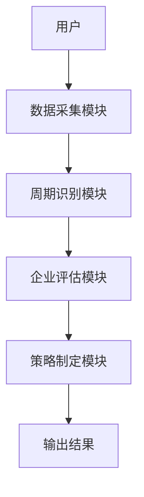
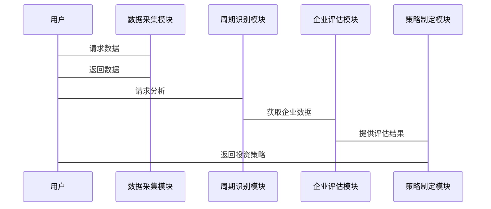

                 


# 巴菲特-芒格看待经济周期：长期视角的重要性

## 关键词：巴菲特，芒格，经济周期，长期视角，价值投资，安全边际，复利效应

## 摘要：  
本文深入探讨了巴菲特和芒格在经济周期中的投资哲学，强调长期视角的重要性。通过分析价值投资的核心理念、安全边际的概念以及复利效应的力量，本文揭示了如何在经济波动中保持稳健投资。结合实际案例和数学模型，文章为读者提供了系统化的投资决策框架，并提供了具体的Python代码实现和系统架构设计，帮助读者在复杂多变的经济环境中做出明智的投资决策。

---

## 第一部分: 巴菲特与芒格投资理念的背景与核心

### 第1章: 巴菲特与芒格的生平与投资哲学

#### 1.1 巴菲特的生平与投资历程  
沃伦·巴菲特（Warren Buffett）被誉为“股神”，他的投资哲学以价值投资为核心，强调寻找具有持续竞争优势和良好管理的公司。他通过长期持有优质资产，避免短期市场的波动，实现财富的稳步增长。  

#### 1.2 芒格的生平与投资历程  
查理·芒格（Charlie Munger）是巴菲特的亲密合作伙伴，他的多元思维模型强调跨学科思考，认为投资者必须理解企业的经济特性、行业竞争格局以及宏观经济环境。芒格的决策基于对人性的深刻理解，而非单纯的数字计算。  

#### 1.3 巴菲特与芒格的合作关系  
巴菲特和芒格的合作始于1958年，他们的投资理念互补，巴菲特注重企业的内在价值，芒格注重企业的外部环境和竞争优势。这种合作关系使他们成为投资领域的重要人物。  

#### 1.4 巴菲特与芒格的投资哲学  
- **巴菲特的投资哲学**：  
  巴菲特强调“以合理的价格购买优秀的公司”，即价值投资。他认为市场短期波动不可预测，但长期趋势可以通过分析企业的基本面来把握。  
- **芒格的投资哲学**：  
  芒格提出“多元思维模型”，认为投资者必须具备跨学科的知识，才能准确评估企业的价值。他强调安全边际的重要性，即以低于内在价值的价格买入资产，以确保投资的安全性。  

### 第2章: 经济周期的基本概念与长期视角的重要性

#### 2.1 经济周期的定义与类型  
经济周期是指经济活动的波动，通常分为四个阶段：繁荣、衰退、萧条和复苏。投资者需要理解不同阶段的特点，以便做出相应的投资决策。  

#### 2.2 巴菲特与芒格对经济周期的看法  
- **巴菲特的观点**：  
  巴菲特认为经济周期是市场波动的结果，但长期来看，经济总会向好的方向发展。因此，他主张在市场低迷时增加投资，以利用低估值的机会。  
- **芒格的观点**：  
  芒格认为经济周期是不可预测的，但投资者可以通过分散投资和长期持有优质资产来降低风险。  

#### 2.3 长期视角在投资中的重要性  
长期视角使投资者能够忽略短期市场波动，关注企业的长期价值。通过长期持有优质资产，投资者可以享受复利效应，实现财富的稳步增长。  

---

## 第二部分: 价值投资的核心概念与安全边际

### 第3章: 价值投资的核心理念

#### 3.1 价值投资的定义与特点  
价值投资是一种寻找市场价格低于内在价值的资产的投资策略。其核心在于识别具有持续竞争优势的企业，并以合理的价格买入。  

#### 3.2 价值投资的关键要素  
- **内在价值**：企业未来现金流的现值。  
- **安全边际**：市场价格与内在价值之间的差距，确保投资的安全性。  
- **竞争优势**：企业在行业中的独特优势，如成本优势、品牌优势等。  

#### 3.3 价值投资与成长投资的对比  
- **价值投资**：注重低估值，追求安全边际。  
- **成长投资**：注重高增长，追求未来收益。  

### 第4章: 安全边际的概念与应用

#### 4.1 安全边际的定义  
安全边际是指市场价格低于内在价值的部分，是投资的安全垫。通过安全边际，投资者可以在市场波动中避免重大损失。  

#### 4.2 安全边际的计算方法  
安全边际 = 内在价值 - 市场价格  

#### 4.3 安全边际在投资决策中的应用  
投资者应选择具有较大安全边际的资产，以降低投资风险。  

---

## 第三部分: 复利效应与投资算法

### 第5章: 复利效应的数学模型

#### 5.1 复利公式  
复利公式：  
$$ A = P(1 + r)^n $$  
其中，A为终值，P为本金，r为年利率，n为投资年数。  

#### 5.2 复利效应的案例分析  
假设投资本金为1万元，年利率为10%，投资期限为10年：  
$$ A = 10000(1 + 0.1)^{10} = 25937.42 $$  

### 第6章: 投资算法的实现

#### 6.1 投资决策算法  
- 识别经济周期：通过分析市场数据，判断当前经济所处的阶段。  
- 评估企业价值：计算企业的内在价值和市场价格。  
- 制定投资策略：根据经济周期和企业价值，调整投资组合。  

#### 6.2 投资算法的Python代码  
```python
def calculate_intrinsic_value(enterprise, market_price):
    # 计算安全边际
    safety_margin = enterprise - market_price
    return safety_margin

# 示例数据
enterprise_value = 100
market_price = 80

safety_margin = calculate_intrinsic_value(enterprise_value, market_price)
print(f"安全边际为：{safety_margin}")
```

---

## 第四部分: 系统分析与架构设计

### 第7章: 系统分析与架构设计

#### 7.1 系统功能设计  
- 数据采集：获取企业财务数据和市场数据。  
- 周期识别：分析经济周期。  
- 企业评估：计算内在价值和安全边际。  
- 策略制定：根据分析结果，制定投资策略。  

#### 7.2 系统架构设计  


#### 7.3 系统接口设计  
- 数据接口：与数据源（如Yahoo Finance）对接。  
- 用户接口：提供直观的投资分析工具。  

#### 7.4 系统交互设计  


---

## 第五部分: 项目实战与代码实现

### 第8章: 项目实战

#### 8.1 环境安装  
安装必要的Python库，如Pandas、NumPy、Matplotlib。  

#### 8.2 核心代码实现  
```python
import pandas as pd
import numpy as np

def calculate_intrinsic_value(enterprise_value, market_price):
    return enterprise_value - market_price

# 示例数据
data = {
    '企业价值': [100, 120, 90],
    '市场价格': [80, 95, 70]
}
df = pd.DataFrame(data)

# 计算安全边际
df['安全边际'] = df.apply(lambda x: calculate_intrinsic_value(x['企业价值'], x['市场价格']), axis=1)

print(df)
```

#### 8.3 代码解读与分析  
- 数据输入：企业价值和市场价格。  
- 安全边际计算：通过函数计算每家公司的安全边际。  
- 结果输出：显示每家公司的安全边际。  

---

## 第六部分: 最佳实践与总结

### 第9章: 最佳实践

#### 9.1 长期投资的关键点  
- 避免短期波动，关注长期价值。  
- 选择具有竞争优势的企业。  
- 保持合理的安全边际。  

#### 9.2 投资的注意事项  
- 定期调整投资组合，以适应市场变化。  
- 保持分散投资，降低风险。  
- 避免情绪化决策，坚持理性分析。  

#### 9.3 拓展阅读  
- 《巴菲特传》  
- 《芒格投资思想》  
- 《价值投资入门》  

---

## 结语  

通过本文的分析，我们可以看到，巴菲特和芒格的投资哲学强调长期视角和安全边际的重要性。在实际投资中，我们可以通过系统化的分析和算法，制定合理的投资策略，实现财富的稳健增长。希望本文对读者在投资决策中有所帮助。

