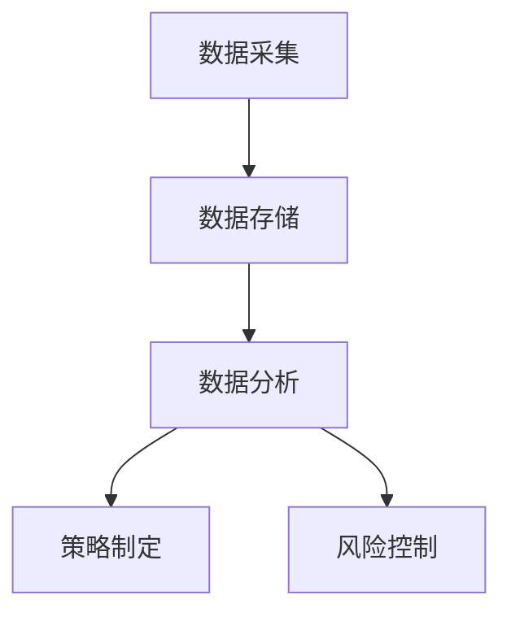
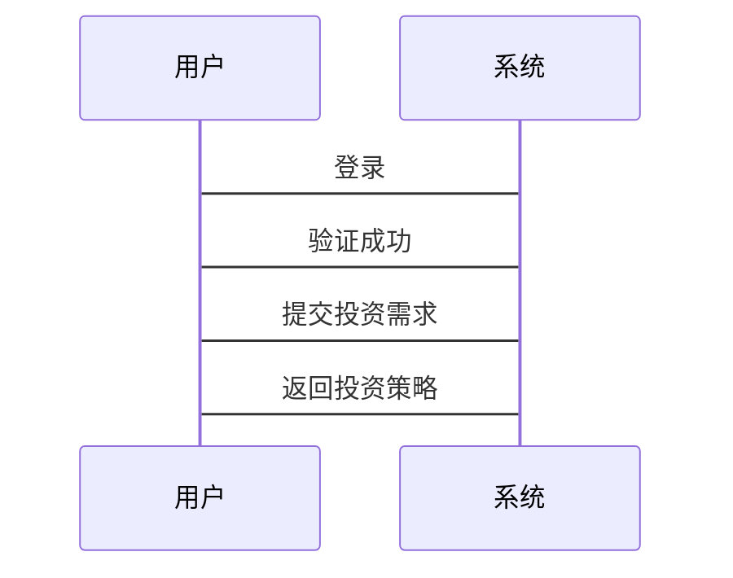

                 


# 巴菲特-芒格看待金融创新：保持谨慎和理性

## 关键词：巴菲特，芒格，金融创新，价值投资，风险管理，长期投资，安全边际

## 摘要：
本文从巴菲特和芒格的投资哲学出发，探讨他们对金融创新的看法，强调保持谨慎和理性的投资策略。通过分析金融创新的现状、挑战以及巴菲特与芒格的经典案例，结合系统的架构设计和实际项目实战，提供一套完整的投资框架，帮助读者在复杂多变的金融市场中做出明智的投资决策。

---

# 第一部分：巴菲特与芒格的投资哲学

## 第1章：巴菲特与芒格的生平与投资理念

### 1.1 巴菲特的生平与投资理念

#### 1.1.1 巴菲特的早年经历与投资启蒙
沃伦·巴菲特（Warren Buffett）于1934年出生在美国堪萨斯州，早年展现出对数字和商业的浓厚兴趣。他在青少年时期开始研究股票市场，阅读《格雷厄姆证券分析》并深受影响。巴菲特的投资启蒙来自于本杰明·格雷厄姆的价值投资理念，即寻找被市场低估的优秀企业进行投资。

#### 1.1.2 巴菲特的价值投资理念
巴菲特继承并发展了格雷厄姆的价值投资理论，强调以合理价格买入具有持续竞争优势的企业。他提出的“护城河”概念，即企业竞争优势的持久性，成为价值投资的重要标准。

#### 1.1.3 巴菲特的长期投资策略
巴菲特主张长期持有优质资产，通过复利效应实现财富增长。他认为短期市场波动难以预测，但长期趋势可以通过对企业基本面的分析来把握。

### 1.2 芒格的生平与投资哲学

#### 1.2.1 芒格的早年经历与学习背景
查理·芒格（Charlie Munger）出生于1924年，是一位自学成才的投资者和律师。他广泛涉猎各个领域的知识，形成了独特的多元思维模型。芒格认为，投资不仅是对市场的理解，更是对人性的洞察。

#### 1.2.2 芒格的多元思维模型
芒格提出“多元思维模型”，强调通过跨学科的思考来理解问题。他认为，只有构建一个完整的知识体系，才能做出正确的投资决策。

#### 1.2.3 芒格的理性与独立思考
芒格倡导理性思考和独立判断，反对盲目跟风。他认为，市场的疯狂往往来自于非理性的行为，而投资者需要保持冷静和独立。

### 1.3 巴菲特与芒格合作的投资哲学

#### 1.3.1 价值投资与长期主义的结合
巴菲特和芒格的合作基于价值投资和长期主义的共同理念。他们不仅关注企业的当前价值，更关注其长期发展潜力。

#### 1.3.2 巴菲特与芒格的决策风格对比
巴菲特更倾向于保守和稳健的投资风格，而芒格则更注重创新和跨学科的思考。两人互补合作，形成了独特的决策风格。

#### 1.3.3 巴菲特与芒格的共同投资原则
两人共同强调安全边际、长期投资和理性思考。他们认为，投资不仅是对市场的理解，更是对人性的洞察。

## 第2章：巴菲特与芒格的投资原则

### 2.1 价值投资的核心原则

#### 2.1.1 买入并持有优质资产
巴菲特和芒格主张买入具有持续竞争优势的企业，并长期持有。他们认为，优质资产的价值会随着时间的推移而增长。

#### 2.1.2 寻找具有持续竞争优势的企业
他们强调寻找那些具有强大护城河的企业，这些企业能够在竞争中长期保持优势。

#### 2.1.3 以合理价格买入优秀企业
巴菲特和芒格认为，以合理价格买入优秀企业是价值投资的核心。他们强调安全边际，即买入价格低于内在价值。

### 2.2 安全边际的概念与应用

#### 2.2.1 安全边际的定义
安全边际是指买入价格与内在价值之间的差距。它为投资提供了缓冲空间，以应对市场的不确定性。

#### 2.2.2 安全边际在投资决策中的作用
安全边际能够降低投资风险，确保在市场波动中仍能获得正收益。它也是巴菲特和芒格长期投资成功的重要因素。

#### 2.2.3 如何计算安全边际
安全边际 = 内在价值 - 市场价格

### 2.3 长期投资与复利效应

#### 2.3.1 长期投资的重要性
长期投资能够避免短期市场的波动干扰，专注于企业的长期价值增长。

#### 2.3.2 复利效应的数学模型
复利效应的计算公式为：
$$
FV = PV \times (1 + r)^n
$$
其中，FV为最终价值，PV为初始本金，r为年化收益率，n为投资年数。

#### 2.3.3 如何最大化复利效应
通过长期持有优质资产，避免频繁交易，降低交易成本，从而最大化复利效应。

---

# 第二部分：金融创新的现状与挑战

## 第3章：金融创新的现状与挑战

### 3.1 金融创新的定义与分类

#### 3.1.1 金融创新的定义
金融创新是指在金融市场中引入新的金融工具、产品、技术和策略，以满足投资者的需求。

#### 3.1.2 金融创新的分类
金融创新可以分为工具创新、产品创新、策略创新和制度创新。

#### 3.1.3 金融创新的驱动因素
金融创新的驱动因素包括市场需求、技术进步、政策变化和竞争压力。

### 3.2 金融创新的双刃剑效应

#### 3.2.1 金融创新的积极作用
金融创新能够提高市场的流动性和效率，降低交易成本，满足多样化的投资需求。

#### 3.2.2 金融创新的潜在风险
金融创新可能导致市场过度杠杆化，增加系统性风险，同时可能引发道德风险。

#### 3.2.3 金融创新对投资策略的影响
金融创新改变了投资环境，要求投资者具备更强的分析能力和风险管理能力。

### 3.3 巴菲特与芒格对金融创新的评价

#### 3.3.1 巴菲特对金融创新的态度
巴菲特对金融创新持谨慎态度，认为许多金融创新只是包装复杂化的工具，增加了市场的风险。

#### 3.3.2 芒格对金融创新的理性看法
芒格认为，金融创新并不能创造真正的价值，而是通过复杂的结构转移风险。

#### 3.3.3 巴菲特与芒格的共同观点
两人一致认为，金融创新不应以复杂化为代价，而应以降低风险和提高效率为目标。

---

# 第三部分：系统架构与投资策略

## 第4章：巴菲特与芒格的系统架构与投资策略

### 4.1 投资系统的构成与设计

#### 4.1.1 投资目标的设定
投资目标应基于个人的财务状况、风险承受能力和投资期限。

#### 4.1.2 投资策略的制定
投资策略应包括资产配置、风险管理和投资组合优化。

#### 4.1.3 投资组合的构建
投资组合应包含不同类型资产，以分散风险并实现收益最大化。

### 4.2 投资系统的数学模型

#### 4.2.1 投资回报的计算公式
投资回报的计算公式为：
$$
回报率 = \frac{最终价值 - 初始价值}{初始价值} \times 100\%
$$

#### 4.2.2 投资组合优化的数学模型
投资组合优化的数学模型为：
$$
\min \sigma^2 \quad \text{subject to} \quad \mu \geq \text{目标收益}
$$
其中，σ²为投资组合的方差，μ为期望收益。

### 4.3 投资系统的系统架构设计

#### 4.3.1 系统功能设计
系统功能包括数据采集、分析处理、策略制定和风险控制。

#### 4.3.2 系统架构图
以下是系统架构的Mermaid图：


### 4.4 投资系统的接口设计

#### 4.4.1 数据接口
数据接口包括数据输入、处理和输出。

#### 4.4.2 系统接口设计
系统接口设计应考虑模块化和可扩展性。

### 4.5 投资系统的交互设计

#### 4.5.1 用户交互流程
用户交互流程包括用户登录、数据输入、分析结果展示和决策支持。

#### 4.5.2 交互序列图
以下是交互序列图的Mermaid图：


---

# 第四部分：项目实战与最佳实践

## 第5章：项目实战与最佳实践

### 5.1 项目实战：构建一个基于CAPM的金融分析系统

#### 5.1.1 环境安装
需要安装Python、Pandas、NumPy和Matplotlib库。

#### 5.1.2 核心代码实现

```python
import pandas as pd
import numpy as np
import matplotlib.pyplot as plt

# 加载数据
data = pd.read_csv('stock_data.csv')

# 计算CAPM模型
beta = data['beta'].values
alpha = data['alpha'].values
return_series = data['return'].values

# 绘制CAPM模型的散点图
plt.scatter(beta, return_series, c='blue', marker='o')
plt.xlabel('Beta')
plt.ylabel('Return')
plt.title('CAPM Model Visualization')
plt.show()
```

#### 5.1.3 案例分析
通过实际案例分析，验证CAPM模型的有效性，并根据分析结果制定投资策略。

### 5.2 最佳实践 tips

#### 5.2.1 投资策略制定
制定清晰的投资策略，包括资产配置和风险管理。

#### 5.2.2 风险管理
定期评估投资组合的风险，及时调整以应对市场变化。

#### 5.2.3 长期投资
坚持长期投资，避免短期波动的干扰。

### 5.3 小结

通过本文的分析和实战，我们可以看到，巴菲特和芒格的谨慎和理性投资理念在金融创新中依然具有重要的指导意义。投资者应保持理性，避免盲目跟风，注重长期价值，以实现稳健的投资收益。

### 5.4 注意事项

#### 5.4.1 风险提示
市场波动、政策变化和经济周期都可能影响投资结果，投资者需保持警惕。

#### 5.4.2 知识更新
金融创新不断涌现，投资者需要持续学习，更新知识和技能。

### 5.5 拓展阅读

#### 5.5.1 推荐书籍
- 《The Intelligent Investor》 by Benjamin Graham
- 《Poor Charlie's Almanack》 by Charlie Munger

#### 5.5.2 推荐博客和网站
-巴菲特股东大会实录
-芒格的演讲和采访

---

# 结语

巴菲特和芒格的投资哲学为我们提供了宝贵的经验和启示。在金融创新日益复杂的今天，保持谨慎和理性，注重长期价值和风险管理，是每位投资者应当遵循的原则。通过系统的架构设计和实际项目实战，我们可以更好地理解和应用这些原则，实现稳健的投资收益。

