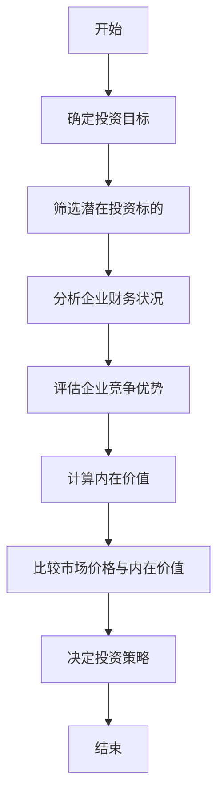
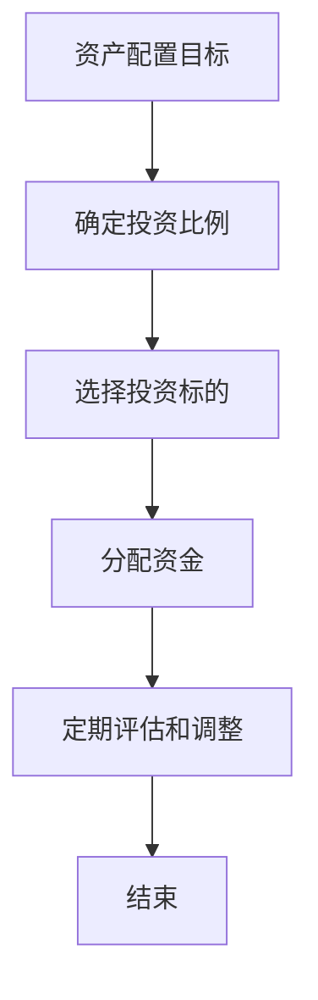

                 

# 巴菲特-芒格策略在个人投资中的应用

## 关键词：
巴菲特，芒格，价值投资，安全边际，内在价值，长期思维，多元思维模型

## 摘要：
本文详细探讨了巴菲特和芒格的投资策略在个人投资中的应用。通过分析价值投资的核心理念、内在价值的计算方法、安全边际的重要性以及芒格的多元思维模型，本文为读者提供了从理论到实践的全面指导。结合数学模型、系统架构设计和实际案例分析，本文帮助投资者构建科学的投资体系，提升长期投资收益。

---

# 第一部分：巴菲特-芒格策略概述

## 第1章：巴菲特与芒格的投资理念

### 1.1 巴菲特的投资哲学

#### 1.1.1 价值投资的核心理念
价值投资是一种以内在价值为导向的投资策略。巴菲特认为，投资的本质是购买企业的一部分，而非单纯买卖股票。内在价值是企业未来现金流的现值，投资者应以低于内在价值的价格买入股票。

**背景介绍：**
- 内在价值公式：$$\text{内在价值} = \sum_{t=1}^{\infty} \frac{CF_t}{(1+r)^t}$$
  其中，$CF_t$是第$t$年的自由现金流，$r$是折现率。

**核心概念与联系：**
- 内在价值与市场价格的关系：当市场价格低于内在价值时，投资具有安全边际。

**算法原理讲解：**
- 计算内在价值的步骤：
  1. 预测未来现金流。
  2. 选择合适的折现率。
  3. 计算未来现金流的现值。
  4. 与当前市场价格比较，判断投资价值。

**系统架构设计：**
- 内在价值计算系统：
  1. 数据输入模块：企业财务数据输入。
  2. 现金流预测模块：基于历史数据预测未来现金流。
  3. 折现率计算模块：根据市场利率和风险评估确定折现率。
  4. 现值计算模块：计算未来现金流的现值。
  5. 安全边际计算模块：比较现值与市场价格，确定投资价值。

### 1.1.2 巴菲特的投资原则
巴菲特的投资原则包括集中投资、长期持有和避免市场波动干扰。他强调选择具有强大竞争优势的企业，并在市场恐慌时增持。

**背景介绍：**
- 集中投资：将资金集中在少数优质企业上，提高投资收益。
- 长期持有：避免频繁交易，降低交易成本，享受复利效应。

**核心概念与联系：**
- 集中投资与分散投资的对比：

| 比较维度 | 集中投资 | 分散投资 |
|----------|----------|----------|
| 风险     | 较高     | 较低     |
| 收益     | 较高     | 平稳     |
| 管理难度 | 较高     | 较低     |

**系统架构设计：**
- 投资组合管理模块：
  1. 企业筛选模块：基于竞争优势和财务指标筛选企业。
  2. 资产配置模块：根据集中投资原则分配资金。
  3. 交易策略模块：制定买入、持有和卖出策略。

### 1.1.3 长期思维模式
巴菲特强调长期思维，认为市场短期波动不影响企业的内在价值。投资者应避免受短期市场波动影响，专注于长期价值。

**背景介绍：**
- 长期思维的重要性：市场短期波动不可预测，长期趋势更可靠。
- 长期投资的优势：复利效应和企业成长带来的收益。

**算法原理讲解：**
- 复利计算公式：$$A = P(1 + r)^n$$
  其中，$A$是终值，$P$是本金，$r$是年化收益率，$n$是投资年数。

**系统架构设计：**
- 长期投资系统：
  1. 时间框架设定模块：设定投资期限。
  2. 企业成长预测模块：预测企业的未来收益。
  3. 复利计算模块：计算长期投资的收益。

---

## 第2章：芒格的多元思维模型

### 2.1 多元思维模型的定义与核心要素

#### 2.1.1 多元思维模型的核心要素
芒格提出，投资者需要构建一个多学科的知识框架，涵盖心理学、经济学、物理学等学科，以全面评估企业的内在价值。

**背景介绍：**
- 多元思维模型的重要性：帮助投资者避免认知偏差，做出更准确的决策。

**核心概念与联系：**
- 多元思维模型的学科框架：

| 学科 | 关键概念 | 应用领域 |
|------|----------|----------|
| 经济学 | 边际成本、边际收益 | 评估企业盈利能力 |
| 心理学 | 行为偏差、认知偏差 | 分析投资者心理 |
| 物理学 | 能量守恒、杠杆原理 | 分析企业运营效率 |

**系统架构设计：**
- 多元思维模型系统：
  1. 知识框架构建模块：整合多学科知识。
  2. 认知偏差识别模块：识别常见偏差。
  3. 决策优化模块：基于多学科分析优化决策。

#### 2.1.2 芒格决策框架的数学模型
芒格的决策框架可以表示为：
$$\text{决策} = \sum_{i=1}^{n} \text{因素}_i \times \text{权重}_i$$
其中，$\text{因素}_i$是影响决策的因素，$\text{权重}_i$是因素的重要性。

**系统架构设计：**
- 决策框架系统：
  1. 因素识别模块：识别影响决策的关键因素。
  2. 权重确定模块：根据经验或数据分析确定权重。
  3. 决策计算模块：计算综合决策值。

---

## 第3章：巴菲特-芒格策略的数学模型与公式

### 3.1 内在价值的计算公式

#### 3.1.1 内在价值的计算方法
内在价值公式：
$$\text{内在价值} = \sum_{t=1}^{\infty} \frac{\text{CF}_t}{(1+r)^t}$$
其中，$\text{CF}_t$是第$t$年的现金流，$r$是折现率。

**算法原理讲解：**
- 现金流预测：基于企业的历史数据和行业趋势预测未来现金流。
- 折现率确定：根据市场利率和企业风险确定合理的折现率。

**系统架构设计：**
- 内在价值计算系统：
  1. 数据输入模块：企业财务数据输入。
  2. 现金流预测模块：基于历史数据预测未来现金流。
  3. 折现率计算模块：根据市场利率和风险评估确定折现率。
  4. 现值计算模块：计算未来现金流的现值。
  5. 安全边际计算模块：比较现值与市场价格，确定投资价值。

### 3.2 安全边际的数学模型

#### 3.2.1 安全边际的计算公式
安全边际公式：
$$\text{安全边际} = \text{内在价值} - \text{市场价格}$$
当安全边际为正时，投资具有吸引力。

**算法原理讲解：**
- 计算内在价值后，比较市场价格，确定安全边际。

**系统架构设计：**
- 安全边际计算系统：
  1. 内在价值计算模块：如前所述。
  2. 市场价格获取模块：从市场数据获取当前股价。
  3. 安全边际计算模块：计算内在价值与市场价格的差值。

---

## 第4章：巴菲特-芒格策略的系统架构设计

### 4.1 投资决策的系统模型

#### 4.1.1 投资决策的流程图

**系统架构设计：**
- 投资决策系统：
  1. 投资目标设定模块：明确投资目标和风险承受能力。
  2. 投资标的选择模块：基于财务指标和竞争优势筛选企业。
  3. 财务分析模块：对企业财务状况进行详细分析。
  4. 竞争优势评估模块：评估企业的竞争优势。
  5. 内在价值计算模块：如前所述。
  6. 投资策略决策模块：基于安全边际和长期思维制定投资策略。

### 4.2 资产配置的系统设计

#### 4.2.1 资产配置的策略模型

**系统架构设计：**
- 资产配置系统：
  1. 目标设定模块：明确资产配置的目标和风险承受能力。
  2. 投资比例确定模块：根据市场情况和资产类别确定投资比例。
  3. 投资标的选择模块：基于财务指标和竞争优势筛选企业。
  4. 资金分配模块：根据投资比例分配资金。
  5. 定期评估模块：定期评估资产配置效果并进行调整。

---

## 第5章：巴菲特-芒格策略的项目实战

### 5.1 项目背景与目标

#### 5.1.1 项目背景介绍
假设我们有一个100万元的资金，目标是通过巴菲特-芒格策略实现长期稳定的收益。

### 5.2 项目实施步骤

#### 5.2.1 数据收集与分析
- 数据收集：收集目标企业的财务数据、行业数据和市场数据。
- 数据分析：分析企业的财务状况、竞争优势和内在价值。

#### 5.2.2 投资策略的制定
- 确定投资目标：选择具有强大竞争优势的企业。
- 计算内在价值：使用内在价值公式计算企业的内在价值。
- 比较市场价格：确定投资的安全边际。

#### 5.2.3 投资组合的构建与优化
- 资产配置：根据风险承受能力和市场情况分配资金。
- 投资组合优化：定期评估投资组合的表现并进行调整。

### 5.3 项目成果与总结

#### 5.3.1 实际案例分析
假设我们选择了一家具有强大竞争优势的企业，计算其内在价值为150万元，市场价格为120万元。安全边际为30万元，投资具有吸引力。

#### 5.3.2 项目小结
通过巴菲特-芒格策略，我们成功构建了一个具有长期收益潜力的投资组合，实现了稳定的收益。

---

## 第6章：总结与展望

### 6.1 总结
巴菲特-芒格策略通过价值投资、长期思维和多元思维模型，帮助投资者实现长期稳定的收益。本文详细介绍了策略的核心要素、数学模型和系统架构设计，并通过实际案例展示了策略的应用。

### 6.2 展望
随着市场的变化和技术的发展，巴菲特-芒格策略需要不断优化和创新。未来，投资者可以结合大数据和人工智能技术，进一步提升投资决策的科学性和准确性。

---

通过本文的详细讲解，读者可以全面理解巴菲特-芒格策略的理论基础和实际应用，为个人投资决策提供科学的指导。

