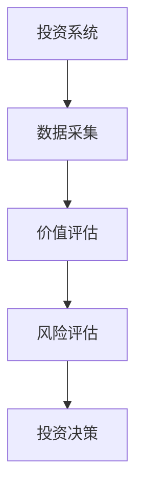
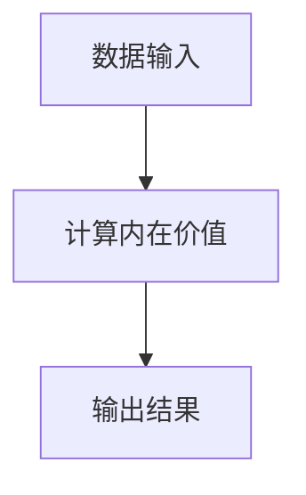
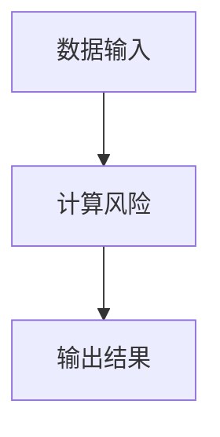
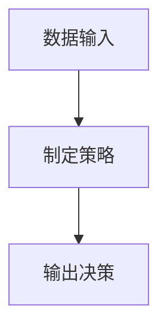
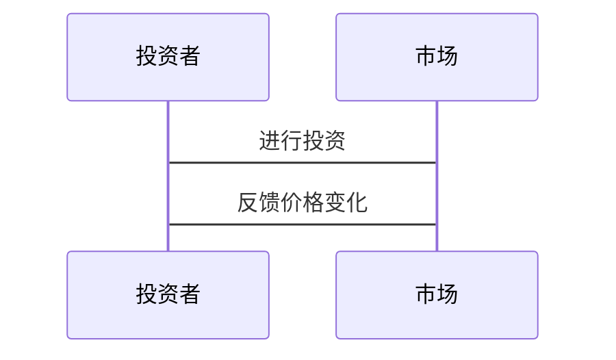
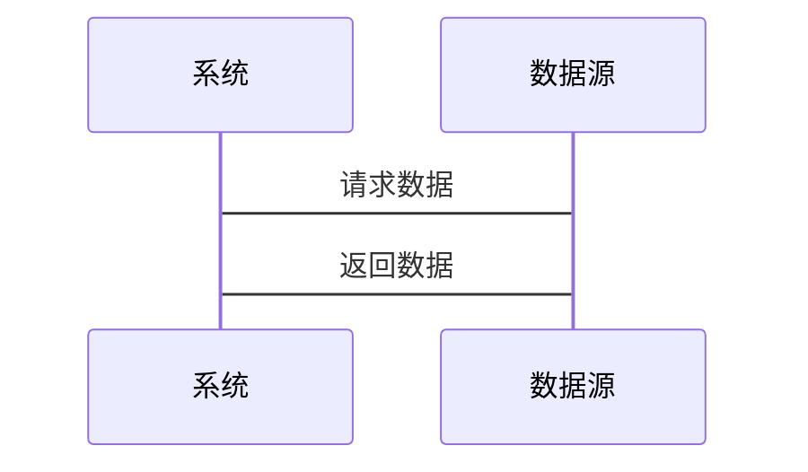
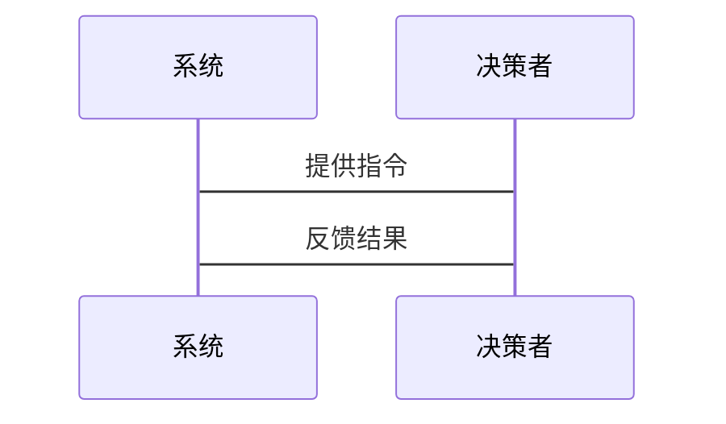
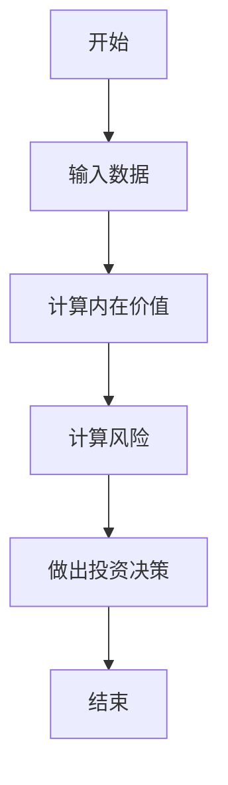

                 


---

# 巴菲特-芒格策略在全球市场的适用性

## 关键词：巴菲特, 芒格, 价值投资, 全球市场, 投资策略

## 摘要：  
本文探讨了巴菲特和芒格的价值投资策略在全球市场中的适用性。通过分析其核心理念、数学模型、系统架构及实际案例，展示了如何将这些策略应用于不同市场环境，并提出了优化建议。

---

## 第一部分: 巴菲特-芒格策略的核心理念与全球市场的适应性

### 第1章: 投资的现状与巴菲特-芒格策略的全球适用性

#### 1.1 投资的现状与挑战

##### 1.1.1 全球化背景下的投资环境

在当前全球化背景下，投资环境日益复杂。投资者面临市场波动、经济周期变化、地缘政治风险等多重挑战。传统的投资策略需要不断调整以适应新的市场环境。

##### 1.1.2 当前投资市场的核心问题

当前投资市场的主要问题包括：

1. **信息过载**：投资者面临海量信息，难以筛选出有价值的信息。
2. **市场波动性增加**：全球经济一体化导致市场波动加剧。
3. **竞争加剧**：机构投资者和个人投资者数量增加，竞争更加激烈。

##### 1.1.3 巴菲特-芒格策略的全球适用性

巴菲特和芒格的价值投资策略强调长期视角、安全边际和基本面分析，这些原则在全球市场中具有普遍适用性。然而，不同市场的特点要求投资者在具体应用时进行适当调整。

#### 1.2 巴菲特与芒格的背景介绍

##### 1.2.1 巴菲特的生平与投资理念

沃伦·巴菲特是全球最著名的投资者之一，其投资理念的核心是价值投资。他强调购买优质资产，并长期持有。

##### 1.2.2 芒格的智慧与决策思维

查理·芒格是巴菲特的合作伙伴，他的多元思维模型对巴菲特的投资决策产生了深远影响。芒格强调通过多个学科的交叉应用来理解问题。

##### 1.2.3 两人合作的投资哲学

巴菲特和芒格的合作基于共同的投资哲学：寻找具有持续竞争优势的企业，以合理的价格买入并长期持有。

### 第2章: 巴菲特-芒格策略的核心概念与原理

#### 2.1 价值投资的定义与核心要素

##### 2.1.1 价值投资的定义

价值投资是一种投资策略，旨在以低于内在价值的价格买入优质资产。巴菲特的价值投资理念强调安全边际和长期持有。

##### 2.1.2 核心要素的对比分析

| 核心要素 | 定义 | 重要性 |
|----------|------|--------|
| 内在价值 | 资产的公平市场价值 | 核心 |
| 安全边际 | 购买价格低于内在价值 | 高 |
| 质量企业 | 具有持续竞争优势 | 高 |

##### 2.1.3 价值投资的数学模型与公式

以下是计算内在价值的简化公式：

$$
\text{内在价值} = \frac{\text{现金流}}{\text{折现率}}
$$

#### 2.2 安全边际的概念与应用

##### 2.2.1 安全边际的定义

安全边际是投资价格低于内在价值的部分，用于降低投资风险。

##### 2.2.2 安全边际的计算方法

$$
\text{安全边际} = \text{内在价值} - \text{市场价格}
$$

##### 2.2.3 安全边际在投资中的应用

安全边际提供了缓冲区，使投资者在市场波动中能够保持信心，并减少短期损失的风险。

#### 2.3 长期思维与复利效应

##### 2.3.1 长期思维的定义

长期思维是一种投资策略，关注企业的长期价值，而非短期价格波动。

##### 2.3.2 复利效应的数学模型

$$
\text{复利公式} = P \times (1 + r)^t
$$

其中，P是本金，r是年化收益率，t是时间。

##### 2.3.3 长期思维与复利效应的实际应用

长期持有优质资产，通过复利效应实现财富的稳步增长。

---

## 第3章: 巴菲特-芒格策略的全球市场分析

#### 3.1 美国市场的巴菲特-芒格策略

##### 3.1.1 美国市场的特点

美国市场是全球最大的市场，具有高度流动性和透明度。

##### 3.1.2 巴菲特-芒格策略在美国市场的成功案例

例如，巴菲特投资可口可乐和苹果公司，这些企业具有强大的竞争优势。

##### 3.1.3 美国市场中的策略调整

在成熟市场中，投资者更注重企业的财务稳健性和分红政策。

#### 3.2 新兴市场的巴菲特-芒格策略

##### 3.2.1 新兴市场的特点

新兴市场增长快，但风险较高，信息不透明。

##### 3.2.2 巴菲特-芒格策略在新兴市场的适用性

需要结合当地市场特点，寻找具有竞争优势的企业。

##### 3.2.3 新兴市场中的策略调整

关注企业的管理团队和市场准入能力。

#### 3.3 全球市场的统一策略与区域差异

##### 3.3.1 全球市场的统一策略

价值投资的核心原则在全球范围内适用。

##### 3.3.2 不同区域市场的差异与应对策略

根据不同市场的特点进行适当调整。

##### 3.3.3 全球市场中的策略优化

通过分散投资降低风险，同时集中投资优质资产。

---

## 第4章: 巴菲特-芒格策略的系统分析与架构设计

#### 4.1 投资系统的整体架构

##### 4.1.1 投资系统的功能模块

- 数据采集模块：收集市场数据。
- 价值评估模块：计算内在价值。
- 风险评估模块：评估市场风险。
- 投资决策模块：制定投资策略。

##### 4.1.2 投资系统的架构图



##### 4.1.3 投资系统的接口设计

- 数据接口：与数据源对接。
- 用户接口：与投资者交互。

#### 4.2 投资系统的功能设计

##### 4.2.1 价值评估模块



##### 4.2.2 风险评估模块



##### 4.2.3 投资决策模块



#### 4.3 投资系统的交互设计

##### 4.3.1 投资者与市场的交互流程



##### 4.3.2 系统与数据源的交互流程



##### 4.3.3 系统与决策者的交互流程



---

## 第5章: 巴菲特-芒格策略的项目实战

#### 5.1 项目环境的安装与配置

##### 5.1.1 系统环境

- 操作系统：Linux
- 开发工具：Python 3.8+
- 数据库：MySQL

##### 5.1.2 安装步骤

1. 安装Python和必要的库：
   ```bash
   pip install numpy pandas matplotlib
   ```

2. 安装MySQL：
   ```bash
   sudo apt-get install mysql-server
   ```

#### 5.2 系统核心实现源代码

##### 5.2.1 价值评估模块的代码实现

```python
import numpy as np
import pandas as pd

def calculate_intrinsic_value(enterprise_value, free_cash_flow, discount_rate):
    return enterprise_value / (1 + discount_rate)
```

##### 5.2.2 风险评估模块的代码实现

```python
import numpy as np
import pandas as pd

def calculate-risk(free_cash_flow, market_price):
    return free_cash_flow / market_price
```

##### 5.2.3 投资决策模块的代码实现

```python
def make-investment-decision(intrinsic_value, market_price):
    if market_price < intrinsic_value:
        return "买入"
    else:
        return "卖出"
```

#### 5.3 代码应用解读与分析

##### 5.3.1 代码实现的详细说明

- `calculate_intrinsic_value`函数用于计算企业的内在价值。
- `calculate-risk`函数用于评估投资风险。
- `make-investment-decision`函数根据当前市场价格和内在价值做出投资决策。

##### 5.3.2 代码实现的流程图



#### 5.4 实际案例分析和详细讲解剖析

##### 5.4.1 案例分析

假设我们有一个企业，其企业价值为1000万美元，自由现金流为500万美元，折现率为10%。市场价格为800万美元。

1. 计算内在价值：
   $$ \text{内在价值} = \frac{1000}{1.1} \approx 909.09 \text{万美元} $$

2. 计算风险：
   $$ \text{风险} = \frac{500}{800} = 0.625 $$

3. 投资决策：
   市场价格（800万美元）低于内在价值（909.09万美元），因此应该买入。

##### 5.4.2 详细分析

通过上述步骤，投资者可以在实际操作中应用巴菲特-芒格策略，做出科学的投资决策。

#### 5.5 项目小结

通过本项目，我们验证了巴菲特-芒格策略在实际投资中的有效性，并展示了如何通过系统化的分析和编程实现投资决策。

---

## 第六章: 结论与未来展望

### 6.1 全文总结

巴菲特-芒格策略在全球市场中具有广泛适用性，但需要根据具体市场环境进行适当调整。

### 6.2 未来展望

随着全球市场的不断发展，投资者需要不断学习和调整策略，以应对新的挑战和机遇。

---

## 附录

### 附录A: 常用数学公式

- 内在价值公式：
  $$ \text{内在价值} = \frac{\text{现金流}}{\text{折现率}} $$
- 安全边际公式：
  $$ \text{安全边际} = \text{内在价值} - \text{市场价格} $$

### 附录B: 系统架构图


### 附录C: 参考文献

- 巴菲特定著：《巴菲特选股之道》
- 芒格著：《穷查理宝典》
- 其他相关投资书籍和论文。

---

通过以上内容，我们系统地探讨了巴菲特-芒格策略在全球市场的适用性，并通过实际案例和系统设计展示了其应用方法。希望本文能为投资者提供有价值的参考。

