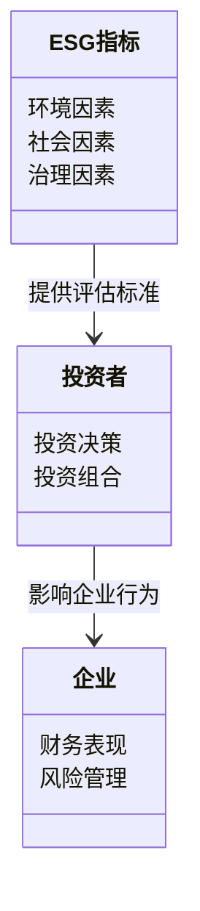
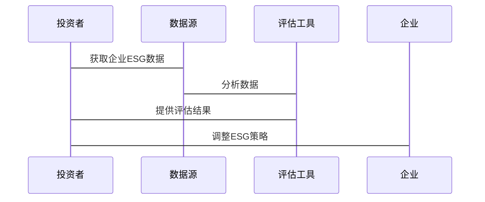

                 


# 巴菲特如何看待可持续发展投资

## 关键词：
- 巴菲特, 可持续发展投资, 投资哲学, 企业治理, 环境影响, 社会责任

## 摘要：
本文探讨巴菲特对可持续发展投资的看法，分析其投资哲学、策略及其对企业的长期影响。通过经典案例和系统分析，结合现代工具和技术，帮助读者理解如何将可持续发展融入投资决策，提升投资回报和企业价值。

---

## 第1章：巴菲特的生平与投资哲学

### 1.1 巴菲特的生平简介
沃伦·巴菲特，1934年出生，全球著名投资者，伯克希尔·哈撒韦公司创始人。他以价值投资闻名，强调长期投资和企业基本面分析。巴菲特的投资哲学基于“先生存，后发展”，注重企业内在价值和长期盈利能力。

### 1.2 可持续发展投资的定义与重要性
可持续发展投资（SRI）关注环境、社会和治理（ESG）因素，旨在通过投资推动社会和环境的可持续发展。其重要性体现在企业长期价值的维护、风险降低和道德责任的履行。

---

## 第2章：可持续发展投资的核心框架

### 2.1 可持续发展投资的分析框架
#### 2.1.1 企业治理与可持续发展
治理结构透明、高效的公司更受投资者青睐。巴菲特认为，良好的公司治理是企业长期成功的关键。

#### 2.1.2 环境影响评估
企业对环境的影响直接影响其成本和声誉。巴菲特关注企业的环保措施，认为这能降低风险并提高效率。

#### 2.1.3 社会责任与道德投资
企业应承担社会责任，解决社会问题。巴菲特支持投资那些在道德和责任方面表现良好的企业。

### 2.2 可持续发展投资的工具与指标
#### 2.2.1 ESG指标
ESG指标包括环境（碳排放、能源使用）、社会（员工权益、社会责任）和治理（透明度、高管薪酬）。

#### 2.2.2 可持续发展评级体系
通过评级机构（如MSCI、晨星）评估企业ESG表现，帮助投资者选择优质投资标的。

---

## 第3章：巴菲特的可持续发展投资策略

### 3.1 巴菲特的投资策略分析
#### 3.1.1 长期价值投资
巴菲特注重企业长期价值，而非短期波动。他认为ESG因素能反映企业长期盈利能力。

#### 3.1.2 企业基本面分析
深入分析财务报表，评估企业盈利能力、现金流和竞争优势。注重企业治理和环保表现。

### 3.2 巴菲特对可持续发展的关注
#### 3.2.1 企业治理的重要性
巴菲特认为，管理层的行为直接影响企业价值。他倾向于投资治理透明、管理层稳定的公司。

#### 3.2.2 环境因素对企业价值的影响
环境风险可能影响企业成本和合规性。巴菲特关注企业的环保措施，避免投资高污染行业。

---

## 第4章：巴菲特的经典投资案例

### 4.1 可口可乐的投资案例
可口可乐的全球分销系统和品牌价值使其成为巴菲特的长期投资。公司注重环保和可持续包装，符合巴菲特的ESG标准。

### 4.2 苹果公司的投资案例
苹果的创新能力和强大的供应链管理使其成为巴菲特青睐的目标。苹果在环保方面的努力也符合ESG标准。

---

## 第5章：可持续发展投资的系统分析与架构设计

### 5.1 系统分析与架构设计方案
#### 5.1.1 问题场景介绍
通过系统分析评估企业的ESG表现，识别投资风险和机会。

#### 5.1.2 系统功能设计（领域模型mermaid类图）


#### 5.1.3 系统架构设计mermaid架构图


#### 5.1.4 系统接口设计和系统交互mermaid序列图


---

## 第6章：可持续发展投资的项目实战

### 6.1 环境安装与工具配置
#### 6.1.1 投资分析工具的安装
- 使用Python和Pandas进行数据分析。
- 安装必要的库：`pip install pandas numpy matplotlib seaborn`.

#### 6.1.2 数据源的获取与处理
从Morningstar或MSCI获取ESG数据，清洗数据并生成评估指标。

### 6.2 系统核心实现源代码
#### 6.2.1 数据分析代码示例
```python
import pandas as pd

# 加载数据
data = pd.read_csv('esg.csv')

# 计算ESG评分
data['ESG评分'] = data[['环境', '社会', '治理']].mean(axis=1)

# 输出结果
print(data.head())
```

#### 6.2.2 可视化展示代码示例
```python
import matplotlib.pyplot as plt

data['ESG评分'].plot(kind='bar')
plt.title('企业ESG评分')
plt.xlabel('企业名称')
plt.ylabel('评分')
plt.show()
```

---

## 第7章：总结与小结

### 7.1 最佳实践与注意事项
- **风险管理**：关注ESG指标，识别潜在风险。
- **长期性**：可持续投资需耐心和长期视角。
- **多元化**：分散投资以降低风险。

### 7.2 未来趋势与展望
- **ESG投资的普及**：越来越多投资者关注ESG因素。
- **技术驱动**：大数据和AI将提升ESG评估的准确性。

---

通过本文的分析，读者可以深入了解巴菲特的可持续发展投资理念，并学习如何将这些理念应用到实际投资中。

