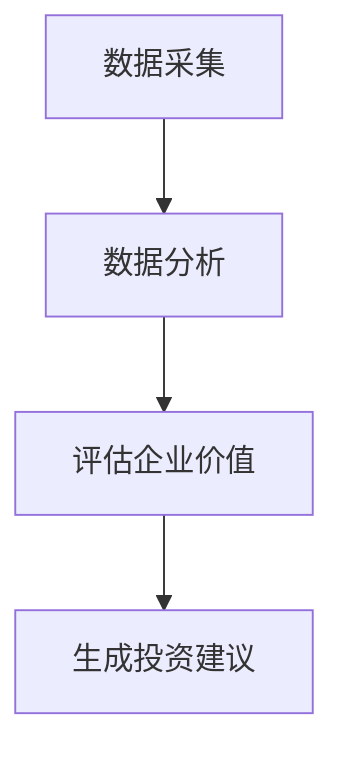
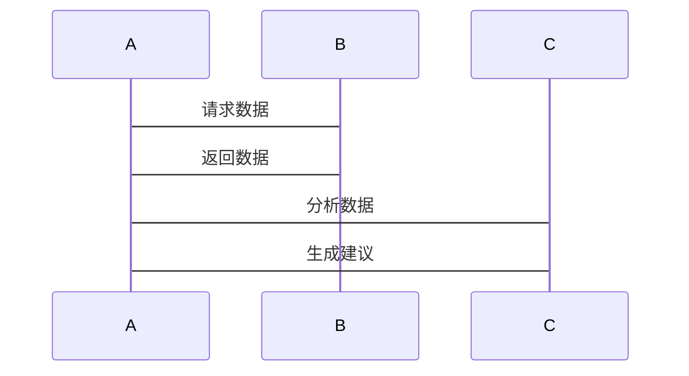

                 


# 巴菲特如何看待新兴市场投资

> 关键词：巴菲特，价值投资，新兴市场，投资策略，风险管理，系统架构

> 摘要：本文深入探讨了巴菲特的投资理念在新兴市场中的应用，分析了其价值投资策略的核心要素，结合系统架构设计和项目实战，详细解读了巴菲特如何在新兴市场中寻找投资机会和应对风险挑战。

---

# 第一部分: 巴菲特投资理念与新兴市场概述

## 第1章: 巴菲特投资哲学的起源

### 1.1 价值投资的定义与核心原则
- 价值投资的核心理念：寻找市场低估的企业
- 核心原则：安全边际、长期投资、企业内在价值

### 1.2 巴菲特投资理念的形成与发展
- 巴菲特的成长历程
- 价值投资理论的演变

### 1.3 新兴市场的特点与挑战
- 新兴市场的定义与范围
- 投资机会与风险并存
- 与成熟市场的差异

## 第2章: 巴菲特对新兴市场的看法

### 2.1 长期看法
- 新兴市场的潜力与未来
- 人口红利与经济增长

### 2.2 投资策略
- 寻找具有强大竞争优势的企业
- 重点关注消费、科技等行业的龙头企业

### 2.3 风险管理
- 新兴市场的波动性
- 如何应对政策风险、经济周期风险

---

# 第二部分: 巴菲特投资模型与分析框架

## 第3章: 巴菲特投资模型的构成

### 3.1 经济护城河的定义与分类
- 经济护城河的类型：成本优势、网络效应、专利技术等

### 3.2 可持续竞争优势的来源
- 品牌影响力、市场占有率、生产效率

### 3.3 企业定价权的衡量标准
- 市场地位、成本结构、定价能力

## 第4章: 投资模型在新兴市场的应用

### 4.1 新兴市场中经济护城河的识别
- 以阿里巴巴为例：网络效应的优势

### 4.2 可持续竞争优势在新兴市场的体现
- 以腾讯为例：社交媒体的垄断地位

### 4.3 企业定价权在新兴市场的评估
- 以茅台为例：品牌溢价能力

## 第5章: 投资模型的数学模型与公式

### 5.1 经济护城河的量化指标
- 市盈率（P/E）与市净率（P/B）的比较

### 5.2 可持续竞争优势的评估公式
$$ \text{竞争优势指数} = \frac{\text{市场份额} \times \text{品牌影响力}}{\text{行业增长率}} $$

### 5.3 企业定价权的数学模型
$$ \text{定价权指数} = \frac{\text{利润率} \times \text{市场占有率}}{\text{行业平均利润率}} $$

---

# 第三部分: 巴菲特投资策略的系统分析与架构设计

## 第6章: 投资策略的系统架构

### 6.1 系统架构的总体设计
- 分层架构：数据采集、分析、决策

### 6.2 功能模块的划分
- 数据采集模块：收集企业财务数据
- 分析模块：评估企业价值
- 决策模块：生成投资建议

### 6.3 系统架构的流程图展示


## 第7章: 系统接口设计

### 7.1 系统接口的定义与描述
- API接口：数据获取与分析结果返回

### 7.2 系统接口的交互流程


---

# 第四部分: 巴菲特投资策略的项目实战

## 第8章: 项目背景与目标

### 8.1 项目背景介绍
- 新兴市场中寻找投资机会

### 8.2 项目目标设定
- 构建投资模型，评估新兴市场企业价值

## 第9章: 核心代码实现

### 9.1 环境安装
- Python 3.8及以上版本
- 导入必要的库：pandas, numpy, matplotlib

### 9.2 核心代码实现
```python
import pandas as pd
import numpy as np

def calculate_pe_ratio(df):
    pe_ratio = df['Price'] / df['Earnings']
    return pe_ratio

data = pd.DataFrame({
    'Price': [100, 200, 300],
    'Earnings': [10, 20, 30]
})

pe = calculate_pe_ratio(data)
print(pe)
```

### 9.3 代码解读与分析
- 计算市盈率，评估企业估值

## 第10章: 案例分析

### 10.1 科技行业
- 以腾讯为例，分析其投资价值

### 10.2 消费行业
- 以茅台为例，分析其定价权

---

# 第五部分: 总结与展望

## 第11章: 总结

### 11.1 核心观点回顾
- 巴菲特的投资理念在新兴市场中的应用

### 11.2 投资策略的系统化框架

## 第12章: 展望

### 12.1 新兴市场的未来趋势
- 数字经济与科技行业的潜力

### 12.2 巴菲特投资理念的未来发展

---

# 附录

## A. 巴菲特经典语录

## B. 参考文献

---

通过以上目录结构，文章将详细阐述巴菲特的投资理念在新兴市场中的应用，结合理论分析和实际案例，帮助读者全面理解如何在新兴市场中应用巴菲特的价值投资策略。

