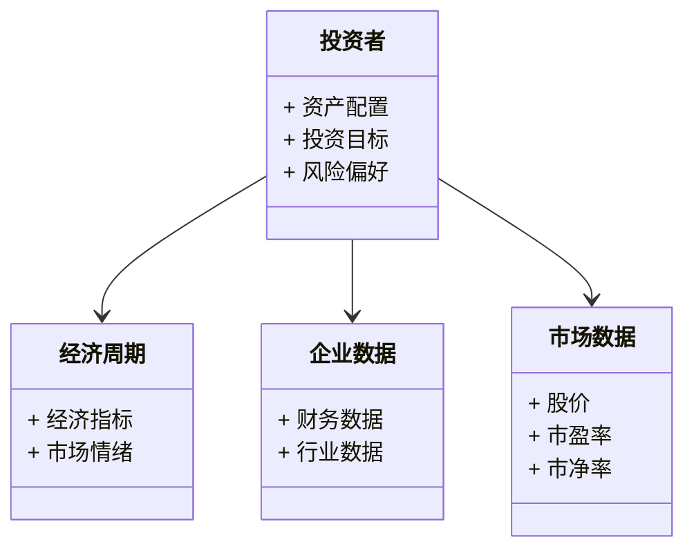
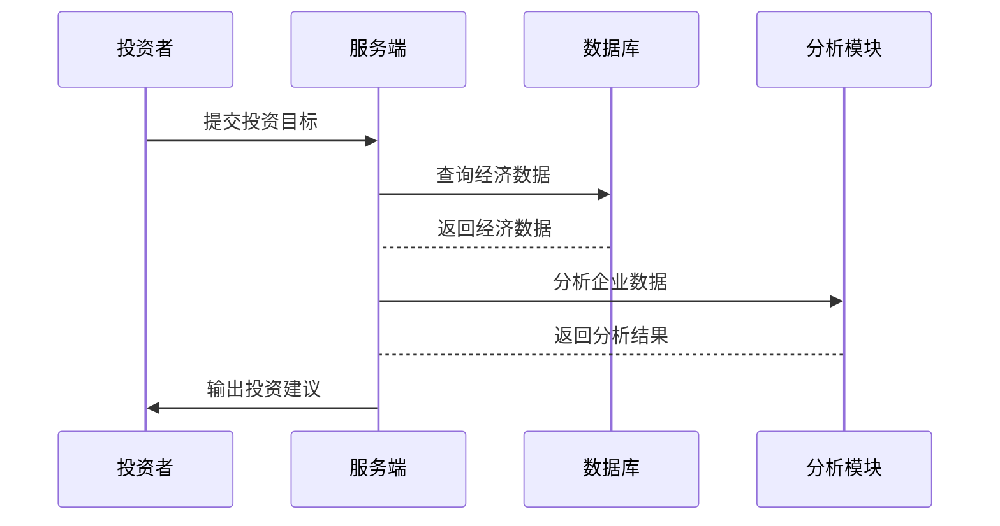

                 


# 巴菲特如何看待经济周期与投资

> 关键词：巴菲特，经济周期，投资策略，价值投资，安全边际，长期投资

> 摘要：本文深入探讨了巴菲特如何将经济周期与投资策略相结合，分析了他在不同经济周期下的投资策略和方法，结合了理论与实践，展示了巴菲特的投资理念对现代投资的深远影响。

---

## 第一部分: 经济周期与巴菲特投资理念概述

### 第1章: 经济周期的基本概念

#### 1.1 经济周期的定义与类型

##### 1.1.1 经济周期的定义
经济周期是指经济活动在时间上的波动，通常分为繁荣、衰退、萧条和复苏四个阶段。每个阶段的特点不同，对企业盈利、市场估值和投资决策产生重要影响。

##### 1.1.2 经济周期的主要类型
- **繁荣期**：经济增长迅速，企业盈利高，股价通常处于高位。
- **衰退期**：经济增长放缓，企业盈利下降，股价通常处于低位。
- **萧条期**：经济活动极度低迷，企业盈利极低，股价通常处于历史低位。
- **复苏期**：经济开始恢复，企业盈利逐步回升，股价通常处于低位并开始反弹。

##### 1.1.3 经济周期对企业的影响
经济周期的变化直接影响企业的盈利能力、市场份额和资本成本。在繁荣期，企业可以快速扩张；在衰退期，企业可能面临裁员、削减成本的压力。

#### 1.2 巴菲特投资理念的核心要素

##### 1.2.1 巴菲特的早期投资经历
巴菲特的投资理念起源于他早期的投资经历，尤其是在20世纪70年代石油危机和经济衰退期间，他学会了如何在经济低迷时期寻找廉价的优质资产。

##### 1.2.2 巴菲特的投资哲学
巴菲特的投资哲学以“价值投资”为核心，强调以合理的价格投资于具有持续竞争优势的企业，并长期持有。

##### 1.2.3 巴菲特的价值投资原则
- **长期投资**：巴菲特认为长期投资能够摊薄短期市场波动的风险。
- **安全边际**：在购买股票时，确保买入价格低于企业的内在价值。
- **优质企业**：投资于具有强大竞争优势和良好管理的企业。

---

### 第2章: 巴菲特投资理念的核心原则

#### 2.1 巴菲特投资理念的起源

##### 2.1.1 巴菲特的早期投资经历
巴菲特在20世纪50年代开始投资，早期的投资经历使他意识到市场波动对短期投资的负面影响，从而转向长期价值投资。

##### 2.1.2 巴菲特的投资哲学
巴菲特的投资哲学强调对企业的深入研究和长期持有，而不是短期市场波动的预测。

#### 2.2 巴菲特投资理念的核心原则

##### 2.2.1 价值投资原则
价值投资的核心在于寻找市场价格低于内在价值的股票。巴菲特认为，市场价格与内在价值之间的差距是投资机会的来源。

##### 2.2.2 安全边际概念
安全边际是指买入价格低于企业内在价值的幅度。通过安全边际，巴菲特能够在经济低迷时期保护投资本金。

##### 2.2.3 长期投资策略
长期投资策略使巴菲特能够忽略短期市场波动，专注于企业的长期价值。

---

## 第二部分: 巴菲特的经济周期分析方法

### 第3章: 巴菲特的经济周期分析框架

#### 3.1 经济周期对投资决策的影响

##### 3.1.1 经济周期与企业估值的关系
在繁荣期，企业估值可能过高；在衰退期，企业估值可能被低估。巴菲特通常在衰退期寻找廉价的优质资产。

##### 3.1.2 经济周期与投资策略的调整
巴菲特在不同经济周期下调整投资策略。例如，在衰退期，他会寻找那些在经济低迷时期依然能够保持盈利的企业。

##### 3.1.3 经济周期与投资组合的构建
在不同经济周期下，巴菲特的投资组合会有所不同。例如，在衰退期，他会增加对高分红股票的投资；在复苏期，他会关注那些具有增长潜力的企业。

#### 3.2 巴菲特的经济周期判断方法

##### 3.2.1 通过利率和市场情绪判断经济周期
巴菲特通过观察利率水平和市场情绪来判断经济周期的变化。例如，低利率通常预示着经济可能处于复苏期或繁荣期。

##### 3.2.2 通过企业盈利和现金流预测经济周期
巴菲特通过分析企业的盈利和现金流来判断经济周期的变化。例如，衰退期的企业盈利通常会下降，而复苏期的企业盈利逐渐恢复。

##### 3.2.3 通过市场估值指标判断经济周期
巴菲特通过分析市场估值指标（如市盈率、市净率）来判断经济周期的变化。例如，市场估值过高的时期可能意味着经济处于繁荣期，而市场估值过低的时期可能意味着经济处于衰退期。

### 第4章: 巴菲特投资策略在不同经济周期的表现

#### 4.1 经济繁荣期的投资策略

##### 4.1.1 高增长行业的投资机会
在繁荣期，高增长行业（如科技、消费）的投资机会较多。巴菲特通常会选择那些具有持续竞争优势的企业。

##### 4.1.2 高收益债券的投资机会
在繁荣期，高收益债券的收益率通常较高，巴菲特也会关注这些投资机会。

#### 4.2 经济衰退期的投资策略

##### 4.2.1 优质企业的抄底机会
在衰退期，优质企业的股票价格通常会被低估，巴菲特会寻找那些具有强大竞争优势和良好管理的企业进行投资。

##### 4.2.2 高质量债券的投资机会
在衰退期，高质量债券的安全性较高，收益率也相对较高。

#### 4.3 经济稳定期的投资策略

##### 4.3.1 平衡投资组合的构建
在稳定期，巴菲特通常会保持一个平衡的投资组合，既包括成长型股票，也包括价值型股票。

##### 4.3.2 长期持有的优势
在稳定期，巴菲特的长期持有策略能够帮助他摊薄短期市场波动的风险。

---

## 第三部分: 巴菲特投资模型的算法与数学原理

### 第5章: 巴菲特投资模型的算法原理

#### 5.1 巴菲特投资模型的概述

##### 5.1.1 模型的输入变量
- 企业盈利
- 企业现金流
- 企业负债
- 行业前景
- 市场估值

##### 5.1.2 模型的输出结果
- 企业内在价值
- 安全边际
- 投资建议

#### 5.2 巴菲特投资模型的数学公式

##### 5.2.1 企业价值计算公式
$$
\text{企业价值} = \text{自由现金流} \times (1 + g) / (r - g)
$$
其中，\( g \) 是企业盈利增长率，\( r \) 是折现率。

##### 5.2.2 安全边际计算公式
$$
\text{安全边际} = \text{企业价值} - \text{市场价格}
$$

##### 5.2.3 投资建议
- 如果市场价格 < 企业价值，则建议买入。
- 如果市场价格 > 企业价值，则建议卖出。

#### 5.3 巴菲特投资模型的算法流程

##### 5.3.1 数据输入与清洗
- 输入企业的财务数据、行业数据和市场数据。
- 清洗数据，去除异常值。

##### 5.3.2 企业价值评估
- 使用自由现金流模型计算企业的内在价值。

##### 5.3.3 安全边际计算
- 计算企业价值与市场价格之间的差额，得出安全边际。

##### 5.3.4 投资决策输出
- 根据安全边际和市场价格，输出投资建议。

### 第6章: 巴菲特投资模型的系统架构设计

#### 6.1 问题场景介绍
在实际投资中，投资者需要根据经济周期和市场环境调整投资策略。巴菲特的投资模型可以作为一个参考框架，帮助投资者做出更明智的投资决策。

#### 6.2 系统功能设计

##### 6.2.1 领域模型（Mermaid类图）


#### 6.3 系统架构设计（Mermaid架构图）


#### 6.4 系统接口设计
- 输入接口：接收投资者的资产配置、投资目标和风险偏好。
- 输出接口：输出投资建议和投资组合。

#### 6.5 系统交互设计（Mermaid序列图）


---

## 第四部分: 巴菲特投资模型的项目实战

### 第7章: 项目实战

#### 7.1 环境安装

##### 7.1.1 安装Python
```bash
python --version
pip install --upgrade pip
```

##### 7.1.2 安装必要的库
```bash
pip install pandas numpy matplotlib
```

#### 7.2 系统核心实现源代码

##### 7.2.1 数据收集模块
```python
import pandas as pd

def collect_data(ticker):
    # 收集企业数据
    df = pd.DataFrame()
    # 数据收集逻辑
    return df
```

##### 7.2.2 数据分析模块
```python
import numpy as np

def calculate_intrinsic_value(df):
    # 计算企业内在价值
    g = df['盈利增长率'].values[0]
    r = df['折现率'].values[0]
    intrinsic_value = df['自由现金流'].values[0] * (1 + g) / (r - g)
    return intrinsic_value
```

##### 7.2.3 投资决策模块
```python
def make_investment_decision(intrinsic_value, market_price):
    if intrinsic_value > market_price:
        return "买入"
    elif intrinsic_value < market_price:
        return "卖出"
    else:
        return "观望"
```

#### 7.3 实际案例分析
以苹果公司为例，分析其在当前经济周期下的投资价值。

##### 7.3.1 数据收集
收集苹果公司的财务数据、行业数据和市场数据。

##### 7.3.2 数据分析
计算苹果公司的内在价值和安全边际。

##### 7.3.3 投资决策
根据分析结果，输出投资建议。

---

## 第五部分: 最佳实践与总结

### 第8章: 最佳实践

#### 8.1 投资策略的注意事项
- 确保对企业基本面的深入研究。
- 保持对经济周期的敏感性。
- 长期持有优质资产。

#### 8.2 小结
巴菲特的投资理念强调长期投资、价值投资和安全边际。在实际投资中，投资者需要结合经济周期和市场环境，灵活调整投资策略。

#### 8.3 拓展阅读
- 巴菲特的《巴菲特致股东的信》
- 《投资之道》

---

## 附录: 巴菲特投资模型的数学公式

$$
\text{内在价值} = \frac{\text{自由现金流}}{\text{折现率} - \text{盈利增长率}}
$$

$$
\text{安全边际} = \text{内在价值} - \text{市场价格}
$$

---

## 结语

通过本文的分析，我们可以看到巴菲特如何将经济周期与投资策略相结合，如何通过价值投资和长期持有实现财富增长。希望本文能为投资者提供有价值的参考和启发。

