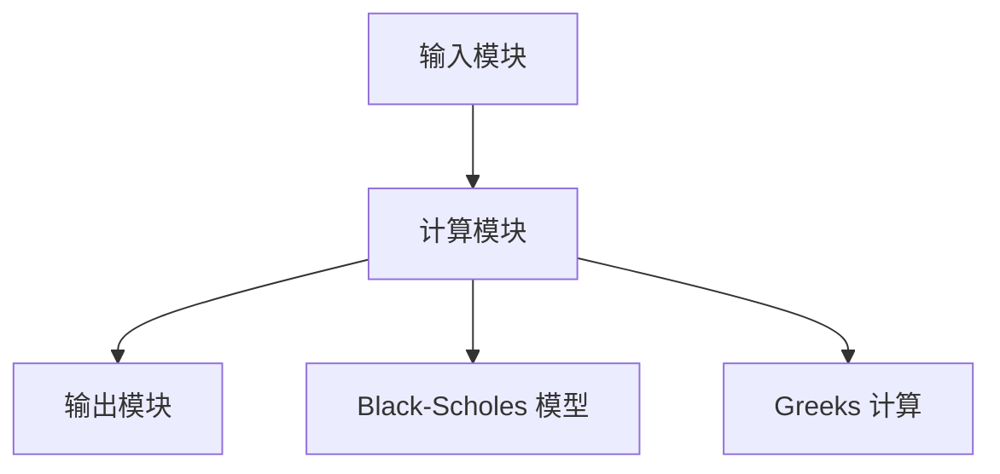
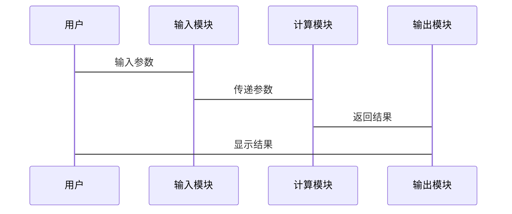

                 


# 巴菲特如何看待衍生品投资

## 关键词
- 巴菲特
- 衍生品
- 期权
- 期货
- 风险管理
- 投资策略

## 摘要
本文探讨了巴菲特对衍生品投资的看法，从衍生品的基本概念、其在投资中的作用到巴菲特的具体投资策略，再到风险管理的重要性。通过详细分析，本文旨在为投资者提供一个全面的视角，理解巴菲特为什么对衍生品持谨慎态度，并如何在实际投资中应用这一理念。

---

# 第一部分: 巴菲特与衍生品投资的背景介绍

## 第1章: 衍生品投资的基本概念

### 1.1 衍生品的定义与分类
#### 1.1.1 什么是衍生品
衍生品是一种金融工具，其价值依赖于其他资产或指数的表现。常见的衍生品包括期权、期货、掉期和远期合约。

#### 1.1.2 衍生品的主要类型
- **期权**：买方有权在特定时间内以固定价格购买或出售资产。
- **期货**：在未来特定时间以约定价格买卖资产的标准化合约。
- **掉期**：双方交换现金流的协议，通常基于利率或汇率。
- **远期合约**：定制化协议，类似于期货但非标准化。

#### 1.1.3 衍生品的基本特征
- **杠杆效应**：以小博大，放大收益或损失。
- **风险对冲**：用于对冲其他投资的风险。
- **复杂性**：涉及复杂的数学模型和市场分析。

### 1.2 巴菲特的投资理念
#### 1.2.1 巴菲特的投资哲学
巴菲特的价值投资理念强调长期持有优质资产，注重基本面分析，而非短期市场波动。

#### 1.2.2 巴菲特对价值投资的诠释
他认为市场先生是不可预测的，投资应基于企业的内在价值，而非市场情绪。

#### 1.2.3 巴菲特对风险的定义
风险在于永久性本金损失，而非短期波动。他更关注于企业内在风险，而非市场波动风险。

---

## 第2章: 衍生品的双刃剑效应

### 2.1 衍生品的优势
#### 2.1.1 价格发现功能
通过衍生品市场，可以更准确地反映资产的真实价值。

#### 2.1.2 风险管理工具
企业可以通过衍生品对冲价格波动风险，锁定成本或收益。

#### 2.1.3 套利机会
利用不同市场或产品之间的价格差异，进行无风险套利。

### 2.2 衍生品的风险
#### 2.2.1 杠杆效应的双刃剑
杠杆可以放大收益，但也会放大损失，可能导致资产负债表迅速恶化。

#### 2.2.2 市场流动性风险
衍生品市场的流动性不足可能导致价格大幅波动，难以以合理价格买卖。

#### 2.2.3 结算风险
交易对手违约可能导致无法履行合约的风险。

---

## 第3章: 巴菲特与衍生品投资的争议

### 3.1 巴菲特对衍生品的谨慎态度
#### 3.1.1 巴菲特对衍生品的早期观点
巴菲特早期对衍生品持开放态度，认为它们是有效的风险管理工具。

#### 3.1.2 巴菲特对衍生品的批评
2008年金融危机后，巴菲特批评衍生品市场的过度复杂性和杠杆，认为它们加剧了市场的不稳定性。

#### 3.1.3 巴菲特对衍生品的实践
尽管批评衍生品，但巴菲特的公司仍使用少量衍生品进行风险管理，如购买保险合约以对冲极端风险。

---

# 第二部分: 衍生品投资的核心概念与联系

## 第4章: 衍生品的核心原理

### 4.1 衍生品定价模型
#### 4.1.1 Black-Scholes模型
Black-Scholes模型用于定价欧式期权，公式为：
$$
C = S_0 e^{r t} N(d_1) - K e^{r T} N(d_2)
$$

其中：
- $C$ 是期权的理论价格
- $S_0$ 是标的资产当前价格
- $r$ 是无风险利率
- $t$ 是时间（年）
- $K$ 是执行价格
- $T$ 是到期时间
- $N(d)$ 是标准正态分布的累积分布函数
- $d_1 = \frac{\ln(S_0/K) + (r + \sigma^2/2)T}{\sigma \sqrt{T}}$
- $d_2 = d_1 - \sigma \sqrt{T}$

#### 4.1.2 二叉树模型
二叉树模型通过构建树状图来模拟标的资产的价格波动，适用于美式期权定价。

#### 4.1.3 风险中性定价
在风险中性框架下，投资者对风险资产的预期回报为无风险利率，用于计算期权的预期 payoff。

### 4.2 衍生品的 Greeks
Greeks 衡量期权价格对不同变量的敏感性：
- **Delta**：期权价格对标的资产价格的变化率。
- **Gamma**：Delta的变化率，衡量Delta的敏感性。
- **Vega**：期权价格对波动率的变化率。
- **Theta**：期权价格对时间的敏感性。
- **Rho**：期权价格对利率的变化率。

---

## 第5章: 衍生品的数学模型与公式

### 5.1 期权定价公式
#### 5.1.1 Black-Scholes公式
如前所述，Black-Scholes公式的应用广泛，但假设条件严格（无股息、无交易成本等）。

#### 5.1.2 二叉树模型
二叉树模型适用于美式期权，通过构建上下行概率来模拟价格变动。

#### 5.1.3 风险中性定价
在风险中性定价中，预期回报等于无风险利率，用于计算期权的预期 payoff。

---

## 第6章: 系统分析与架构设计方案

### 6.1 问题场景介绍
假设我们需要构建一个简单的衍生品定价系统，用于计算期权的价格和 Greeks。

### 6.2 系统功能设计
- **输入模块**：用户输入标的资产价格、执行价格、波动率、时间、无风险利率等参数。
- **计算模块**：使用 Black-Scholes 模型计算期权价格和 Greeks。
- **输出模块**：显示期权价格及 Greeks，便于用户进行风险分析。

### 6.3 系统架构设计
以下是系统架构的 Mermaid 图：



### 6.4 系统接口设计
- **输入接口**：接受用户输入的参数。
- **输出接口**：显示计算结果。

### 6.5 系统交互
以下是系统交互的 Mermaid 序列图：



---

## 第7章: 项目实战

### 7.1 环境安装
- 安装 Python 和必要的库（如 numpy、scipy、pandas）。
- 安装 Mermaid 插件以便生成图表。

### 7.2 核心实现源代码
以下是 Black-Scholes 模型的 Python 实现：

```python
import numpy as np
from scipy.stats import norm

def black_scholes(S, K, r, T, sigma):
    d1 = (np.log(S/K) + (r + sigma**2/2)*T) / (sigma * np.sqrt(T))
    d2 = d1 - sigma * np.sqrt(T)
    C = S * norm.cdf(d1) - K * np.exp(r*T) * norm.cdf(d2)
    return C

# 示例
S = 100
K = 105
r = 0.05
T = 1
sigma = 0.2

price = black_scholes(S, K, r, T, sigma)
print(f"期权价格为：{price:.2f}")
```

### 7.3 案例分析
假设标的资产价格为100，执行价为105，无风险利率为5%，波动率为20%，到期时间为1年。计算得到的期权价格约为 $8.05。

### 7.4 项目小结
通过本项目，我们掌握了 Black-Scholes 模型的基本实现，并了解了如何将其应用于实际投资中。

---

## 第8章: 最佳实践与小结

### 8.1 巴菲特的教训
- **谨慎使用衍生品**：避免过度依赖衍生品，尤其是在市场波动剧烈时。
- **关注基本面**：巴菲特始终强调基本面分析，认为衍生品只是辅助工具。

### 8.2 风险管理
- **设定止损**：在使用衍生品时，设定止损点以控制风险。
- **分散投资**：不要将所有资金投入高风险的衍生品。

### 8.3 小结
衍生品是强大的工具，但需要谨慎使用。巴菲特的经验教训提醒我们，投资应注重长期价值，而非短期市场波动。

---

## 附录: 拓展阅读

- 巴菲特股东大会演讲（Annual Meeting）
- 《聪明的投资者》（The Intelligent Investor）—— 巴菲特的经典著作
- Black-Scholes 模型的论文

---

通过以上结构和内容，您可以系统地了解巴菲特如何看待衍生品投资，并将这些知识应用于实际投资中。

