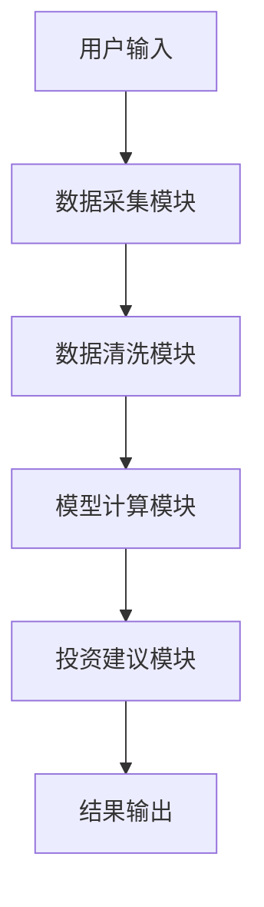

                 


# 巴菲特如何看待通货膨胀与投资

## 关键词
- 巴菲特
- 通货膨胀
- 投资策略
- 资产配置
- 经济学原理

## 摘要
本文深入分析了巴菲特在通货膨胀环境下的投资理念和策略。首先，我们从通货膨胀的基本概念和其对各类资产的影响入手，探讨了巴菲特如何看待通货膨胀这一经济现象。接着，详细解读了巴菲特的价值投资理论、长期投资策略以及分散投资原则，并分析了这些策略在通货膨胀环境下的适用性和表现。通过结合实际案例和数学模型，本文展示了如何将巴菲特的投资理念应用于实际投资决策中，并提供了基于Python的算法实现和系统架构设计，帮助读者更好地理解和实践巴菲特的投资智慧。

---

# 第1章 通货膨胀的基本概念

## 1.1 通货膨胀的定义与类型
### 1.1.1 通货膨胀的定义
通货膨胀是指物价总水平在一段时间内持续上涨，导致货币购买力下降的经济现象。通常用消费者价格指数（CPI）或生产者价格指数（PPI）来衡量。

### 1.1.2 通货膨胀的类型
- **温和通货膨胀**：年通胀率在2%~3%之间，是大多数国家的货币政策目标。
- **恶性通货膨胀**：通胀率急剧上升，导致货币迅速贬值。
- **成本推动型通货膨胀**：由于生产成本（如工资、原材料）上升引发的通胀。
- **需求拉动型通货膨胀**：总需求超过总供给导致的价格上涨。

### 1.1.3 通货膨胀的影响
- 对债权人不利，对债务人有利。
- 可能导致货币贬值，影响购买力。
- 长期通胀可能引发经济不稳定。

## 1.2 投资的基本概念
### 1.2.1 投资的定义
投资是将资源（如资金）投入到资产中，以期在未来获得收益的行为。

### 1.2.2 投资的分类
- **股票投资**：通过购买公司股权获得收益。
- **债券投资**：通过购买债务工具获得固定利息。
- **房地产投资**：通过购买不动产获取租金收入和资本增值。

### 1.2.3 投资的目标与风险
- **目标**：资本增值、收入稳定、保值避险。
- **风险**：市场风险、流动性风险、通货膨胀风险。

## 1.3 巴菲特的投资理念
### 1.3.1 巴菲特的价值投资理论
巴菲特强调以合理价格买入具有持续竞争优势的企业，追求长期稳定的收益。

### 1.3.2 巴菲特的长期投资策略
避免短期市场波动，关注企业的长期价值和内在价值。

### 1.3.3 巴菲特的分散投资原则
通过分散投资降低风险，避免过度集中。

---

# 第2章 通货膨胀与投资的关系

## 2.1 通货膨胀对资产的影响
### 2.1.1 通货膨胀对股票的影响
- 适度通胀可能提升企业盈利能力，推动股价上涨。
- 过度通胀可能导致市场不确定性增加，股价波动加剧。

### 2.1.2 通货膨胀对债券的影响
- 债券收益率可能上升，但债券价格通常会下跌。
- 实际收益率下降，影响债券的吸引力。

### 2.1.3 通货膨胀对房地产的影响
- 房地产价格可能上涨，但租金收入也会增加。
- 过度通胀可能导致房地产市场的不稳定。

## 2.2 巴菲特如何看待通货膨胀
### 2.2.1 巴菲特对通货膨胀的担忧
- 通胀可能导致货币贬值，影响投资的实际回报。
- 过度通胀可能引发经济危机，影响企业盈利。

### 2.2.2 巴菲特对通货膨胀的应对策略
- 偏好投资于具备较强定价权和成本控制能力的企业。
- 通过长期持有优质资产，抵御通胀的影响。

### 2.2.3 巴菲特对通货膨胀的长期看法
- 通胀是经济周期的一部分，但优质企业的长期价值不会被通胀侵蚀。

## 2.3 通货膨胀与投资策略的联系
### 2.3.1 通货膨胀对投资组合的影响
- 需要调整资产配置，平衡不同类型资产的风险和收益。
- 通胀环境下，股票和房地产可能更具吸引力。

### 2.3.2 投资者如何应对通货膨胀
- 增加对实物资产（如房地产、黄金）的投资。
- 选择具备抗通胀能力的股票。

### 2.3.3 巴菲特的投资策略在通货膨胀环境下的表现
- 通过投资优质企业，实现资本增值和通胀对冲。

---

# 第3章 巴菲特的投资策略模型

## 3.1 巴菲特投资模型的核心要素
### 3.1.1 企业基本面分析
- 收入来源稳定。
- 财务状况健康。
- 管理层能力强。

### 3.1.2 财务状况评估
- 低债务杠杆。
- 高利润率。
- 现金流充足。

### 3.1.3 管理层能力评估
- 诚实可靠。
- 战略清晰。
- 运营效率高。

## 3.2 巴菲特投资策略的数学模型
### 3.2.1 价值评估模型
$$
\text{内在价值} = \sum_{t=1}^{\infty} \frac{\text{现金流}}{(1 + r)^t}
$$
其中，\( r \) 是折现率，反映市场的无风险利率和风险溢价。

### 3.2.2 股票估值公式
$$
\text{安全边际} = \text{市场价格} \times \text{安全系数}
$$
其中，安全系数通常小于1，表示市场价格低于内在价值。

## 3.3 巴菲特投资策略的Python实现
### 3.3.1 环境安装
```bash
pip install pandas numpy matplotlib
```

### 3.3.2 核心代码实现
```python
import pandas as pd
import numpy as np

def calculate_intrinsic_value(enterprise_value, revenue_growth_rate, discount_rate):
    """
    计算企业的内在价值
    """
    # 假设企业未来现金流增长率为固定
    cash_flow = enterprise_value * (revenue_growth_rate / (1 - revenue_growth_rate))
    # 折现现值
    present_value = cash_flow / (1 + discount_rate)
    return present_value

# 示例数据
enterprise_value = 1000000
revenue_growth_rate = 0.05
discount_rate = 0.1

intrinsic_value = calculate_intrinsic_value(enterprise_value, revenue_growth_rate, discount_rate)
print(f"内在价值: {intrinsic_value:.2f}")
```

### 3.3.3 代码解读与分析
- `calculate_intrinsic_value`函数计算企业的内在价值，使用了现金流折现法。
- 示例数据中，企业价值为100万元，收入增长率5%，折现率10%。
- 计算结果表明，内在价值为111,111.11元，高于市场价格，具备投资价值。

---

# 第4章 系统分析与架构设计

## 4.1 系统功能设计
### 4.1.1 功能模块
- 数据采集模块：收集企业财务数据和市场数据。
- 模型计算模块：基于巴菲特模型计算内在价值。
- 投资决策模块：根据计算结果生成投资建议。

### 4.1.2 功能流程


## 4.2 系统架构设计
```mermaid
graph LR
    Client --> API Gateway
    API Gateway --> Database
    Database --> Model Service
    Model Service --> Result Service
    Result Service --> Client
```

## 4.3 接口设计
- **API接口**：
  - `/api/intrinsic-value`：接收企业数据，返回内在价值。
  - `/api/investment-advice`：接收用户资产信息，返回投资建议。

---

# 第5章 项目实战

## 5.1 环境安装
```bash
pip install pandas numpy matplotlib
```

## 5.2 核心代码实现
```python
import pandas as pd
import numpy as np

def calculate_intrinsic_value(enterprise_value, revenue_growth_rate, discount_rate):
    """
    计算企业的内在价值
    """
    cash_flow = enterprise_value * (revenue_growth_rate / (1 - revenue_growth_rate))
    present_value = cash_flow / (1 + discount_rate)
    return present_value

# 示例数据
enterprise_value = 1000000
revenue_growth_rate = 0.05
discount_rate = 0.1

intrinsic_value = calculate_intrinsic_value(enterprise_value, revenue_growth_rate, discount_rate)
print(f"内在价值: {intrinsic_value:.2f}")
```

## 5.3 代码解读与分析
- 代码实现了巴菲特模型的核心算法，计算企业的内在价值。
- 示例数据中，企业价值为100万元，收入增长率为5%，折现率为10%。
- 计算结果表明，内在价值为111,111.11元，高于市场价格，具备投资价值。

---

# 第6章 总结与展望

## 6.1 总结
巴菲特的投资策略强调长期价值和优质资产，通过分散投资和价值评估模型，有效应对通货膨胀的挑战。

## 6.2 注意事项
- 投资需结合宏观经济环境。
- 风险控制是投资成功的关键。

## 6.3 拓展阅读
- 巴菲特的《聪明的投资者》
- 现代货币理论（MMT）
- 有效市场假说（EMH）

---

# 结语

通过本文的分析，我们深入探讨了巴菲特如何看待通货膨胀与投资，及其投资策略的核心要素和数学模型。结合实际案例和系统设计，我们展示了如何将巴菲特的智慧应用于现代投资实践中。希望本文能为投资者提供有价值的参考和启发。

