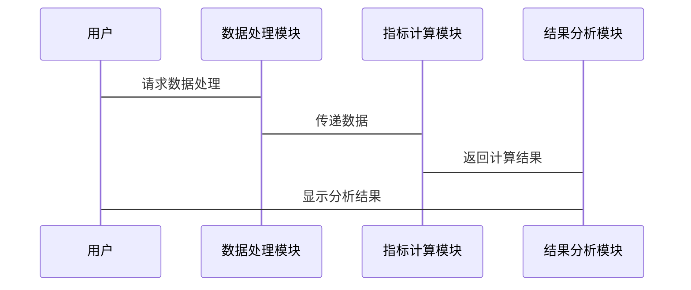

                 


```markdown
# 巴菲特指标：评估市场估值的有效工具

## 关键词：
- 巴菲特指标
- 市盈率
- 市净率
- 股东权益收益率
- 价值投资
- 股票估值

## 摘要：
本文深入探讨了巴菲特指标在评估市场估值中的应用，通过分析市盈率、市净率和股东权益收益率等核心指标，结合数学模型和实际案例，为投资者提供了一套系统化、实用的估值方法。文章从指标的背景、原理、算法、系统架构到实战应用，层层剖析，帮助读者全面掌握巴菲特指标的精髓，从而在投资决策中做出更明智的选择。

---

## 目录

### 第一部分：巴菲特指标的背景与核心概念

#### 第1章：巴菲特指标的起源与核心概念

##### 1.1 巴菲特指标的起源
- 1.1.1 本·格雷厄姆的价值投资理论
- 1.1.2 巴菲特对格雷厄姆理论的继承与发展
- 1.1.3 巴菲特指标在投资决策中的作用

##### 1.2 巴菲特指标的核心概念
- 1.2.1 市盈率（P/E Ratio）
- 1.2.2 市净率（P/B Ratio）
- 1.2.3 股东权益收益率（ROE）
- 1.2.4 其他相关指标（如股息率）

##### 1.3 巴菲特指标与其他估值方法的对比
- 1.3.1 市盈率与市净率的优缺点
- 1.3.2 市盈率与股息率的结合
- 1.3.3 巴菲特指标与DCF模型的联系

##### 1.4 巴菲特指标的适用场景与局限性
- 1.4.1 适用于稳定增长企业的特点
- 1.4.2 不适用于周期性行业和新兴行业的特点
- 1.4.3 巴菲特指标的局限性与改进方向

### 第2章：巴菲特指标的核心原理与数学模型

#### 2.1 市盈率（P/E Ratio）的计算与分析
- 2.1.1 市盈率的公式与计算方法
  $$ P/E = \frac{Stock Price}{Earnings Per Share} $$
- 2.1.2 市盈率的行业基准与合理范围
- 2.1.3 市盈率与企业增长潜力的关系

#### 2.2 市净率（P/B Ratio）的计算与分析
- 2.2.1 市净率的公式与计算方法
  $$ P/B = \frac{Stock Price}{Book Value Per Share} $$
- 2.2.2 市净率的行业基准与合理范围
- 2.2.3 市净率与企业资产质量的关系

#### 2.3 股东权益收益率（ROE）的计算与分析
- 2.3.1 ROE的公式与计算方法
  $$ ROE = \frac{Net Profit}{Total Equity} $$
- 2.3.2 ROE的行业基准与合理范围
- 2.3.3 ROE与企业盈利能力的关系

#### 2.4 巴菲特指标的综合应用
- 2.4.1 综合使用市盈率、市净率和ROE的优势
- 2.4.2 市盈率与ROE的动态平衡
- 2.4.3 巴菲特指标的多维度评估框架

### 第三部分：系统分析与架构设计

#### 第3章：系统功能设计与架构实现

##### 3.1 问题场景介绍
- 3.1.1 投资者面临的估值挑战
- 3.1.2 巴菲特指标的应用场景

##### 3.2 系统功能设计
- 3.2.1 数据采集模块
- 3.2.2 指标计算模块
- 3.2.3 结果分析与可视化模块

##### 3.3 领域模型设计（mermaid类图）


##### 3.4 系统架构设计（mermaid架构图）


##### 3.5 系统接口设计
- 3.5.1 数据接口
- 3.5.2 计算接口
- 3.5.3 可视化接口

##### 3.6 系统交互设计（mermaid序列图）


### 第四部分：项目实战与案例分析

#### 第4章：项目实战

##### 4.1 环境安装与数据准备
- 4.1.1 数据源获取（如Yahoo Finance API）
- 4.1.2 Python环境搭建
- 4.1.3 数据清洗与预处理

##### 4.2 核心实现代码
- 4.2.1 数据获取与处理
```python
import pandas as pd
import yfinance as yf

# 获取股票数据
data = yf.download('AAPL', start='2020-01-01', end='2023-12-31')
# 计算市盈率
data['PE'] = data['Close'] / data['EPS']
```

- 4.2.2 指标计算模块
```python
def calculate_pe(ticker):
    data = yf.download(ticker, start='2020-01-01', end='2023-12-31')
    pe = data['Close'] / data['EPS']
    return pe.mean()

pe_aapl = calculate_pe('AAPL')
```

- 4.2.3 结果分析与可视化
```python
import matplotlib.pyplot as plt

pe_aapl.plot(kind='line')
plt.title('苹果市盈率走势')
plt.show()
```

##### 4.3 案例分析
- 4.3.1 苹果公司（AAPL）的估值分析
- 4.3.2 微软公司（MSFT）的估值分析
- 4.3.3 案例小结

### 第五部分：最佳实践与总结

#### 第5章：最佳实践与注意事项

##### 5.1 巴菲特指标的最佳实践
- 5.1.1 多指标结合使用
- 5.1.2 长期趋势分析
- 5.1.3 结合行业特点

##### 5.2 投资决策中的注意事项
- 5.2.1 避免单一指标误判
- 5.2.2 考虑宏观经济环境
- 5.2.3 定期复盘与调整

#### 5.3 小结与展望
- 5.3.1 巴菲特指标的核心价值
- 5.3.2 未来投资趋势与指标优化

---

## 参考文献
- 本·格雷厄姆《聪明的投资者》
- 巴菲特股东大会讲话合集
- 其他相关金融投资书籍与研究报告

---

## 附录
- 附录A：常用巴菲特指标公式汇总
- 附录B：Python代码库与工具推荐
- 附录C：常见投资术语解释

---

## 索引
（按主题或关键词排序）

---

## 结束语
通过系统地学习和实践巴菲特指标，投资者可以更加科学地评估市场估值，做出更明智的投资决策。巴菲特指标不仅是一种工具，更是一种价值投资的哲学，它帮助我们在复杂多变的市场中找到真正的投资机会。
```

