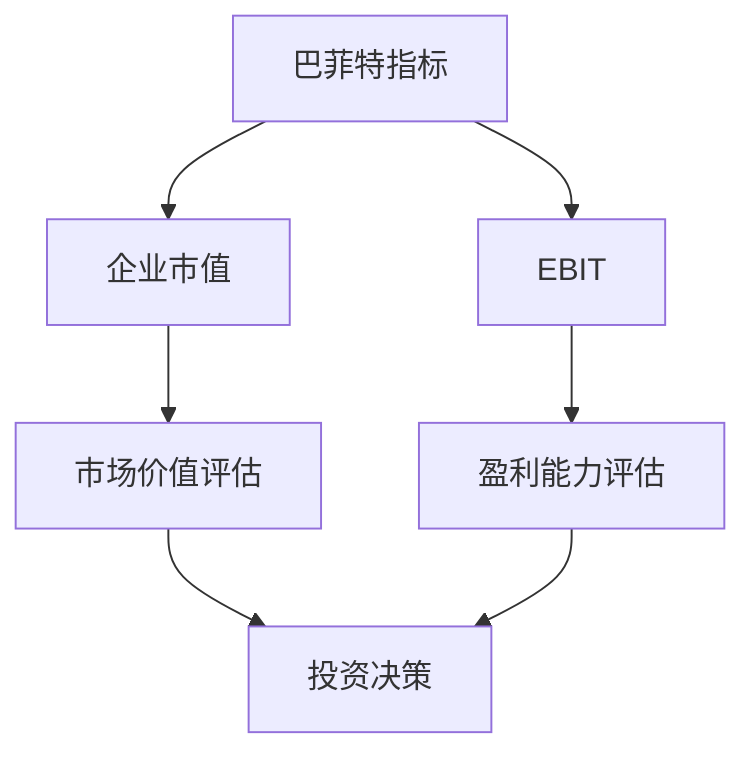

                 

# 巴菲特指标在国际市场的适用性探讨

## 关键词：巴菲特指标，国际市场，投资策略，经济环境，会计准则，文化差异

## 摘要：  
巴菲特指标是一种用于评估企业内在价值的重要工具，但其在国际市场的适用性受到经济环境、会计准则和文化差异等多种因素的影响。本文通过分析不同国家和地区的经济特点、会计准则差异以及文化背景对巴菲特指标的影响，探讨如何优化和调整该指标以适应国际市场。文章结合实际案例和数据，提出了在跨国投资中应用巴菲特指标的最佳实践，并展望了其未来的发展趋势。

---

# 第一部分：巴菲特指标的背景与基础

## 第1章：巴菲特指标的基本概念

### 1.1 巴菲特指标的定义与核心要素

#### 1.1.1 巴菲特指标的定义
巴菲特指标（Buffett Indicator），也称为“巴菲特比率”，是由股神沃伦·巴菲特提出的一种用于评估企业内在价值的工具。该指标通过将企业市值与息税前利润（EBIT）进行对比，帮助投资者判断企业的估值是否合理。

$$ \text{巴菲特指标} = \frac{\text{企业市值}}{\text{息税前利润（EBIT）}} $$

该指标的核心在于通过比较企业的市值与其实际盈利能力之间的关系，判断企业是否被高估或低估。

#### 1.1.2 巴菲特指标的核心要素
- **企业市值**：企业的市场价值，即当前的股价乘以流通股数。
- **息税前利润（EBIT）**：企业扣除利息和税金前的利润，是衡量企业盈利能力的重要指标。
- **行业基准值**：不同行业和市场的基准值不同，通常以10倍左右为合理区间，高于10倍可能表示高估，低于10倍可能表示低估。

#### 1.1.3 巴菲特指标的计算公式与应用场景
$$ \text{巴菲特指标} = \frac{\text{企业市值}}{\text{EBIT}} $$

应用场景包括：
1. 评估企业的内在价值。
2. 比较不同企业或行业的估值水平。
3. 作为投资决策的参考工具。

---

### 1.2 巴菲特指标的发展历程

#### 1.2.1 巴菲特指标的起源与演变
巴菲特指标起源于巴菲特的投资理念，他认为企业的内在价值是其未来现金流的现值。巴菲特指标通过将市值与EBIT对比，简化了对企业价值的评估。随着全球化的推进，该指标的应用范围逐渐扩展到国际市场。

#### 1.2.2 巴菲特指标在投资中的历史表现
巴菲特指标在长期投资中表现出色，尤其是在美国市场，其对企业的估值判断具有较高的准确性。然而，随着国际市场的拓展，该指标在不同环境下的表现出现了差异。

#### 1.2.3 巴菲特指标的局限性与改进方向
- 局限性：指标忽略了通货膨胀、税率差异等因素。
- 改进方向：结合其他指标（如市净率、市盈率）进行综合评估。

---

## 第2章：巴菲特指标在不同市场的表现

### 2.1 美国市场中的巴菲特指标

#### 2.1.1 美国市场的特点与巴菲特指标的适用性
美国市场是巴菲特指标的发源地，其市场经济体系完善、信息披露规范，使得该指标在美国市场中表现稳定。

#### 2.1.2 美国市场中巴菲特指标的成功案例
例如，巴菲特投资可口可乐时，通过巴菲特指标评估其合理估值，取得了长期收益。

#### 2.1.3 美国市场中巴菲特指标的局限性
在一些周期性行业（如制造业），指标可能因EBIT波动较大而产生偏差。

---

### 2.2 其他主要市场的巴菲特指标表现

#### 2.2.1 欧洲市场的特点与巴菲特指标的适用性
欧洲市场以成熟企业为主，但会计准则与美国存在差异，影响指标的准确性。

#### 2.2.2 日本市场的特点与巴菲特指标的适用性
日本市场受通货膨胀率较低和企业税制影响，指标的应用需要调整。

#### 2.2.3 中国市场的特点与巴菲特指标的适用性
中国市场成长性强，但会计准则和税率差异较大，需结合其他指标进行分析。

---

# 第二部分：巴菲特指标的国际适用性分析

## 第3章：不同国家经济环境对巴菲特指标的影响

### 3.1 经济体制差异对巴菲特指标的影响

#### 3.1.1 市场经济与计划经济的对比
市场经济环境下，企业盈利能力更容易通过EBIT反映，而计划经济下可能受政策影响较大。

#### 3.1.2 通货膨胀率差异
高通货膨胀率可能导致EBIT虚高，影响指标的准确性。

#### 3.1.3 税收政策差异
不同国家的税率差异会影响企业的净利润，进而影响巴菲特指标的计算。

---

### 3.2 会计准则差异对巴菲特指标的影响

#### 3.2.1 不同国家会计准则的差异
例如，美国采用GAAP，而欧洲部分国家采用IFRS，两者在收入确认和资产计量上有差异。

#### 3.2.2 会计准则差异对巴菲特指标的具体影响
以某跨国企业为例，同一企业在不同准则下的EBIT可能存在差异，影响指标结果。

#### 3.2.3 如何调整巴菲特指标以适应不同会计准则
通过标准化处理或引入其他财务指标进行调整。

---

### 3.3 文化差异对巴菲特指标的影响

#### 3.3.1 不同国家的企业文化差异
例如，美国企业注重创新和风险，而亚洲企业更注重稳定和家族管理。

#### 3.3.2 文化差异对管理层决策的影响
管理层决策可能影响企业财务数据的披露方式，进而影响指标的应用。

#### 3.3.3 如何在不同文化背景下调整巴菲特指标的应用
结合当地市场环境和企业治理结构，灵活调整指标的权重或评估标准。

---

## 第4章：巴菲特指标的跨国比较与优化

### 4.1 不同国家巴菲特指标的表现对比

#### 4.1.1 美国、欧洲、亚洲等主要市场的对比分析
通过对比不同市场的指标表现，找出差异性。

#### 4.1.2 不同行业中的表现差异
例如，科技行业与传统制造业的指标差异。

#### 4.1.3 不同公司规模中的表现差异
大公司与小公司在市值和EBIT上的差异影响指标的适用性。

---

### 4.2 巴菲特指标的优化与调整

#### 4.2.1 根据不同市场特点调整指标的权重
例如，在高通胀国家增加对通货膨胀的调整权重。

#### 4.2.2 结合其他指标进行综合评估
如结合市盈率（P/E）和市净率（P/B）进行多维度评估。

#### 4.2.3 如何在跨国投资中应用优化后的指标
通过制定差异化的投资策略，灵活调整指标的应用。

---

# 第三部分：巴菲特指标的国际投资策略

## 第5章：巴菲特指标的国际投资策略

### 5.1 跨国投资中的巴菲特指标应用

#### 5.1.1 制定差异化的投资策略
根据不同市场的特点，调整指标的应用方式。

#### 5.1.2 跨国公司的案例分析
以某跨国公司为例，分析如何在不同市场中应用巴菲特指标。

---

## 第6章：巴菲特指标的未来展望

### 6.1 巴菲特指标的未来发展趋势

#### 6.1.1 全球化与指标的适应性
随着全球化的深入，巴菲特指标需要进一步优化以适应更多市场环境。

#### 6.1.2 技术进步对指标的影响
大数据和人工智能技术可以提高指标的计算和分析效率。

---

# 附录

## 附录A：巴菲特指标相关数据与表格

## 附录B：巴菲特指标的 Mermaid 图

## 附录C：相关代码与工具

---

# 参考文献

（此处列出相关书籍、论文、网站等参考资料）

---

以上为文章的完整大纲和部分内容示例。通过以上分析，我们可以看到巴菲特指标在国际市场的适用性受到多种因素的影响，投资者需要结合具体情况灵活调整其应用策略。

