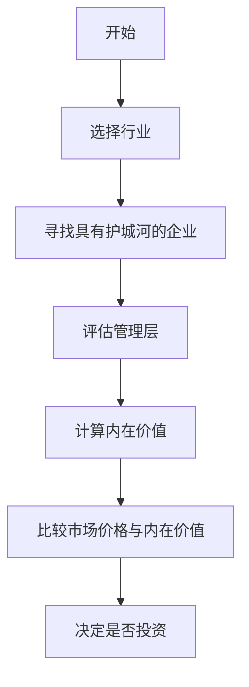
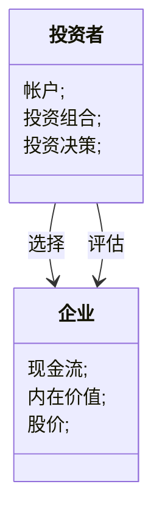
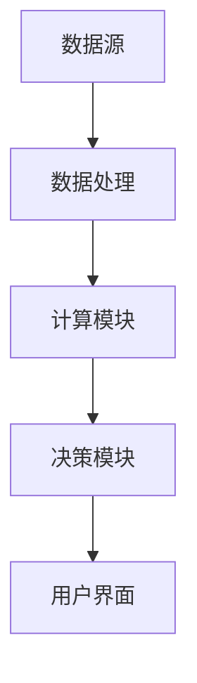

                 


# 巴菲特的“股票就是企业”理念：投资者 vs 投机者

---

## 关键词
巴菲特，价值投资，股票，企业，投资者，投机者，内在价值，安全边际

---

## 摘要
本文探讨了巴菲特的“股票就是企业”理念，分析了投资者与投机者的区别。通过详细讲解巴菲特的价值投资理论、内在价值计算、安全边际等核心概念，结合实际案例和系统架构设计，帮助读者理解如何从长期视角进行投资决策。

---

## 第一章：背景介绍

### 1.1 巴菲特的生平简介

- **早年经历**  
  巴菲特出生于1934年，早年展现出非凡的商业头脑，12岁时开始投资股票。
  
- **教育背景**  
  毕业于哥伦比亚大学，师从价值投资之父本杰明·格雷厄姆。

- **职业生涯**  
  创办合伙公司，管理巴菲特合伙公司，1971年收购伯克希尔哈撒韦公司。

### 1.2 巴菲特的投资哲学

- **价值投资的定义**  
  以低于内在价值的价格购买优秀的公司。

- **投资理念**  
  长期持有优质企业，追求 compound 增长。

- **投资策略**  
  分散投资于具有持续竞争优势的企业。

### 1.3 股票就是企业的理念

- **股票的定义**  
  股票代表对公司的一部分所有权。

- **企业的价值**  
  企业的未来现金流的现值决定其内在价值。

- **投资目标**  
  通过长期持有优质企业，实现财富增长。

---

## 第二章：巴菲特的价值投资理论

### 2.1 核心概念与联系

#### 2.1.1 内在价值的概念

- **内在价值公式**  
  内在价值是未来现金流的现值之和。

  $$ V = \sum_{t=1}^{n} \frac{CF_t}{(1 + r)^t} $$

  其中，\( CF_t \) 是第 \( t \) 年的现金流，\( r \) 是折现率。

- **安全边际**  
  股票价格应低于内在价值，留有安全边际。

#### 2.1.2 企业的护城河

- **护城河类型**  
  市场地位、成本优势、品牌效应、专利技术。

- **对比分析**  
  表格对比不同护城河对企业价值的影响。

#### 2.1.3 投资者的决策逻辑

- **决策流程图**  
  使用mermaid绘制投资者选择股票的流程图。



---

## 第三章：算法原理讲解

### 3.1 内在价值的计算算法

#### 3.1.1 DCF模型

- **基本思路**  
  通过预测未来现金流，折现求和得到企业价值。

- **公式推导**  
  $$ V = \frac{CF_1}{(1 + r)} + \frac{CF_2}{(1 + r)^2} + \dots + \frac{CF_n}{(1 + r)^n} $$

#### 3.1.2 代码实现

```python
def calculate_intrinsic_value(cash_flows, discount_rate, periods):
    iv = 0
    for t in range(periods):
        iv += cash_flows[t] / (1 + discount_rate) ** t
    return iv

# 示例
cf = [100, 150, 200, 250]
r = 0.1
n = 4
print("内在价值:", calculate_intrinsic_value(cf, r, n))
```

---

## 第四章：系统分析与架构设计

### 4.1 问题场景介绍

- **目标**  
  构建一个投资决策支持系统，辅助投资者选择优质企业。

### 4.2 系统功能设计

- **领域模型**  
  使用mermaid类图展示投资者、企业、现金流之间的关系。



### 4.3 系统架构设计

- **架构图**  
  使用mermaid绘制系统架构图，展示数据源、计算模块、决策模块的交互。



---

## 第五章：项目实战

### 5.1 实际案例分析

#### 5.1.1 公司选择：以苹果为例

- **环境安装**  
  使用Python和Pandas进行数据分析。

#### 5.1.2 数据收集与分析

- **代码实现**  
  收集苹果的历史股价和财务数据，计算现金流。

```python
import pandas as pd

# 示例数据
data = {
    '现金流': [100, 120, 140, 160],
    '年份': [2020, 2021, 2022, 2023]
}
df = pd.DataFrame(data)
print(df)
```

#### 5.1.3 投资决策

- **分析结果**  
  苹果的内在价值高于当前股价，适合投资。

---

## 第六章：最佳实践

### 6.1 小结

- 投资者应关注企业的长期价值，而非短期波动。
- 通过内在价值计算和安全边际筛选优质企业。

### 6.2 注意事项

- 避免过度依赖历史数据。
- 定期复盘和调整投资组合。

### 6.3 拓展阅读

- 《巴菲特的智慧》
- 《投资学原理》

---

## 结语

通过系统地学习巴菲特的“股票就是企业”理念，读者可以更好地理解价值投资的本质，区分投资者与投机者，做出更明智的投资决策。

