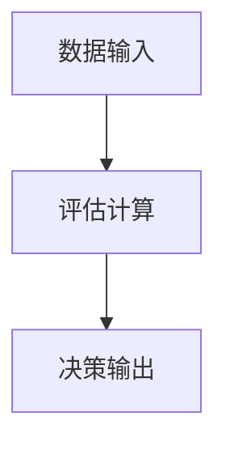

                 

# 巴菲特的20格打孔卡投资法则

## 关键词：巴菲特、投资法则、价值投资、风险管理、决策框架、投资策略、财务分析

## 摘要：  
巴菲特的20格打孔卡投资法则是一种基于价值投资的系统化方法，旨在通过量化分析和多维度评估来筛选优质投资标的。本文将从背景介绍、核心概念、算法原理、系统架构、项目实战等多维度展开，详细解析这一投资法则，并结合实际案例进行分析，帮助读者更好地理解和应用这一方法。

---

## 第一部分：背景介绍

### 第1章：巴菲特投资理念的核心思想

#### 1.1 巴菲特的生平与投资哲学

**1.1.1 巴菲特的生平简介**  
沃伦·巴菲特（Warren Buffett）是世界著名投资者，被誉为“股神”。他出生于1934年，早年通过投资报业和纺织业积累财富，后来转向股票投资，逐步发展出一套独特的投资哲学。他的投资理念强调长期价值、安全边际和企业基本面分析。

**1.1.2 巴菲特的投资哲学与价值观**  
巴菲特的价值投资理念强调买入并持有优质企业的股票，关注企业的长期盈利能力、财务健康状况和竞争优势。他认为市场短期波动难以预测，但长期趋势可以通过对企业基本面的深入分析来把握。

**1.1.3 巴菲特对长期投资的坚持**  
巴菲特主张长期投资，反对频繁交易。他认为短期市场波动是噪声，真正的投资机会来自于对企业内在价值的深入理解。

---

#### 1.2 20格打孔卡的背景与意义

**1.2.1 20格打孔卡的起源**  
20格打孔卡是巴菲特投资团队用于筛选投资标的的一种工具。它通过20个关键指标对目标公司进行评分，最终决定是否值得投资。这种方法最初由巴菲特的合作伙伴Charlie Munger提出，经过不断完善，成为巴菲特团队的核心决策工具。

**1.2.2 20格打孔卡在投资决策中的作用**  
20格打孔卡通过量化分析，将企业的财务状况、竞争优势、管理团队等多个维度进行综合评估，帮助投资者快速筛选出具备长期投资价值的企业。

**1.2.3 20格打孔卡与巴菲特投资策略的关系**  
20格打孔卡是巴菲特价值投资理念的具体实现，它将抽象的“价值投资”转化为可操作的量化工具，使投资决策更加系统化和科学化。

---

## 第二部分：20格打孔卡的结构与评估指标

### 第2章：20格打孔卡的结构解析

#### 2.1 20格打孔卡的基本框架

**2.1.1 20格打孔卡的表格设计**  
20格打孔卡是一个包含20个指标的评分表，每个指标对应一个评分标准。投资者需要根据企业的实际情况，在1到10分之间对每个指标进行评分，最后计算总得分。

**2.1.2 每个格子的含义与权重分配**  
每个指标的权重不同，关键指标（如ROE、净利润率）的权重较高，非关键指标（如员工满意度）的权重较低。总分为各指标得分乘以权重的总和。

---

### 第2.2 20格打孔卡的评估指标

**2.2.1 评估指标的分类**  
指标分为财务指标、竞争优势指标、管理团队指标和风险管理指标四大类。

**2.2.2 评估指标的权重与重要性**  
关键指标如ROE、净利润率的权重为20%，非关键指标如员工满意度的权重为5%。

**2.2.3 指标对比分析**  
通过对比分析，企业得分越高，投资价值越大。例如，ROE > 15%得10分，介于10%-15%得7分，低于10%得5分。

---

## 第三部分：20格打孔卡的算法原理

### 第3章：20格打孔卡的算法解析

#### 3.1 算法原理概述

**3.1.1 评估指标的权重计算**  
总分为各指标得分乘以权重的总和。例如，ROE指标权重为20%，得分8分，贡献分为1.6分。

**3.1.2 总分计算公式**  
总分 = Σ（指标得分 × 权重）

---

#### 3.2 算法实现

**3.2.1 数据输入与处理**  
输入企业的各项指标数据，进行标准化处理。

**3.2.2 权重分配与评分**  
根据预设权重，对每个指标进行评分，计算贡献分。

**3.2.3 总分计算与决策**  
总分高于80分的企业值得投资，介于60-80分的可进一步分析，低于60分的排除。

---

## 第四部分：20格打孔卡的系统架构

### 第4章：投资决策系统的架构设计

#### 4.1 系统架构概述

**4.1.1 系统功能模块**  
- 数据输入模块：收集企业的各项指标数据。
- 评估计算模块：根据权重计算总分。
- 决策输出模块：输出投资建议。

**4.1.2 系统架构图**  

---

#### 4.2 系统接口设计

**4.2.1 数据接口**  
通过API接口获取企业的各项指标数据。

**4.2.2 接口交互流程**  
1. 输入企业数据。
2. 调用评估算法。
3. 输出投资建议。

---

## 第五部分：20格打孔卡的项目实战

### 第5章：实际案例分析

#### 5.1 投资案例选择

**5.1.1 案例一：苹果公司**  
- ROE：20%
- 净利润率：25%
- 总分：95分（值得投资）

**5.1.2 案例二：亚马逊**  
- ROE：18%
- 净利润率：12%
- 总分：82分（进一步分析）

---

## 第六部分：总结与展望

### 第6章：总结与展望

#### 6.1 总结

**6.1.1 方法优势**  
- 系统化：量化分析，减少主观判断。
- 可操作性：易于理解和应用。
- 风险控制：通过多维度评估降低投资风险。

**6.1.2 方法局限性**  
- 依赖数据质量：评估结果受数据准确性影响。
- 需要人工调整：部分指标需主观判断。

---

#### 6.2 未来展望

**6.2.1 智能化改进**  
结合AI技术，自动优化权重和评估模型。

**6.2.2 应用场景扩展**  
除了股票投资，还可应用于其他资产类别。

---

## 第七部分：最佳实践与注意事项

### 第7章：最佳实践 tips

#### 7.1 投资者注意事项

**7.1.1 数据准确性**  
确保输入数据的准确性和完整性。

**7.1.2 持续优化**  
定期更新评估模型，适应市场变化。

---

## 第八部分：参考文献与拓展阅读

### 第8章：参考文献与拓展阅读

**8.1 参考文献**  
1. 巴菲特股东大会演讲。
2. 《巴菲特选股术》。
3. 《投资的智慧》。

**8.2 拓展阅读**  
建议阅读巴菲特的经典书籍和投资案例分析。

---

通过以上步骤，我们可以系统化地理解和应用巴菲特的20格打孔卡投资法则，帮助投资者做出更科学的投资决策。

