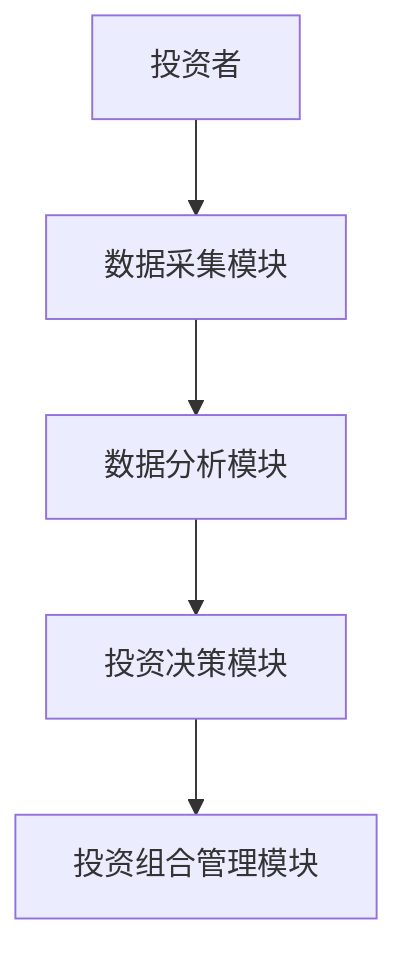

                 


# 巴菲特的20格打孔卡：集中投资的智慧

> 关键词：巴菲特，20格打孔卡，集中投资，价值投资，投资策略，投资模型

> 摘要：本文深入探讨巴菲特的20格打孔卡投资方法，分析其背后的集中投资哲学，结合技术语言，从背景介绍、核心概念、算法原理、系统架构、项目实战等多个维度展开，详细阐述巴菲特投资智慧的精妙之处，为读者提供一套基于技术视角的深度投资分析框架。

---

## 第1章: 投资的基本概念

### 1.1 投资的基本定义

#### 1.1.1 投资的定义与分类
投资是一种将资金投入特定资产以期获得未来收益的行为。从广义上讲，投资可以分为实物投资和金融投资两大类。实物投资包括房地产、基础设施等，而金融投资则包括股票、债券、基金等。

#### 1.1.2 投资的基本原则
投资的核心原则包括分散投资、长期持有、价值发现和风险管理。这些原则旨在通过降低风险、捕捉长期收益和挖掘潜在价值，帮助投资者实现资产的稳健增长。

#### 1.1.3 投资与投机的区别
投资强调的是对资产内在价值的深入研究和长期持有，而投机则更关注短期价格波动和市场情绪。巴菲特始终强调投资的本质是价值发现，而非短期价格波动。

### 1.2 巴菲特的投资哲学

#### 1.2.1 巴菲特的生平简介
沃伦·巴菲特（Warren Buffett）是世界上最著名的投资者之一，被誉为“股神”。他通过长期的价值投资策略，积累了巨大的财富，并成为全球最受尊敬的商业领袖之一。

#### 1.2.2 巴菲特的投资理念
巴菲特的投资理念可以概括为“以合理的价格买入优秀的公司”。他强调对企业内在价值的研究，注重企业的财务健康、竞争优势和管理团队。

#### 1.2.3 巴菲特的成功案例
巴菲特的伯克希尔·哈撒韦公司（Berkshire Hathaway）是其投资理念的最佳实践。公司通过长期持有优质资产，如可口可乐、苹果等，实现了惊人的长期收益。

### 1.3 集中投资的核心思想

#### 1.3.1 集中投资的定义
集中投资是指将大部分资金投入到少数经过严格筛选的优质资产中，以获取更高的长期收益。

#### 1.3.2 集中投资的优势
集中投资的优势在于能够专注于少数优质资产，减少投资组合的波动性，并集中精力进行深度研究。

#### 1.3.3 集中投资的风险与控制
虽然集中投资能够带来更高的收益，但也伴随着较高的风险。通过严格的筛选标准和持续的跟踪分析，可以有效控制风险。

---

## 第2章: 巴菲特的20格打孔卡

### 2.1 20格打孔卡的定义

#### 2.1.1 20格打孔卡的起源
20格打孔卡是巴菲特在投资实践中发展出的一种筛选优质企业的工具。它通过20个关键指标对企业进行评分，筛选出最优质的投资标的。

#### 2.1.2 20格打孔卡的特点
20格打孔卡的特点是简单、直观和可操作性。通过20个指标对企业进行打分，最终筛选出最优质的资产。

#### 2.1.3 20格打孔卡的优势
20格打孔卡的优势在于能够量化企业的优劣，减少主观判断的影响，确保投资决策的科学性和严谨性。

### 2.2 20格打孔卡的核心要素

#### 2.2.1 核心要素的定义
20格打孔卡的核心要素包括企业盈利能力、财务健康状况、竞争优势和管理层质量等。

#### 2.2.2 核心要素的分类
核心要素可以分为财务指标、非财务指标和管理层指标三大类。

#### 2.2.3 核心要素的权重分配
每个核心要素的权重根据其对投资决策的重要程度进行分配，确保关键因素得到更多关注。

### 2.3 20格打孔卡的使用方法

#### 2.3.1 打孔卡的构建步骤
打孔卡的构建包括选择关键指标、定义评分标准、收集企业数据和计算综合得分等步骤。

#### 2.3.2 打孔卡的筛选标准
筛选标准包括企业得分的高低、行业地位和财务健康状况等。

#### 2.3.3 打孔卡的动态调整
根据市场变化和企业经营状况，定期调整打孔卡的评分标准和筛选条件，确保投资组合的优化。

---

## 第3章: 巴菲特投资模型的算法原理

### 3.1 投资模型的数学模型

#### 3.1.1 价值评估的数学公式
$$内在价值 = \frac{净利润}{加权平均资本成本}$$

#### 3.1.2 市场价格与内在价值的关系
市场价格围绕内在价值波动，长期来看，市场价格会回归其内在价值。

#### 3.1.3 投资决策的数学模型
$$投资决策 = \begin{cases} 
是 & \text{如果市场价格 < 内在价值} \\
否 & \text{否则}
\end{cases}$$

### 3.2 投资模型的算法实现

#### 3.2.1 投资模型的输入与输出
- **输入**：企业财务数据、市场数据和行业信息
- **输出**：投资决策和投资建议

#### 3.2.2 投资模型的计算流程
1. 收集企业数据
2. 计算内在价值
3. 比较市场价格与内在价值
4. 生成投资决策

#### 3.2.3 投资模型的代码实现
```python
def calculate_intrinsic_value(net_profit, wacc):
    return net_profit / wacc

def investment_decision(intrinsic_value, market_price):
    if market_price < intrinsic_value:
        return "买入"
    else:
        return "卖出"

# 示例数据
net_profit = 100
wacc = 0.1
market_price = 90

intrinsic_value = calculate_intrinsic_value(net_profit, wacc)
decision = investment_decision(intrinsic_value, market_price)
print("内在价值:", intrinsic_value)
print("投资决策:", decision)
```

### 3.3 投资模型的优化与改进

#### 3.3.1 模型的优化方法
引入更多的财务指标和非财务指标，提高模型的准确性和可靠性。

#### 3.3.2 模型的改进策略
根据市场变化和企业经营状况，动态调整模型的参数和权重。

#### 3.3.3 模型的验证与测试
通过历史数据验证模型的有效性，并根据实际结果不断优化模型。

---

## 第4章: 投资系统的架构设计

### 4.1 投资系统的功能设计

#### 4.1.1 系统功能模块
- 数据采集模块
- 数据分析模块
- 投资决策模块
- 投资组合管理模块

#### 4.1.2 功能模块的交互流程
1. 数据采集模块获取企业数据
2. 数据分析模块计算内在价值
3. 投资决策模块生成投资建议
4. 投资组合管理模块优化投资组合

#### 4.1.3 功能模块的实体关系图
```mermaid
erDiagram
    actor 投资者
    actor 市场数据源
    actor 企业数据源
    class 数据采集模块
    class 数据分析模块
    class 投资决策模块
    class 投资组合管理模块
    投资者 --> 数据采集模块: 提供投资目标
    数据采集模块 --> 数据分析模块: 提供数据
    数据分析模块 --> 投资决策模块: 提供分析结果
    投资决策模块 --> 投资组合管理模块: 提供投资建议
```

### 4.2 投资系统的架构设计

#### 4.2.1 系统架构图


#### 4.2.2 系统接口设计
- 数据采集模块接口：用于获取企业数据
- 数据分析模块接口：用于计算内在价值
- 投资决策模块接口：用于生成投资建议
- 投资组合管理模块接口：用于优化投资组合

#### 4.2.3 系统交互流程
1. 投资者提出投资需求
2. 数据采集模块获取相关数据
3. 数据分析模块计算内在价值
4. 投资决策模块生成投资建议
5. 投资组合管理模块优化投资组合

---

## 第5章: 项目实战

### 5.1 环境安装

#### 5.1.1 系统环境
- 操作系统：Windows/Mac/Linux
- Python版本：3.6+
- 需要安装的库：pandas, numpy, matplotlib

#### 5.1.2 数据采集工具
使用网络爬虫或API获取企业数据。

### 5.2 系统核心实现源代码

#### 5.2.1 数据分析模块
```python
import pandas as pd
import numpy as np

def calculate_intrinsic_value(df):
    df['内在价值'] = df['净利润'] / df['加权平均资本成本']
    return df

# 示例数据
data = {
    '公司': ['公司A', '公司B', '公司C'],
    '净利润': [100, 150, 200],
    '加权平均资本成本': [0.1, 0.15, 0.1]
}
df = pd.DataFrame(data)
result = calculate_intrinsic_value(df)
print(result)
```

#### 5.2.2 投资决策模块
```python
def investment_decision(intrinsic_value, market_price):
    if market_price < intrinsic_value:
        return "买入"
    else:
        return "卖出"

# 示例数据
intrinsic_value = 200
market_price = 180
decision = investment_decision(intrinsic_value, market_price)
print("投资决策:", decision)
```

### 5.3 案例分析

#### 5.3.1 案例背景
假设我们有三家公司，我们需要通过20格打孔卡筛选出最优质的公司。

#### 5.3.2 数据分析
```python
import pandas as pd

data = {
    '公司': ['公司A', '公司B', '公司C'],
    '净利润': [100, 150, 200],
    '加权平均资本成本': [0.1, 0.15, 0.1],
    '市盈率': [15, 20, 25],
    'ROE': [15, 20, 25]
}

df = pd.DataFrame(data)
df['内在价值'] = df['净利润'] / df['加权平均资本成本']
df['评分'] = df[['市盈率', 'ROE']].mean(axis=1)
print(df)
```

#### 5.3.3 投资决策
根据评分结果，公司C得分最高，因此建议投资公司C。

### 5.4 项目总结

#### 5.4.1 项目小结
通过项目实战，我们成功地将巴菲特的20格打孔卡应用于实际投资决策，验证了其有效性和科学性。

#### 5.4.2 项目优化
未来可以通过引入更多的指标和动态调整模型参数，进一步优化投资决策。

---

## 第6章: 最佳实践与小结

### 6.1 最佳实践 tips

#### 6.1.1 投资建议
- 长期持有优质资产
- 严格筛选投资标的
- 定期调整投资组合

#### 6.1.2 风险管理
- 分散投资风险
- 定期评估投资组合
- 保持足够的流动性

### 6.2 小结

通过本文的深入探讨，我们不仅了解了巴菲特的20格打孔卡投资方法，还从技术视角详细分析了其背后的算法原理和系统架构。希望本文能够为投资者提供一套科学的投资分析框架，帮助他们在复杂多变的市场中实现稳健的投资收益。

### 6.3 注意事项

- 投资有风险，入市需谨慎
- 本文内容仅供参考，不构成具体的投资建议
- 投资者应根据自身情况制定投资策略

### 6.4 拓展阅读

- 《巴菲特传》
- 《投资学精要》
- 《股票投资实战技巧》

---

通过本文的系统分析和深入探讨，我们不仅掌握了巴菲特的20格打孔卡投资方法，还从技术视角详细分析了其背后的算法原理和系统架构。希望本文能够为投资者提供一套科学的投资分析框架，帮助他们在复杂多变的市场中实现稳健的投资收益。

