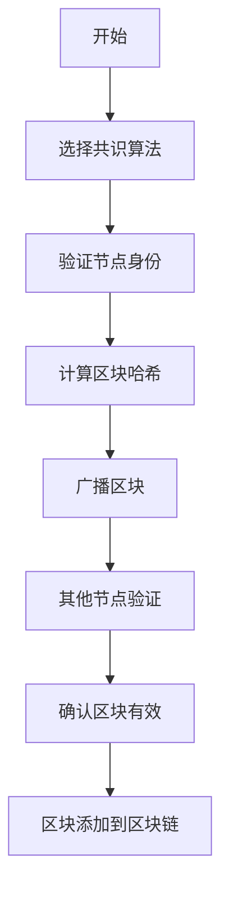
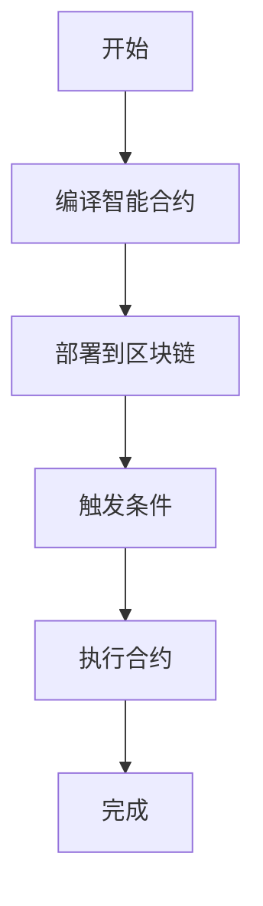
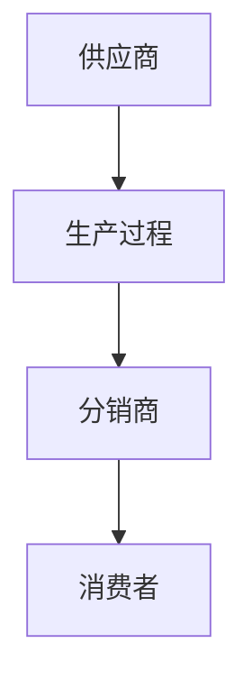
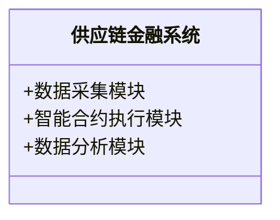
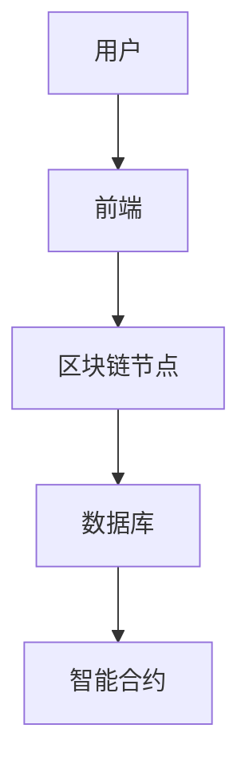
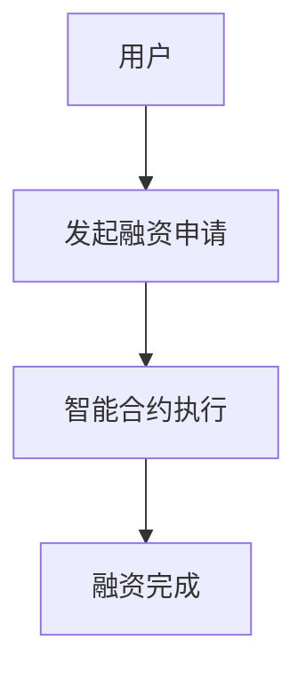

                 


# 巴菲特的产业链分析5.0：区块链技术在供应链金融中的应用

> 关键词：巴菲特产业链分析5.0, 区块链技术, 供应链金融, 智能合约, 供应链透明度

> 摘要：本文深入分析了巴菲特产业链分析5.0方法与区块链技术的结合，探讨了区块链技术如何在供应链金融中实现透明、高效和安全的解决方案。通过详细讲解区块链的核心原理、智能合约的应用、系统架构设计以及项目实战案例，本文为读者提供了一个全面理解区块链在供应链金融中应用的视角。

---

## 第1章: 巴菲特的产业链分析5.0概述

### 1.1 巴菲特产业链分析方法的演进

#### 1.1.1 从巴菲特1.0到5.0的演进历程
巴菲特的产业链分析方法从最初的简单财务指标分析，逐步演变为5.0版本的全面数字化分析。5.0版本通过引入区块链技术，实现了对供应链金融的实时监控和数据共享。

#### 1.1.2 产业链分析的核心理念
产业链分析的核心理念是通过对供应链上下游企业数据的整合和分析，评估企业的整体风险和价值。5.0版本通过区块链技术，确保数据的真实性和透明性。

#### 1.1.3 巴菲特分析方法在现代金融中的应用
在现代金融中，巴菲特的分析方法结合区块链技术，能够快速识别供应链中的风险点，并优化资金流动效率。

### 1.2 区块链技术的基本概念与特点

#### 1.2.1 区块链的定义与核心特征
区块链是一种分布式账本技术，具有去中心化、不可篡改和透明性等特点。

#### 1.2.2 区块链与传统数据库的对比
传统数据库依赖中心化机构进行数据存储和管理，而区块链通过去中心化的节点实现数据的分布式存储。

#### 1.2.3 区块链在金融领域的潜力
区块链技术能够提高金融交易的透明度和效率，降低交易成本，并实现跨境支付的实时结算。

### 1.3 区块链技术与供应链金融的结合

#### 1.3.1 供应链金融的定义与传统模式
供应链金融是指通过对供应链上下游企业的融资支持，优化企业现金流。传统模式依赖于中心化机构的信用评估和数据管理。

#### 1.3.2 区块链技术如何赋能供应链金融
区块链技术能够实现供应链数据的实时共享和智能合约的自动执行，从而提高融资效率和降低风险。

#### 1.3.3 巴菲特分析方法的核心目标
通过区块链技术，巴菲特的分析方法能够实时监控供应链的动态，评估企业的信用风险，并优化投资决策。

### 1.4 本章小结
本章通过介绍巴菲特产业链分析5.0方法和区块链技术的基本概念，探讨了两者结合在供应链金融中的潜力和优势。

---

## 第2章: 区块链技术的核心原理

### 2.1 区块链的分布式账本原理

#### 2.1.1 分布式账本的基本结构
区块链的分布式账本由多个节点组成，每个节点存储完整的交易记录。通过共识机制实现账本的同步和一致性。

#### 2.1.2 区块链的共识机制
共识机制（如PoW、PoS）用于确保所有节点对账本状态的一致性。通过数学模型确保数据的安全性和可靠性。

#### 2.1.3 区块链的数据安全与加密
区块链通过哈希函数和非对称加密算法，确保数据的完整性和不可篡改性。$$ H(message) = hash \text{ value} $$

### 2.2 区块链的智能合约原理

#### 2.2.1 智能合约的定义与特点
智能合约是一种自动执行的计算机程序，能够在区块链上自动执行预设的条件。

#### 2.2.2 智能合约的执行流程
智能合约通过区块链的虚拟机（如EVM）进行编译和执行，实现条件的自动验证和触发。

#### 2.2.3 智能合约的安全性分析
智能合约的安全性依赖于代码的正确性和区块链网络的去中心化特性。$$ if (condition) \{ execute \} $$

### 2.3 区块链的去中心化与信任机制

#### 2.3.1 去中心化的核心思想
去中心化通过消除单一信任点，降低系统被攻击的风险。

#### 2.3.2 区块链的信任建立机制
通过数学模型和共识机制，区块链实现了去中心化的信任建立。$$ \text{信任} = \text{节点数量} \times \text{共识机制} $$

#### 2.3.3 去中心化与中心化的优劣势对比
| 特性       | 去中心化       | 中心化       |
|------------|----------------|--------------|
| 信任机制   | 基于共识       | 基于中心机构  |
| 安全性      | 高            | 中           |
| 效率        | 低            | 高           |

### 2.4 本章小结
本章详细讲解了区块链技术的核心原理，包括分布式账本、共识机制和智能合约的实现。

---

## 第3章: 供应链金融的现状与问题

### 3.1 供应链金融的传统模式

#### 3.1.1 传统供应链金融的定义
传统供应链金融依赖于中心化机构（如银行）对企业进行信用评估和融资支持。

#### 3.1.2 传统供应链金融的痛点
传统模式存在信息不对称、融资效率低、成本高等问题。

#### 3.1.3 传统供应链金融的效率问题
通过中心化机构的层层审批，导致融资周期长、效率低。

### 3.2 区块链技术如何解决供应链金融的问题

#### 3.2.1 提高供应链透明度
区块链通过实时共享数据，实现供应链上下游企业的信息透明化。

#### 3.2.2 优化资金流动性
区块链智能合约的自动执行功能，能够快速完成融资和支付，提高资金流动性。

#### 3.2.3 降低交易成本
通过去中心化技术，减少中间环节，降低交易成本。

### 3.3 巴菲特产业链分析5.0的核心优势

#### 3.3.1 数据的实时性与准确性
区块链技术能够实时更新数据，确保供应链信息的准确性。

#### 3.3.2 供应链的可追溯性
通过区块链的不可篡改性，实现供应链的全链条可追溯。

#### 3.3.3 信任机制的建立与维护
区块链技术通过去中心化的信任机制，降低供应链金融的风险。

### 3.4 本章小结
本章分析了供应链金融的传统模式和区块链技术如何解决其痛点。

---

## 第4章: 区块链技术在供应链金融中的具体应用

### 4.1 智能合约在供应链金融中的应用

#### 4.1.1 智能合约的自动执行
智能合约能够自动执行融资条件，实现供应链金融的自动化管理。

#### 4.1.2 智能合约的可编程性
通过编写智能合约，实现供应链金融的多种业务逻辑。

#### 4.1.3 智能合约的风险控制
智能合约通过预设条件，自动识别和控制供应链金融中的风险。

### 4.2 区块链技术在多方协作中的应用

#### 4.2.1 多方协作的实现
通过区块链技术，供应链上下游企业能够实现数据共享和协作。

#### 4.2.2 区块链的透明性与信任机制
区块链的透明性和信任机制，能够降低多方协作中的信任成本。

#### 4.2.3 区块链的高效性与可扩展性
通过区块链技术，实现供应链金融的高效性和可扩展性。

### 4.3 区块链技术在供应链透明度中的应用

#### 4.3.1 供应链数据的实时共享
通过区块链技术，实现供应链数据的实时共享和可追溯。

#### 4.3.2 供应链透明度的提升
区块链技术能够提高供应链的透明度，降低信息不对称风险。

#### 4.3.3 供应链透明度的案例分析
通过具体案例，展示区块链技术在供应链透明度中的实际应用。

### 4.4 本章小结
本章详细讲解了区块链技术在供应链金融中的具体应用，包括智能合约和多方协作的实现。

---

## 第5章: 区块链技术的算法原理

### 5.1 区块链的共识机制

#### 5.1.1 共识机制的数学模型
通过数学模型描述共识机制的实现原理。$$ \text{共识} = \text{节点数} \times \text{算法} $$

#### 5.1.2 共识机制的实现步骤
通过mermaid流程图展示共识机制的实现步骤。



#### 5.1.3 共识机制的优劣势对比
| 特性       | PoW          | PoS          |
|------------|---------------|--------------|
| 前提条件   | 计算能力      | 持有代币数量  |
| 安全性      | 高            | 高           |
| 效率        | 低            | 高           |

### 5.2 区块链的哈希函数

#### 5.2.1 哈希函数的定义与特点
哈希函数是一种将任意长度的数据映射为固定长度的值的函数。

#### 5.2.2 哈希函数的实现原理
通过数学公式展示哈希函数的实现原理。$$ H(message) = \text{hash value} $$

#### 5.2.3 哈希函数的应用场景
哈希函数广泛应用于区块链的数据完整性验证和区块的唯一标识。

### 5.3 区块链的智能合约

#### 5.3.1 智能合约的数学模型
通过数学模型描述智能合约的执行逻辑。$$ if (condition) \{ execute \} $$

#### 5.3.2 智能合约的实现步骤
通过mermaid流程图展示智能合约的实现步骤。



#### 5.3.3 智能合约的安全性分析
智能合约的安全性依赖于代码的正确性和区块链网络的去中心化特性。

### 5.4 本章小结
本章详细讲解了区块链技术的算法原理，包括共识机制和哈希函数的实现。

---

## 第6章: 供应链金融系统架构设计

### 6.1 问题场景介绍

#### 6.1.1 供应链金融的核心问题
供应链金融的核心问题是信息不对称和融资效率低。

#### 6.1.2 供应链金融的业务流程
通过mermaid流程图展示供应链金融的业务流程。



#### 6.1.3 供应链金融的系统目标
系统目标是实现供应链数据的实时共享和智能合约的自动执行。

### 6.2 系统功能设计

#### 6.2.1 系统功能模块
系统功能模块包括数据采集、智能合约执行、数据分析等。

#### 6.2.2 系统功能的实现步骤
通过mermaid类图展示系统功能的实现步骤。



#### 6.2.3 系统功能的核心要素
系统功能的核心要素包括数据采集、智能合约和数据分析。

### 6.3 系统架构设计

#### 6.3.1 系统架构的总体设计
通过mermaid架构图展示系统架构的总体设计。



#### 6.3.2 系统架构的实现细节
系统架构通过区块链节点实现数据的分布式存储和智能合约的执行。

#### 6.3.3 系统架构的优势
系统架构的优势包括高可用性、高扩展性和高安全性。

### 6.4 本章小结
本章详细讲解了供应链金融系统的架构设计，包括功能模块和系统架构的实现细节。

---

## 第7章: 项目实战：基于区块链的供应链金融系统

### 7.1 环境安装与配置

#### 7.1.1 系统环境要求
系统环境要求包括操作系统、区块链框架（如以太坊）和开发工具（如Solidity）。

#### 7.1.2 区块链框架的安装
通过命令行安装以太坊区块链框架。

#### 7.1.3 开发工具的配置
配置Solidity编译器和以太坊钱包。

### 7.2 系统核心实现

#### 7.2.1 智能合约的实现
通过Solidity语言实现智能合约，部署到以太坊区块链。

```solidity
// SPDX-License-Identifier: MIT
pragma solidity ^0.8.0;

contract SupplyChain {
    // 合约代码实现
}
```

#### 7.2.2 数据采集模块的实现
通过API接口实现数据采集模块，采集供应链数据。

#### 7.2.3 系统接口设计
通过REST API实现系统接口，支持智能合约的调用和数据的查询。

### 7.3 代码实现与解读

#### 7.3.1 智能合约的实现代码
展示智能合约的实现代码，并进行详细解读。

#### 7.3.2 数据采集模块的实现代码
展示数据采集模块的实现代码，并进行详细解读。

#### 7.3.3 系统接口设计与实现
展示系统接口的设计与实现代码，并进行详细解读。

### 7.4 实际案例分析

#### 7.4.1 案例背景介绍
通过具体案例介绍供应链金融的实际应用场景。

#### 7.4.2 案例实现步骤
通过mermaid序列图展示案例实现步骤。



#### 7.4.3 案例分析与总结
通过案例分析，总结区块链技术在供应链金融中的实际应用效果。

### 7.5 本章小结
本章通过实际案例展示了区块链技术在供应链金融中的具体应用，包括系统实现和案例分析。

---

## 第8章: 总结与展望

### 8.1 本章总结

#### 8.1.1 巴菲特产业链分析5.0的核心思想
通过区块链技术实现供应链金融的透明化和高效化。

#### 8.1.2 区块链技术在供应链金融中的优势
区块链技术能够提高供应链的透明度和信任度，降低融资成本。

#### 8.1.3 本章的主要内容回顾
回顾本文的主要内容，包括区块链技术的核心原理、供应链金融的现状与问题、区块链技术的具体应用等。

### 8.2 未来展望

#### 8.2.1 区块链技术的发展趋势
区块链技术将朝着更高效、更安全的方向发展。

#### 8.2.2 区块链技术在供应链金融中的未来应用
未来，区块链技术将与人工智能、大数据等技术结合，进一步优化供应链金融。

#### 8.2.3 巴菲特产业链分析5.0的未来发展
巴菲特的产业链分析5.0方法将通过不断的技术创新，进一步优化供应链金融的分析和决策能力。

### 8.3 最佳实践 tips

#### 8.3.1 技术实现 tips
在实现区块链系统时，需要注意数据的安全性和智能合约的正确性。

#### 8.3.2 项目管理 tips
在项目管理中，需要注意团队协作和系统集成的复杂性。

#### 8.3.3 运维维护 tips
在系统运维中，需要注意系统的稳定性和数据的备份。

### 8.4 本章小结
本章总结了全文的主要内容，并展望了区块链技术在供应链金融中的未来发展方向。

---

## 附录

### 附录A: 供应链金融相关术语解释

### 附录B: 区块链技术相关术语解释

### 附录C: 智能合约开发工具指南

### 附录D: 项目源代码

---

通过以上目录和内容，本文为读者提供了一个全面理解巴菲特产业链分析5.0方法与区块链技术在供应链金融中应用的视角。

