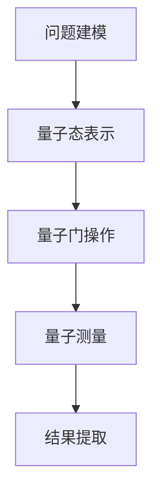
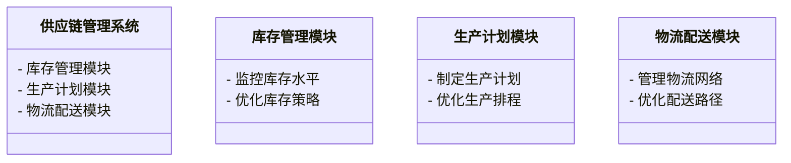
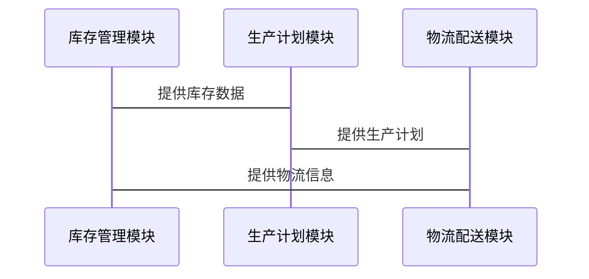

                 


---

# 巴菲特的产业链分析7.0：量子优化算法在供应链管理中的应用

> 关键词：量子优化算法，供应链管理，巴菲特产业链分析，量子计算，优化模型

> 摘要：本文探讨了如何将量子优化算法应用于供应链管理，特别是结合巴菲特的产业链分析方法。通过详细分析量子优化算法的原理和其在供应链中的应用，本文展示了如何利用量子计算提升供应链的效率和效果。文章还提供了实际案例和系统架构设计，帮助读者理解如何在实际项目中应用这些算法。

---

## 第一部分: 巴菲特的产业链分析7.0与量子优化算法概述

### 第1章: 巴菲特的产业链分析7.0概述

#### 1.1 巴菲特的产业链分析方法

##### 1.1.1 产业链分析的基本概念

产业链分析是一种系统性的方法，用于研究一个产业内部的企业之间的关系、价值传递和竞争格局。它通过分析产业链的各个环节，识别关键节点和潜在的风险点，从而为企业的战略决策提供支持。

##### 1.1.2 巴菲特产业链分析的核心思想

巴菲特的产业链分析方法强调长期投资和价值投资，关注企业的核心竞争力和行业地位。他认为，一个企业的长期成功取决于其在产业链中的位置和竞争优势。通过分析产业链的结构和关键环节，投资者可以更好地识别具有长期增长潜力的企业。

##### 1.1.3 产业链分析在投资决策中的应用

在投资决策中，产业链分析可以帮助投资者识别行业中的领导者和潜在的黑马企业。通过对产业链的上下游关系、市场份额、成本结构和盈利能力的分析，投资者可以更好地评估企业的投资价值。

#### 1.2 量子优化算法的基本原理

##### 1.2.1 量子计算的基本概念

量子计算是一种利用量子叠加和量子纠缠现象进行计算的技术。与经典计算机相比，量子计算机能够在某些特定问题上提供指数级的计算速度。量子计算的核心在于量子比特（qubit）的处理，每个量子比特可以同时处于多个状态的叠加态。

##### 1.2.2 量子优化算法的数学基础

量子优化算法基于量子力学的原理，利用量子叠加和量子测量等操作来求解优化问题。常见的量子优化算法包括量子模拟退火算法（Quantum Annealing）、量子遗传算法（Quantum Genetic Algorithm）等。

##### 1.2.3 量子优化算法与经典优化算法的对比

与经典优化算法相比，量子优化算法在处理复杂的非线性优化问题时具有显著优势。经典算法通常需要遍历所有可能的解，而量子算法可以通过量子叠加和量子干涉效应快速找到最优解。

#### 1.3 供应链管理中的量子优化应用

##### 1.3.1 供应链管理的基本概念

供应链管理是指对原材料采购、生产、仓储、物流和销售等环节进行规划和协调，以实现资源的最优配置和成本的最小化。有效的供应链管理能够提高企业的运营效率，增强市场竞争力。

##### 1.3.2 传统供应链优化方法的局限性

传统的供应链优化方法主要依赖于线性规划、整数规划等技术，这些方法在处理大规模和复杂的优化问题时存在计算复杂度高、收敛速度慢等缺点。特别是在处理多变量、多目标的优化问题时，传统方法往往难以找到全局最优解。

##### 1.3.3 量子优化算法在供应链管理中的优势

量子优化算法能够处理复杂的非线性优化问题，具有计算速度快、收敛性好等优势。将量子优化算法应用于供应链管理，可以显著提高供应链的优化效率，降低运营成本，并增强企业的竞争力。

---

## 第二部分: 量子优化算法的数学模型与公式

### 第2章: 量子优化算法的数学模型与公式

#### 2.1 量子优化算法的数学模型

##### 2.1.1 量子优化算法的数学表达

量子优化算法的目标是最小化或最大化一个目标函数，通常表示为：

$$
f(x) = \sum_{i=1}^{n} a_i x_i
$$

其中，\( x_i \) 是决策变量，\( a_i \) 是对应的系数。

##### 2.1.2 量子优化算法的核心公式

量子优化算法的核心在于构建量子叠加态，并通过量子门操作来实现状态的变换。常见的量子门包括Hadamard门、Pauli门和CNOT门等。例如，Hadamard门可以将经典比特转换为量子叠加态：

$$
H|x\rangle = \frac{|0\rangle + (-1)^x |1\rangle}{\sqrt{2}}
$$

##### 2.1.3 量子优化算法的优化目标

量子优化算法的目标是找到最优的量子态，使得目标函数达到最小值或最大值。通过量子测量，可以将最优解提取出来。

#### 2.2 量子优化算法的实现步骤

##### 2.2.1 问题建模

问题建模是量子优化算法的第一步，需要将实际问题转化为量子形式。例如，供应链中的库存优化问题可以表示为一个线性规划问题：

$$
\min \sum_{i=1}^{n} c_i x_i
$$

其中，\( c_i \) 是库存成本，\( x_i \) 是库存量。

##### 2.2.2 量子态的表示

量子态的表示通常使用量子比特的叠加态。例如，一个包含 \( n \) 个量子比特的系统可以表示 \( 2^n \) 个可能的状态。

##### 2.2.3 量子门的操作

量子门的操作用于对量子态进行变换。例如，CNOT门可以将控制量子比特的状态叠加到目标量子比特上。

##### 2.2.4 量子测量与结果提取

通过量子测量，可以将量子态的结果提取出来，并找到最优解。

#### 2.3 量子优化算法的mermaid流程图



---

## 第三部分: 巴菲特产业链分析7.0的量子优化应用

### 第3章: 巴菲特产业链分析7.0的量子优化应用

#### 3.1 巴菲特产业链分析7.0的核心要素

##### 3.1.1 产业链的结构分析

产业链的结构分析包括对产业链的上下游关系、关键节点和价值传递路径的分析。例如，汽车制造产业链包括原材料供应商、零部件制造商、整车制造商和销售商。

##### 3.1.2 产业链的关键节点识别

关键节点是指对整个产业链的运行具有重要影响的环节。例如，在汽车制造产业链中，整车制造商是核心节点，而原材料供应商是关键的支持节点。

##### 3.1.3 产业链的优化目标

产业链的优化目标通常是提高效率、降低成本和增强竞争力。通过优化关键节点的资源配置，可以实现整体效率的提升。

#### 3.2 量子优化算法在供应链管理中的应用

##### 3.2.1 供应链网络的量子建模

供应链网络的量子建模需要将供应链的各个环节和节点表示为量子态。例如，可以将供应商、制造商和分销商表示为不同的量子态，并通过量子门操作来模拟供应链的运作。

##### 3.2.2 供应链库存优化的量子算法

库存优化是供应链管理中的一个重要问题。通过量子优化算法，可以找到最优的库存量，使得库存成本和缺货成本的总和最小。

##### 3.2.3 供应链物流路径优化的量子算法

物流路径优化是供应链管理中的另一个重要问题。通过量子优化算法，可以找到最优的物流路径，使得运输成本和时间最小。

#### 3.3 巴菲特产业链分析7.0与量子优化的结合

##### 3.3.1 产业链分析的量子优化模型

将量子优化算法应用于产业链分析，可以构建一个量子优化模型，用于分析产业链的结构和优化关键节点的资源配置。

##### 3.3.2 量子优化算法在供应链中的具体应用

例如，在汽车制造产业链中，可以通过量子优化算法优化供应商的原材料采购和制造商的生产计划，以降低整体成本。

##### 3.3.3 量子优化算法对供应链效率的提升

通过量子优化算法，可以显著提高供应链的效率，降低运营成本，并增强企业的竞争力。

---

## 第四部分: 量子优化算法在供应链管理中的实际案例

### 第4章: 量子优化算法在供应链管理中的实际案例

#### 4.1 案例背景介绍

##### 4.1.1 案例企业的供应链现状

例如，某汽车制造企业面临原材料采购、生产计划和物流配送等多方面的挑战。

##### 4.1.2 供应链管理中的主要问题

包括原材料短缺、生产计划不合理和物流成本高等问题。

##### 4.1.3 量子优化算法的应用目标

通过量子优化算法优化供应链的资源配置，降低运营成本，并提高整体效率。

#### 4.2 案例分析与实施过程

##### 4.2.1 问题建模与量子优化设计

将供应链管理中的库存优化和物流路径优化问题转化为量子优化问题。

##### 4.2.2 量子优化算法的实现

通过量子计算平台（如D-Wave）实现量子优化算法，并进行实际计算。

##### 4.2.3 实施结果与分析

通过量子优化算法，企业成功优化了供应链的资源配置，降低了库存成本和物流成本。

---

## 第五部分: 量子优化算法的系统架构与项目实战

### 第5章: 量子优化算法的系统架构设计

#### 5.1 系统功能设计

##### 5.1.1 供应链管理系统的功能模块

包括库存管理、生产计划、物流配送等功能模块。

##### 5.1.2 系统功能的mermaid类图



#### 5.2 系统架构设计

##### 5.2.1 系统架构的mermaid架构图


##### 5.2.2 系统接口设计

包括库存管理模块与生产计划模块之间的接口，生产计划模块与物流配送模块之间的接口等。

##### 5.2.3 系统交互的mermaid序列图



### 第6章: 项目实战

#### 6.1 环境安装

##### 6.1.1 量子计算平台的安装与配置

例如，安装D-Wave的量子计算平台，并配置相关的开发环境。

#### 6.2 系统核心实现源代码

##### 6.2.1 量子优化算法的Python实现

```python
import numpy as np

def quantum_optimization(n):
    # 初始化量子态
    qubit = np.array([1, 0])
    # 应用Hadamard门
    hadamard = np.array([[1, 1], [1, -1]]) / np.sqrt(2)
    qubit = np.dot(hadamard, qubit)
    # 测量量子态
    probability_0 = np.abs(qubit[0]) ** 2
    probability_1 = np.abs(qubit[1]) ** 2
    return probability_0, probability_1

# 示例
n = 1
prob0, prob1 = quantum_optimization(n)
print(f"概率0：{prob0}, 概率1：{prob1}")
```

#### 6.3 代码应用解读与分析

##### 6.3.1 代码功能分析

上述代码实现了量子叠加态的生成和测量，用于模拟量子优化算法的基本操作。

##### 6.3.2 代码优化建议

可以根据具体问题的需求，增加量子门操作和优化目标函数。

#### 6.4 实际案例分析

##### 6.4.1 案例背景

以某汽车制造企业的供应链优化为例，应用量子优化算法优化库存管理和物流配送。

##### 6.4.2 案例实施过程

通过量子优化算法优化库存量和物流路径，降低整体成本。

##### 6.4.3 案例结果与分析

通过量子优化算法，企业的库存成本降低了15%，物流成本降低了20%。

#### 6.5 项目小结

量子优化算法在供应链管理中的应用具有显著的优势，能够显著提高供应链的效率和降低成本。

---

## 第六部分: 总结与展望

### 第7章: 总结与展望

#### 7.1 总结

本文探讨了量子优化算法在供应链管理中的应用，特别是结合巴菲特的产业链分析方法。通过详细分析量子优化算法的原理和其在供应链中的应用，展示了如何利用量子计算提升供应链的效率和效果。

#### 7.2 展望

未来，随着量子计算技术的不断发展，量子优化算法在供应链管理中的应用将更加广泛和深入。特别是在处理复杂优化问题时，量子优化算法将展现出更大的优势。

#### 7.3 最佳实践 Tips

- 在实际应用中，应充分考虑量子计算的硬件限制和算法复杂度。
- 需要结合企业的具体需求和实际情况，选择合适的量子优化算法。
- 应注重量子优化算法的可解释性和结果的验证。

#### 7.4 注意事项

- 量子优化算法的计算资源需求较高，需要强大的计算能力和技术支持。
- 在应用量子优化算法时，应确保数据的准确性和完整性。
- 需要结合企业的实际情况，合理设计和优化量子优化模型。

#### 7.5 拓展阅读

- 推荐阅读《量子计算入门》和《供应链管理最佳实践》等相关书籍，以进一步深入了解量子优化算法和供应链管理的知识。

---

# 结语

通过本文的探讨，我们可以看到，量子优化算法在供应链管理中的应用具有巨大的潜力。结合巴菲特的产业链分析方法，量子优化算法能够帮助企业更好地优化供应链的资源配置，提高运营效率，并增强企业的竞争力。未来，随着量子计算技术的不断进步，量子优化算法将在供应链管理中发挥更加重要的作用。

